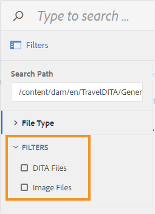

# 为文件浏览对话框配置筛选器 {#id20CIL7009GN}

在Web编辑器中工作时，需要使用文件浏览对话框插入图像、引用或键引用等元素。 默认的文件浏览对话框不提供任何文件过滤选项。 您可以添加自己的过滤器，以便轻松快速地访问所需的文件。

执行以下步骤，将自定义文件过滤选项添加到文件浏览对话框：

1. 要下载UI配置文件，请以管理员身份登录到Adobe Experience Manager。

1. 单击顶部的Adobe Experience Manager链接，然后选择 **工具**.
1. 选择 **指南** 从工具列表中，单击 **文件夹配置文件**.
1. 单击 **全局配置文件** 磁贴。
1. 选择 **XML编辑器配置** 选项卡，然后单击 **编辑** 顶部图标
1. 单击 **下载** 图标，用于在本地系统上下载ui\_config.json文件。 然后，您可以对文件进行更改，然后上传相同的更改。
1. 在 `ui_config.json` 文件，添加要添加过滤器的定义。

   以下代码段显示了如何添加两个过滤选项 — DITA文件和图像文件。

   ```
   "browseFilters": [
                       {
                       "title": "DITA Files",
                       "property": "jcr:content/metadata/dita_class",
                       "operation": "exists"
                       },
                       {
                       "title": "Image Files",
                       "property": "jcr:content/metadata/dc:format",
                       "value": [
                       "image/jpeg",
                       "image/gif",
                       "image/png"
                       ]
                       }
                       ]
   ```

   在上述代码片段中，第一个过滤器用于DITA文件。 过滤器定义采用以下参数：

   标题：过滤器的显示名称。 此标题将作为筛选选项显示在文件浏览对话框中。

   属性：在文件的元数据中匹配的属性。 例如，要仅允许具有 `dita_class` 元数据的属性中，属性过滤器采用&quot; `jcr:content/metadata/dita_class`”作为其值。

   操作：指定&quot; `exists`”以匹配属性参数中指定的值的存在。

   第二个滤镜用于图像文件。 这些参数与第一个筛选器相似，不同之处在于 `value` 参数。 此 `value` 参数以图像类型的数组作为其值。 在value参数中指定的所有文件类型都将被搜索并显示在文件浏览对话框中，所有其他文件类型将被忽略。

1. 保存 *ui\_config.json* 文件并上传相同的文件。 然后重新加载Web编辑器。

   启动文件浏览对话框时，将显示在ui\_config.json文件中配置的过滤器选项。

   


**父主题：**[&#x200B;自定义Web编辑器](conf-web-editor.md)
