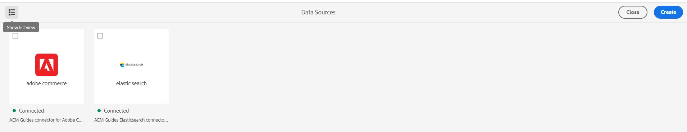
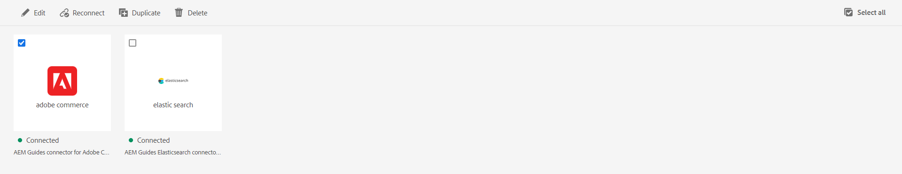

# 从用户界面配置数据源连接器

Experience Manager指南随附于 **数据源** 此工具可帮助您为数据源配置现成的连接器。 您可以设置JIRA、SQL(MySQL、PostgreSQL、Microsoft SQL Server、SQLite、MariaDB、H2DB)、AdobeCommerce、Elasticsearch和通用REST客户端连接器。

要配置连接器，请执行以下步骤：

1. 选择 **Adobe Experience Manager** 单击顶部的链接，然后选择“工具”。
1. 选择 **指南** 工具列表中。
1. 选择 **数据源** 磁贴。 此 **数据源** 页面。 您可以查看连接的数据源。

   您可以在 **列表视图** 或 **平铺视图** 以列表或图块形式查看各种连接的数据源。

   

   *查看或创建数据源连接器。*
1. 单击&#x200B;**创建**。
1. 选择要为其创建连接器的数据库。 例如，Elasticsearch连接器。
   >[!NOTE]
   >
   >列出所有可用的现成数据库。

1. 单击&#x200B;**下一步**。
1. 根据数据库输入配置和连接详细信息。

   >[!TIP]
   >* 将鼠标悬停在  在字段附近查看有关它的更多详细信息。
   > * 带*的字段为必填字段。 例如，您可以为Elasticsearch连接器输入以下详细信息。

   * **名称**：输入数据源的名称。
   * 身份验证类型：从下拉列表中选择身份验证类型。 例如，基本的用户名 — 密码身份验证
   * **用户名**：输入您的用户名。
   * **密码**：输入您的用户名和密码。
   * **URL**：添加API URL。

1. 选择 **测试连接**. 您可以查看 **测试连接** 仅在添加所需的详细信息后启用按钮。 如果连接详细信息正确，请查看成功消息。 否则，您可能会看到一条错误消息。

1. 选择 **保存** 以保存连接器。     查看 **保存** 在填写所有详细信息且连接成功后启用按钮。

   如果连接器保存成功，则可以在页面上查看连接的数据源。

## 可用于连接器的功能

* 在 **列表视图** 或 **平铺视图**  以列表或图块形式查看各种连接的数据源。
* 选中单个连接器的复选框。 单击 **全选** 以选择所有连接器。 您可以单击 **取消全选** 当所有连接器都处于选中状态时。

*编辑、重新连接、复制或删除数据源连接器。*

您可以对上的连接器使用以下特征 **数据源** 页面：

* **编辑**：编辑所选连接器的配置详细信息。

* **重新连接**：重新连接到已断开连接的连接器。

* **复制**：使用当前连接器作为基础创建新重复连接器。 缺省情况下，会创建带有后缀（如connectorname_1）的重复连接器。 例如，sample-elastic-search_1。
如果存在同名的连接器，则会查看错误。

* **删除**：删除选定的连接器。

配置数据源后，连接器将列在 **“数据源”面板** 在Web编辑器中。 然后，您可以连接到数据源并将内容片段插入到您的主题中。 有关详细信息，请查看 [插入数据源中的内容片段](../user-guide/web-editor-content-snippet.md).
