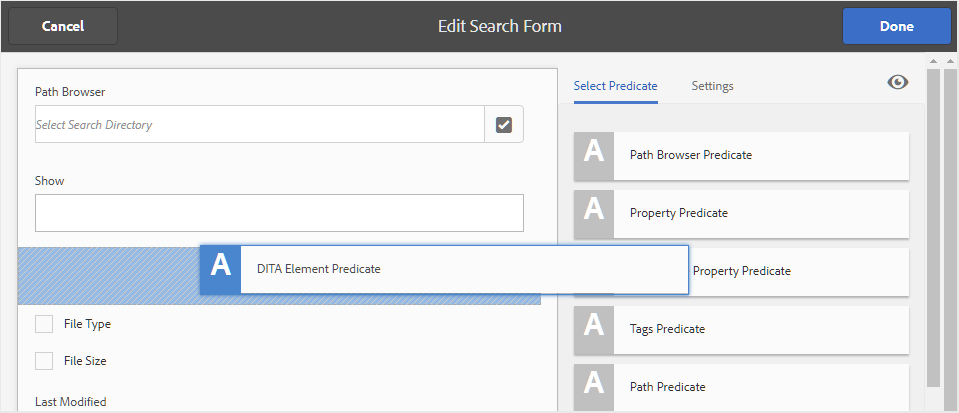
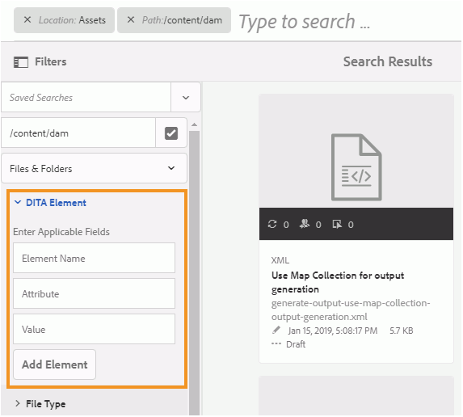
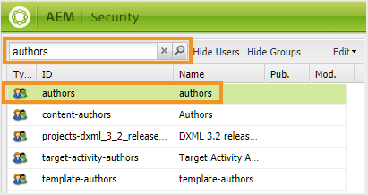
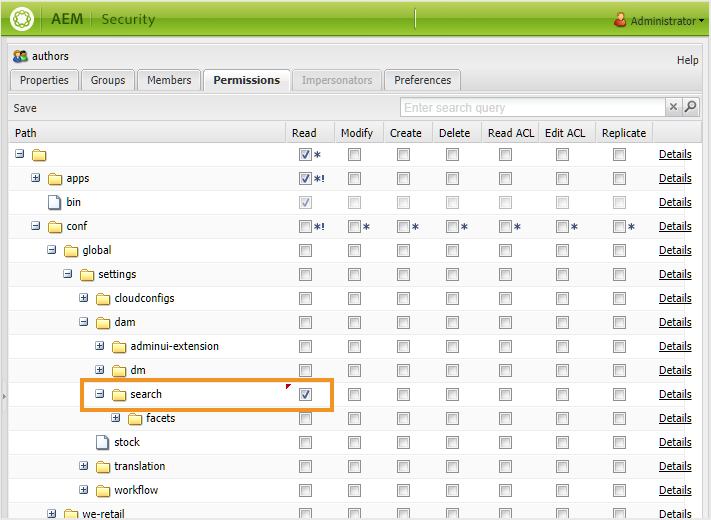

# 配置AEM Assets UI搜索 {#id192SC800MY4}

默认情况下，AEM不识别DITA内容，因此，它不提供任何机制来搜索其存储库中的DITA内容。 此外，OOTB不具备根据内容的UUID搜索内容的功能。 AEM Guides允许您在AEM存储库中添加DITA内容搜索和基于UUID的搜索功能。

配置DITA内容搜索涉及以下任务：

1. [在资产UI中添加DITA元素搜索组件](#id192SF0F50HS)
1. [在资产UI中添加基于UUID的搜索组件](#id2034F04K05Z)
1. [向用户提供权限](#id192SF0G0RUI)
1. [在搜索中添加自定义元素或属性](#id192SF0G10YK)
1. [从现有内容提取元数据](#id192SF0GA0HT)

除了添加搜索功能外，您还可以配置不应包含在搜索中的文件夹。 有关更多详细信息，请参阅 [从搜索结果中排除临时文件](#id197AHI0035Z).

## 在资产UI中添加DITA元素搜索组件 {#id192SF0F50HS}

执行以下操作以在AEM Assets UI中添加DITA内容搜索组件：

1. 以管理员身份登录Adobe Experience Manager。

1. 单击 **Adobe Experience Manager** 在顶部链接，然后选择 **工具**.

1. 选择 **常规** 从工具列表中，单击 **搜索Forms** 磁贴。

1. 在 **搜索Forms** 列表，选择 **资产管理搜索边栏**.

1. 单击 **编辑**.
1. 在 **选择谓词** 选项卡，滚动到列表的末尾。

1. 拖放 **DITA元素谓词** 在搜索表单中的所需位置。

   

1. 单击 **完成** 以保存更改。

   当您访问资产UI中的过滤器选项时，您将获得DITA元素搜索过滤选项。

   


## 在资产UI中添加基于UUID的搜索组件 {#id2034F04K05Z}

执行以下操作可在AEM Assets UI中添加基于UUID的搜索组件：

1. 以管理员身份登录Adobe Experience Manager。

1. 单击 **Adobe Experience Manager** 在顶部链接，然后选择 **工具**.

1. 选择 **常规** 从工具列表中，单击 **搜索Forms** 磁贴。

1. 在 **搜索Forms** 列表，选择 **资产管理搜索边栏**.

1. 单击 **编辑**.
1. 在 **选择谓词** 选项卡，选择 **属性谓词** 并将其拖放到搜索表单中的所需位置。

1. 在 **设置** 选项卡中，为新添加的用户提供以下详细信息 **属性谓词** 组件：

   - **字段标签**： UUID
   - **属性名称**： jcr：content/fmUuid
1. 单击 **完成** 以保存更改。

   当您访问Assets UI中的“筛选器”选项时，您将获得基于UIS的搜索筛选选项。


## 向用户提供权限 {#id192SF0G0RUI}

作者和发布者需要获得明确权限，才能从Assets UI访问搜索功能。 如果不授予这些权限，则您的用户将无法根据其元素/属性值或UUID搜索DITA内容。

执行以下步骤以提供对DITA搜索功能的访问：

1. 访问用户和群组权限页面。

1. 搜索要向其授予访问权限的用户组或个人用户。 例如，要授予作者组中所有用户的访问权限，请在 **筛选查询** 字段并按 **输入**.

   

1. 选择 **作者** 组。

1. 在右窗格中，选择 **权限** 选项卡。

1. 导航到以下文件夹位置：

   /conf/global/settings/dam/search

1. 给出 **读取** 对搜索文件夹的权限。

   

1. 单击&#x200B;**保存**。


选定的用户或用户组现在可以访问资产UI中的搜索DITA内容功能。

## 在搜索中添加自定义元素或属性 {#id192SF0G10YK}

要使DITA搜索正常工作，需要对DITA内容进行一些预处理。 此预处理步骤从单个DITA映射和主题中提取选择性内容，以便可以编制索引以加快搜索。 在内部，此过程称为 *序列化*. DITA文件的序列化在内容上传期间发生，也可以按需执行。 它使用配置文件来确定每个DITA文件中应索引多少内容。 序列化文件的默认位置为：

/libs/fmdita/config/serializationconfig.xml

默认搜索配置允许您搜索DITA中的所有元素和属性 `prolog` 元素。 如果要基于其他元素或属性进行搜索，则需要配置搜索序列化文件。

>[!NOTE]
>
> 如果您希望使用 `prolog` 元素，则可以跳过此过程。

此文件包含两个主要部分 — 属性集和规则集。 下面给出了规则集部分的代码片段：

```
<ruleset filetypes="xml dita"><!-- Element rules --><rule xpath="//[contains(@class, 'topic/topic')]/[contains(@class, 'topic/prolog')]//*[not(*)]" text="yes" attributeset="all-attrs" /><!-- Attribute rules --><rule xpath="//[contains(@class, 'topic/topic')]/[contains(@class, 'topic/prolog')]///@[local-name() != 'class']" /></ruleset>
```

在规则集部分，您可以指定：

- 用于提取元素的规则

- 用于提取属性的规则


规则包含以下内容：

xpath ：这是从DITA文件中检索元素或属性的XPath查询。 元素规则的默认配置将检索所有 `prolog` 元素。 而且，属性规则的默认配置将检索 `prolog` 元素。 您可以指定XPath查询来序列化要搜索的元素或属性。

    XPath查询包含文档类型的类名。 “topic/topic”类用于主题类型DITA文档。 如果要为其他DITA文档创建规则，则必须使用以下类名：
    
    文档类型|类名|
    -----------------------
    |主题| — 主题/主题|
    任务| — 主题/主题任务/任务|
    |概念| — 主题/主题概念/概念|
    引用| — 主题/主题引用/引用|
    地图 — 地图/地图

文本：如果要搜索指定元素中的文本，请指定是值。 如果指定no作为值，则只序列化元素中的属性。 需要在“属性集”部分指定您要搜索的属性。

属性集：指定要与此规则关联的属性集的ID。 全属性值是一个特殊的大小写，表示此规则的所有属性都必须序列化。

属性集包含要在DITA内容中搜索的属性列表。 属性集包含以下内容：

id ：属性集的唯一标识符。 此ID在规则集的属性集参数中指定。

attribute ：要搜索的属性列表。 对于每个属性，您需要在每个属性的 `attribute` 元素。

执行以下步骤以在搜索序列化文件中添加自定义DITA元素或属性：

1. 使用包管理器下载/libs/fmdita/config/serializationconfig.xml文件。

1. 创建覆盖节点，用于 `config` 中的文件夹 `apps` 节点。

1. 导航到 `apps` 节点：

   `/apps/fmdita/config/serializationconfig.xml`

1. 添加所需的元素或属性规则集。

1. 提交更改并运行Cloud Manager \(CI/CD\)管道以部署配置更改。


存储并激活新的序列化信息以进行搜索。 但是，必须从现有DITA内容中提取元数据才能用于搜索。

## 从现有内容提取元数据 {#id192SF0GA0HT}

在默认搜索序列化文件中进行任何更改后，必须在中启用DITA元数据提取选项 *com.adobe.fmdita.config.ConfigManager* 捆绑然后运行工作流以提取元数据。 这将从现有DITA文件中提取所需的元数据，然后可使用该元数据进行搜索。

如果您在更新序列化文件后创建新文件或编辑任何文件，则会自动从此类文件中提取元数据。 只有AEM资料档案库中已存在的文件才需要提取元数据的过程。

从现有DITA文件提取元数据涉及两个任务：

1. 在configMgr中启用元数据提取选项
1. 运行元数据提取工作流

请按照以下说明进行操作： [配置覆盖](download-install-additional-config-override.md#) 创建配置文件。 在配置文件中，提供以下\(property\)详细信息以配置元数据提取选项：

| PID | 属性键 | 属性值 |
|---|------------|--------------|
| `com.adobe.fmdita.config.ConfigManager` | `dita.serialization` | 布尔值\(true/false\)。<br> **默认值**： `false` |

执行以下步骤以运行元数据提取工作流：

1. 以管理员身份登录Adobe Experience Manager。

1. 单击 **Adobe Experience Manager** 在顶部链接，然后选择 **工具**.

1. 选择 **指南** 从工具列表中，单击 **DITA元数据提取** 磁贴。

1. 如果要从单个文件及其依赖项中提取元数据，请单击 **选择文件** 链接并浏览文件。

1. 如果要从文件夹中的多个文件中提取元数据，请单击 **选择文件夹** 链接，浏览并选择所需的文件夹。 单击 **添加** 按钮以将文件夹添加到序列化任务列表。

   >[!NOTE]
   >
   > 您可以选择多个文件夹并将其添加到序列化任务。

1. 单击 **开始**.

1. 在确认元数据提取对话框中，单击 **确定**.


## 从搜索结果中排除临时文件 {#id197AHI0035Z}

默认情况下，将对整个AEM存储库执行搜索。 可能有一些位置您希望从搜索中排除。 例如，在启动内容翻译工作流时，未批准的文件将保留在临时文件夹位置。 执行搜索时，搜索结果中还会返回来自此临时位置的文件。

要阻止AEM Guides搜索临时翻译文件夹位置，您需要在排除列表中添加临时文件夹位置。

执行以下步骤以从搜索中排除临时翻译文件夹：

>[!NOTE]
>
> 您可以使用此过程将任何其他文件夹位置添加到排除列表中。 有关使用索引的更多详细信息，请参见 [内容搜索和索引](https://experienceleague.adobe.com/docs/experience-manager-cloud-service/operations/indexing.html).

1. 在自定义damAssetLucene索引中添加以下属性：

   | 属性名称 | 类型 | 价值 |
   |-------------|----|-----|
   | excludedPaths | String\[\] | 将以下值添加到此属性：<br> `/content/dam/projects/translation\_output` |

1. 导航到位于以下位置的lucene节点：

   /oak：index/lucene

1. 在lucene节点中添加以下属性：

   | 属性名称 | 类型 | 价值 |
   |-------------|----|-----|
   | excludedPaths | String\[\] | 将以下值添加到此属性：<br> `/content/dam/projects/translation\_output` |
