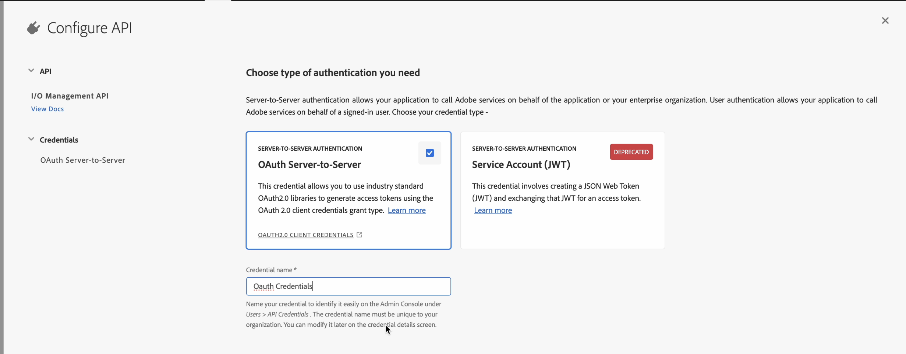
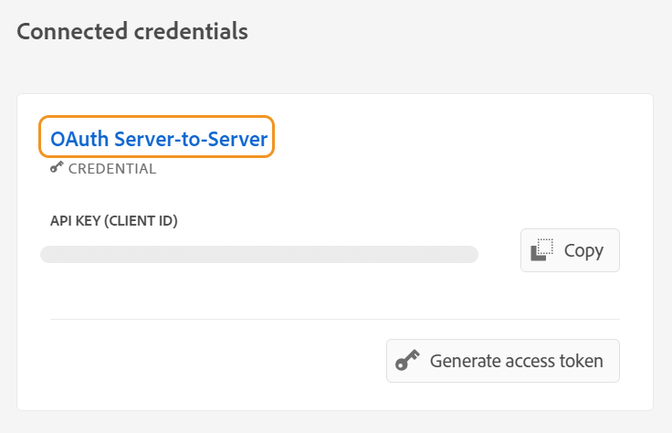
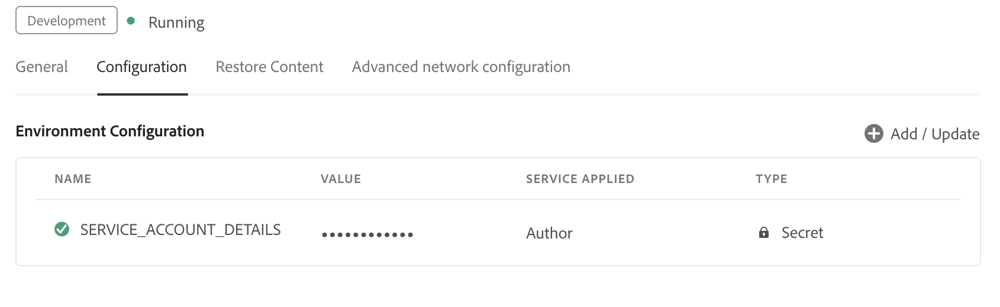

# 配置AI支持的指南助手以搜索内容

管理员可以为作者配置“指南助手”功能。 Guides Assistant服务由Adobe IMS基于身份验证的身份验证保护。 将您的环境与Adobe基于令牌的安全身份验证工作流集成，并开始使用新的“指南助手”功能。 以下配置可帮助您添加 **人工智能配置** 选项卡添加到文件夹配置文件。 添加后，即可在Web编辑器中使用“指南助手”功能。

## 在Adobe Developer控制台中创建IMS配置

执行以下步骤可在Adobe Developer控制台中创建IMS配置：

>[!NOTE]
>
>如果您已经创建了OAuth项目来配置智能建议功能或基于微服务的发布，则可以跳过以下步骤来创建项目。

1. Launch [Adobe Developer控制台](https://developer.adobe.com/console).
1. 成功登录到开发人员控制台后，您将看到 **主页** 屏幕。 此 **主页** 在屏幕中，您可以轻松查找信息和快速链接，包括指向项目和下载的顶部导航链接。
1. 要创建新的空项目，请选择 **创建新项目** 从 **快速入门** 链接。
    {width="550" align="left"}
   *创建新项目。*

1. 选择 **添加API** 从 **项目** 屏幕。  此 **添加API** 屏幕。 此屏幕显示了可用于开发应用程序的Adobe产品和技术的所有可用API、事件和服务。

1. 选择 **I/O管理API** 以将其添加到您的项目。
   
   *将I/O管理API添加到您的项目中。*

1. 新建 **OAuth凭据** 并保存它。
    {width="3000" align="left"}
   *为API配置OAuth凭据。*

1. 在  **项目** 选项卡，选择 **OAuth服务器到服务器** 选项，然后选择新创建的凭据。

1. 选择 **OAuth服务器到服务器** 查看项目凭据详细信息的链接。

    {width="800" align="left"}

   *连接到项目以查看凭据详细信息。*

1. 返回到 **项目** 选项卡并选择 **项目概述** 左边。

   

   *新项目入门。*

1. 单击 **下载** 按钮以下载服务JSON。

   

   *下载JSON服务详细信息。*

您已配置OAuth身份验证详细信息并下载JSON服务详细信息。 根据下一节中的要求，随时准备此文件。

### 将IMS配置添加到环境

执行以下步骤以将IMS配置添加到环境：

1. 打开Experience Manager，然后选择程序，其中包含要配置的环境。
1. 切换到 **环境** 选项卡。
1. 选择要配置的环境名称。 这应该会将您导航到 **环境信息** 页面。
1. 切换到 **配置** 选项卡。
1. 更新SERVICE_ACCOUNT_DETAILS JSON字段。 确保您使用以下屏幕快照中给出的相同名称和配置。

{width="800" align="left"}


*添加环境配置详细信息。*


将IMS配置添加到环境后，执行以下步骤以使用OSGi将这些属性与AEM Guides链接：

1. 在您的Cloud Manager Git项目代码中，添加以下两个给定的文件(对于文件内容，请查看 [附录](#appendix))。

   * `com.adobe.aem.guides.eventing.ImsConfiguratorService.cfg.json`

1. 确保新添加的文件包含在您的 `filter.xml`.
1. 提交并推送您的Git更改。
1. 运行管道以将更改应用到环境。

完成此操作后，您应该能够使用 **指南助手** 功能。


## 附录 {#appendix}

**文件**：
`com.adobe.aem.guides.eventing.ImsConfiguratorService.cfg.json`

**内容**：

```
{
 "service.account.details": "$[secret:SERVICE_ACCOUNT_DETAILS]",
}
```


配置后， **指南助手**  图标显示在Web编辑器的右侧面板中。 选择图标以查看 **指南助手** 面板。
有关更多详细信息，请查看 [用于搜索内容的AI支持的指南助手](../user-guide/ai-based-guides-assistant.md) Experience Manager部分。
