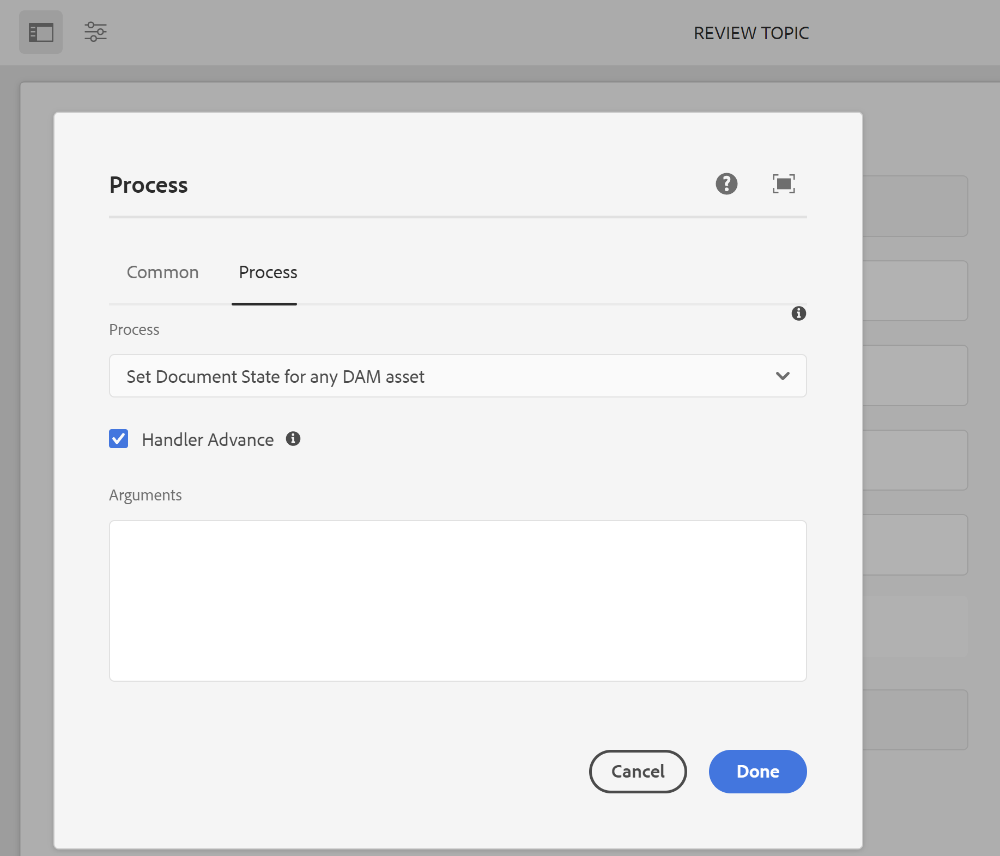

# 配置文档状态 {#id181GB0400UI}

AEM Guides允许您根据组织的要求为DITA主题定义文档状态。 您可以定义文档从开始到结束的不同状态。 例如，第一个状态可以是“草稿”，它可以移至“审阅”、“已批准”、“已翻译”，最后移至“已发布”。

主题可通过两种方式从一种状态转换到另一种状态 — 手动和自动。 在配置文件中定义的文档状态可用于手动更改文档状态。 可以从主题文件的“属性”页完成此操作。 此外，您可以定义谁可以将文档从一个状态移动到另一个状态。 例如，作者可以创建文档，文档的默认状态可以是草稿。 当作者发送文档以供审阅时，她可以将文档状态更改为“正在审阅”。 审阅者可以根据审阅过程将文档状态再次更改为“已批准”或“草稿”。 如果文档为“已批准”，发布者可以根据工作流将文档状态更改为“已翻译”或“已发布”。

>[!NOTE]
>
> 如果用户属于 *管理员* 组，用户可以从任何状态更改文档状态，而不管系统中定义的文档状态转换。

## 创建文档状态

AEM Guides随附了一组默认文档状态。 这些状态包括：

- 草稿
- 编辑
- 正在审核
- 已批准
- 已审核
- 完成

这些默认状态适用于在DAM下创建的所有DITA主题。 您可以创建自己的文档状态，并将这些状态分配给特定文件夹。 然后，在该文件夹下创建的所有DITA文件都将有权访问新创建的文档状态。

要使用“Folder Profile（文件夹配置文件）”创建文档状态，请执行以下步骤：

1. 单击顶部的Adobe Experience Manager链接，然后选择 **工具**.
1. 选择 **指南**&#x200B;工具列表中。
1. 单击“文档状态”拼贴。

   此时会显示资产状态页面。 默认情况下，该页面会显示默认配置文件。

1. 单击 **创建配置文件** 并输入以下详细信息：
   - 在“配置文件”字段中输入配置文件的名称。
   - 指定要应用新配置文件的路径。
   - 在中指定文档的状态 **允许的状态** 下 **状态**. 默认文档状态为“草稿”、“编辑”、“正在审阅”、“已批准”和“完成”。-

     单击 **添加** 按钮以添加文档状态。

      - 单击“删除”图标可删除文档状态。

     >[!NOTE]
     >
     > 如果文档仍然处于某个状态，请勿删除该文档状态。 如果删除文档状态，您将无法更改此类文档的文档状态，除非您属于 *管理员* 用户组。

   - 在中指定文档的开始状态 **开始状态**.
   - 在中指定文档的结束状态 **结束状态**.
   - 在中指定文档的状态转换 **从** 和 **至** 下 **状态转换**.

      - 指定可以在中更改文档状态的用户和用户组 **组**.

      - 单击 **添加** 按钮以添加状态转换。

      - 单击“删除”图标可删除状态转换。

     >[!NOTE]
     >
     > 如果文档仍在中，请勿删除状态转换 `From` 省/州。 如果删除状态转换，您将无法更改此类文档的文档状态，除非您属于 *管理员* 用户组。

1. 单击&#x200B;**完成**。

## 创建文档状态配置文件的副本

您可以根据需要创建现有文档状态配置文件的副本。 您可以使用副本作为创建另一个文档配置文件的基础。

要创建文档状态配置文件的副本，请执行以下步骤：

1. 单击顶部的Adobe Experience Manager链接，然后选择 **工具**.
1. 选择 **指南**&#x200B;工具列表中。
1. 单击“文档状态”拼贴。

   此时会显示资产状态页面。

1. 选择要复制的文档状态配置文件，然后单击 **重复的配置文件**.
1. 进行所需更改并单击 **完成**.

## 删除文档状态或状态转换

>[!NOTE]
>
> 如果文档仍然处于状态或状态转换，请勿删除文档状态或状态转换。 如果删除状态或状态转换，您将无法更改此类文档的文档状态，除非您属于 *管理员* 用户组。

执行以下步骤以从文档状态配置文件中删除文档状态或状态转换：

1. 单击顶部的Adobe Experience Manager链接，然后选择 **工具**.
1. 选择 **指南** 工具列表中。
1. 单击“文档状态”拼贴。

   此时会显示资产状态页面。

1. 选择要从中删除文档状态的文档状态配置文件，然后单击 **编辑个人资料**.
1. 删除文档状态或状态转换，然后单击 **完成**.

## 删除文档状态配置文件

要删除文档状态配置文件，请执行以下步骤：

1. 单击顶部的Adobe Experience Manager链接，然后选择 **工具**.
1. 选择&#x200B;**指南** 工具列表中。
1. 单击 **文档状态** 磁贴。

   此时会显示资产状态页面。

1. 选择要删除的文档状态配置文件，然后单击 **删除配置文件**.

## 自动更改文档状态

如果您不想手动更改文档状态，则可以创建工作流并自动更改文档状态。

>[!NOTE]
>
> 自动化工作流应与配置中定义的文档状态和过渡保持一致。 系统不会执行任何检查通过自动工作流完成的状态更改。

1. 单击顶部的Adobe Experience Manager链接，然后选择 **工具**.
1. 选择 **工作流** 工具列表中。

1. 单击 **模型** 磁贴。

1. 选择相关工作流，例如“审阅主题”。

1. 单击 **编辑**.

   该工作流将在新选项卡中打开。

1. 单击 **编辑** \（右上方\）。

1. 打开 **步骤** 浏览器；使用 **切换侧面板**，位于顶部工具栏的最左侧

1. 将相应的步骤拖动到模型中的所需位置。

1. 单击在工作流模型中添加的新步骤，然后选择 **配置** 从组件工具栏中

1. 打开 **进程** 选项卡。

1. 在 **进程** 下拉列表，选择 **为任何DAM资产设置文档状态**.

1. 选择 **处理程序前进** 选项。

   

1. 在 **参数** 文本框，输入要从所选工作流转换到的文档状态。

   >[!NOTE]
   >
   > 确保在“参数”文本框中输入正确的文档状态。 如果输入的值不正确，则文档将被设置为不正确的状态。

1. 确认更改，方法： **保存并关闭**.


## 启用审批工作流

AEM Guides提供了文档审批工作流，可帮助您控制文档开发过程的生命周期。 要启用审批工作流，请执行以下步骤：

1. 要下载UI配置文件，请以管理员身份登录到Adobe Experience Manager。

1. 单击顶部的Adobe Experience Manager链接，然后选择 **工具**.
1. 选择 **指南** 从工具列表中，单击 **文件夹配置文件**.
1. 单击 **全局配置文件** 磁贴。
1. 选择 **XML编辑器配置** 选项卡，然后单击&#x200B;**编辑** 顶部图标
1. 单击 **下载** 图标，用于在本地系统上下载ui\_config.json文件。 然后，您可以对文件进行更改，然后上传相同的更改。
1. 在 `ui_config.json` 文件，通过更改 *功能* 部分如下所示：

   ```
   "features":  
   { 
      "approvalWorkflow":  true 
   }
   ```

1. 保存文件并将其上传。
