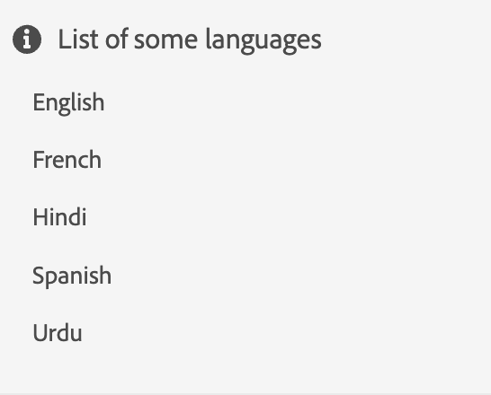

# 小组件

可以组合多个基本组件（如组件部分中所述）来构成构件。
小组件可用于制作新的“更复杂”组件，或为组件的项目提供结构。

让我们深入了解小部件的概念！

我们首先制作一个简单的构件来显示语言列表。

```js title="basicWidget.js"
const widgetJSON =  {
    "component": "div", 
    "id": "widget_languages", 
    "items": [ // adding components to the widget
        {
            "component": "div",
            "items": [
                {
                    "component": "icon",
                    "icon": "info"
                },
                {
                    "component": "label",
                    "label": "List of some languages"
                }
            ]
        },
        {
            "component": "list",
            "data": "@languages"
        }
    ]
},
```

此处， `@languages` 是一个在模型中定义的数组， `widget_languages` 作为： [“英语”、“法语”、“印地语”、“西班牙语”、“乌尔都语”]

呈现的基本构件将如下所示：


