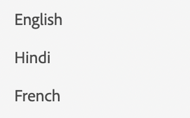

# 列表

要显示列表，我们使用组件列表。

```js title="list.js"
const listJSON =  {
    "component": "list", //tells the component name
    "data": "@languages", // an array of list items
},
```

在这里，语言是一个简单的字符串数组。 `languages = ["English", "Hindi", "French"]`
如果要呈现对象列表，可以使用项目配置指定结构。

```js title="list.js"
const listJSON =  {
    "component": "list", //tells the component name
    "data": "@projects", // an array of list items
    "itemConfig": { // used to define the structure of the list items.
    "component": "widget",
    "id": "checkbox_label"
    }
},
```

通常itemConfig是 `widget`. 要了解有关构件的更多信息，请访问 [小组件](../Widgets/basic-widget.md)

渲染的列表将如下所示：


