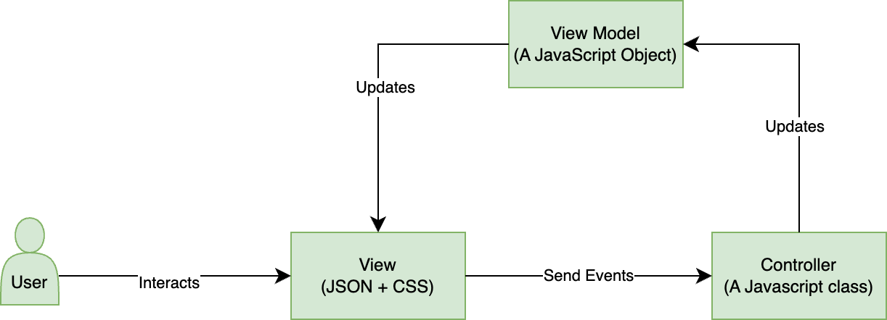
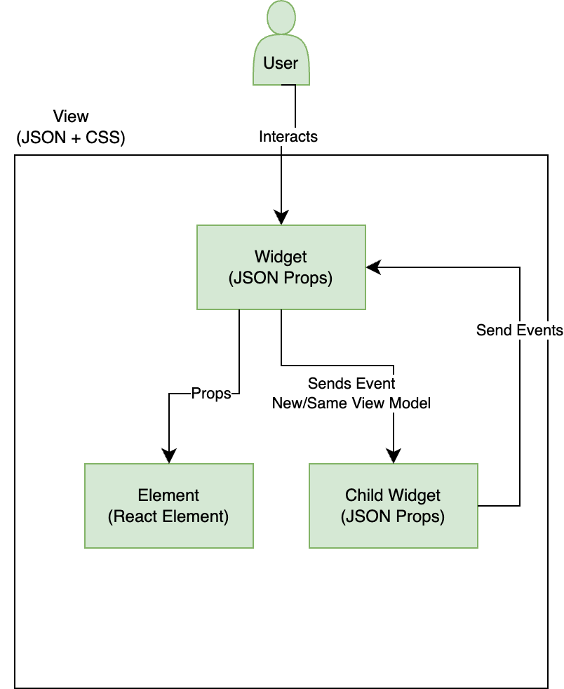
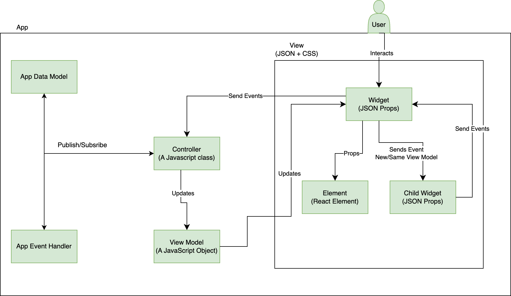

# Jui框架

在开始了解如何编写扩展之前，我们将了解框架的结构。
以便我们能够有效地推广它。

## 简介

JUI是在React和AdobeReact Spectrum组件之上的MVC框架。 JUI是JSON用户界面。 它包含多个Git存储库。

JUI-Core是核心库，具有将JSON配置转换为工作react组件并将其链接到相关控制器类实例的所有逻辑。
JUI-React-Spectrum库具有AdobeReact Spectrum组件的包装构件

## JUI核心设计

### MVC UI设计

### 小组件

- 具有唯一ID。
- 具有要查看的单个JSON文件。
- 可以拥有自己的或共享的控制器。
- 可以使用父模型或新模型。
- 可以具有UI元素（React组件）
- 可以有其他构件
- 应用程序是一个小组件

### 元素

- 是HTML/React组件。
- 没有任何模型，它使用父构件模型。

### 事件处理程序

- 下一个(eventOpts)
   - 使用某些选项触发事件
- 订阅（回调）
   - 获取有关事件是通过配置触发的通知

### 应用程序/全局模型

- 下一个（新值）
   - 要发布新值
- 订阅（回调）
   - 获取值更改的通知
   - 首次获取旧值
- GetValue()
   - 获取当前值

### 控制器

- 它应从Controller类扩展
- API
- 创建模型
   - 要创建子小部件独立模型，请执行以下操作
- InitEventHandler
   - 创建子小部件单独事件处理程序
- RegisterCommand
   - 注册本地、父或应用程序事件
- 下一个(eventName， eventHandler)
   - 触发子构件事件处理程序、父构件事件处理程序或应用程序事件处理程序的事件
- Subscribe(callback， eventHandler)
- SubscribeAppModel(callback)

### 示例应用程序设计

