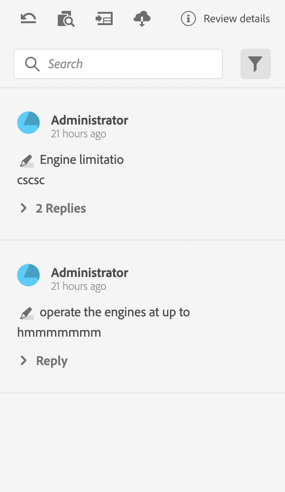
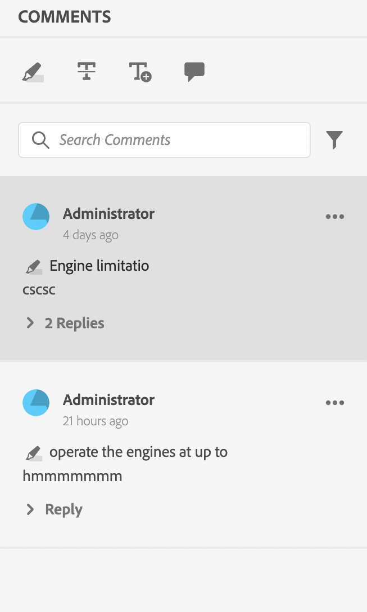
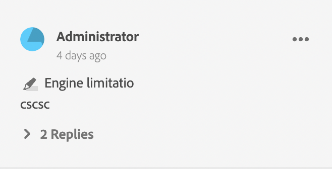
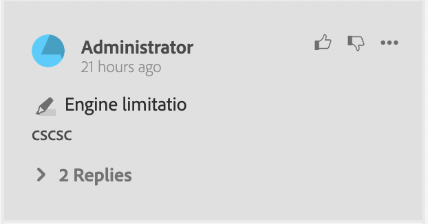
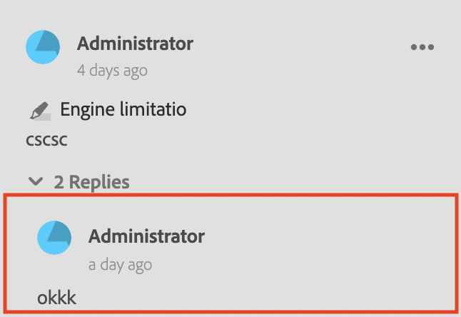
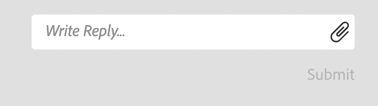
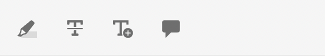

# 审核应用程序的组件

以下是审核应用程序的主要组件：

- 内联审阅面板： `id: inline_review_panel`
   - 在XML编辑器端呈现审阅注释的右侧面板。

- 主题审阅： `id: topic_reviews`
   - 在审阅应用程序中呈现评论的右侧面板。

- 审阅注释： `id: review_comment`
   - 每个审阅备注的构件。

查看查看查看应用程序上的评论：

查看xml编辑器端的注释：

- 审阅评论回复： `id: comment_reply`
   - 每个审核评论回复的构件。
     

- 新建评论回复： `id: comment_new_reply`
   - 用于新审核评论回复的小部件。
     

- 注释工具箱： `id: annotation_toolbox`
   - 审阅应用程序右上角的工具栏。
     
