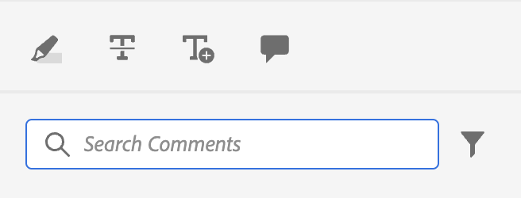
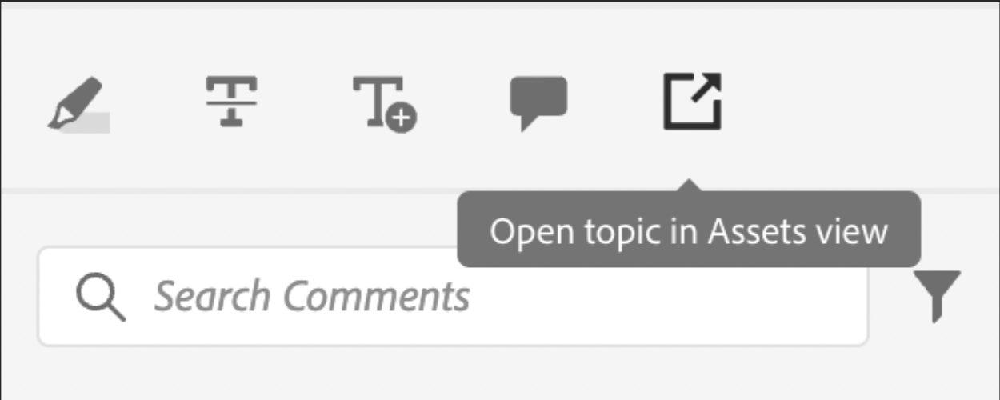

# 简单自定义示例

现在，让我们了解如何在AEM Guides应用程序中集成这些自定义项。

例如，我们希望在应用程序的现有视图中添加此按钮。
为此，我们需要3个基本要素：

1. 此 `id` 我们要将组件添加到的JSON视图的。
2. 此 `target`，即我们要向其中添加新组件的JSON中的位置。 此 `target` 是使用 `key` 和 `value`. 键值对可以是用于定义组件的任何属性，这些属性有助于唯一标识组件。
我们还可以使用索引来引用目标。
我们有3个视图状态：  `APPEND`， `PREPEND`， `REPLACE`.
3. 新创建组件的JSON和相应方法。

假设我们要向审阅中使用的注释工具箱添加一个按钮，该按钮将在AEM中打开文件。

```typescript
export default {
  id: 'annotation_toolbox', 
  view: {
    items: [
      {
        component: 'button',
        icon: 'linkOut',
        title: 'Open topic in Assets view',
        'on-click': 'openTopicInAEM',
        target: {
          key: 'value',
          value: 'addcomment',
          viewState: VIEW_STATE.APPEND

        },
      },
    ],
  },
  controller: {
    openTopicInAEM: function (args) {
        const topicIndex = tcx.model.getValue(tcx.model.KEYS.REVIEW_CURR_TOPIC)
        const {allTopics = {}} = tcx.model.getValue(tcx.model.KEYS.REVIEW_DATA) || {}
        tcx.appGet('util').openInAEM(allTopics[topicIndex])
    },
  },
}
```

在上例中，我们提供了：

1. 该 `id` 我们要插入组件的JSON的，例如 `annotation_toolbox`
2. 目标为 `addcomment` 按钮。 我们将按钮添加到之后 `addcomment` 按钮使用viewState `append`.
3. 我们定义控制器中按钮的单击事件。

的JSON [`annotation_toolbox`](./../../../jsons/review_app/annotation_toolbox.json)

在自定义之前，注释工具箱如下所示：



自定义后，注释工具箱如下所示：



## 添加CSS

为了保持一致性，我们提供了已设置样式的组件。 插入的JSON将应用其固有的样式。管理css的主要方法是通过扩展中的extraClass键进行。

```js
{    
    "view":{
        items:[
            {
                compoenent:"button",
                extraClass:"underline bg-red",
            }
        ]
    }
}
```

您可以通过将css文件添加到以下位置来放置自定义样式和CSS类： [clientlibs](#clientlibs). 在构建期间，我们还创建了 [顺风](https://tailwindcss.com/docs/utility-first) 尾风中实用程序类的输出。 其配置位于 [tailwind.config.js](../../../tailwind.config.js)
