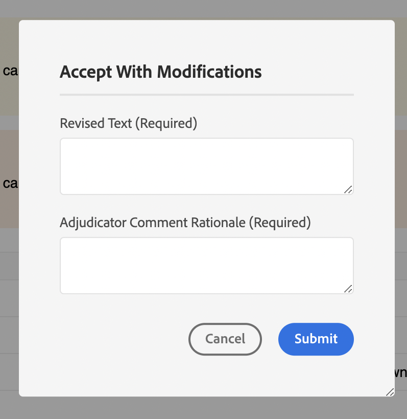
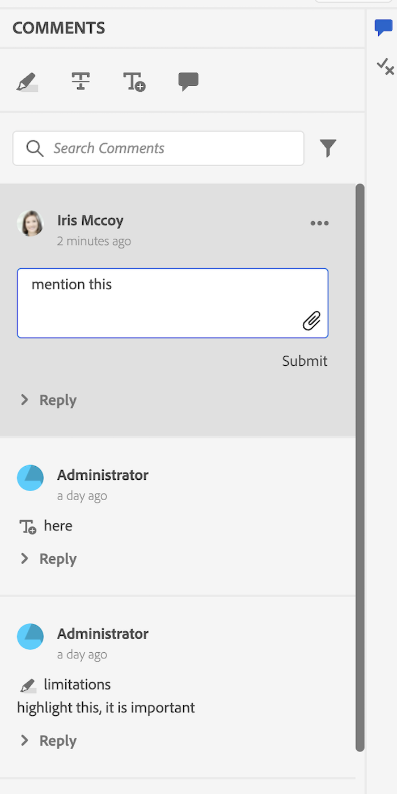
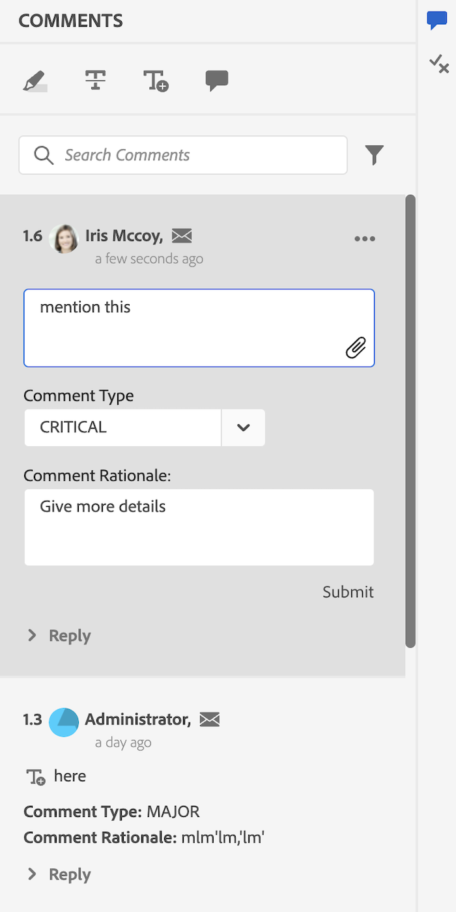

# 示例

在此程序包中，我们还提供了一些自定义示例(位于 `guides_extension/src`) 。 下面是每个报表的简要说明。

1. [上下文菜单](./../../src/file_options.ts)
在此示例中，我们已自定义 `file_options` 上下文菜单，用于删除 `Delete` 和 `Edit` 选项，然后替换 `Duplicate` 带以下各项的选项 `Download` 选项。

2. [左侧面板](../../src/left_panel_container.ts)
在此示例中，我们已自定义 `left tab panel` 拥有另一个`tab` 标题为“测试扩展”的扩展，以及相应的 `tab panel` ，它有一个标签： `Test Tab Panel`

3. [右侧面板](../../src/right_panel_container.ts)
在此示例中，我们已自定义 `right tab panel` 拥有另一个 `tab` 标题为“测试扩展”的扩展，以及相应的 `tab panel` ，它有一个标签： `New Tab Panel`

4. [存储库面板](../../src/repository_panel.ts)

5. [工具栏](../../src/toolbar.ts)
在此示例中，我们已替换了 `Insert Element`， `Insert Paragraph`， `Insert Numbered List`， `Insert Bulleted List` 按钮与单个 `More Insert Options` 包含所有这些内容的按钮。

[查看应用程序示例]

1. [注释工具箱](../../src/review_app_examples/annotation_extension.ts)
在此示例中，我们在注释工具箱中添加了另一个按钮，用于在AEM中打开当前审阅主题。

2. [查看评论](../../src/review_app_examples/review_comment.ts)
在此示例中，我们添加了将用户名替换为用户信息（包含评论者的全名和标题）、添加了唯一评论ID和mailTo图标，并添加了用于提及评论严重性和理由的输入字段。
我们还添加了 `accept with modification` XMLEditor侧用于打开对话框的注释上的按钮。

3. [评论回复](../../src/review_app_examples/comment_reply.ts)
在此示例中，我们添加了将用户名替换为用户信息（包含评论者的全名和标题），并在评论标头中添加了mailTo图标。

4. [内联审核面板](../../src/review_app_examples/inline_review_panel.ts)
在此文件中，我们会计算并分配唯一评论ID，如中所述 `Review Comment` 和 `Comment Reply` 示例。
   - 此 `setCommentId` 方法可根据评论计数为每个评论设置唯一的评论ID。

   - 此 `setUserInfo` 使用每个注释的全名和标题设置userInfo的值。

   - 此 `onNewCommentEvent` 确保 `setUserInfo` 每个新评论或回复都会调用方法。

   - 此 `updatedProcessComments` 函数针对每个新注释事件运行，并确保 `setCommentId` 如果得到新的评论事件，则调用。

5. [主题审阅面板](../../src/review_app_examples/topic_reviews.ts)：此文件将扩展 [内联审核面板](../../src/review_app_examples/inline_review_panel.ts) 因此，添加的自定义项也可在审核应用程序端正常工作。

6. [“接受并修改”对话框](../../src/review_app_examples/accept_with_modification_dialog.ts)
这是向应用程序添加新构件的示例。 在此处，我们创建了一个新对话框，该对话框有两个输入文本字段： `Revised Text` 和 `Adjudicator Comment Rationale`

以下是自定义之前和自定义之后的审核面板：

