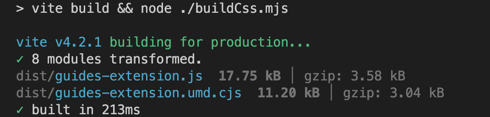
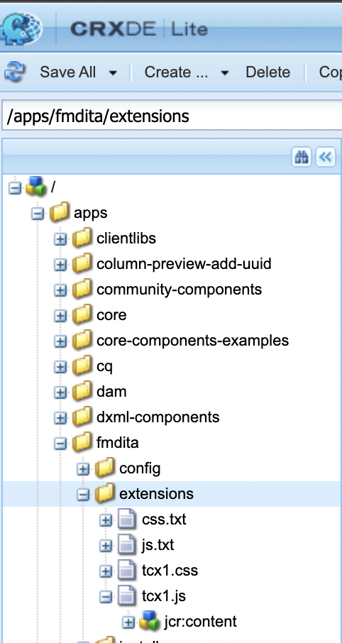
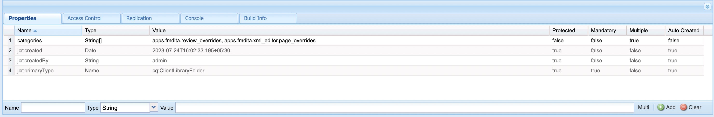

# 安装和使用AEM Guides扩展包

通过扩展，您可以自定义AEM Guides应用程序以更好地满足您的需求。 AEM Guides v4.3及更高版本（内部部署）和2310（云）支持此扩展框架。

## 要求

此包需要 [Git bash](https://github.com/git-guides/install-git) 和npm

## 安装

引导AEM Guides框架安装的最简单方法是通过cli

```bash
npx @adobe/create-guides-extension
```

## 添加自定义设置代码

1. 为要在中扩展的每个组件添加代码文件 `src/` 目录。 已经为您添加了一些样例文件。
2. 现在，在 `index.ts` 文件位于 `src/` 目录：
   - 导入 `.ts` 包含要在内部版本中添加的自定义设置的文件。
   - 将导入添加到 `window.extension`
   - 注册自定义组件的 `id` 和相应的导入到 `tcx extensions`
   - 请参阅示例 `/src/index.ts`

## 构建自定义代码

- 运行 `npm run build` 在根目录中。 目录里有3个文件， `dist/`：
   - `build.css`
   - `guides-extension.js`
   - `guides-extension.umd.cjs`



## 将自定义项添加到AEM

- 转到 `CRXDE` `crx/de/index.jsp#/`
- 在 `apps` 文件夹，新建类型为的节点 `cq:ClientLibraryFolder`



- 在 `properties` 选择节点 `Multi` 添加以下属性Name： `categories`
类型： `String []`
值： `apps.fmdita.review_overrides`， `apps.fmdita.xml_editor.page_overrides`



- 要添加构建的js，请创建新文件，例如， `tcx1.js` 在上述创建的节点中。 此处，添加来自的代码 `dist/guides-extension.umd.cjs` 或 `dist/guides-extension.js`. 现在创建新文件 `js.txt`，此处我们添加js文件的名称，在本例中为：

```t
#base=.
tcx1.js
```

- 要添加内置的css，请创建新文件，例如， `tcx1.css` 在上述创建的节点中。 此处，添加来自的代码 `dist/build.css`. 现在创建新文件 `css.txt`，此处我们添加css文件的名称，在本例中为：

```t
#base=.
tcx1.css
```

- 执行 `shift + refresh` 以加载包含自定义设置的应用程序！

## 疑难解答

检查上述所有步骤是否正确执行。
将代码添加到tcx.js后，请确保进行硬刷新（shift +刷新）。
现在打开AEM，右键单击并单击 `Inspect`
转到“源”并搜索您的 `[node_name].js` （例如： extensions.js）文件。 执行控制/Cmd + D以搜索文件。 如果 `.js` 文件包含您粘贴自的JS代码 `dist/guides-extension.umd.cjs` 或 `dist/guides-extension.js`，您的设置已完成
