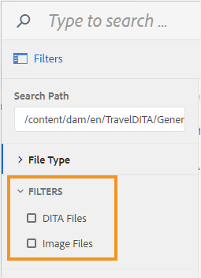

# 为文件浏览对话框配置筛选器 {#id20CIL7009GN}

在Web编辑器中工作时，需要使用文件浏览对话框插入图像、引用或键引用等元素。 默认的文件浏览对话框不提供任何文件过滤选项。 您可以添加自己的过滤器，以便轻松快速地访问所需的文件。

执行以下步骤，将自定义文件过滤选项添加到文件浏览对话框：

1. 登录AEM并打开CRXDE Lite模式。

1. 导航到以下位置提供的默认配置文件：

   `/libs/fmdita/clientlibs/clientlibs/xmleditor/ui_config.json`

1. 在以下位置创建默认配置文件的副本：

   `/apps/fmdita/xmleditor/ui_config.json`

1. 导航到并打开 `ui_config.json` 中的文件 `apps` 节点进行编辑。

1. 在 `ui_config.json` 文件，添加要添加过滤器的定义。

   以下代码段显示了如何添加两个过滤选项 — DITA文件和图像文件。

   ```json
   "browseFilters": [
       {
         "title": "DITA Files",
         "property": "jcr:content/metadata/dita_class",
         "operation": "exists"
       },
       {
         "title": "Image Files",
         "property": "jcr:content/metadata/dc:format",
         "value": [        
           "image/jpeg",
           "image/gif",
           "image/png"
         ]
       }
   ]
   ```

   在上述代码片段中，第一个过滤器用于DITA文件。 过滤器定义采用以下参数：

   - **标题：**   过滤器的显示名称。 此标题将作为筛选选项显示在文件浏览对话框中。

   - **属性：**   在文件的元数据中匹配的属性。 例如，要仅允许具有 `dita_class` 元数据的属性中，属性过滤器采用&quot;`jcr:content/metadata/dita_class`”作为其值。

   - **操作：**   指定&quot;`exists`”以匹配属性参数中指定的值的存在。

   第二个滤镜用于图像文件。 这些参数与第一个筛选器相似，不同之处在于 `value` 参数。 此 `value` 参数以图像类型的数组作为其值。 在value参数中指定的所有文件类型都将被搜索并显示在文件浏览对话框中，所有其他文件类型将被忽略。

1. 保存 *ui\_config.json* 文件并重新加载Web编辑器。

   启动文件浏览对话框时，将显示在ui\_config.json文件中配置的过滤器选项。

   {width="300" align="left"}
