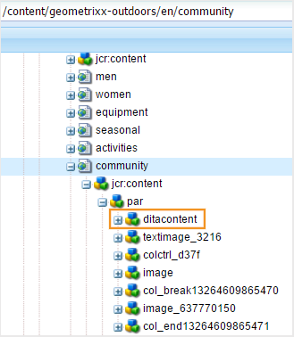
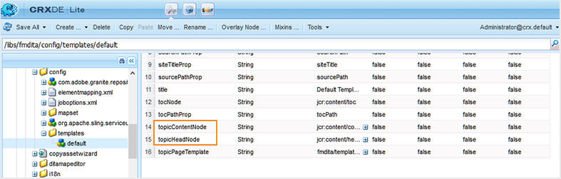
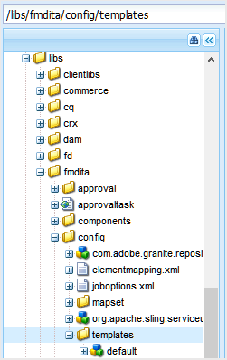
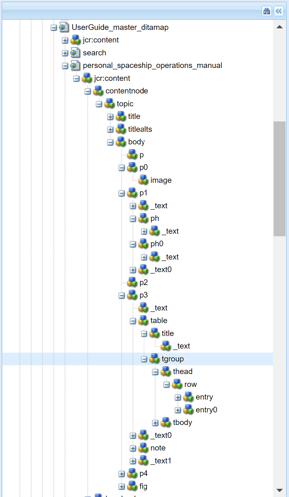
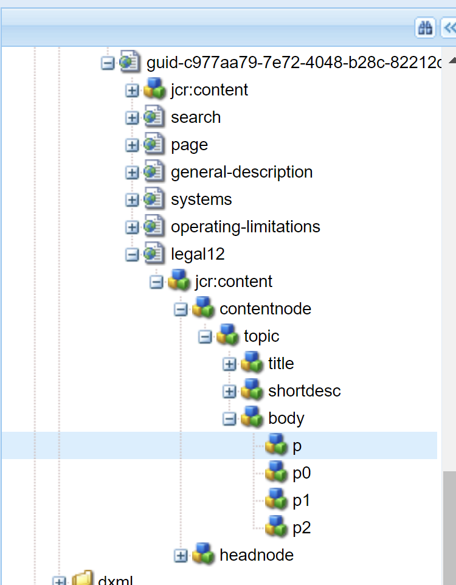
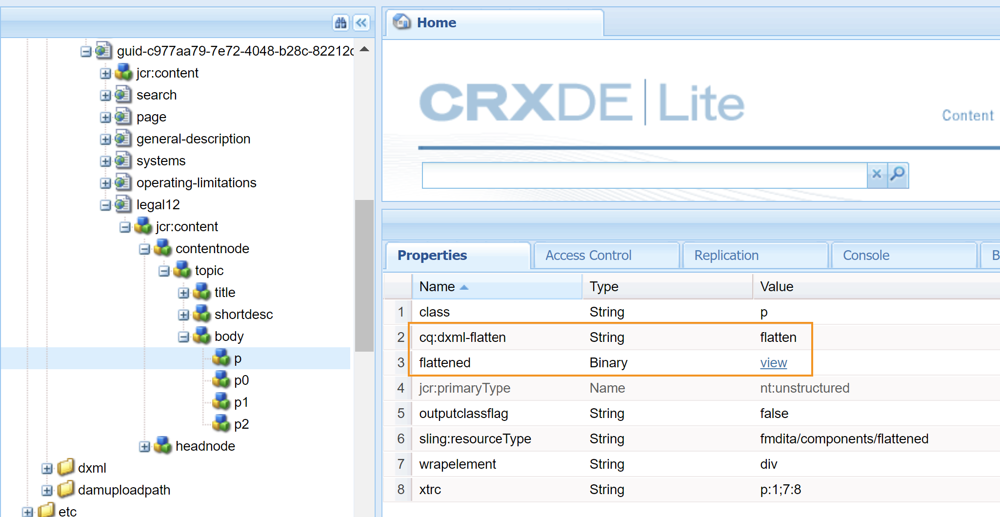
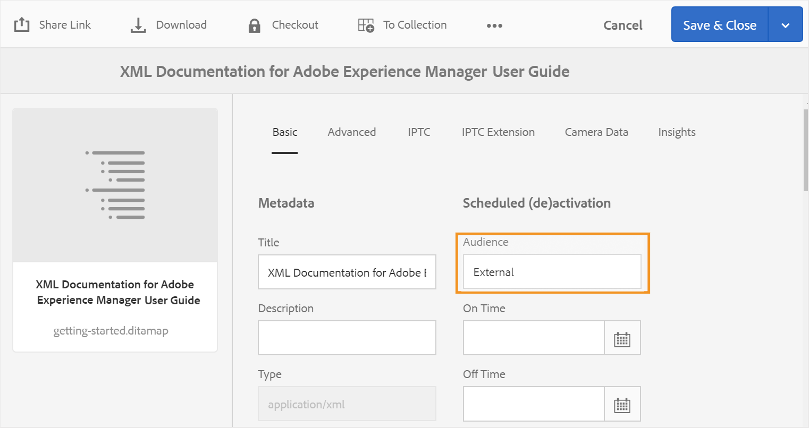

# 配置输出生成设置 {#id181AI0B0E30}

AEM Guides提供了许多配置选项，供您自定义输出生成过程。 本主题介绍有助于您设置输出生成过程的所有配置和自定义设置。

## 在DITA映射操控板上配置基线选项卡 {#id223MD0D0YRM}

您可以配置和隐藏地图仪表板上可用的“基线”选项卡。

此 **隐藏基线选项卡** 选项默认未启用，您需要从configMgr启用它。 执行以下步骤以在Web编辑器中默认启用此选项：

1. 打开Adobe Experience Manager Web控制台配置页面。

   用于访问配置页面的默认URL为：

   ```http
   http://<server name>:<port>/system/console/configMgr
   ```

1. 搜索并单击 **com.adobe.fmdita.config.ConfigManager** 捆绑。

1. 选择 **隐藏基线选项卡** 选项。

1. 单击&#x200B;**保存**。

   >[!NOTE]
   >
   > 此配置默认处于禁用状态，并且基线选项卡在映射仪表板上可用。


## 配置FrameMaker Publishing Server {#id1678G0Z0TN6}

可以使用FrameMaker Publishing Server\(FMPS\)为DITA内容生成输出。 配置FMPS将允许您以FMPS支持的多种格式生成输出。

>[!NOTE]
>
> 要使用FMPS生成输出，您需要设置FMPS服务器。 有关安装和配置的详细信息，请参阅《FrameMaker Publishing Server用户指南》。

要将AEM Guides配置为使用FMPS，请更新 `com.adobe.fmdita.config.ConfigManager` 捆绑包中的组件。

>[!NOTE]
>
> 访问http://&lt;server name=&quot;&quot;>：&lt;port>/system/console/configMgr URL打开Web控制台。

| 属性 | 描述 |
|--------|-----------|
| FrameMaker Publishing Server登录域 | 指定承载FrameMaker Publishing Server的域名或工作组名称。 基于FMPS版本，提供域名为：-   **FMPS 2020**：IP地址： 192.168.1.101 <br>- **FMPS 2019及更早版本**：IP地址或域名 |
| FRAMEMAKER PUBLISHING SERVERURL | 指定FrameMaker Publishing ServerURL。 基于FMPS版本，提供FMPS URL如下所示：<br>- **FMPS 2020**： `http://<fmps_ip>:<port>` \(http://192.168.1.101:7000\) <br> - **FMPS 2019及更早版本**： `http://<fmps_ip>:<port>/fmserver/v1/` |
| FMPS版本 | 指定FrameMaker Publishing Server的版本号。 基于FMPS版本，提供版本信息，如下所示： <br>- **FMPS 2020**：2020 <br> - **FMPS 2019及更早版本**：2019或2017 |
| FrameMaker Publishing Server用户名和密码 | 指定用于访问FrameMaker Publishing Server的用户名和口令。 |
| FMPS超时 | \(*可选*\)指定AEM Guides等待FrameMaker Publishing Server响应的时间\（以秒为单位）。 如果在指定时间内未收到响应，AEM Guides将终止发布任务，并将任务标记为失败。 <br> 默认值：300秒\（5分钟\） |
| 外部AEM URL | *\（可选\）* FrameMaker Publishing Server将放置生成的输出文件的AEM URL。 例如：`http://<server-name>:<port>/`。 |
| AEM管理员用户名和密码 | *\（可选\）* AEM设置管理员的用户名和密码。 FrameMaker Publishing Server将使用此端口与AEM进行通信。 |
| FMPS任务执行等待超时 | 此设置仅适用于FMPS 2020。 指定时间\（以秒为单位），在此时间之后，FMPS将停止等待此进程执行。 |

## 在现有AEM站点中配置混合发布 {#id1691I0V0MGR}

如果您有一个包含DITA内容的AEM站点，则可以配置AEM站点输出以将DITA内容发布到站点内的预定义位置。 例如，在以下屏幕截图中，AEM Site页面， `ditacontent` 节点已保留以存储DITA内容：

{width="300" align="left"}

页面中的其余节点直接从AEM站点编辑器创作。 将发布设置配置为将DITA内容发布到预定义的位置，可确保AEM Guides发布过程不会修改任何现有的非DITA内容。

您需要在现有站点上执行以下配置，以允许将DITA内容发布到预定义节点：

- 配置网站的模板属性

- 在站点中添加节点以发布DITA内容


执行以下步骤可配置现有站点的模板属性：

1. 登录AEM并打开CRXDE Lite模式。

1. 导航到站点的模板配置节点。 例如，AEM Guides将默认模板配置存储在以下节点中：

   `/libs/fmdita/config/templates/default`

   >[!NOTE]
   >
   > 请勿将默认配置文件中的任何自定义设置用于 `libs` 节点。 您必须创建一个由 `libs` 中的节点 `apps` 节点并更新以下文件中的所需文件： `apps` 仅节点。

1. 添加以下属性：

   | 属性名称 | 类型 | 价值 |
   |-------------|----|-----|
   | `topicContentNode` | 字符串 | 指定要发布DITA内容的节点名称。 例如，AEM Guides发布DITA内容的默认节点为： <br>`jcr:content/contentnode` |
   | `topicHeadNode` | 字符串 | 指定要存储DITA内容的元数据信息的节点名称。 例如，AEM Guides存储元数据信息的默认节点为： <br>`jcr:content/headnode` |


以下屏幕截图显示了在AEM Guides的默认模板节点中添加的属性：

{width="800" align="left"}

下次使用站点的模板配置发布任何DITA内容时，该内容将发布到 `topicContentNode` 和 `topicHeadNode` 属性。

但是，对于现有站点，您必须手动添加 `topicContentNode` 和 `topicHeadNode` 节点。

执行以下步骤，将所需的节点添加到现有站点：

1. 登录AEM并打开CRXDE Lite模式。

1. 定位 `jcr:content` 在站点节点中。

1. 添加 `topicContentNode` 和 `topicHeadNode` 与在站点的模板配置中指定的名称相同的节点。


## 自定义AEM站点输出 {#id166TG0B30WR}

AEM Guides支持以下列格式创建输出：

- AEM站点

- PDF

- HTML5
- ePub
- 通过DITA-OT自定义输出

对于AEM Site输出，您可以为不同的输出任务分配不同的设计模板。 这些设计模板可以不同布局呈现DITA内容。 例如，您可以为内部和外部受众指定不同的设计模板。

您还可以将自定义DITA Open Toolkit \(DITA-OT\)插件与AEM Guides一起使用。 您可以上传这些自定义DITA-OT插件以按特定方式生成PDF输出。

>[!TIP]
>
> 请参阅 *AEM站点发布* 部分。[appendix.md\#](appendix.md#) 以了解有关创建AEM站点输出的最佳实践。

### 自定义用于生成输出的设计模板 {#customize_xml-add-on}

AEM Guides使用一组预定义的设计模板来生成AEM Site输出。 您可以自定义AEM Guides的设计模板，以生成符合您公司品牌要求的输出。 设计模板是各种样式\(CSS\)、脚本\（服务器和客户端\）、资源\（图像、徽标和其他资源\）以及将所有这些资源绑定在一起的JCR节点的集合。 设计模板可以非常简单，只需具有几个JCR节点的单个服务器端脚本，也可以是样式、资源和JCR节点的复杂组合。 设计模板由AEM Guides发布子系统在生成AEM Site输出时使用，它们控制所生成输出的结构、外观和风格。

设计模板资源在服务器上的放置位置没有限制，但通常会根据其功能进行逻辑组织。 例如，默认模板将其所有JavaScript和CSS文件存储在下 `/etc/designs/fmdita/clientlibs/siteoutput/default` 文件夹。 无论这些文件位于何处，它们都会通过一组JCR节点链接在一起。 这些JCR节点和文件共同构成了整个设计模板。

AEM Guides附带的默认设计模板允许您自定义登录、主题和搜索页面组件。 您可以复制缺省设计和相应的参照模板，并指定不同的元件来生成所需的输出。

执行以下步骤，指定用于AEM Site输出生成的您自己的设计模板：

1. 登录AEM并打开CRXDE Lite模式。

1. 导航到默认设计模板节点。 默认设计模板节点的位置为：

   `/libs/fmdita/config/templates/`

   {width="300" align="left"}

   >[!NOTE]
   >
   > 复制默认设计模板 `libs` 文件夹到 `apps` 并在 `apps` 文件夹。 您还必须在从默认模板节点引用的模板中进行更改。 引用的模板放在 `/libs/fmdita/templates/default/cqtemplates` 节点。 在中复制引用的模板 `apps` 文件夹。

1. 单击 *默认* 中的组件 *模板* 节点以访问其属性。

   下表描述了AEM Guides的设计模板属性。

   | 属性 | 描述 |
   |--------|-----------|
   | `landingPageTemplate`， `searchPageTemplate`， `topicPageTemplate`， `shadowPageTemplate` | 指定 `cq:Template` 节点\（登陆、搜索和主题\）。 默认情况下， `cq:Template` 可以在中找到这些页面的节点 `/libs/fmdita/templates/default/cqtemplates` 节点。 此节点定义登录、搜索和主题页面的结构和属性。 <br>此 `shadowPageTemplate` 用于优化分块内容。 您需要将此属性的值设置为： <br> `fmdita/templates/default/cqtemplates/shadowpage` <br> **注意** 您必须为以下项目指定一个值： `topicPageTemplate`. 此 `landingPageTemplate` 和 `searchPageTemplate` 是可选属性。 如果您不希望生成搜索和登陆页面，请不要指定这些属性。 |
   | `title` | 设计模板的描述性名称。 |
   | `topicContentNode` | 将在主题页面中包含DITA内容的节点的位置。 路径相对于主题页面。 |
   | `topicHeadNode` | 包含派生自DITA内容的头值\（或metadata\）的节点位置。 路径相对于主题页面。 |
   | `tocNode` | 将包含目录的节点的位置。 路径相对于登陆页面或目标路径。 |
   | `basePathProp` | 用于存储已发布站点的根目录的路径的属性名称。 |
   | `indexPathProp` | 用于存储已发布站点的登陆/索引页面路径的属性名称。 |
   | `pdfPathProp` | 存储主题PDF路径的属性名称(如果启用了主题PDF生成)。 |
   | `pdfTypeProp` | 用于存储PDF生成类型的属性名称。 目前，此属性始终包含“主题”。 |
   | `searchPathProp` | 用于存储搜索页面路径的属性名称（如果模板包含搜索页面）。 |
   | `siteTitleProp` | 用于存储正在发布的站点标题的属性名称。 此标题通常与正在发布的地图的标题相同。 |
   | `sourcePathProp` | 用于存储当前页面的源DITA主题的路径的属性名称。 |
   | `tocPathProp` | 用于存储已发布站点的目录根目录的路径的属性名称。 |


>[!NOTE]
>
> 创建自定义设计模板节点后，必须更新AEM Site输出预设中的“设计”选项才能使用自定义设计模板节点。

有关更多信息，请参阅 [创建您的第一个Adobe Experience Manager 6.3网站](https://helpx.adobe.com/experience-manager/using/first_aem63_website.html) 和 [基础知识](https://helpx.adobe.com/experience-manager/6-3/sites/developing/using/the-basics.html) 在AEM上开发您自己的网站。

### 使用文档标题生成AEM站点输出

在生成AEM Site输出时，生成URL的方式对内容的可发现性起着重要作用。 如果您使用的是基于UUID的文件名，则根据文件的UUID生成URL不利于搜索。 作为管理员或发布者，您可以控制如何为AEM Site输出生成URL。 AEM Guides为您提供了一个配置，通过该配置，您可以选择使用文件的标题而不是基于UUID的文件名来生成AEM Site输出的URL。 默认情况下，对于基于UUID的文件系统，此选项处于打开状态。 这意味着在为基于UUID的文件系统生成AEM Site输出时，文件的标题将用于生成URL，而不是文件的UUID。

在生成AEM Site输出时，生成URL的方式对内容的可发现性起着重要作用。 对于不基于UUID的文件系统，AEM Site输出是使用文件名而不是文件的标题生成的。 作为管理员或发布者，您可以控制如何为AEM Site输出生成URL。 AEM Guides为您提供了一个配置，通过该配置，您可以选择使用文件的标题而不是文件名生成AEM Site输出的URL。 默认情况下，此选项处于关闭状态。 这意味着在生成AEM Site输出时，文件名将用于生成URL，而不是文件的标题。 通过启用此选项，您可以选择根据文件标题生成URL。

>[!NOTE]
>
> 您可以进一步配置规则，以仅允许在AEM Site输出的URL中使用一组字符。 有关更多详细信息，请参阅 [配置用于创建主题和发布AEM站点输出的文件名清理规则](#id2164D0KD0XA).

要在AEM Site输出中配置URL生成，请执行以下步骤：

1. 打开Adobe Experience Manager Web控制台配置页面。

   用于访问配置页面的默认URL为：

   ```http
   http://<server name>:<port>/system/console/configMgr
   ```

1. 搜索并单击 **com.adobe.fmdita.config.ConfigManager** 捆绑。

1. 选择 **对AEM站点页面名称使用标题** 选项。

   >[!NOTE]
   >
   > 如果要使用文件名生成输出，请取消选择此选项。

1. 单击&#x200B;**保存**。


### 配置用于创建主题和发布AEM站点输出的文件名清理规则 {#id2164D0KD0XA}

作为管理员，您可以定义文件名中允许的有效特殊字符列表，这些字符最终形成AEM Site输出的URL。 在早期版本中，允许用户定义包含特殊字符的文件名，例如 `@`， `$`， `>`，等等。 这些特殊字符会在生成AEM网站页面时生成编码的URL。

从3.8版本开始，添加了配置以定义允许文件名中使用的特殊字符列表。 默认情况下，有效的文件名配置包含&#39;&#39;`a-z A-Z 0-9 - _`“。 这意味着在创建文件时，文件的标题中可以包含任何特殊字符，但在内部，它将被替换为连字符\(`-`\)的文件名中。 例如，文件的标题可以是Introduction 1或Introduction@1 ，针对这两种情况生成的相应文件名是Introduction-1。

定义有效字符列表时，请记住这些字符»`*/:[\]|#%{}?&<>"/+`”和 `a space` 将始终替换为连字符\(`-`\)。

>[!NOTE]
>
> 如果未配置有效的特殊字符列表，文件创建过程可能会给您一些意外的结果。

要在文件名和AEM Site输出中配置有效的特殊字符，请执行以下步骤：

1. 打开Adobe Experience Manager Web控制台配置页面。

   用于访问配置页面的默认URL为：

   ```http
   http://<server name>:<port>/system/console/configMgr
   ```

1. 搜索并单击 *com.adobe.fmdita.common.SanitizeNodeNameImpl* 捆绑。

1. 在 **不允许将字符集发布到AEM Sites** 属性，确保将属性设置为 ```'<>`@$```. 您可以向此列表添加更多特殊字符，但是，它必须具有这些必需的特殊字符。

   >[!NOTE]
   >
   > 您还可以配置其他属性，例如 **使用小写** 在文件名中， **分隔符** 处理无效字符，以及 **最大字符数** 在文件名中允许。

1. 单击&#x200B;**保存**。

1. 搜索并单击 **com.adobe.fmdita.config.ConfigManager** 捆绑。

1. 在 **有效字符的正则表达式** 属性，确保将属性设置为 `[-a-zA-Z0-9_]`. 您可以向此列表添加更多字符，但是，它必须具有这些基本字符，并且列表必须以连字符\(`-`\)。

   >[!NOTE]
   >
   > 此属性定义用于创建新文件的有效字符列表。

1. 单击&#x200B;**保存**。


### 配置AEM站点节点结构的扁平化

在生成AEM Site输出时，将在内部创建主题中每个元素的节点。 对于包含数千个主题的DITA映射，此节点结构可能会变得太深。 对于较大的站点，这种类型的深度嵌套节点结构可能存在性能问题。 以下快照显示AEM Site输出的深度嵌套节点结构：

{width="300" align="left"}

在上面的快照中，请注意为每个 `p` 元素及其后续子元素和类似结构会为主题中使用的其他所有元素创建。

AEM Guides允许您配置如何在内部创建AEM Site输出的节点结构。 可以在指定的元素处拼合节点结构，这意味着您可以定义一个元素，该元素将被视为主元素，其中的所有子元素将与主元素合并。 例如，如果您决定拼合 `p` 元素，然后显示在 `p` 元素将与主元素合并 `p` 元素。 将不会为 `p` 元素。 以下快照显示扁平化于 `p` 元素：

{width="300" align="left"}

要拼合AEM Site节点结构，请执行以下步骤：

1. 指定要展平节点结构的元素。

   1. 叠加 `libs` 中的节点 `apps` 节点并打开elementmapping.xml文件。

   1. 添加 `<flatten>true</flatten>` 属性。 例如，如果要在 `p` 元素，然后在定义中添加flatten属性 `p` 元素如下所示：

      ```XML
      <ditaelement>
          <name>p</name>
          <class>- topic/p</class>
          <componentpath>fmdita/components/dita/wrapper</componentpath>
          <type>COMPOSITE</type>
          <target>para</target>
          <flatten>true</flatten>
          <wrapelement>div</wrapelement>
      </ditaelement>
      ```

      >[!NOTE]
      >
      > 默认情况下，flatten节点属性配置于 `p` 元素。

1. 在configMgr中启用站点节点拼合配置。

   1. 打开Adobe Experience Manager Web控制台配置页面。

      用于访问配置页面的默认URL为：

      ```http
      http://<server name>:<port>/system/console/configMgr
      ```

   1. 搜索并单击 *com.adobe.dxml.flattening.FlatteningConfigurationService* 捆绑。

   1. 选择 **属性拼合.enabled** 选项。

   1. 单击&#x200B;**保存**。


>[!IMPORTANT]
>
> 如果您在elementmapping.xml文件中进行了任何更改，请确保打开configMgr并保存任何包以使更改生效。

现在，当您生成AEM Site输出时， `p` 元素平面化并存储在 `p` 元素本身。 您可以为以下对象找到新的拼合属性： `p` CRXDE中的元素。

{width="650" align="left"}

**防止AEM站点注释结构扁平化**

与在AEM Site输出中指定要拼合的节点类似，您还可以指定要从此配置中排除的元素。 例如，如果要扁平化节点 `body` 元素，但您不需要 `table` 元素范围 `body` 要进行拼合，您可以在 `table` 元素的定义。

要排除 `table` 元素，将以下属性添加到 `table` 元素的定义：

`<preventancestorflattening>true|false</preventancestorflattening>`

### 在AEM站点输出中为已删除的页面配置版本控制

使用以下方式生成AEM站点输出时 **删除和**&#x200B;创建&#x200B;****为现有输出页面设置选择的选项，将为要删除的页面创建版本。 您可以将系统配置为在删除之前停止创建版本。

执行以下步骤可停止为要删除的页面创建版本：

1. 打开Adobe Experience Manager Web控制台配置页面。

   用于访问配置页面的默认URL为：

   ```http
   http://<server name>:<port>/system/console/configMgr
   ```

1. 搜索并单击 *com.adobe.fmdita.config.ConfigManager* 捆绑。

1. 选择&#x200B;**不为已删除的页面创建版本** 选项。

   >[!NOTE]
   >
   > 选中此选项后，用户可直接删除任何页面，而无需为其创建任何版本。 如果未选中该选项，则在删除页面之前将创建一个版本。

1. 单击&#x200B;**保存**。

## 通过DITA-OT发布输出时使用元数据 {#id191LF0U0TY4}

AEM Guides提供了一种在使用DITA-OT发布输出时传递自定义元数据的方式。 作为管理员和发布者，您需要执行以下任务以在已发布输出中配置和使用自定义元数据：

- 作为管理员，在系统中添加所需的元数据，以便该元数据在DITA映射的“属性”页面上可用。

- 作为管理员，将自定义元数据添加到元数据列表中，以便该元数据显示在DITA映射控制台中。

- 作为发布者，使用DITA映射配置和添加自定义元数据并生成所需的输出。


要在系统中添加所需的元数据，请执行以下步骤：

1. 以管理员身份登录Adobe Experience Manager。

1. 单击顶部的Adobe Experience Manager链接，然后选择 **工具**.

1. 选择 **资产** 工具列表中。

1. 单击 **元数据架构** 磁贴。

   此时会显示元数据架构Forms页面。

1. 选择 **默认** 表单中。

   >[!NOTE]
   >
   > 在DITA映射的“属性”页面上显示的属性取自此表单。

1. 单击 **编辑**.

1. 添加要在发布的输出中使用的自定义元数据。 例如，我们将使用以下步骤添加受众元数据：

   1. 从 **构建表单** 组件列表，拖放 **单行文本** 组件放在窗体上。

   1. 选择新字段以打开 **设置** 字段的。

   1. 在 **字段标签**，输入元数据名称 — Audience。

   1. 在 **映射到属性** 设置，指定。/jcr：content/metadata/&lt;name of=&quot;&quot; the=&quot;&quot; metadata=&quot;&quot;>. 例如，我们将其设置为。/jcr：content/metadata/audience.

   使用这些步骤，添加所有必需的元数据参数。

1. 单击&#x200B;**保存**。


现在，所有DITA映射的“属性”页面中都会显示新参数。

{width="650" align="left"}

接下来，您需要使自定义元数据在DITA映射控制台中可用。 执行以下步骤，使自定义元数据在DITA映射短划线板上可用：

1. 登录AEM并打开CRXDE Lite模式。

1. 访问位于以下位置的metadataList文件：

   /libs/fmdita/config/metadataList

   >[!NOTE]
   >
   > metadataList文件包含属性列表，这些属性显示在 **属性** 映射仪表板中DITA映射的下拉列表。 默认情况下，此文件中列出了四个属性 — docstate、dc：language、dc：description和dc：title。

1. 添加您在元数据架构Forms页面中添加的自定义元数据。 例如，将受众参数添加到默认列表的末尾。

1. 单击&#x200B;**全部保存**。


现在，自定义元数据将显示在DITA映射控制台的 **属性** 下拉列表。

最后，作为发布者，您需要在发布的输出中包含自定义元数据。 要在生成输出时处理自定义元数据，请执行以下步骤：

1. 在Assets UI中，导航到要发布的DITA映射。

1. 选择DITA映射文件并打开其属性页。

1. 在属性页面上，指定自定义元数据的值。 在本例中，我们为受众参数指定了External值。

   {width="650" align="left"}

1. 单击“**保存并关闭**”。

1. 单击DITA映射文件以打开DITA映射控制台。

1. 在 **输出预设** 选项卡，选择要用于生成输出的输出预设。

1. 单击 **编辑**.

1. 从 **属性** 下拉列表中，选择要传递给发布过程的属性。

   {width="650" align="left"}


选定的属性/元数据将传递到发布流程，并在最终输出中可用。

## 使用AEM组件自定义DITA元素映射 {#id1679J600HEL}

AEM Guides中的DITA元素映射到其对应的AEM组件。 AEM Guides在发布和审阅等工作流中使用此映射，将DITA元素转换为相应的AEM组件。 映射在中定义 `elementmapping.xml` 文件，可从CRXDE Lite模式访问。 在CRXDE Lite模式下访问以下URL：

`/libs/fmdita/config/elementmapping.xml`

>[!NOTE]
>
> 请勿将默认配置文件中的任何自定义设置用于 ``libs`` 节点。 您必须创建一个由 ``libs`` 中的节点 ``apps`` 节点并更新以下文件中的所需文件： ``apps`` 仅节点。

您可以使用预定义的DITA元素映射，也可以将DITA元素映射到自定义AEM组件。 要使用自定义AEM组件，您需要了解 `elementmapping.xml` 文件。

### elementmapping.xml结构

全面概述 `elementmapping.xml` 架构说明如下：

1. 首先基于元素名称搜索每个DITA元素以查找相应的组件映射。 例如：

   ```XML
   <ditaelement>     
      <name>**substeps**</name>  
      <class>- topic/ol task/substeps</class>  
      <componentpath>dita/components/ditaolist</componentpath>  
      <type>COMPOSITE</type>  
      <target>para</target>
   </ditaelement>
   ```

   在上例中，所有 `substeps` DITA元素使用 `dita/components/ditaolist` 组件。

1. 如果DITA元素未根据名称找到匹配项，则根据 `class` 已完成。 例如：

   ```XML
   <ditaelement>  
      <name>topic</name>  
      <class>**- topic/topic**</class>  
      <componentpath>fmdita/components/dita/topic</componentpath>  
      <type>COMPOSITE</type>  
      <target>para</target>  
      <attributemap> 
         <attribute from="id" to="id" />  
      </attributemap>
   </ditaelement>
   ```

   在上例中，如果没有为 `task` 元素，然后 `task` 元素被映射到上述组件，因为 `task` 继承自 `topic` 组件。

1. 当元素具有相应的组件映射时，则其子元素的进一步处理由来确定 `type`. 例如：

   ```XML
   <ditaelement>  
      <name>title</name>  
      <class>- topic/title</class>  
      <componentpath>foundation/components/title</componentpath>  
      <type>**STANDALONE**</type>  
      <target>para</target>  
      <textprop>jcr:title</textprop>
   </ditaelement>
   ```

   `type` 采用以下值：

   - 组合：元素到组件 *子元素的映射将继续* 也一样。

   - STANDALONE：当前元素的子元素为 *未进一步映射*.

   在上例中，如果 `<title>` 元素具有任何子元素，将不会映射到任何其他组件。 的组件 `<title>` 元素负责呈现 `<title>` 元素。

1. 如果有多个组件映射到单个DITA元素，则会选择该元素的最佳匹配项。 要选择最佳匹配元件，需要考虑DITA元素的域和结构专业化。

   如果存在具有域专门化的DITA元素并且为域专门化映射了组件，则该组件被赋予高优先级。

   同样，如果存在具有结构专门化的DITA元素并且为结构专门化映射了某个组件，则该组件将获得高优先级。

1. 您可以使用 `<attributemap>` 在元素映射中，将属性值映射到对应的节点属性。

1. `textprop` 可用于将DITA元素的文本内容序列化为节点属性。 此外，可以在元素标记中多次使用它来序列化已发布层次结构中多个位置的文本内容。 您还可以自定义目标属性的位置和名称。 例如：

   ```XML
   <ditaelement> 
       <name>title</name> 
       <class>- topic/title</class> 
       <componentpath>foundation/components/title</componentpath> 
       <type>STANDALONE</type> 
       <target>para</target> 
       <textprop>**jcr:title**</textprop>
   </ditaelement>
   ```

   上述元素映射指定了 `<title>` 元素将另存为名为的属性的值 `jcr:title` 在输出节点上。

1. `xmlprop` 可用于将给定元素的整个XML序列化为节点属性。 然后，组件可以读取此节点属性并进行自定义渲染。 例如：

   ```XML
   <ditaelement> 
       <name>svg-container</name> 
       <class>+ topic/foreign svg-d/svg-container</class> 
       <componentpath>fmdita/components/dita/svg</componentpath> 
       <type>STANDALONE</type> 
       <target>para</target> 
       <xmlprop>**data**</xmlprop>
   </ditaelement>
   ```

   上述元素映射指定元素的整个XML标记 `<svg-container>` 将另存为名为的属性的值 `data` 在输出节点上。

1. 在输出生成过程中有一个特殊的属性映射来处理路径解析。 例如：

   ```XML
   <attributemap> 
       <attribute from="href" to="fileReference" ispath="true" rel="source" /> 
       <attribute from="height" to="height" /> 
       <attribute from="width" to="width" />
   </attributemap>
   ```

   对于上述 `attributemap`， `href` dita元素中的属性将映射到名为的节点属性 `fileReference`. 现在，自 `ispath` 设置为 `true`，输出生成过程会解析此路径，然后在中设置它 `fileReference` 节点属性。

   此分辨率如何根据 `rel` 属性映射中的属性。

   - 如果 `rel=source`，然后值 `href` 相对于当前正在处理的DITA源文件解析。 的值 `href` 解析并放置在 `fileReference` 属性。

   - 如果 `rel=target`，然后值 `href` 相对于根发布位置解析。 的值 `href` 解析并放置在 `fileReference` 属性。

   如果您不希望对路径属性进行任何预处理或解析，则无需指定 `ispath` 属性。 该值会按原样复制，组件可以执行所需的分辨率。


### DITA元素架构

以下是中的DITA元素架构示例 `elementmapping.xml` 文件：

```XML
<ditaelement>         
    <name>element_name</name>     
    <class>element_class</class>     
    <componentpath>fmdita/components/dita/component_name</componentpath>     
    <type>COMPOSITE|STANDALONE</type>      
    <attributeprop>propname_a</attributeprop>       
    <textprop>propname_t</textprop>     
    <xmlprop>propname_x</xmlprop>      
    <xpath>xpath expression string</xpath>      
    <target>head|para</target>      
    <wrapelement>div</wrapelement>      
    <wrapclass>class_name</wrapclass>      
    <attributemap>           
    <attribute from="attrname" to="propname" ispath="true|false" rel="source|target" />     
    </attributemap>     
    <skip>true|false</skip> 
</ditaelement>
```

下表介绍了DITA元素架构中的元素：

| 元素 | 描述 |
|-------|-----------|
| `<ditaelement>` | 每个映射元素的顶级节点。 |
| `<class>` | 要为其编写组件的目标DITA元素的类属性。 <br>例如，DITA主题的class属性为： <br>`topic/topic` |
| `<componentpath>` | 映射的AEM组件的CRXDE路径。 |
| `<type>` | 可能的值： <br>- **复合**：同时处理子元素 <br>- **独立**：跳过子元素的处理 |
| `<attributeprop>` | 用于将序列化DITA属性和值作为属性映射到AEM节点。 例如，如果您拥有 `<note type="Caution">` 元素并且为此元素映射的组件具有 `<attributeprop>attr_t</ attributeprop>`，则节点的属性和值将序列化为 `attr_t` 对应AEM节点的属性\( `attr_t->type="caution"`\)。 |
| `<textprop>propname_t</textprop>` | 保存 `getTextContent()` 输出到由定义的属性 `propname_t.` **注意：**  这是一个优化的属性。 |
| `<xmlprop>propname_x </xmlprop>` | 将此节点的序列化XML保存到定义的属性 `propname_x.` **注意：** 这是一个优化的属性。 |
| `<xpath>` | 如果在元素映射中提供了XPath元素，则还应与元素名称和类一起满足XPath条件以使用组件映射。 |
| `<target>` | 将DITA元素放置在crx存储库中的指定位置。 <br>可能的值：<br>- **head**：在head节点下 <br>- **文本**：在段落节点下 |
| `<wrapelement>` | 用于包住内容的HTML元素。 |
| `<wrapclass>` | 属性的元素值 `wrapclass.` |
| `<attributemap>` | 包含一个或多个的容器节点 `<attribute>` 节点。 |
| `<attribute from="attrname" to="propname" ispath="true|false" rel="source|target" />` | 将DITA属性映射到AEM属性：<br>- **`from`**： DITA属性名称<br>- **`to`**：AEM组件属性名称 <br>- **`ispath`**：如果属性是路径值\(例如： *图像*\)<br>- **`rel`**：如果路径是源或目标 <br>**注意：** 如果 `attrname` 开头为 `%`，然后映射 `attrname minus '%'` 至prop ` `propname`’。 |

**其他说明**

- 如果计划改写默认要素映射，建议不要在默认要素映射中进行更改 `elementmapping.xml` 文件。 您应该创建一个新的映射XML文件，并将该文件放置在其他位置，最好是放置在您创建的自定义apps文件夹中。

- 在 `elementmapping.xml` 文件，有许多映射项引用fmdita/components/dita/wrapper组件。 包装器是一个通用组件，它使用站点节点上的属性生成相关HTML，来呈现相对简单的DITA结构。 它使用 `wrapelement` 属性，用于生成封闭标记并将子渲染委派给相应的组件。 当您只需要容器组件时，此选项非常有用。 而不是创建一个新组件来呈现特定的容器标记，如 `div` 或 `p`，您可以将包装组件与 `wrapelement` 和 `wrapclass` 属性以获得相同的效果。

- 建议不要在字符串JCR属性中保存大量文本。 输出生成中的优化属性类型计算可确保大型文本内容不会另存为字符串类型。 相反，当需要保存大于特定阈值的内容时，属性的类型会更改为二进制。 默认情况下，此阈值配置为512字节，但可在配置管理器中更改\(*com.adobe.fmdita.config.ConfigManager*\)更改 **另存为二进制阈值** 设置。

- 如果您计划覆盖某些\（而非全部\）元素映射，则不必复制整个 `elementmapping.xml` 文件。 您需要创建一个新的XML映射文件，并仅定义要覆盖的元素。

- 在自定义位置创建XML文件后，更新 `Override Element Mapping` 在中设置 `com.adobe.fmdita.config.ConfigManager` 捆绑。


## 自定义DITA映射控制台 {#id188HC08M0CZ}

AEM Guides使您可以灵活地扩展DITA映射控制台的功能。 例如，如果您有一组与AEM Guides中可用的报告不同的报告，可以将此类报告添加到映射控制台。 要自定义映射控制台，您需要创建一个AEM客户端库\（或ClientLib\），其中包含用于执行所需功能的代码。

>[!NOTE]
>
> 不建议直接修改页面组件，因为新版本的产品将覆盖此设置。

AEM Guides提供了 `apps.fmdita.dashboard-extn` 用于自定义映射控制台的类别。 每当加载映射控制台时，在 `apps.fmdita.dashboard-extn` 类别被执行并加载。

>[!NOTE]
>
> 有关创建AEM客户端库的详细信息，请参阅 [使用客户端库](https://helpx.adobe.com/experience-manager/6-4/sites/developing/using/clientlibs.html).

## 在输出生成期间处理图像演绎版 {#id177BF0G0VY4}

AEM提供了一组默认的工作流和媒体句柄来处理资产。 在AEM中，有预定义的工作流用于处理最常见的MIME类型的资源。 通常，AEM会为您上传的每个图像以二进制格式创建相同的多个演绎版。 这些演绎版可以具有不同的尺寸、不同的分辨率、添加的水印或某些其他改变的特征。 有关AEM如何处理资源的更多信息，请参阅 [使用媒体处理程序和工作流处理资源](https://helpx.adobe.com/experience-manager/6-5/assets/using/media-handlers.html) 请参阅AEM文档。

AEM Guides允许您配置在为文档生成输出时使用的图像演绎版。 例如，您可以从默认图像演绎版中选择或创建图像演绎版，然后使用相同的图像演绎版发布文档。 用于发布文档的图像演绎版映射存储在中 `/libs/fmdita/config/ **renditionmap.xml**` 文件。 代码片段 `renditionmap.xml` 文件如下所示：

>[!NOTE]
>
> 建议您创建 `renditionmap.xml` 中的文件 `apps` 所有自定义项的文件夹。

```XML
<renditionmap>
   <mapelement>
      <mimetype>image/png</mimetype>
      <rendition output="AEMSITE">cq5dam.web.1280.1280.jpeg</rendition>
      <rendition output="PDF">original</rendition>
      <rendition output="HTML5">cq5dam.web.1280.1280.jpeg</rendition>
      <rendition output="EPUB">cq5dam.web.1280.1280.jpeg</rendition>
      <rendition output="CUSTOM">cq5dam.web.1280.1280.jpeg</rendition>
   </mapelement>
...
</renditionmap>
```

此 `mimetype` 元素指定文件格式的MIME类型。 此 `rendition output` 元素指定输出格式的类型和格式副本的名称\(例如， `cq5dam.web.1280.1280.jpeg`\)来发布指定的输出。 您可以指定用于所有受支持的输出格式(AEMSITE、PDF、HTML5、EPUB和自定义)的图像演绎版。

如果指定的格式副本不存在，则AEM Guides发布过程将首先查找给定图像的Web格式副本。 如果找不到Web演绎版，则使用图像的原始演绎版。

>[!NOTE]
>
> 这些图像演绎版仅控制输出生成。 当您打开文档进行预览或审阅时，会使用图像的Web演绎版。

## 为输出历史记录配置自动清除时段 {#id19AAI070V8Q}

生成输出时，将创建输出以及输出日志。 对于大型DITA映射，这些日志可能会占用存储库中的大量空间。 默认情况下，日志存储在存储库中的以下位置：

/var/dxml/metadata/outputHistory/

在一段时间内，所有日志文件的集合大小可能会达到GB。 AEM Guides允许您配置一个时间段来将这些日志文件保留在资料档案库中。 在指定的时间段后，日志以及输出生成历史记录将从存储库中删除。

>[!NOTE]
>
> 输出生成历史记录是输出选项卡中生成的输出列表中的日志条目。

配置历史记录清除功能会影响存储库中所有DITA映射的输出生成。 在DITA映射的输出选项卡中，在指定的天数之后以及在设置中指定的时间清除历史记录。

>[!NOTE]
>
> 删除日志文件和输出生成历史记录不会对生成的输出产生任何影响。

执行以下步骤来设置清除输出历史记录和日志的日期和时间：

1. 打开Adobe Experience Manager Web控制台配置页面。

   用于访问配置页面的默认URL为：

   ```http
   http://<server name>:<port>/system/console/configMgr
   ```

1. 搜索并单击 **com.adobe.fmdita.config.ConfigManager** 捆绑。

1. 在 **输出历史记录清除期间** 属性，指定清除输出历史记录以及输出日志的天数。 默认情况下，该时间设置为5天。 如果要禁用此功能，则将此属性设置为0。

1. 在 **输出历史记录清除时间** 属性，指定清除进程的启动时间。 默认情况下，设置为0:00 \（或12:00午夜\）。 每天这个时候，清除过程都对 **输出历史记录清除期间** 属性。

   >[!NOTE]
   >
   > 默认情况下，清除功能会在每个午夜对超过5天的输出执行。

1. 单击&#x200B;**保存**。


## 更改最近生成的输出列表限制 {#id1679JH0H0O2}

您可以更改DITA映射的输出选项卡中显示的已生成输出的最大数量。 默认情况下，将显示最近25个生成的输出的列表。 要更改要在列表中显示的输出数量，请更新 **输出列表限制** 在中设置 `com.adobe.fmdita.config.ConfigManager` 捆绑。

>[!TIP]
>
> 请参阅 *输出历史记录* 部分。[appendix.md\#](appendix.md#) 以获取有关使用输出历史记录的最佳实践。

## 输出生成性能优化 {#id176LB050VUI}

AEM Guides允许您配置输出生成进程池大小，以控制同时运行的输出生成进程数。 默认情况下，进程池大小将设置为系统中可用的处理内核数加一。 如果要连续发布，则可能需要将此值更改为1。 在这种情况下，将执行第一个发布任务，并将下一个发布任务存储在发布队列中。

要更改输出生成处理池大小，请更新 **生成池大小** 在中设置 `com.adobe.fmdita.publish.manager.PublishThreadManagerImpl` 捆绑。
