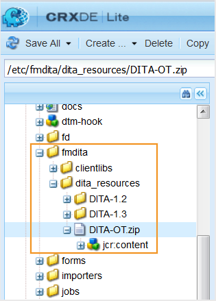

# 使用自定义DITA-OT和DITA专业化 {#id181GAJ0005Z}

DITA Open Toolkit \(DITA-OT\)是一组基于Java的开源工具，用于处理DITA映射和主题内容。 AEM Guides允许您轻松导入和使用自定义DITA-OT插件。 导入后，可以将AEM Guides配置为使用自定义DITA-OT插件生成任何格式的输出。 在生成输出时，只需选择DITA-OT选项，AEM Guides就会使用自定义DITA-OT插件生成所需的输出。

如果您要在发布任何输出时处理Ant参数，AEM Guides为您提供了一种简单的方法。 您可以指定要使用的Ant参数，发布进程随后会处理这些参数。

>[!NOTE]
>
> AEM Guides随DITA-OT版本3.3.2提供。但是，AEM Guides支持DITA-OT版本1.7及更高版本。 有关DITA-OT版本的完整列表，请参见 [DITA-OT版本](http://www.dita-ot.org/download).

>[!TIP]
>
> 请参阅 *DITA-OT配置文件配置* 和 *使用自定义DITA-OT* 最佳实践指南中的部分提供了有关使用自定义DITA-OT插件的最佳实践。

## 使用自定义DITA-OT插件 {#id181NH1020L7}

可通过两种方式使用自定义DITA-OT插件进行发布。 第一种方法是将自定义DITA-OT插件上传到AEM存储库中。 另一种方法是在服务器上保存自定义DITA-OT插件，创建配置文件并在配置文件中提供自定义DITA-OT插件的位置。

默认情况下，AEM Guides附带预配置的配置文件，其中包含用于编辑和发布内容的默认模板的配置。 您可以使用编辑文档时使用的自定义模板以及自定义DITA-OT插件创建自定义配置文件以发布内容。

AEM Guides提供的默认DITA-OT包随Apache FOP XSL-FO处理器提供，该处理器不支持渲染MathML方程组。 如果在内容中使用MathML公式，请确保已集成适用于Apache FOP的MathML渲染引擎插件，或使用不同的XSL-FO处理器。

>[!IMPORTANT]
>
> 如果您已将AEM Guides从2.2版升级到2.5.1版或2.6版，那么通过配置管理器进行的所有更改都将自动选取并存储在默认配置文件中。

执行以下步骤以将自定义DITA-OT插件上载到AEM存储库：

1. 登录AEM并打开CRXDE Lite模式。

1. 下载 `DITA-OT.ZIP` 文件。

   的位置 `DITA-OT.ZIP` 文件为 `/libs/fmdita/dita_resources/DITA-OT.zip`.

   

1. 解压缩服务器上zip文件的内容。

1. 使用DITA-OT插件集成器机制将DITA-OT的新版本与您的自定义DITA-OT插件集成。

   >[!NOTE]
   >
   > 插件ZIP文件中的类路径分隔符取决于操作系统，这意味着如果您的服务器托管在Windows上，则类路径分隔符将不同于Linux上使用的路径分隔符。 有关手动集成插件的更多信息，请参见 *手动安装插件* dita-OT文档中的主题。

1. 再次创建ZIP文件，并保留相同的名称\(`DITA-OT.ZIP`\)和文件夹结构。

1. 将更新后的ZIP文件上传回AEM存储库。

   在上传ZIP文件之前，请确保进行以下检查：

   - 在Mac/Linux操作系统上运行集成器\（以安装自定义插件\）以避免文件分隔符出现问题 — 由于Windows和Linux操作系统具有不同的文件分隔符，因此集成在Mac/Linux操作系统上的插件与Windows和Linux安装程序兼容。
   - 确保 `DITA-OT.ZIP` 文件包含一个名为“DITA-OT”的文件夹，其中包含所有相关的插件和文件。
   - 检查 `DITA-OT.ZIP` 您创建的文件为mimeType： &quot;nt：file&quot; \(这与上传到AEM时的ZIP文件的主要类型相对应\)。 使用WebDAV工具或代码部署将此ZIP文件上传到AEM中的所需路径。 \(请勿使用AEM包管理器部署此ZIP文件，因为此ZIP文件不是AEM内容包，而只是存档文件。\)
   >[!NOTE]
   >
   > 建议不要覆盖默认的DITA-OT包。 您应该将包含插件的自定义DITA-OT包上传到 `apps` 文件夹。

1. 打开默认DITA配置文件进行编辑并保存它\（不进行任何更新\）以使更改生效。

执行以下步骤以创建新配置文件并将其配置为使用存储在服务器上的自定义DITA-OT插件：

1. 将自定义DITA-OT插件存储在服务器上。

   >[!NOTE]
   >
   > 用于存储自定义DITA-OT插件的文件夹结构应为： `\*<parent-folder\>*\DITA-OT`.

1. 单击顶部的Adobe Experience Manager链接，然后选择 **工具**.

1. 选择 **指南** 工具列表中。

1. 单击 **DITA配置文件** 磁贴。

   >[!NOTE]
   >
   > “默认配置文件”信息显示在“配置文件”页面上。 如果您已将AEM Guides从2.2版升级到2.5.1版或2.6版，那么通过配置管理器进行的所有更改都将自动选取并存储在默认配置文件中。

1. 您可以选择编辑默认配置文件，创建新配置文件，或者从默认配置文件中复制设置以创建新配置文件。

   >[!NOTE]
   >
   > 您可以更新默认配置文件，但无法删除它。 但是，您可以编辑和删除您创建的所有新配置文件。

1. 配置以下属性以使用自定义DITA-OT插件：

   | 属性名称 | 描述 |
   |-------------|-----------|
   | **配置文件属性** |
   | 配置文件名称 | 为此配置文件提供一个唯一的名称。 |
   | 重用输出 | *\（可选\）* 如果您的配置文件基于现有的配置文件，请选择此选项。 选择此选项可确保AEM Guides不会再次提取DITA-OT包的内容并重用现有的DITA-OT包。 |
   | 配置文件提取路径 | *\（可选\）* 指定在磁盘上保留DITA-OT的路径。 默认情况下，AEM Guides将DITA-OT包捆绑到其存储库中，并将它提取到磁盘上的此路径下。 **注意** 您可以使用任何现有系统变量或属性定义此路径。 请参阅描述 [DITA-OT环境变量](#id181NH0YN0AX) 属性，以了解更多信息。 |
   | 已分配路径 | \(*可选*\)指定内容存储库中此配置文件适用的路径。 您可以指定多个位置。 |
   | **DITA-OT属性** |
   | DITA-OT超时 | \(*可选*\)指定AEM Guides等待DITA-OT插件响应的时间\（以秒为单位）。 如果在指定时间内未收到响应，AEM Guides将终止发布任务，并将任务标记为失败。 此外，在输出生成日志文件中提供故障日志。  默认值：300秒\（5分钟\） |
   | DITA-OTPDF参数 | 指定由自定义DITA-OT插件处理的命令行参数，以生成PDF输出。 对于所有自定义DITA-OT配置文件，请指定以下命令行参数：`-lib plugins/org.dita.pdf2.fop/lib/` |
   | DITA-OT AEM参数 | \(*可选*\)指定由自定义DITA-OT插件处理的自定义命令行参数，用于生成AEM Site输出。 |
   | DITA-OT库路径 | \(*可选*\)指定DITA-OT插件的其他库路径。 |
   | DITA-OT构建XML | \(*可选*\)指定与自定义DITA-OT插件捆绑在一起的自定义Ant构建脚本的路径。 此路径相对于文件系统中的目录DITA-OT。 |
   | DITA-OT Ant脚本文件夹 | \（可选\）指定DITA-OT Ant脚本文件夹的路径。 此路径相对于文件系统中的目录DITA-OT。 |
   | DITA-OT环境变量 | *\（可选\）* 指定要传递到DITA-OT进程的环境变量。 默认情况下，AEM Guides会添加四个变量 —  `ANT_OPTS`， `ANT_HOME`， `PATH`、和 `CLASSPATH`.   您可以重用任何现有系统环境变量或属性来构建新环境变量。 例如，如果您拥有 `JAVA_HOME` 系统中定义的系统变量，并且您想要定义一个名为的新环境变量 `JAVA_BIN` 这是使用以下项目构建的： `JAVA_HOME`. 然后，您可以添加 `JAVA_BIN` 作为：  `JAVA_BIN= ${JAVA_HOME}/bin`   **注意** 您还可以使用Java系统属性来构建环境变量。 例如，如果AEM启动脚本定义了Java系统属性 `java.io.tmpdir` 对于临时目录，可以使用此属性将新变量定义为： `${java.io.tmpdir}/fmdita/dita_ot`.   **重要** 要重用任何现有的系统变量或资产，必须将它包含在 `${}`. |
   | 覆盖DITA-OT输出 | *\（可选\）* 如果选择此选项，则可以指定本地系统上可用的DITA-OT包，以使用DITA-OT生成输出。 此配置是在激活ConfigManager时设置的。   如果要指定存储在AEM服务器上的DITA-OT包的路径，则取消选择此选项。 |
   | AEM DITA-OT Zip路径/本地DITA-OT目录路径 | 根据您在覆盖DITA-OT输出中所做的选择，指定存储自定义DITA-OT.zip文件的完整路径。 这可以是AEM存储库或本地系统中的路径。 |
   | DITA-OT插件路径 | 自定义插件的路径。 此插件自动与主DITA-OT包集成。 |
   | 集成目录 | \(*可选*\)AEM存储库中的自定义DTD和XSD catalog.xml文件的路径。 仅当DITA-OT包中缺少目录时才应提供此项。 这些目录作为插件自动与主DITA-OT集成。 |
   | 添加系统ID目录 | \(*可选*\)仅当目录中缺少公共ID条目，或者DITA文件仅使用与从中上载它们的服务器路径相关的系统ID时，才选择此选项。 |
   | DITA-OT临时路径 | *\（可选\）* 指定复制DITA文件以供处理的临时位置。 在DITA-OT处理文件之前，这些文件将复制到此临时位置。 默认情况下，临时存储位置为：   **注意** 您可以使用任何现有系统变量或属性定义此路径。 请参阅描述 [DITA-OT环境变量](#id181NH0YN0AX) 属性，以了解更多信息。 |

   >[!NOTE]
   >
   >  AEM Guides安装程序会创建两个环境变量，您可以使用这两个环境变量指定自定义DITA-OT插件文件的路径。 这些环境变量包括：DITAOT\_DIR，其中包含文件系统上DITA-OT目录的路径；以及DITAMAP\_DIR，其中包含文件系统中提取DITA映射内容的路径。

1. 单击 **完成** 以保存配置文件。

>[!NOTE]
>
> 您可以将自定义DITA配置文件导出为资源包，并上传到其他AEM Guides实例上以节省时间。 有关更多信息，请参阅 [附录](appendix.md).

## 集成DITA专业化 {#id211MB0E00XA}

DITA专业化是通过添加新元素或删除现有元素来创建新DITA结构的过程。 要创建新的DITA元素，可将现有DITA元素作为基础，并根据创作要求对其进行修改。 实质上，DITA专业化允许您创建符合业务要求的自定义信息模型，同时保留现有DITA体系结构的好处。

您可以使用配置文件功能存储自定义DITA专业化设置。 然后，您可以在创作和发布自定义DITA内容时使用这些设置。 AEM Guides允许您在自定义DTD/XSD中使用公共ID和系统ID。

>[!NOTE]
>
> AEM Guides Web Editor不支持XSD。

执行以下步骤以创建新配置文件并将其配置为使用专用的DTD和XSD AEM Guides：

1. 在本地计算机上创建一个包含专用DTD和XSD的专用化文件夹。

1. 在中指定DTD详细信息 `catalog.xml` 文件也必须包含在specialization文件夹中。

   >[!NOTE]
   >
   > 对于DITA 1.3，DTD的默认位置 `catalog.xml` AEM存储库中的文件为： `/libs/fmdita/dita_resources/DITA-1.3/dtd/catalog.xml`.

1. 请在“ ”中指定XSD详细信息 `catalog.xml` 文件也必须包含在specialization文件夹中。

   >[!NOTE]
   >
   > 对于DITA 1.3，AEM存储库中XSD catalog.xml文件的默认位置为： `/libs/fmdita/dita_resources/DITA-1.3/xsd/catalog.xml`.

1. 将文件夹上传到以下位置：

   `/libs/fmdita/dita_resources`

1. 单击顶部的Adobe Experience Manager链接，然后选择 **工具**.

1. 选择 **指南** 工具列表中。

1. 单击&#x200B;**DITA配置文件** 磁贴。

   >[!NOTE]
   >
   > “默认配置文件”信息显示在“配置文件”页面上。 如果您已将AEM Guides从2.2版升级到2.5.1版或2.6版，那么通过配置管理器进行的所有更改都将自动选取并存储在默认配置文件中。

1. 您可以选择编辑默认配置文件，创建新配置文件，或者从默认配置文件中复制设置以创建新配置文件。

   >[!NOTE]
   >
   > 您无法删除默认配置文件。 但是，您可以编辑和删除您创建的所有新配置文件。

1. 在 **架构** \> **目录** 设置，指定自定义DTD和XSD的路径 `catalog.xml` AEM存储库中的文件。

1. 选择 **添加系统ID目录** 选项。

   >[!NOTE]
   >
   > 仅当目录中缺少公共ID条目，或者DITA文件仅使用与从中上载它们的本地文件路径相关的系统ID时，才选择此选项。

   有关“概要文件”页上其他属性的详细信息，请参阅中的属性表 [步骤6](#id17A9F0D075Z) 的 [使用自定义DITA-OT插件](#id181NH1020L7) 部分。

1. 单击 **完成** 以保存配置文件。

>[!NOTE]
>
> 您可以将自定义DITA配置文件导出为资源包，并上传到其他AEM Guides实例上以节省时间。 有关更多信息，请参阅 [Appendix.md](appendix.md).
