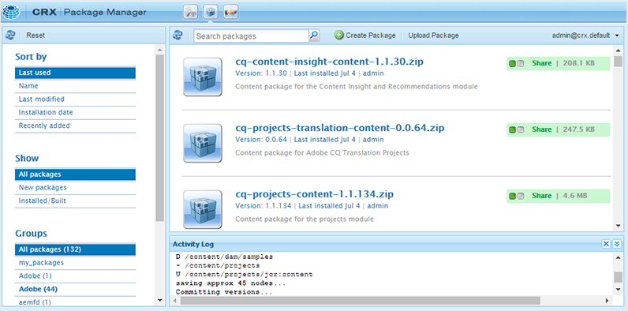
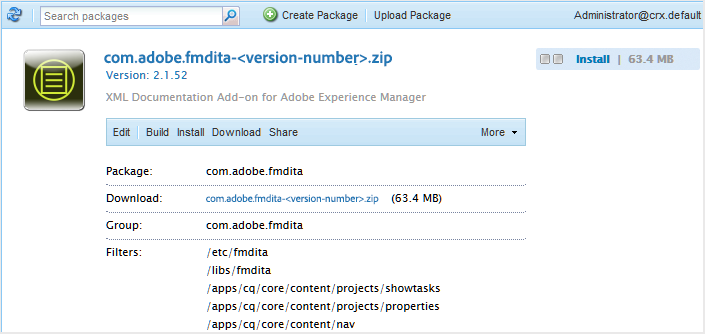

# 首次下载并安装AEM Guides {#id213BCL00KEV}

执行以下步骤，首次在计算机上下载和安装AEM Guides：

>[!IMPORTANT]
>
> 如果要将Livefyre与AEM Guides结合使用，请确保先安装3.0之前的Livefyre版本，然后再安装AEM Guides。 如果您使用的是Livefyre版本3.0或更高版本，则没有此类限制。

1. 从Adobe软件分发门户下载AEM Guides。

1. 登录AEM实例并导航到CRX包管理器。 访问包管理器的默认URL为：

   ```http
   http://<server name>:<port>/crx/packmgr/index.jsp
   ```

   包管理器可管理本地AEM安装中的包。 有关使用包管理器的更多信息，请参阅 [如何使用包](https://helpx.adobe.com/experience-manager/6-5/sites/administering/using/package-manager.html) 请参阅AEM文档。

   {width="650" align="left"}

1. 要上传AEM Guides包，请单击 **上传包**.

1. 在上传包对话框中，导航到您在步骤1中下载的AEM Guides文件，然后单击 **确定**.

   资源包将上传到您的AEM实例。

1. 要安装包，请单击 **安装**.

   {width="650" align="left"}

1. 在“安装包”对话框中，单击 **安装**.

1. 要开始使用AEM Guides，请单击“主页”按钮  位于CRX包管理器的左上角。


>[!NOTE]
>
> 在安装程序中所有AEM服务器实例上执行安装过程。

**父主题：**[&#x200B;下载并安装](download-install.md)
