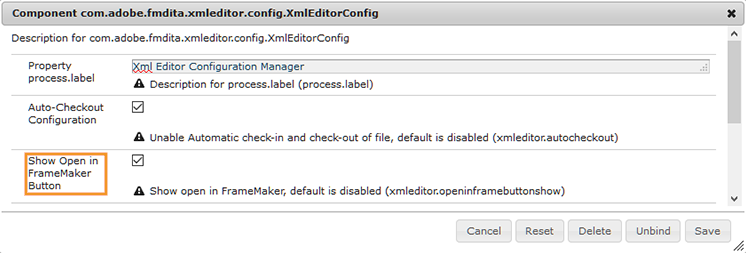

# 集成基于桌面的XML编辑器 {#id181GB01G0HS}

市面上有许多XML编辑器，您已经可以使用了一个。 Adobe FrameMaker是最强大的XML编辑器之一，它附带AEM连接器。 在FrameMaker中使用AEM连接器，您可以轻松地与AEM存储库连接、签出和签入文件，以及直接在FrameMaker中编辑文件。 您还可以将AEM Guides配置为从Web编辑器启动FrameMaker。 在FrameMaker中打开文件后，您可以编辑该文件并将其签回AEM存储库中。

## 从Web编辑器以FrameMaker启用文件编辑

可以使用FrameMaker或任何其他DITA编辑器创建和更新DITA内容。 但是，如果贵组织使用FrameMaker作为DITA编辑器，则可以为用户提供选项以直接从AEM在FrameMaker中打开DITA文档。

默认情况下，您的用户不会看到 **在FrameMaker中打开** AEM按钮。 执行以下步骤以在AEM工具栏中添加此按钮：

1. 打开Adobe Experience Manager Web控制台配置页面。

   用于访问配置页面的默认URL为：

   ```http
   http://<server name>:<port>/system/console/configMgr
   ```

1. 搜索并单击 **com.adobe.fmdita.xmleditor.config.XmlEditorConfig** 捆绑。

   {width="550" align="left"}

1. 选择 **显示“在FrameMaker中打开”按钮** 选项。

1. 单击&#x200B;**保存**。


当您启用 **显示“在FrameMaker中打开”按钮** 选项，然后 **在FrameMaker中打开** 选择AEM存储库中的任意DITA文件时将显示按钮。 当此选项为 *未启用*， **在FrameMaker中打开** 仅当在存储库中选择.fm或.book文件时，才会显示按钮。
