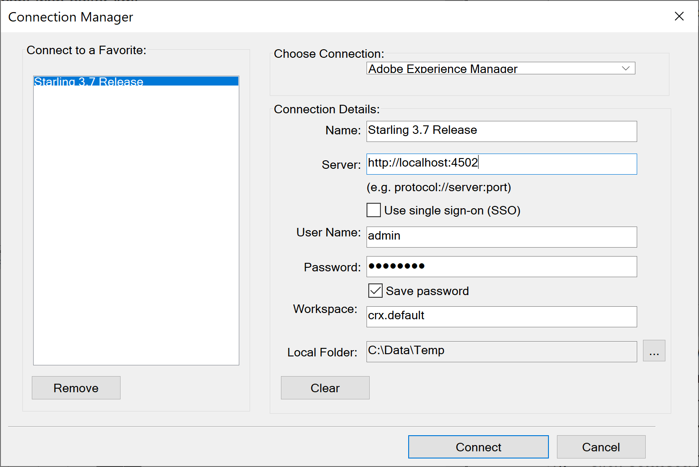
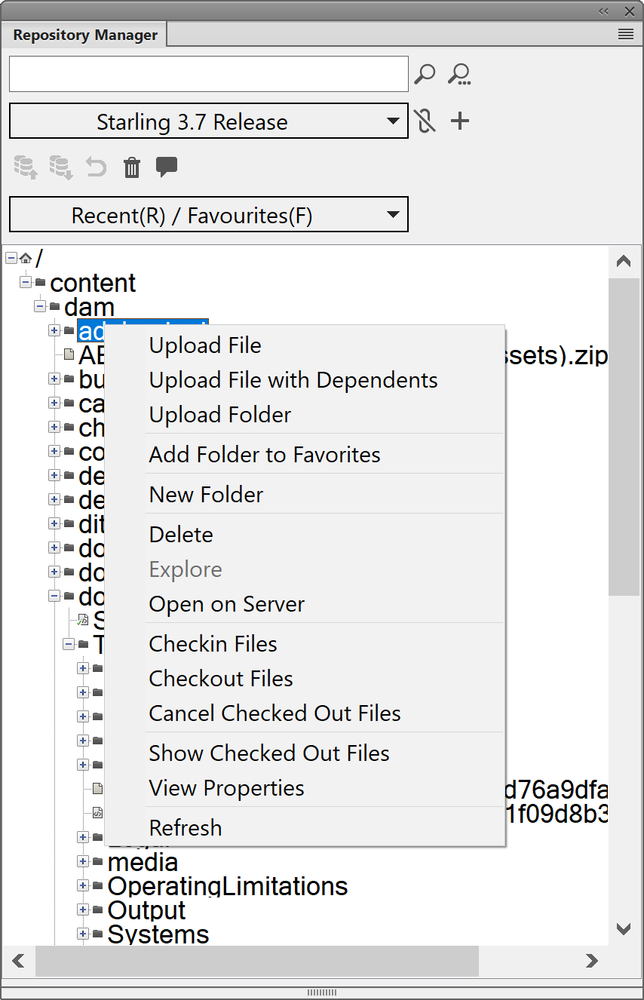

# 上载现有DITA内容 {#id176FF000JUI}

最有可能的情况是，您拥有要与AEM Guides一起使用的现有DITA内容的存储库。 对于此类现有内容，您可以使用以下任意方法将您的内容批量上传到AEM存储库。

## 使用WebDAV工具

如果在任何其他DITA编辑器中创作主题和映射，则可以使用任何WebDAV工具上载文件。 本节中给出的过程使用WinSCP作为WebDAV工具来上载内容。

执行以下步骤以使用WinSCP上载文件：

1. 在计算机上下载并安装WinSCP。

1. 启动WinSCP应用程序。

   此时将显示“登录”对话框。

1. 在“登录”对话框中，通过选择WebDAV作为 **文件协议** 并提供其他连接详细信息，例如：

   - 托管AEM服务器的URL，

   - 端口号\（默认值为4502\），以及

   - 用于访问AEM服务器的用户名和密码。

1. 单击&#x200B;**登录**。

   成功连接后，您将在WinSCP用户界面中看到AEM Assets的内容。 您可以使用WinSCP文件资源管理器轻松浏览、创建、更新或删除内容。


## 使用FrameMaker

Adobe FrameMaker附带强大的AEM连接器，可让您轻松地将现有DITA和其他FrameMaker文档\(.book和.fm\)上传到AEM。 您可以使用各种文件上传功能，例如上传单个文件、上传具有或不具有依赖关系的完整文件夹\（如内容引用、交叉引用和图形\）。

执行以下步骤以使用FrameMaker的AEM Connector上传内容：

1. 启动FrameMaker。

1. 打开 **连接管理器** 对话框。

   {width="550" align="left"}

1. 输入以下详细信息以连接到AEM资料档案库：

   - **名称**：输入描述性名称以标识与AEM服务器的连接。
   - **服务器**：输入AEM服务器的URL和端口号。

   - **用户名**/**密码**：输入用于访问AEM服务器的用户名和密码。

1. 单击 **连接**.

   成功建立连接后，“存储库管理器”窗口中会显示AEM存储库中的资产。

   {width="550" align="left"}

   右键单击任何文件或文件夹可让您执行相关操作。 例如，如果右键单击文件夹，可以获得以下选项：上传文件、上传具有依赖关系的文件、上传整个文件夹等。


## 配置UUID文件名模式

导入内容时，文件名不必基于UUID。 在使用基于UUID的文件名的系统中，必须使用UUID而不是原始文件名引用所有文件。 如果导入的文件没有基于UUID的文件名，则可以将系统配置为向其文件属性添加UUID。 然后，使用此UUID来引用此类文件，其中UUID不用于命名文件。

执行以下步骤以根据UUID模式检查文件名，并将UUID分配给未分配UUID的文件：

1. 打开Adobe Experience Manager Web控制台配置页面。

   用于访问配置页面的默认URL为：

   ```http
   http://<server name>:<port>/system/console/configMgr
   ```

1. 搜索并单击 *com.adobe.fmdita.config.ConfigManager* 捆绑。

1. 在 **UUID文件名模式** 属性，指定模式以检查导入文件的名称。

   如果文件不遵循指定的模式，则会将UUID添加到文件的属性中，并且使用分配给文件的UUID更新对该文件的所有引用。

1. 单击&#x200B;**保存**。


## 使用WebDav工具以UUID上传内容 {#id201MI0I04Y4}

您可以使用以下任意方法通过UUID上传内容：

- 从本地系统拖放内容。
- 使用 **创建** \> **文件** 工作流从AEM Assets UI。
- 使用诸如WinSCP之类的工具。

如果您使用WinSCP等工具，可以通过设置 **将具有相同UUID的旧文件移动到新文件夹** 选项。 此选项定义对AEM存储库中某个其他位置可用的文件执行的操作。 此设置可在 *com.adobe.fmdita.config.ConfigManager* 捆绑包中的configMgr。

默认情况下， **将具有相同UUID的旧文件移动到新文件夹** 选项已打开。 这意味着，如果上传的文件位于存储库中的其他某个文件夹中，则现有文件会被移动到当前位置并被上传的文件覆盖。 如果不选择此选项，则文件将在其现有位置被覆盖。

**有关使用基于UUID的文件的其他说明**：

在AEM存储库中移动或复制内容时，必须考虑以下几点：

- 将一个或多个文件从一个位置复制到另一个位置时，将为没有任何UUID的文件生成新的UUID。 此UUID会添加到文件的元数据中。

- 如果文件存在冲突或重复，则会为要复制或移动的新文件生成唯一的文件名。

- 任何两个文件都不能具有相同的UUID。 为所有新文件分配一个唯一的UUID。


将内容从本地系统移动或复制到AEM存储库时，必须考虑以下几点：

- 如果文件由两个不同的用户同时上传，则以后处理的文件会覆盖较早的文件。 然而，这种做法非常少见，应当避免。

- 当您从AEM存储库签出内容并在本地系统上做出更改时，请确保在上传文件时文件名未发生更改。


## 使用curl命令

您还可以使用curl命令在DAM中创建文件夹、上传文件以及向上传的内容添加元数据。

**创建文件夹**

运行以下命令以在AEM存储库中创建文件夹：

```curl
curl --user <username>:<password> --data jcr:primaryType=sling:Folder "<server folder path>"
```

指定以下参数以创建文件夹：

- `<username>:<passowrd>`：指定用于访问AEM存储库的用户名和密码。 此用户必须具有文件夹创建权限。

- `jcr:primaryType=sling:Folder`：指定此参数 *原样* 创建文件夹类型资源。

- `<server folder path>`：完整的文件夹路径，包括要在AEM存储库中创建的新文件夹的名称。 例如，如果将路径指定为 `http://192.168.1.1:4502/content/dam/projects/AEM-Guides`，然后文件夹 `AEM-Guides` 创建于 `projects` DAM中的文件夹。


**上传文件**

运行以下命令在AEM资料档案库中上传文件：

```curl
curl --user <username>:<password> -T "<local file path>" "<server folder path>"
```

指定以下参数以上传文件：

- `<username>:<passowrd>`：指定用于访问AEM存储库的用户名和密码。 此用户必须具有对的写入权限 `server folder path`.

- ``local file path``：本地系统上要上传的完整文件路径。

- `<server folder path>`：AEM服务器上要上传文件的完整文件夹路径。


**添加元数据**

运行以下命令在文件中添加元数据：

```curl
curl --user <username>:<password> -F<attribute name>=<value> <metadata node path>
```

指定以下参数以添加元数据信息：

- `<username>:<passowrd>`：指定用于访问AEM存储库的用户名和密码。 此用户必须具有对的写入权限 ``metadata node path``.

- ``-F<attribute name>=<value>``：和 `<attribute name>` 是元数据属性的名称，如 `audience` 和 `<value>` 可以 `internal`. 您可以指定多个以空格分隔的属性名称 — 值对。

- `<metadata node path>`：完整的文件夹路径，包括文件名及其元数据节点。 例如，如果将路径指定为 `http://192.168.1.1:4502/content/dam/projects/AEM-Guides/intro.xml/jcr:content/metadata`，则指定的元数据信息将设置在 `intro.xml` 文件。


**父主题：**[&#x200B;迁移现有内容](migrate-content.md)
