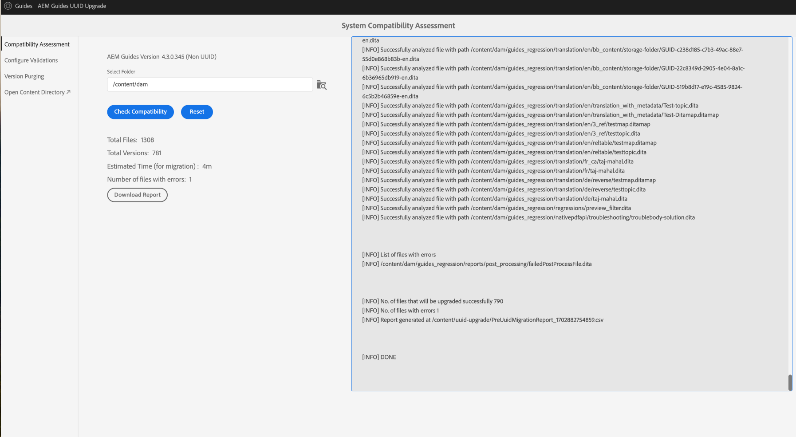
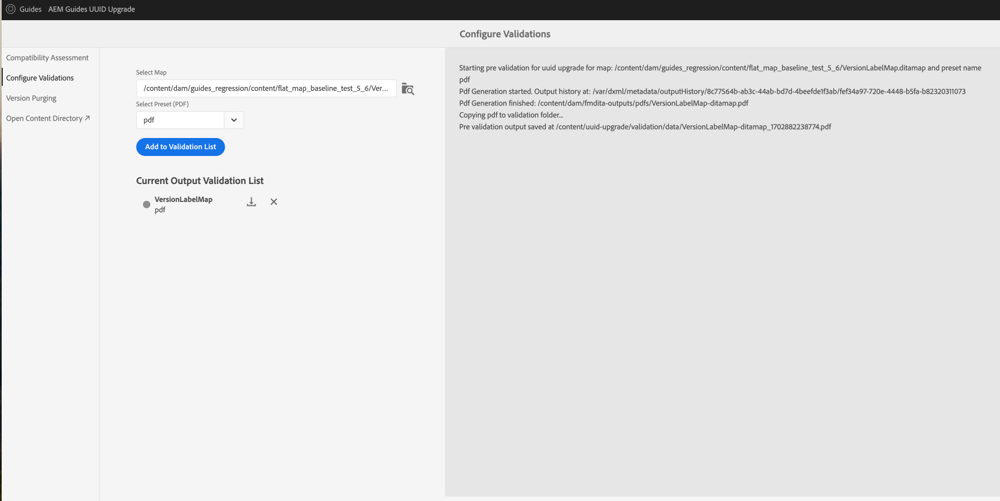
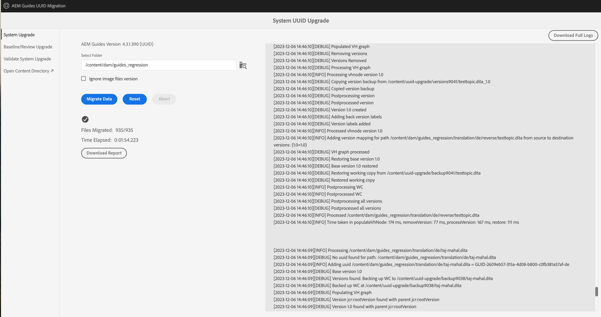
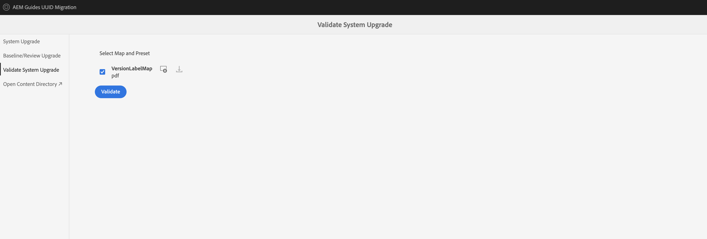

# 从用户界面使用版本迁移非UUID内容

如果您使用的是版本4.3.x或更高版本，请执行这些步骤以将具有版本的非UUID内容迁移到UUID内容。

## 兼容性矩阵

| 当前AEM Guides版本（非UUID） | 迁移到UUID所需的版本 | 支持的升级路径 |
|---|---|---|
| 4.3.x或更高版本 | 4.3.0非UUID | 安装4.3.1 (UUID) |

## 必需的包

1. **版本清除**： `com.adobe.guides.version-purge-1.0.11.zip` （可选）
1. **预迁移**： `com.adobe.guides.pre-uuid-migration-1.1.2 .zip`
1. **迁移**： `com.adobe.guides.uuid-upgrade-1.1.13.zip`

## 预迁移

1. （可选）对内容执行版本清除以删除不必要的版本并加快迁移过程。 要在版本4.1上执行版本清除（4.0上不支持），请安装包 `com.adobe.guides.version-purge-1.0.11.zip`，并使用此URL转到用户界面 `http://<server-name> /libs/fmdita/clientlibs/xmleditor_version_purge/page.html`.

   >[!NOTE]
   >
   >此实用程序不删除基线或审阅中使用的任何版本，也不具有任何标签。
1. 安装预迁移包(`ccom.adobe.guides.pre-uuid-migration-1.1.2 .zip`)。

   >[!NOTE]
   >
   >* 您需要管理员权限才能执行迁移。
   >* 建议先修复有错误的文件，然后再继续迁移。

1. 选择 **兼容性评估**  从左侧面板中浏览文件夹路径。
1. 检查兼容性以列出以下信息：
   * 文件总数
   * 总版本
   * 预计迁移时间
   * 有错误的文件数

{width="800" align="left"}

1. 选择 **配置验证** 从左侧面板。 则 **选择映射** 和 **选择预设** 以配置它们。 当前输出验证列表将显示迁移前存在的输出文件，并可在稍后针对迁移后生成的输出文件进行验证。

{width="800" align="left"}

## 迁移

### 步骤1：更新配置

1. 请确保可用空间至少是AEM （crx-quickstart目录）在迁移期间占用空间的10倍。 完成迁移后，可以通过运行压缩回收大部分磁盘空间(请参阅 [修订版清理](https://experienceleague.adobe.com/docs/experience-manager-65/deploying/deploying/revision-cleanup.html?lang=en))。

1. 启用 *启用后处理工作流启动器* 在 `com.adobe.fmdita.config.ConfigManager` 和 *启用版本后处理* 在 `com.adobe.fmdita.postprocess.version.PostProcessVersionObservation.`

1. 在非UUID版本上安装受支持发行版的UUID版本。 例如，如果您使用的是4.0非UUID内部版本或4.1非UUID内部版本，则需要安装UUID版本4.1。

1. 安装新的包以进行uuid迁移(`com.adobe.guides.uuid-upgrade-1.1.13`)。

1. 禁用以下工作流和在上运行的任何其他工作流 `/content/dam` 在中使用启动器 `http://localhost:4502/libs/cq/workflow/content/console.html`.

   * DAM更新资产工作流
   * DAM元数据写回工作流

1. 禁用 *启用后处理工作流启动器* 在 `com.adobe.fmdita.config.ConfigManager` 和禁用 *启用版本后处理* 在 `com.adobe.fmdita.postprocess.version.PostProcessVersionObservation`.

1. 禁用属性启用验证(`validation.enabled`)。

1. 确保 `uuid.regex` 属性文件夹在中已正确设置 `com.adobe.fmdita.config.ConfigManager`. 如果为空，则将其设置为默认值 —  `^GUID-(?<id>.*)`.
1. 为添加单独的日志程序 `com.adobe.fmdita.uuid.upgrade.UuidUpgrade` 浏览器响应也位于 `/content/uuid-upgrade/logs`.

### 步骤2：运行迁移并验证

#### 安装迁移包

{width="800" align="left"}

* 选择 **系统升级** 以运行迁移。 先从包含较小数据的文件夹开始，然后再对其运行 `/content/dam`.

* 选择 **下载报表** 在迁移运行时，检查文件夹中的所有文件是否已正确升级，以及所有功能是否仅对该文件夹起作用。

>[!NOTE]
>
> 内容迁移可以在文件夹级别或整个文件夹级别运行 `/content/dam` 或在同一文件夹中（重新运行迁移）。

此外，确保也针对所有媒体资产（例如您在DITA内容中使用的图像和图形）执行内容迁移也很重要。

#### 基线和审查迁移

选择 **基线/审查升级** 从左侧面板中迁移基线并在文件夹级别查看。

{width="800" align="left"}

### 步骤3：恢复配置

成功迁移服务器后，启用后处理、标记和以下工作流（包括迁移期间最初禁用的所有其他工作流）以继续在服务器上工作。

* DAM更新资产工作流
* DAM元数据工作流

>[!NOTE]
>
>如果某些文件在迁移前未处理或损坏，则它们在迁移前会损坏，甚至在迁移后也会保持损坏状态。

## 迁移验证

迁移完成后，选择 **验证系统升级** 在迁移之前和之后，从左侧面板中验证输出文件，以确保迁移成功。

{width="800" align="left"}

1. 迁移完成后，可以通过运行压缩回收大部分磁盘空间(请参阅 `https://experienceleague.adobe.com/docs/experience-manager-65/deploying/deploying/revision-cleanup.html?lang=en`)。

