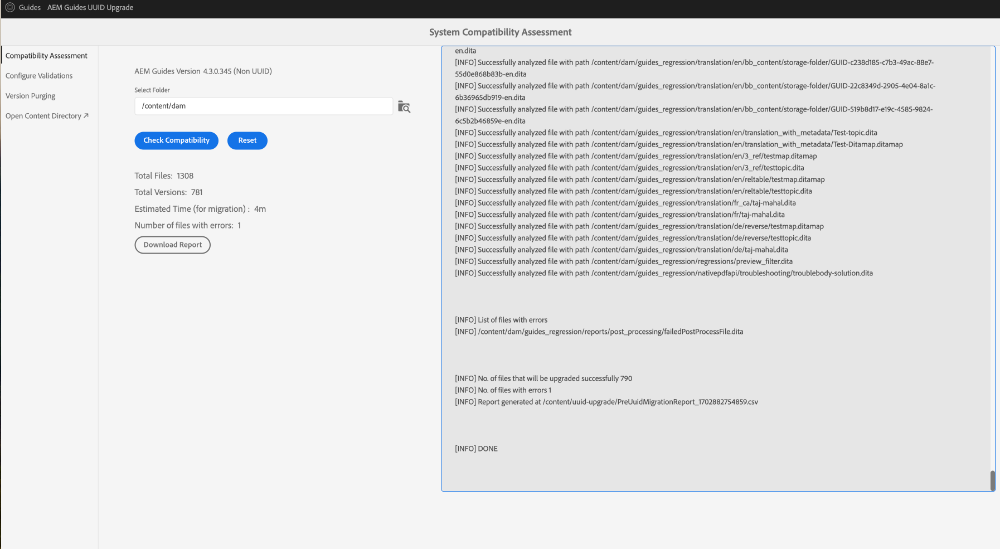
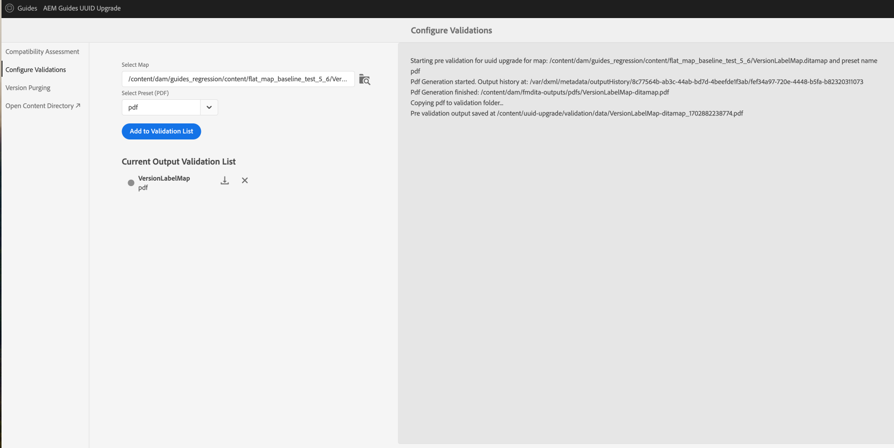
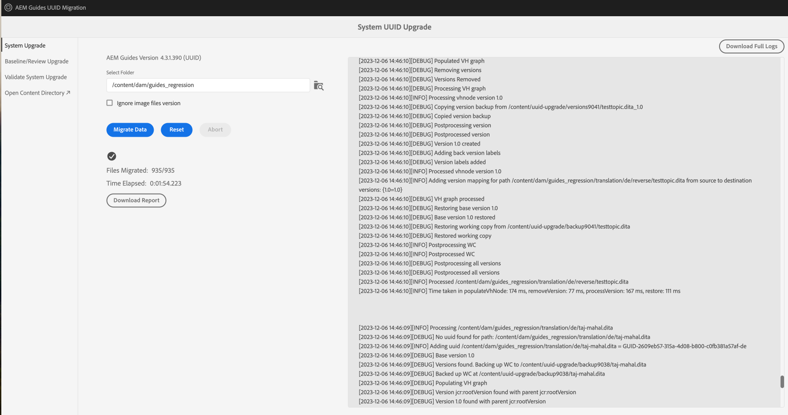
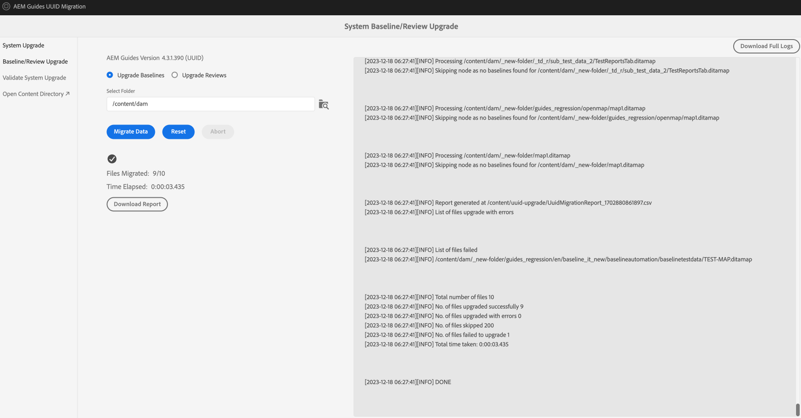
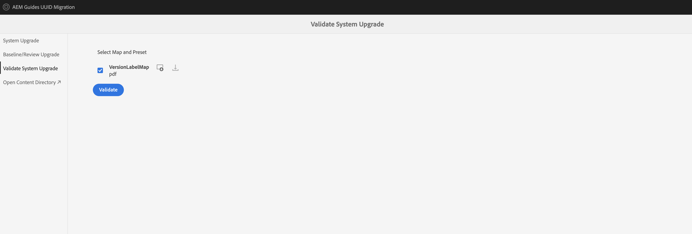

# 迁移受版本控制的内容

执行以下步骤，将您的非UUID版本化内容迁移到UUID内容。

>[!NOTE]
>
>请遵循 [升级说明](./upgrade-xml-documentation.md) 特定于您的产品的许可版本。

## 兼容性矩阵

| 当前Experience Manager指南版本（非UUID） | 迁移到UUID所需的版本 | 支持的升级路径 |
|---|---|---|
| 3.8.5、4.0.x或4.1.x | 4.1非UUID | 安装4.1 (UUID)并运行迁移 |
| 4.2、4.2.x或4.3 | 4.3.0非UUID | 安装4.3.1 (UUID)并运行迁移 |
| 4.3.1 | NA | NA |

## 软件包安装

根据您的版本，从Adobe软件分发门户下载所需的包：

  版本4.1的软件包升级路径

1. **预迁移**： [com.adobe.guides.pre-uuid-migration-1.0.9.zip](https://experience.adobe.com/#/downloads/content/software-distribution/en/aem.html?package=%2Fcontent%2Fsoftware-distribution%2Fen%2Fdetails.html%2Fcontent%2Fdam%2Faem%2Fpublic%2Faemdox%2Fother-packages%2Fuuid-migration%2F1-0%2Fcom.adobe.guides.pre-uuid-migration-1.0.9.zip)
1. **迁移**： [com.adobe.guides.uuid-upgrade-1.0.19.zip](https://experience.adobe.com/#/downloads/content/software-distribution/en/aem.html?package=%2Fcontent%2Fsoftware-distribution%2Fen%2Fdetails.html%2Fcontent%2Fdam%2Faem%2Fpublic%2Faemdox%2Fother-packages%2Fuuid-migration%2F1-0%2Fcom.adobe.guides.uuid-upgrade-1.0.19.zip)

 版本4.3.1的软件包升级路径

1. **预迁移**： [com.adobe.guides.pre-uuid-migration-1.1.3.zip](https://experience.adobe.com/#/downloads/content/software-distribution/en/aem.html?package=%2Fcontent%2Fsoftware-distribution%2Fen%2Fdetails.html%2Fcontent%2Fdam%2Faem%2Fpublic%2Faemdox%2Fother-packages%2Fuuid-migration%2Fcom.adobe.guides.pre-uuid-migration-1.1.3.zip)
1. **迁移**： [com.adobe.guides.uuid-upgrade-1.1.15.zip](https://experience.adobe.com/#/downloads/content/software-distribution/en/aem.html?package=%2Fcontent%2Fsoftware-distribution%2Fen%2Fdetails.html%2Fcontent%2Fdam%2Faem%2Fpublic%2Faemdox%2Fother-packages%2Fuuid-migration%2Fcom.adobe.guides.uuid-upgrade-1.1.15.zip)

## 预迁移

对非UUID版本（4.1非UUID或4.3.0非UUID）执行以下检查：

1. 根据您的版本安装预迁移包。

   >[!NOTE]
   >
   >* 您需要管理员权限才能执行迁移。
   >* 建议先修复有错误的文件，然后再继续迁移。
1. （可选）对内容执行版本清除以删除不必要的版本并加快迁移过程。 要执行版本清除，请选择选项 **版本清除** 从“迁移”屏幕中，使用URL转到用户界面 `http://<server-name>/libs/fmdita/clientlibs/xmleditor_uuid_upgrade/page.html`.
   >[!NOTE]
   >
   >此实用程序不删除基线或审阅中使用的任何版本，也不具有任何标签。
1. Launch `http://<server-name>/libs/fmdita/clientlibs/xmleditor_uuid_upgrade/page.html`.
1. 选择 **兼容性评估**  从左侧面板中浏览文件夹路径。
1. 检查兼容性以列出以下信息：
   * 文件总数
   * 总版本
   * 预计迁移时间
   * 有错误的文件数

   {width="800" align="left"}

1. 选择 **配置验证** 从左侧面板。 然后， **选择映射** 和 **选择预设** 以配置它们。 当前输出验证列表显示迁移前存在的输出文件，并可在稍后针对迁移后生成的输出文件进行验证。

   {width="800" align="left"}

## 迁移

### 步骤1：更新配置

1. 请确保可用空间至少是AEM （crx-quickstart目录）在迁移期间占用空间的10倍。 完成迁移后，您可以通过运行压缩来回收大部分磁盘空间(请参阅 [修订版清理](https://experienceleague.adobe.com/docs/experience-manager-65/deploying/deploying/revision-cleanup.html?lang=en))。

1. 启用 *启用后处理工作流启动器* 在 `com.adobe.fmdita.config.ConfigManager` 和 *启用版本后处理* 在 `com.adobe.fmdita.postprocess.version.PostProcessVersionObservation.`

1. 在非UUID版本上安装受支持发行版的UUID版本。 例如，如果您使用的是4.1非UUID内部版本，则需要安装UUID版本4.1并运行迁移。

1. 安装新的包以进行uuid迁移。

1. 禁用以下工作流和在上运行的任何其他工作流 `/content/dam` 在中使用启动器 `http://<server-name>/libs/cq/workflow/content/console.html`.

   * DAM更新资产工作流
   * DAM元数据写回工作流

1. 禁用 *启用后处理工作流启动器* 在 `com.adobe.fmdita.config.ConfigManager` 和禁用 *启用版本后处理* 在 `com.adobe.fmdita.postprocess.version.PostProcessVersionObservation`.

1. 禁用属性启用验证(`validation.enabled`)。

1. 确保 `uuid.regex` 属性文件夹在中已正确设置 `com.adobe.fmdita.config.ConfigManager`. 如果为空，则将其设置为默认值 —  `^GUID-(?<id>.*)`.
1. 为添加单独的日志程序 `com.adobe.fmdita.uuid` 浏览器响应也位于 `/content/uuid-upgrade/logs`.

### 步骤2：运行迁移并验证

#### 安装迁移包

1. Launch `http://<server-name>/libs/fmdita/clientlibs/xmleditor_uuid_upgrade/page.html`.

   {width="800" align="left"}

1. 选择 **系统升级** 以运行迁移。 先从包含较小数据的文件夹开始，然后再对其运行 `/content/dam`.

1. 选择 **下载报表** 在迁移运行时，检查文件夹中的所有文件是否已正确升级，以及所有功能是否仅对该文件夹起作用。

>[!NOTE]
>
> 内容迁移可以在文件夹级别运行，完成 `/content/dam`，或相同的文件夹（重新运行迁移）。

此外，确保为所有媒体资产（例如您在DITA内容中使用的图像和图形）完成内容迁移也很重要。

#### 基线和审查迁移

选择 **基线/审查升级** 从左侧面板中迁移基线并在文件夹级别查看。

{width="800" align="left"}

### 步骤3：恢复配置

成功迁移服务器后，启用后处理、标记和以下工作流（包括在迁移期间最初禁用的所有其他工作流）以继续在服务器上工作。

* DAM更新资产工作流
* DAM元数据工作流

>[!NOTE]
>
>如果某些文件在迁移前未处理或损坏，则它们在迁移前将损坏，甚至在迁移后仍保持损坏状态。

## 迁移验证

1. 迁移完成后，选择 **验证系统升级** 在迁移之前和之后，从左侧面板中验证输出文件，以确保迁移成功。

   {width="800" align="left"}

1. 完成验证后，可以通过运行压缩回收大部分磁盘空间(请参阅 `https://experienceleague.adobe.com/docs/experience-manager-65/deploying/deploying/revision-cleanup.html?lang=en`)。

