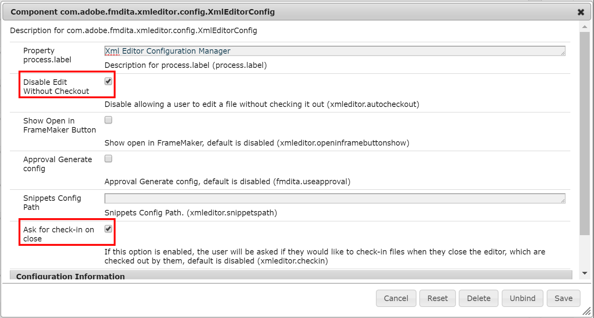
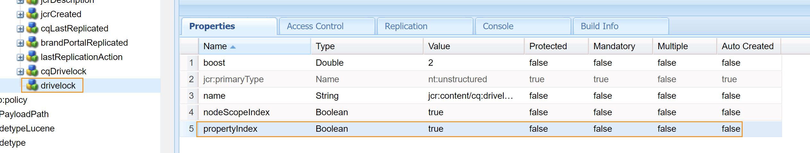
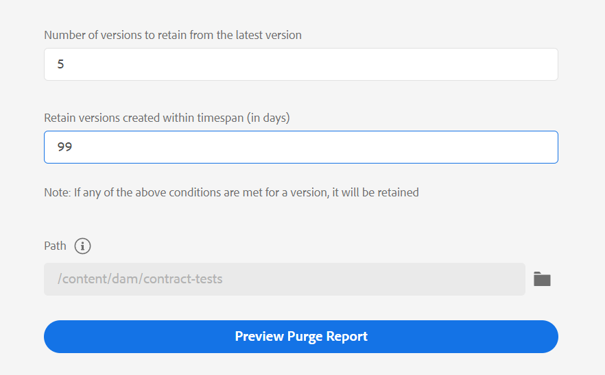
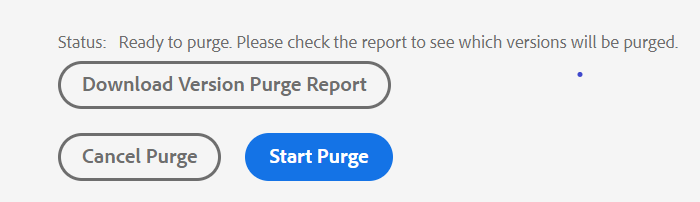

# 版本管理 {#id181GB000XY4}

版本控制是任何内容管理系统的一个重要方面。 它允许您在特定时间点创建数字资产的快照。 有了数字资产的版本，您可以恢复并更新资产的所需版本。 通常，要创建任何资源的版本，您需要签出并签入所需的资源。

作为管理员，您可以强制实施规则，以限制用户在不签出文件的情况下编辑文件。 同样，您可以确保所有签出的文件都签回以避免任何数据丢失。

在多用途环境中，确保用户不会从系统中删除文件也很重要。 此要求对于其他用户签出的文件更为重要。您可以允许或阻止用户覆盖其他用户签出的文件。 为了防止用户意外从系统中删除已签出的文件，AEM Guides提供了可供您使用的配置。 除了已检出文件之外，您还可以控制删除包含引用或从其他文件引用的文件。 此外，您还可以为上传的文件创建新版本。

## 为上载的文件创建新版本

>[!NOTE]
>
> 此配置仅在上传文件时适用。

要创建上传文件的新版本，请执行以下步骤：

1. 打开Adobe Experience Manager Web控制台配置页面。

   用于访问配置页面的默认URL为：

   ```http
   http://<server name>:<port>/system/console/configMgr
   ```

1. 搜索并单击 **com.adobe.fmdita.config.ConfigManager** 捆绑。

1. 选择 **为上载的文件创建新版本** 选项。

   默认情况下，此选项处于关闭状态。

   如果选择该选项，则会发生新版本管理机制并覆盖任何后续上传的默认上传行为，它将上传文件的内容另存为新版本。 如果取消选择该选项，AEM Guides将使用AEM默认版本管理机制。

1. 单击&#x200B;**保存**。


>[!NOTE]
>
> 如果启用属性，则可以批量上传70个或更少的文件 **为上载的文件创建新版本** \(create.ver.new.content\)并使用 **资产UI**&#x200B;以批量上传资产。

## 配置设置以允许编辑已签出的文件

AEM Guides的Web编辑器允许您创建和更新DITA主题。 您可以将Web编辑器配置为仅允许编辑已从存储库中签出的那些文档。 这可确保没有其他编写器意外覆盖由其他编写器打开进行编辑的主题。 打开主题进行编辑后，作者可以在关闭文件时签入文件。

另一条重要规则是确保已签出的文件被签回系统。 这样可防止用户在不重新签入文件的情况下意外关闭文件。

执行以下步骤以启用这些功能：

1. 打开Adobe Experience Manager Web控制台配置页面。

   用于访问配置页面的默认URL为：

   ```http
   http://<server name>:<port>/system/console/configMgr
   ```

1. 搜索并单击 **com.adobe.fmdita.xmleditor.config.XmlEditorConfig** 捆绑。

1. 选择 **禁用“编辑而不签出”** 选项。

   {width="650" align="left"}

   利用此选项，用户在签出文件之前将不会在工具栏中看到编辑选项。

1. 选择 **关闭时要求签入** 选项，用于在关闭已签出的文件时显示警告消息，而不将其保存或签回存储库。

1. 单击&#x200B;**保存**。


>[!NOTE]
>
> 无论您是打开还是关闭此功能，文件“检出”和“检入”选项始终在主题预览中可用。

## 上传时覆盖签出的文件

>[!NOTE]
>
> 此配置仅适用于从Assets UI创建文件的情况，而不适用于使用WebDAV工具上传文件的情况。

要允许用户在上传时覆盖已由他们或其他某个用户签出的文件，请执行以下步骤：

1. 打开Adobe Experience Manager Web控制台配置页面。

   用于访问配置页面的默认URL为：

   ```http
   http://<server name>:<port>/system/console/configMgr
   ```

1. 搜索并单击 **com.adobe.fmdita.config.ConfigManager** 捆绑。

1. 选择 **上载时覆盖签出的文件** 选项。

   默认情况下，此选项处于打开状态。 选中此选项后，用户将能够覆盖已签出的文件。 如果未选择该选项，则当该文件已由他们或其他用户检出时，将阻止覆盖该文件。

1. 单击&#x200B;**保存**。


## 阻止删除已签出的文件

要防止用户意外删除已由用户或其他某个用户签出的文件，请执行以下步骤：

1. 打开Adobe Experience Manager Web控制台配置页面。

   用于访问配置页面的默认URL为：

   ```http
   http://<server name>:<port>/system/console/configMgr
   ```

1. 搜索并单击 **com.adobe.fmdita.xmleditor.config.XmlEditorConfig** 捆绑。

1. 选择 **阻止删除已签出的内容** 选项。

   默认情况下，此选项处于打开状态。 选中此选项后，用户将无法删除已签出的文件。

1. 单击&#x200B;**保存**。


为了支持此功能，新增了一个索引属性 `drivelock` 添加于 `oak:index`：

`/oak:index/damAssetLucene/indexRules/dam:Asset/properties/drivelock`

{width="800" align="left"}

除了新的index属性外，请确保在上设置了以下属性 `/oak:index/damAssetLucene`：

- `jcr:primaryType`=`"oak:QueryIndexDefinition"`
- `async`=`"async"`
- `compatVersion`=`"{Long}2"`
- `evaluatePathRestrictions`=`"{Boolean}true"`
- `reindex`=`"{Boolean}false"`
- `reindexCount`=`"{Long}3"` *\（这是重新索引的次数，它将替换为我们的包的安装\）*
- `type`=`"lucene"`

>[!NOTE]
>
> 您可以更改 `reindex` 到 `"{Boolean}true"`. 这将加快文件夹层次结构中签出的文件的搜索结果。

## 防止删除引用的文件

作为管理员，您可以控制谁可以从AEM存储库中删除文件。 具体而言，如果某个文件包含引用或被其他某个文件引用，则可以定义谁可以删除此类文件。

使用此配置，您可以允许或禁止所有用户删除文件，或只允许特定用户组删除文件。 如果允许删除文件，则遵循以下过程：

- 如果要删除包含所有引用和引用文件的文件夹，则会删除所有文件。 该进程将首先删除不包含任何引用的所有文件，然后删除包含引用或被引用的文件。

- 如果您正在删除文件夹，而该文件夹中的任何文件均被该文件夹之外的文件引用，则在删除该文件之前，系统将提示您删除引用。


要定义谁可以删除包含引用或被其他文件引用的文件，请执行以下步骤：

1. 打开Adobe Experience Manager Web控制台配置页面。

   用于访问配置页面的默认URL为：

   ```http
   http://<server name>:<port>/system/console/configMgr
   ```

1. 搜索并单击 **com.adobe.fmdita.config.ConfigManager** 捆绑。

1. 找到 **阻止删除引用的资产** 选项。

1. 根据您要授予删除权限的用户，指定以下常量之一：

   - allow\_unsafe\_delete\_for\_all：授予所有用户删除文件的权限。 在这种情况下，如果文件包含引用或被其他文件引用，则也可以强制删除此类文件。 在删除文件之前，将显示一个包含引用的提示，您可以取消删除操作，删除引用，最后删除文件。 或者，也可以强制删除文件而不删除参照。

     {width="550" align="left"}

   - allow\_unsafe\_delete\_for\_delete\_assets\_group：管理员或属于 *delete-assets* 允许组删除文件。 如果任何其他用户尝试删除包含任何引用的文件，则在删除所有引用之前，不允许他们删除此类文件。 当没有权限的用户尝试删除文件时，将显示以下屏幕截图。

     {width="550" align="left"}

   - block\_unsafe\_delete\_for\_all：不允许所有用户\（包括管理员\）删除文件，除非删除对文件的引用和来自文件的引用。

1. 单击&#x200B;**保存**。


## 清除旧版本的DITA文件

当您更新内容并创建新版本时，存储库中会维护以前版本的DITA文件。 可能会在一段时间内为您的DITA文件创建多个版本，这些版本可能会共同占用存储库中的大量空间。 AEM Guides允许您配置应从存储库中删除的旧版本。

如果您具有管理权限，则可以使用给定的URL访问此实用程序：

`<server folder path> /libs/fmdita/clientlibs/xmleditor_version_purge/page.html`

符合任何给定标准的DITA文件的版本将得到维护且不清除：

- 是文件的第一个版本
- 包含在基线中
- 包含在任何翻译或审阅工作流中
- 应用了标签
- 符合定义的版本年龄或版本号标准

执行以下步骤以清除旧版本：

1. 输入要清除的文件的以下详细信息：

   {width="350" align="left"}

1. 
   - **从最新版本保留的版本数**：输入应保留而不清除的版本数。 例如，如果输入5，则会保留最后5个版本，并且如果满足其他清除条件，则符合清除条件的版本中之前的版本将被清除。
- **保留在时间范围内创建的版本\（以天为单位\）**：输入版本的最长存在时间（以天为单位）。 如果满足其他清除条件，则符合清除指定天数之前的版本的资格。 例如，如果输入100，则符合其他清除条件时，所有在100天之前创建的版本都将被清除。
- **路径**：选择要清除其文件的文件或文件夹的路径。

  >[!NOTE]
  >
  > 只能清除DITA文件。

1. 单击 **预览清除报告**.

   >[!NOTE]
   >
   > 一次只能有一个清除任务。 如果正在执行另一个版本清除操作，则无法启动该操作。

   生成版本清除报告。

1. 下载版本清除报告，并检查要清除的文件和版本。
1. 您可以选择 **取消清除** 或 **开始清除**.

   {width="350" align="left"}

   将显示清除状态。

   单击 **下载版本清除报告** 查看已清除的版本。 此报表提供所有版本的清除状态，以及保留特定版本或清除该版本的原因。


>[!NOTE]
>
> 报告下载位置如下： /var/dxml/versionpurge
