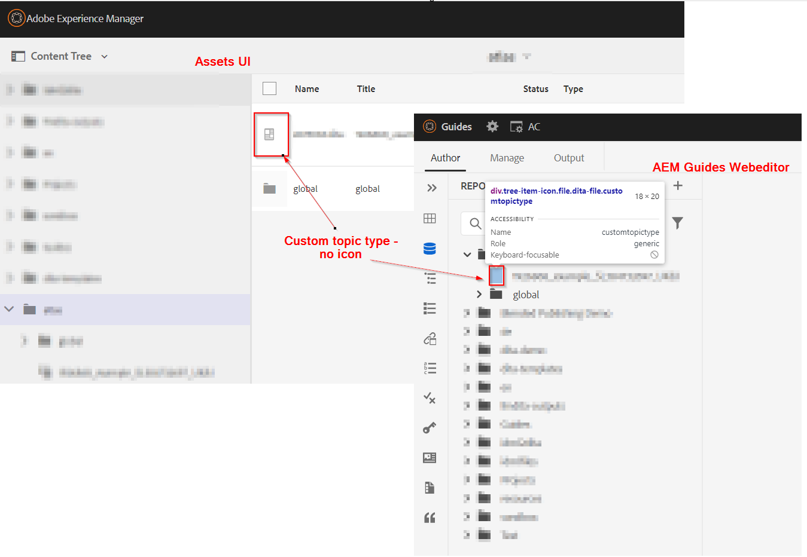
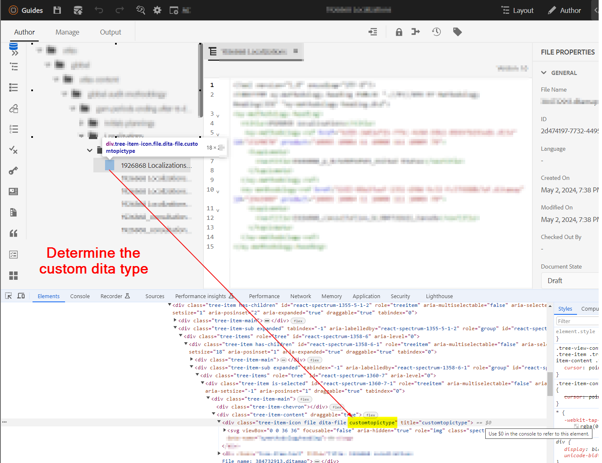
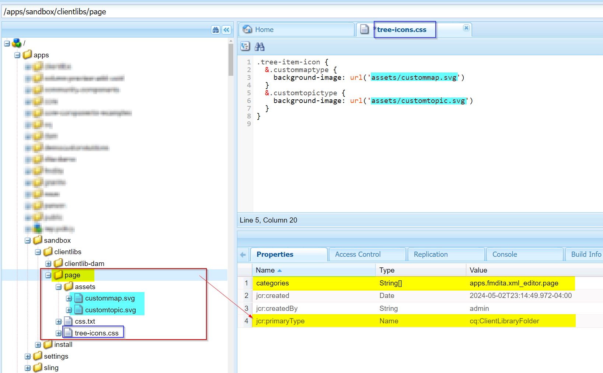
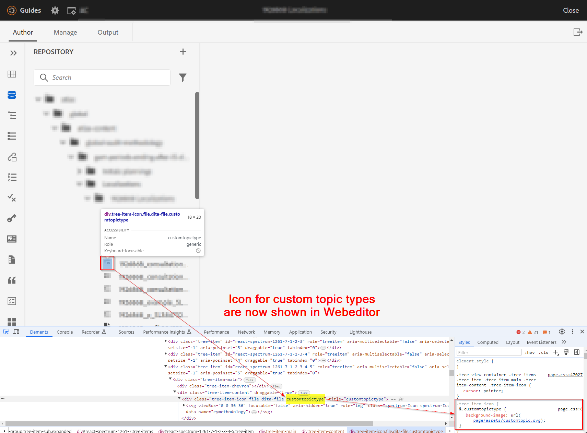
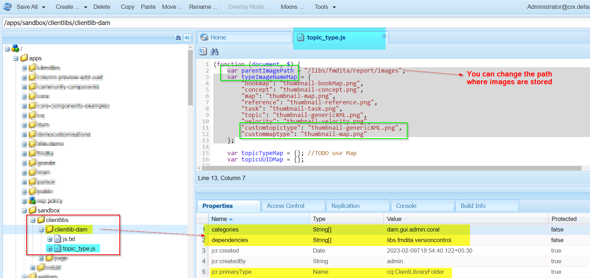
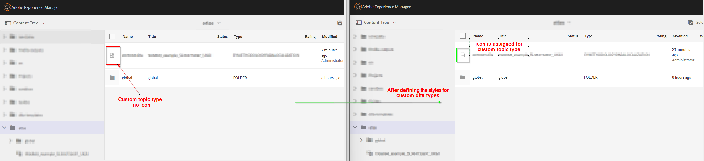

# 为自定义/专用dita（主题或映射）类型配置图标


## 问题陈述

使用AEM Guides中使用的自定义架构，您可以创建自定义主题或映射类型，在使用时，您可能会注意到自定义主题/映射类型在Web编辑器或Assets UI中不显示图标。 请参阅下面的屏幕快照以供参考




因此，要为自定义主题/映射类型分配图标，您必须执行以下操作：
- 查找自定义主题/映射类型
- 编写样式以为自定义类型添加所需的图标


我们可以实施上述步骤以在Web编辑器（存储库视图）和资产UI中显示图标。 以下是这两个步骤的步骤


## 在Web编辑器视图中显示自定义主题/映射的图标

_第1步：_ 确定自定义dita主题/ap的dita类型
- 在Web编辑器中打开存储库视图>在浏览器中打开开发人员控制台
- Inspect列出的主题/地图旁边的图标空间
- 检查分配给自定义主题的类
- 有关更多详细信息，请参阅下面的屏幕截图 
- 我们将使用此类为此分配图标和写入css

_第2步：_ 创建css并将图标分配给此dita类型
- 在/apps下创建客户端库，例如您在所需路径下创建cq：ClientLibraryFolder
   - 将类别“apps.fmdita.xml_editor.page”添加到其中
- 在此目录下创建文件夹“资产”，并添加要用于自定义dita类型的所有图标
- 在client library文件夹下添加css文件，如“tree-icons.css”
   - 向其添加以下代码

```
            .tree-item-icon {
                &.custommaptype {
                    background-image: url('assets/custommap.svg')
                }
                &.customtopictype {
                    background-image: url('assets/customtopic.svg')
                }
            }
```

- 在客户端库文件夹下添加css.txt，并添加对刚刚创建的“tree-icon.css”的引用
- 保存/部署这些更改

有关更多详细信息，请参阅下面的屏幕截图。


最终输出如下面的屏幕截图所示



## 在Assets UI中显示自定义主题/映射图标

_第1步：_ 确定自定义dita主题/映射的dita类型
- 这在前面的方法的步骤1中进行了说明

_第2步：_ 创建Javacscript以定义要为自定义主题/映射类型的自定义dita类型加载哪些图标
- 在/apps下创建客户端库，例如您在所需路径下创建cq：ClientLibraryFolder
   - 向其添加以下属性：
      - &quot;categories&quot;（多值字符串）值，如&quot;dam.gui.admin.coral&quot;
      - &quot;dependencies&quot;(multivalue string)值，如&quot;libs.fmdita.versioncontrol&quot;
- 创建文件“/libs/fmdita/clientlibs/clientlibs/xmleditor/clientlib-dam/topic_type.js”的副本到此/apps目录
   - 编辑复制的“topic_type.js”并在变量“typeImageNameMap”下更改/添加customtopictype
   - 您还可以更改图像文件夹的路径，方法是将变量“parentImagePath”的值更改为存储自定义图标的位置
- 在客户端库文件夹下创建名为js.txt的文件，并添加对“topic_type.js”的引用
- 保存/部署这些更改有关更多详细信息，请参阅下面的屏幕截图。
  

最终输出将如屏幕快照中所示 