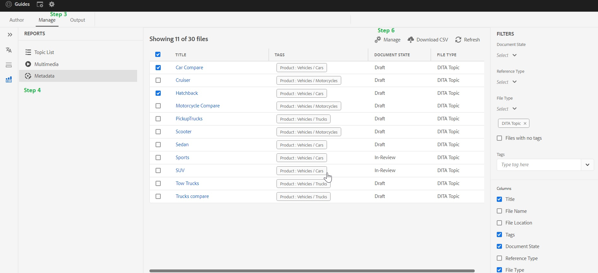

# 如何在DITA内容中添加、删除和管理标记

标记可用于对您的内容进行分类。 如果内容已正确标记，则它可以帮助您在ditamap中查找准确的主题，并且最终用户可以在已发布的输出中更快地找到相应的内容

> **_注意：_**  以下文章适用于AEM Guides内部版本4.2（内部部署）/2023年2月（云版本）或更高版本

## 创建标记

标记是本机AEM功能，AEM管理员可以帮助您初始创建和配置这些标记。

## 添加、删除和管理DITA内容中的标记

**在AEM cq中创建的任何标记：可以为DITA内容添加、删除和管理标记**

可通过多种方式将标记添加到DITA内容中，但本文将重点介绍AEM Guides Web编辑器UI。

### 步骤：

1. 转到指南UI中的存储库视图
2. 双击ditamap并在映射视图中打开
3. 转到“管理”选项卡
4. 在管理选项卡中，转到元数据选项
5. 此处加载您的所有直接和间接ditamap文件列表。
6. 选择一个或多个文件并单击“管理”图标。 您可以在此处向所选文件添加标记。
也可以删除所选文件中常见的现有标记。

## 疑难解答和常见问题解答

### 在管理 — >元数据中的列表为空或不完整

如果列表为空或不完整，则您可能需要在ditamap上运行索引，您可以参考 [升级说明（为您的内容编制索引）](/help/product-guide/install-guide/upgrade-xml-documentation.md#steps-to-index-the-existing-content-to-use-the-new-find-and-replace%3A)

### 自定义元数据未在列表中显示

`Only Tags present in cq:tags can be managed from here and custom metadata is not supported`

## 其他有用资源

- [使用映射功能板批量标记（资产UI）](/help/product-guide/user-guide/map-editor-bulk-tagging.md)
- [Web编辑器中的Ditamap报表](/help/product-guide/user-guide/reports-web-editor.md)
- [在AEM中标记](https://experienceleague.adobe.com/docs/experience-manager-learn/assets/configuring/tagging.html?lang=en)

**有关任何其他查询，请联系您各自的CSM**
