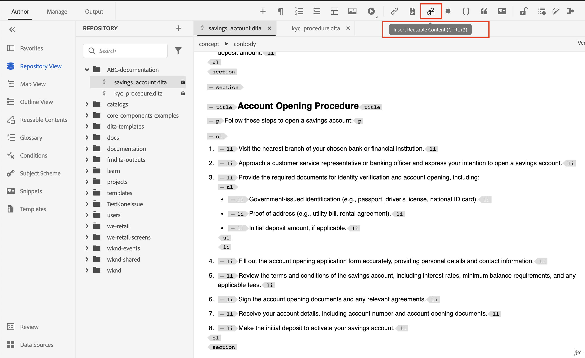
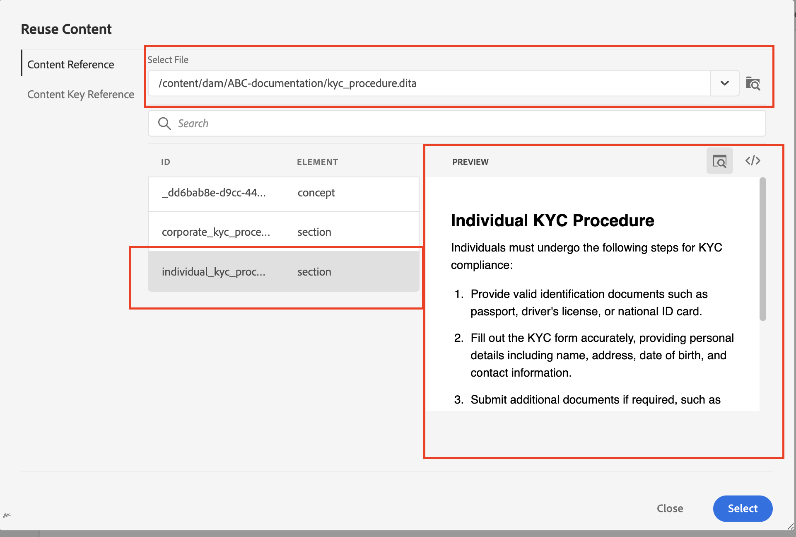
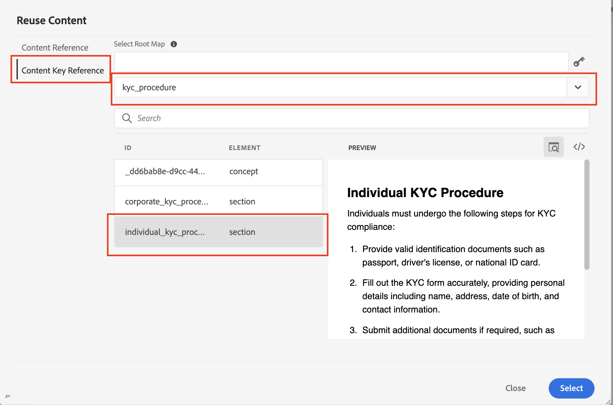
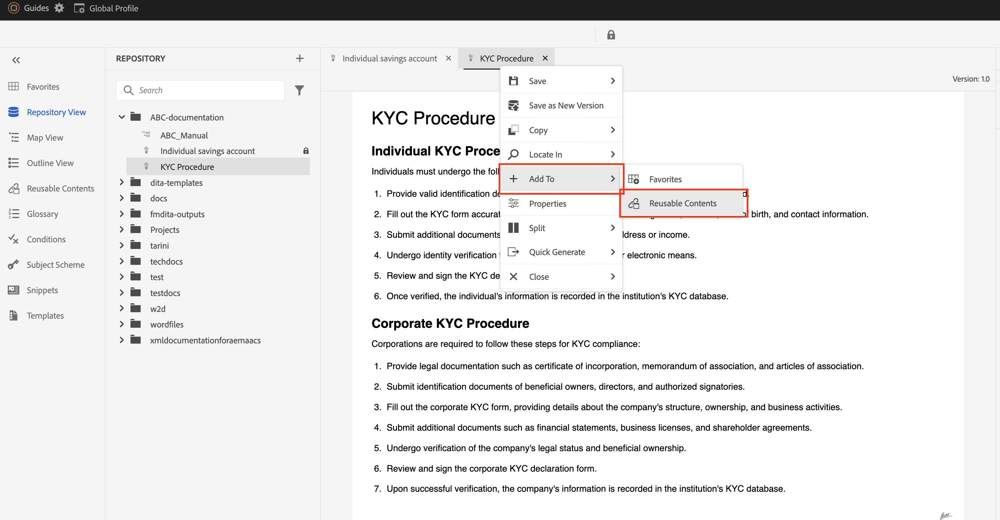
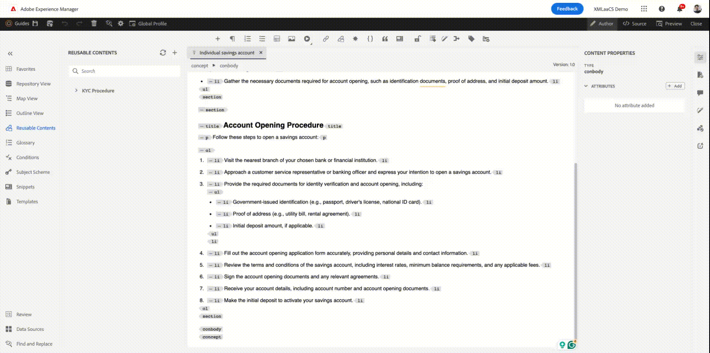

# AEM Guides中的内容可重复使用

AdobeAEM Guides利用DITA的优势，为内容重用提供了用户友好的界面。

在本文中，我们将讨论：

1. 使用主题引用(`topicrefs`)
2. 使用内容引用(`conref` 和 `conkeyref`)
3. 通过在AEM Guides中执行拖放操作来重复使用内容的额外提示

## 使用主题引用的可重用性(topicref)


假设您是一家制造公司，拥有安全防范或故障排除技术的通用主题。

这些可在每个机器型号的特定用户手册中参考和修改，从而减少冗余并确保核心安全信息保持一致。

```
<map id="user_manual_model 100" title="ABC Model 100 User Manual ">


<topicref href="Safety_Information.dita" format="dita">
</topicref>
.
.
.
.
.
</map>
```


同样适用于Model 200

```
<map id="user_manual_model 200" title="ABC Model 200 User Manual ">

<topicref href="Safety_Information.dita" format="dita">
</topicref>
.
.
.
.
.
  
</map>
```

## 使用内容引用的可重用性(conref &amp; conkeyref)

内容引用(conref)属性允许您链接到内容的其他部分。 这提高了可重用性，减少了冗余。

例如：

假设您是一家金融企业，有一个通用的KYC主题，其中包含针对个人、公司等的KYC过程。

您希望对“保存帐户”和“Demat帐户”主题重复使用单个KYC片段。

```
<section id="kyc_requirements_saving_account">
  <title>Know Your Customer (KYC) Requirements</title>
  <p>To comply with regulations and ensure customer identification, all individual applicants for savings  accounts must fulfill the KYC requirements as outlined below</p>
  <p conref=kyc_procedures.dita#individual_kyc></p>
</section>
```

此处 `conref=kyc_procedures.dita#indvidual_kyc` kyc_procedures.dita是文件标识符，#individual_kyc是片段标识符。

Kyc_procedure.dita仍然是唯一的信息源。 如果根据法规要求对KYC流程进行了任何更改，则只需更新一个主题，这些更改将自动反映在引用它的所有主题中。

使用AEM Guides时，它的两下

步骤1：单击插入可重用内容


<br>

步骤2：选择需要重复使用的文件和片段。


与“conref”类似，您也可以使用“conkeyref”，其中，您可以通过键引用内容，而不是提供内容路径。

代码示例：

```
<section conkeyref="kyc_procedure/individual_kyc_procedure" id="individual_kyc_procedure"></section>
```

键定义如下所示：

```
<map id="ABC_manual">
  <title>ABC_Manual</title>
  <topicref href="kyc_procedure_2020.dita" keys="kyc_procedure" processing-role="resource-only" type="concept">
  </topicref>
  <topicref href="savings_account.dita" type="concept">
  </topicref>
</map>
```

Key - &quot;Kyc_procedure&quot;将继续是唯一的单一信息源。 如果根据法规要求对KYC流程进行了任何更改，您只需使用一个新主题路径更新一个主题路径即可，这些更改将自动反映在引用它的所有主题中。

```
<map id="ABC_manual">
  <title>ABC_Manual</title>
  <topicref href="kyc_procedure_2024.dita" keys="kyc_procedure" processing-role="resource-only" type="concept">
  </topicref>
  <topicref href="savings_account.dita" type="concept">
  </topicref>
</map>
```

在此处，由于最近的法规更改，主题路径已从“kyc_procedure_2020.dita”更改为“kyc_procedure_2024.dita”。

使用AEM Guides时，它的两下

步骤1：单击插入可重用内容


步骤2：选择根映射（可选）、键以及需要重用的片段。


此处已自动选择根映射，因为它已在映射视图中打开


## 在AEM Guides中通过一次单击即可重用内容

AEM Guides提供了“可重复使用的内容”功能，只需单击一下即可添加内容引用。

步骤1：将通用主题添加到可重用内容



步骤2：添加后，将要在其中重用的片段拖放到任何目标主题中。




## 常见问题解答

- ### 在“重用内容”对话框中选择了文件/键后，所有内容都未显示

您需要将ID分配给要在其他主题中重用的片段（Dita元素）

- ## 在“重用内容”对话框中未显示键

确保已在具有键定义的映射视图中打开根映射/父映射，或在同一对话框中手动添加根映射路径。


<br>


在AEM Guides社区上发帖 [论坛](https://experienceleaguecommunities.adobe.com/t5/experience-manager-guides/ct-p/aem-xml-documentation) 以进行任何查询。

