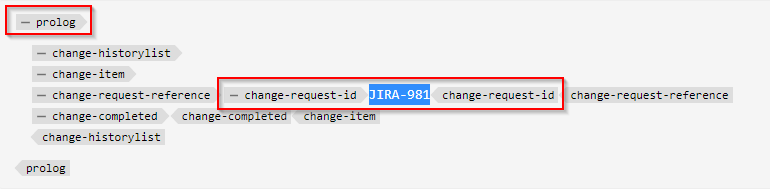
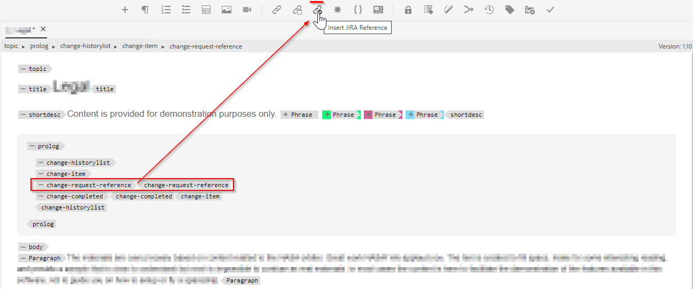
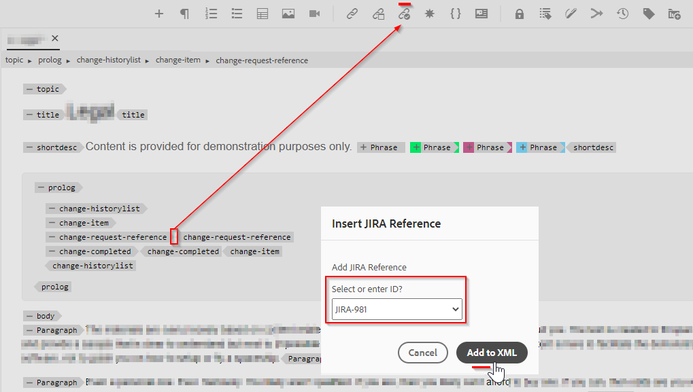
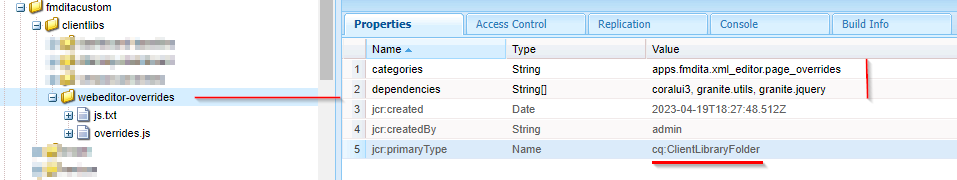
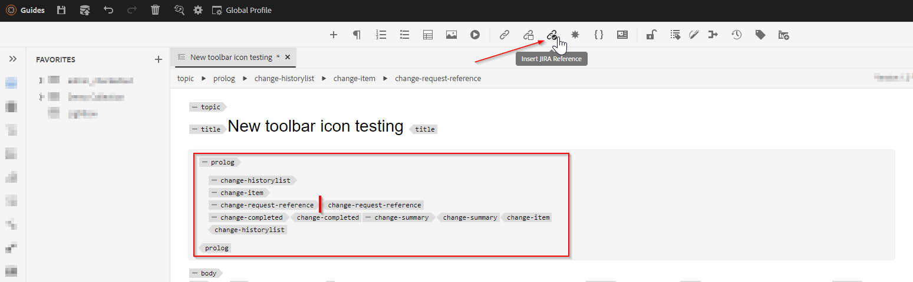

# 在编辑器工具栏中添加新的自定义可操作按钮

在本文中，我们将了解如何在浏览器工具栏中添加新的自定义按钮并调用javascript以执行所需的自定义操作。

向网站添加可操作按钮涉及以下步骤：
- 在中添加按钮 *ui_config.json* 在需要它的位置
- 在编辑器中注册单击按钮的事件，以便用户在单击该事件时执行操作


## 以示例实施

让我们通过一个作者想要为主题序言部分添加jira引用的示例来了解这一点。 嵌入了jira reference-id的prolog部分可能如下所示：



应从API检索包含JIRA ID的“change-request-id”元素（例如，基于应用程序所描述的特定JIRA查询）。 当用户创作prolog部分时，用户应该能够单击按钮并从Web编辑器工具栏插入jira引用id，例如：



当用户单击按钮时，它将显示一个对话框，该对话框应提取可能的选项并允许用户选择所需的JIRA ID，例如：



然后应将“change-request-id”添加到prolog：


## 实施此功能


### 通过在中配置按钮，将其添加到编辑器中 *ui_config.json*

使用文件夹配置文件检查 *ui_config.json* 在“XML编辑器配置”选项卡下，将按钮配置JSON添加到“工具栏”组的所需部分

```
{
    "on-click":"insertJIRARef",
    "icon":"linkCheck",
    "variant":"quiet",
    "type":"button",
    "title":"Insert JIRA Reference"
}
```

[使用此链接了解有关文件夹配置文件和配置ui_config.json的更多信息](https://experienceleague.adobe.com/docs/experience-manager-guides-learn/videos/advanced-user-guide/editor-configuration.html?lang=en)


### 处理新按钮的点击事件

    注：下面提到的步骤作为此帖子中附加的包提供


- 保存文件夹配置文件后，在项目目录(可能位于 */apps*)并添加属性，如下面的屏幕快照所示：
  

```
This example uses "coralui3" library to show a dialog as it is used in the Javascript sample we presented.
You may use different library of your choice.
```

- 在此客户端库文件夹下创建两个文件，如下所述：
   - *覆盖.js*：将具有javascript代码以处理“insertJIRARef”的单击事件（使用附加的包获取此javascript的内容）
   - *js.txt*：其中将包含“overrides.js”以启用此javascript

- 保存更改，您应该已经做好测试准备。


### 测试

- 打开Web编辑器
- 在“用户首选项”中选择您添加自定义的文件夹配置文件 *ui_config.json*. 如果您将其添加到全局配置文件中，则您可能已在使用它。
- 打开一个主题，您会注意到工具栏上新增了一个按钮“插入Jira引用”
- 然后，您可以将prolog部分添加到主题中（如下所示），并尝试在prolog元素“change-request-reference”内单击“插入Jira引用”按钮

```
<prolog>
    <change-historylist>
        <change-item>
            <change-request-reference>
            </change-request-reference>
            <change-completed></change-completed>
            <change-summary></change-summary>
        </change-item>
    </change-historylist>
</prolog>
```

请参阅下面的屏幕截图以了解具体情况：




### 附件

- 示例clientlibs包将安装具有javascript代码的webeditor客户端库，用于工具栏按钮操作： [使用此链接下载](../../../assets/authoring/webeditor-addbuttonontoolbar-insertjira-clientlib.zip)
- 示例 *ui_config.json* ，您可以将其上传到文件夹配置文件： [下载示例ui_config.json](../../../assets/authoring/sample_ui_config_Guides4.2-InsertJiraReference.json)

```
Please note this is compatible to AEM 6.5 and AEM Guides version 4.2.
If you are using a different version please add the toolbar button to the ui_config.json manually.
```
