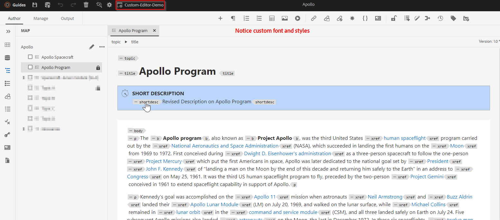

# 向“参考线”编辑器添加自定义样式

在本文中，我们将了解如何添加自定义样式以更改浏览器默认外观。

这将涉及以下步骤：
- 通过文件夹配置文件XML编辑器配置添加自定义样式
- 在浏览器中选择相应的文件夹配置文件并测试更改


## 以示例实施

让我们通过一个示例来了解这一点，我们希望在编辑器中将简短描述和标题显示为具有某些样式方面的单独块。




## 实施此功能


### 将自定义CSS添加到文件夹配置文件

使用文件夹配置文件检查 *css_layout.css* 在“XML编辑器配置”选项卡下，添加具有自定义样式的CSS

[使用此链接可了解有关文件夹配置文件和配置CSS模板布局的更多信息](https://experienceleague.adobe.com/docs/experience-manager-guides-learn/videos/advanced-user-guide/editor-configuration.html?lang=en#customize-the-css-template-layout)

使用以下内容在编辑器中设置上述样式：

- 使用 [css_layout.css](../../../assets/authoring/webeditor-customstyles-css_layout.css) 并将其上传到您选择的文件夹配置文件
- 安装附加的包 [webeditor-styles-resources.zip](../../../assets/authoring/webeditor-styles-resources.zip) 使用AEM包管理器安装上述CSS文件中使用的资源

```
This will install the resources at path "/content/dam/resources" which will include sub-folders "fonts" and "images"
```


### 测试

- 打开Web编辑器
- 在“用户首选项”中，选择添加自定义样式的文件夹配置文件。 如果您将其添加到全局配置文件，则您可能已在使用它。
- 打开一个主题，您会注意到编辑区域应具有自定义UI

```
Please note this is compatible to AEM Guides version 4.2 and AEM Guides cloud version 2303 (March)
```


## 引用

您还可能对中介绍的有关Web服务器配置和自定义的专家讲座感兴趣 [Webeditor专家会议](/help/product-guide/knowledge-base/expert-sessions/webbased-authoring-jan2023.md)
