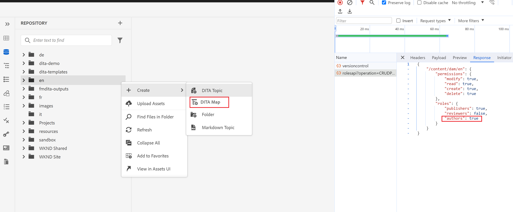
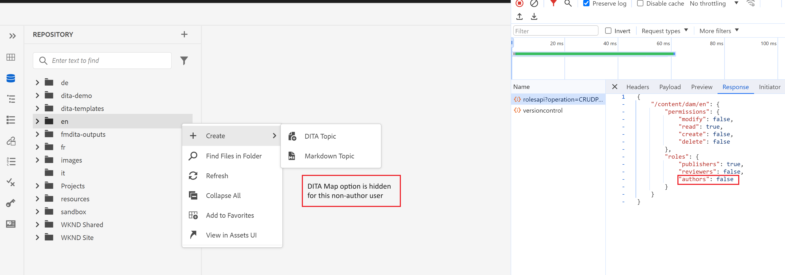

# 在编辑器的文件夹上下文菜单中显示/隐藏“创建DitaMAP”

在本文中，我们将了解如何自定义Guides Web编辑器，以根据用户/组权限在文件夹上下文菜单中隐藏或显示“创建DitaMap”选项。
在此用例中，我们将为所有非作者用户隐藏此选项。

## 先决条件

我们将利用AEM Guides扩展包，允许您根据需要自定义应用程序的UI。
请看这个 [文档](https://github.com/adobe/guides-extension/tree/main) ，详细了解Guides扩展框架的工作原理。

现在，让我们开始了解如何自定义文件夹上下文菜单以对所有非作者用户隐藏此选项。

正如您从下面的代码片段中所看到的，“创建DitaMap”选项对于作者用户可见。



现在，让我们看看如何使用Guides扩展框架隐藏此选项。

## 实施步骤

此实施分为以下几个部分：

- **Folder_options控制器中的更改**

  每个上下文菜单都有一个与之关联的控制器ID。 此控制器处理各种上下文菜单选项的事件功能。

  在本例中，我们将自定义文件夹上下文菜单以对非作者隐藏“创建DitaMap”选项。 为此，我们将对guides扩展框架存储库中/src下的folder_options.ts文件进行更改。

  我们将使用“viewState”作为“REPLACE”来隐藏上下文菜单中的此选项。
我们正在通过键“id”调用此folder_options中的新构件。

```typescript
const folderOptions = {
  id: "folder_options",
  contextMenuWidget: "repository_panel",
  view: {
    items: [
      {
        component: "widget",
        id: "customditamap",
        target: {
          key: "displayName",
          value: "DITA Map",
          viewState: VIEW_STATE.REPLACE,
        },
      },
    ],
  },
};
```

- **创建新构件以处理逻辑**

  需要创建新的构件创建(customoptions.ts)来编写逻辑，以仅对非创作用户隐藏此选项。 为此，我们使用了“show”键，它用作JSON结构中的切换开关。

  您可以编写自己的外部servlet来检查组详细信息。 通过这种方式，您也可以自定义自定义群组的文件夹菜单选项。
在此示例中，我们利用OOTB AEM“rolesapi”调用获取用户详细信息，并在“isAuthor”中设置响应，如上面的代码片段所示。

```typescript
const folderOptions = {
  id: "customditamap",
  view: {
    component: "button",
    quiet: true,
    icon: "breakdownAdd",
    label: "DITA Map",
    "on-click": "createNewDitaMap",
    show: "@extraProps.isAuthor",
  },
};
```

通过此操作，我们能够根据“show”的值隐藏标签为“Dita Map”的按钮。

我们添加了一个控制器以在模型中设置“isAuthor”属性，可以在控制器中使用以下语法执行此操作。

```typescript
this.model.extraProps.set("key", value);
```

其中，键为“isAuthor”，值为来自rolesapi调用的响应。
我们还定义了“createNewDitaMap”事件以启用创建DitaMap选项（对于作者用户）。

```typescript
controller: {
    init: function () {
      this.model.extraProps.set("isAuthor", false);

      rolesApiResponse.then((result) => {
        console.log(result);
        this.model.extraProps.set(
          "isAuthor",
          result["/content/dam"].roles.authors
        );

        console.log("testresult" + result["/content/dam"].roles.authors);
      });
    },
    createNewDitaMap() {
      repositoryController && repositoryController.next("create_new.map");
    },
  },
```

- **添加自定义代码**

  将folder_options.ts和customoptions.ts导入/src下的index.ts文件。

## 测试

- 使用不属于作者组的用户登录AEM。 创建DitaMap选项将在任何文件夹的上下文菜单中隐藏，如下所示。
此用例已添加到GIT，请查找以下相关资源。



### 相关资源

- **扩展框架基本存储库** - [GIT](https://github.com/adobe/guides-extension/tree/main)

- **文档** - [Experience League时](../../../../../guides-ui-extensions/aem_guides_framework/basic-customisation.md)

- **记录的常见用例** - [Experience League时](../../../../../guides-ui-extensions/aem_guides_framework/jui-framework.md)

- **带示例的公共存储库** - [在GIT上](https://github.com/adobe/guides-extension/tree/sc-expert-session). 参阅分支sc-expert-session

```

```
