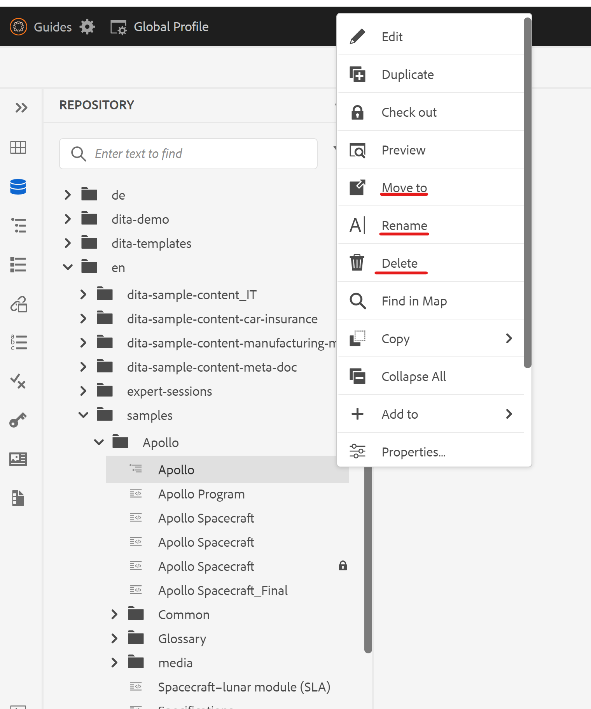
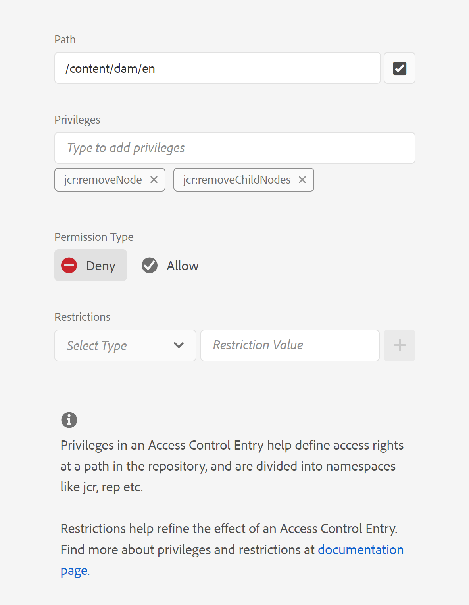
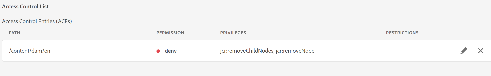
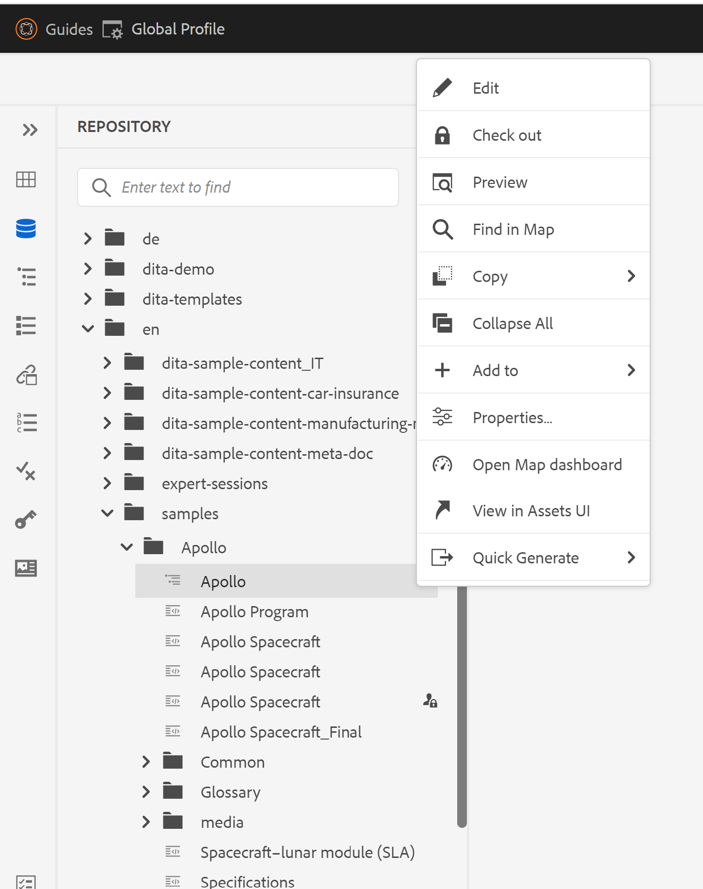

# 删除Webeditor中文件上下文菜单中的“删除”选项

在本文中，我们将了解如何在AEM Guides Web编辑器的文件上下文菜单中向特定用户或组隐藏“删除”选项。 有关文件上下文菜单选项的其他自定义设置，请查看Guides扩展框架。 可以找到更多详细信息 [此处](https://github.com/adobe/guides-extension/tree/main).

正如您从下面的代码片段中所看到的，文件上下文菜单具有适用于此特定用户的“删除”选项。



现在，让我们看看如何为此用户隐藏“删除”选项。

## 实施步骤：

- 从AEM主页导航到工具>安全>权限。
- 从搜索框中选择组或用户。
- 单击右上角的“添加ACE”。
- 选择文件夹路径。
- 包含权限“jcr：removeChildNodes”和“jcr：removeNode”。
- 选择“权限类型”作为“拒绝”，然后单击“添加”，如下所示。





### 测试

- 以已添加ACE的用户身份登录AEM。
- 打开Web编辑器。
- 转到存储库视图，然后选择已添加ACE的文件夹。
- 打开文件上下文菜单。
- “删除”选项将不会显示在上下文菜单中。

文件上下文菜单现在将如下所示：



```
Please note that these steps would also remove 'move' and 'rename' options from the Web Editor as they are also tied to delete process at the backend.
```
