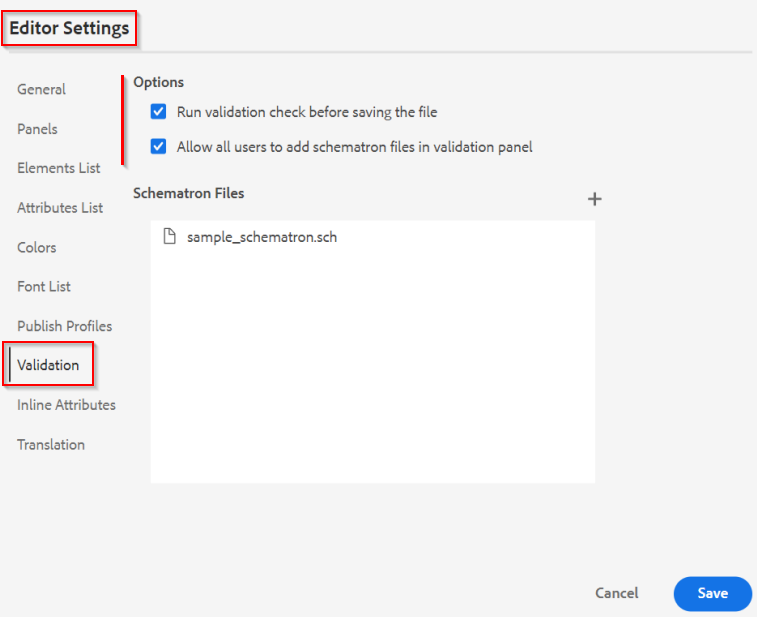
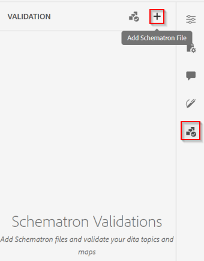
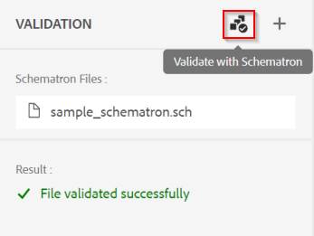

# 控制Web编辑器中的内容质量

本文概述了AEM Guides Web编辑器中验证的可能性。
通过设计，Web编辑器利用系统中的DITA架构设置强制用户创建DITA兼容内容。 这样，存储在系统中的所有内容都是结构化、可重用且有效的DITA内容。

除了支持DITA规则之外，Web编辑器还支持基于&#39;&#39;的内容验证&#x200B;*模式管*”规则。

&quot;*模式管*”是指用于为XML文件定义测试的基于规则的验证语言。 您可以导入Schematron文件，也可以在Web编辑器中编辑它们。 使用“架构”文件，您可以定义某些规则，然后针对DITA主题或映射验证这些规则。 Schematron规则可以通过施加定义为规则的限制来确保XML结构的一致性。 这些限制是由拥有内容质量和一致性的中小企业推动的。

    注意：Web编辑器支持ISO架构。


## 了解“Schematron”在Web编辑器中如何工作

### 配置架构规则

请参阅中的“支持Schematron文件”部分 [用户指南](https://helpx.adobe.com/content/dam/help/en/xml-documentation-solution/4-2/Adobe-Experience-Manager-Guides_UUID_User-Guide_EN.pdf#page=148)


### 在文件保存时强制实施验证规则

Webeditor设置允许超级用户设置将在每次用户更新内容时执行的架构规则/文件。 有关更多详细信息，请参阅中的“验证”部分。 [用户指南](https://helpx.adobe.com/content/dam/help/en/xml-documentation-solution/4-2/Adobe-Experience-Manager-Guides_UUID_User-Guide_EN.pdf#page=58)




### 能否手动运行验证？

可以，作为作者/用户，在创建内容时，您可以使用Web编辑器中的“架构”面板上传架构文件并对在编辑器中打开的文件运行验证。

    为使此功能正常工作，文件夹配置文件管理员必须允许所有用户在“验证”面板中添加架构文件。 请参阅编辑器设置（上面给出的屏幕快照）





### 支持的规则

AEM Guides的当前版本仅支持使用基于“断言”的规则进行验证。 (请参阅 [资产与报表](https://schematron.com/document/205.html))尚不支持任何基于“报告”的规则。


### 有关Schematron规则的示例和更多帮助

#### 示例用例

- 检查链接是否为外部链接，以及链接的作用域是否为“外部”

  ```
  <sch:pattern>
      <sch:rule context="xref[contains(@href, 'http') or contains(@href, 'https')]">
          <sch:assert test="@scope = 'external' and @format = 'html'">
              All external xref links must be with scope='external' and format='html'
          </sch:assert>
      </sch:rule>
  </sch:pattern>
  ```

- 检查地图中是否至少有一个“topicref”，或一个“ul”下是否至少有一个“li”

  ```
  <sch:pattern>
      <sch:rule context="map">
          <sch:assert test="count(topicref) > 0">
              There should be atleast one topicref in map
          </sch:assert>
      </sch:rule>
  
      <sch:rule context="ul">
          <sch:assert test="count(li) > 1" >
              A list must have more than one item.
          </sch:assert>
      </sch:rule>
  </sch:pattern>
  ```

- “indexterm”元素应始终存在于“prolog”中

  ```
  <sch:pattern>
      <sch:rule context="*[contains(@class, ' topic/indexterm ')]">
          <sch:assert test="ancestor::node()/local-name() = 'prolog'">
              The indexterm element should be in a prolog.
          </sch:assert>
      </sch:rule>
  </sch:pattern>
  ```

#### 资源

- 了解  [模式基础知识](https://da2022.xatapult.com/#what-is-schematron)
- 更多关于 [Schematron中的声明规则](https://www.xml.com/pub/a/2003/11/12/schematron.html#Assertions)
- [模式文件示例](../../../assets/authoring/sample_schematron.sch)
