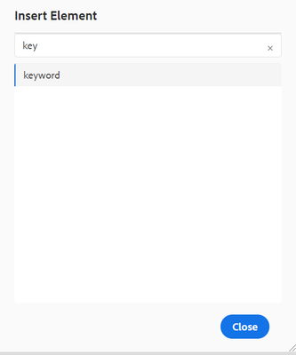
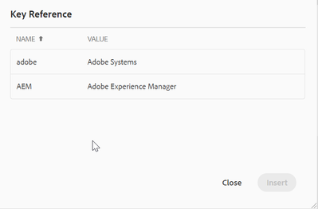

# 创建键

如果组织有一些可恢复且通用的文本（如产品名称或产品推介），并且这些文本在许多地方使用但容易更改，则组织应使用关键值。 对此类可重用文本使用键允许您通过在单个位置（如键值中）进行更改在多个位置推送更新。

## 步骤1：创建用于存储密钥的全局映射

创建映射并添加 [!UICONTROL keyref] 元素到其中。

```
<?xml version="1.0" encoding="UTF-8"?>
<!DOCTYPE map PUBLIC "-//OASIS//DTD DITA Map//EN" "technicalContent/dtd/map.dtd">
<mapid="map.ditamap_ffbdbf06-8658-4311-ad84-1c631bba904f">
  <title>global-keys-map</title>
  <keydefkeys="adobe">
    <topicmeta>
      <linktext>Adobe Systems</linktext>
    </topicmeta>
  </keydef>
  <keydefkeys="AEM">
    <topicmeta>
      <linktext>Adobe Experience Manager</linktext>
    </topicmeta>
  </keydef>
</map>
```

在这里，您已定义了两个定义（如上所示），并提供 [!UICONTROL keyref] 作为 _AEM_ 对于 _Adobe Experience Manager_ 文本。

## 步骤2：将此地图添加到您的发布地图

```
<?xml version="1.0" encoding="UTF-8"?>
<!DOCTYPE map PUBLIC "-//OASIS//DTD DITA Map//EN" "technicalContent/dtd/map.dtd">
<mapid="map.ditamap_cbf4a96d-e382-4e8c-8830-bcc093fe6638">
  <title>sample-map</title>
  <topicrefhref="sample-topic-using-the-keys.dita"type="topic">
  </topicref>
  <maprefformat="ditamap"href="global-keys-map.ditamap"type="map">
  </mapref>
</map>
```

## 步骤3：使用键引用全局键映射中定义的变量

+ 编辑主题并使用 [!UICONTROL keyref].
+ 如屏幕快照所示，将显示一个小窗口，可在其中选择关键字。 当您添加“keyword”元素时，将显示该字段。
  
  

```
<?xml version="1.0" encoding="UTF-8"?>
<!DOCTYPE topic PUBLIC "-//OASIS//DTD DITA Topic//EN" "technicalContent/dtd/topic.dtd">
<topicid="topic.dita_31b00e61-04b5-4193-af7a-68503e88b087">
  <title>sample-topic-using-the-keys</title>
  <shortdesc></shortdesc>
  <body>
    <p>This is a sample topic using the keys defined in the global map</p>
    <p>here i am using the key definition for AEM :<keywordkeyref="AEM"></keyword></p>
  </body>
</topic>
```
