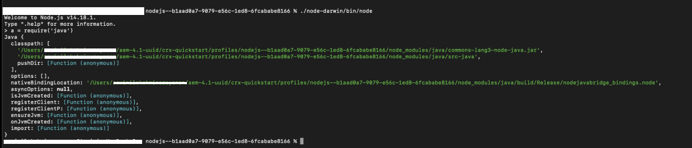
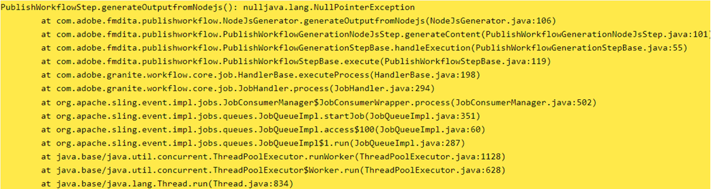
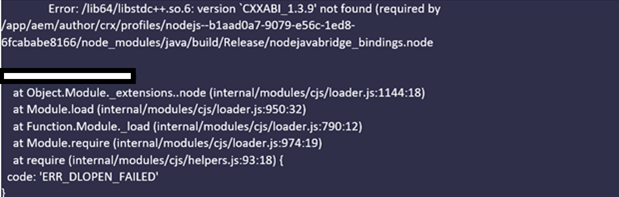
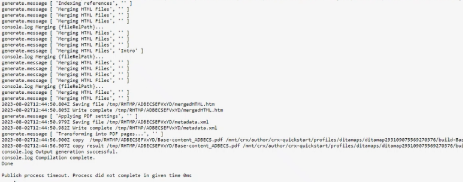

# 为本机PDF发布配置AEM环境

AEM Guides包括一个本机PDF发布引擎，使用户能够以PDF格式设计、开发和发布内容。

通过该功能，可创建各种页面布局、CSS模板并设计PDF模板与页面布局和CSS。

AEM Guides中配置此本机PDF的步骤因操作系统而异。 根据安装AEM的操作系统执行以下配置步骤。

## 前提条件

设置本机PDF的最低要求：

- 已安装Java平台、Standard Edition 8或11 JDK （Java SE开发工具包）和JRE （Java SE运行时环境）
- AEM 6.5 SP13、SP12、SP11或SP10
- 指南4.1及更高版本（非UUID或UUID）

本机PDF发布引擎需要OracleJDK在AEM crx-quickstart文件夹中生成node模块。 默认情况下，它支持以下操作系统：

- Windows 10、windows 2019 server及更高版本。
- Linux — （RHEL 8及更高版本、CentOS 7及更高版本、Ubuntu 18及更高版本）
- Mac OS（基于英特尔）

## Windows Server (JAVA 11/8)的配置步骤

1. 确保AEM服务器已关闭。
2. 在Windows任务栏上，右键单击Windows图标并选择“系统”。
3. 在“Settings（设置）”窗口的“Related Settings（相关设置）”下，单击“Advanced system settings（高级系统设置）”。
4. 在高级选项卡上，单击环境变量。
5. 在系统变量部分，单击“_新建_”以创建新的环境变量。
6. 输入变量名称作为JAVA_HOME。
7. 在值字段中，提供Java安装路径，然后单击确定。

   例如：

   JAVA 11：

   C:\Program Files\JAVA\jdk-11.0.15.1

   JAVA 8：

   C:\Program Files\JAVA\ jdk1.8.0_144

8. 添加从系统变量中选择路径，然后单击编辑。

9. 现在，Inside Path变量提供Server path的值，然后单击Ok。

   例如：

   JAVA 11：

   %JAVA_HOME%\bin\server\

   JAVA 8：

   %JAVA_HOME%\jre\bin\server\

10. 在环境变量对话框中再次单击“确定”。
11. 再次单击“系统属性”对话框中的“确定”。
12. 现在，启动AEM服务器。
13. 在Web编辑器中通过预设生成本机PDF。

## Linux服务器的配置步骤(RHEL7/centOS 7)

1. 确保AEM服务器已关闭
2. 通过执行echo $JAVA_HOME验证JAVA_HOME变量
3. 如果未设置JAVA_HOME变量，请执行步骤4。 否则，请直接转到步骤5。
4. 使用以下基于已安装java版本的命令设置JAVA_HOME变量

   例如：

   JAVA 11：

   1. export JAVA\_HOME=/usr/lib/jvm/java-11.0.15.1
   2. 导出路径=$PATH：$JAVA\_HOME/bin
   3. export LD\_LIBRARY\_PATH=/usr/lib/jvm/jdk-11.0.15.1/lib/server:/usr/java/jdk-11.0.15.1/lib/server

   JAVA 8：

   1. export JAVA\_HOME=/usr/lib/jvm/java-11.0.15.1
   2. 导出路径=$PATH：$JAVA\_HOME/bin

5. 如果您使用的是Guides版本4.2及更高版本，请重新启动AEM服务器并转到步骤12。
6. 复制&quot;_node_modules.zip_”附加到本文底部的crx-quickstart/profiles/nodejs—b1aad0a7-9079-e56c-1ed8-6fcababe8166/目录中。
7. 在crx-quickstart/profiles/nodejs—b1aad0a7-9079-e56c-1ed8-6fcababe8166/位置中打开终端。
8. 使用以下命令删除node_modules目录

   **rm -rf节点模块**

9. 使用以下命令解压缩node_modules.zip

   **unzip node_modules.zip**

10. 如果未安装/识别unzip命令，则可以使用以下命令安装它

   **yum安装unzip**

11. 安装fontconfig包。
命令： yum install fontconfig
12. 在Web编辑器中通过预设生成本机PDF。

**注意** ：可以下载node_modules.zip包 [此处](https://acrobat.adobe.com/link/track?uri=urn:aaid:scds:US:295d8f03-41e1-429b-8465-2761ce3c2fb3).

对于Guides 4.1或更早版本（步骤6-12）的用户，手动导入Linux操作系统的已下载节点模块是一种解决方法

## Mac计算机的配置步骤(JAVA 11/8)

1. 安装OracleJAVA 11或OracleJAVA 8。
2. 将JAVA_HOME环境变量设置为已安装的JAVA目录。
3. 打开Unix shell。
（此处使用Bash设置配置）

   命令： nano ~/.bashhrc

4. 使用以下基于已安装java版本的命令设置JAVA_HOME变量

   例如：

   JAVA 11：

   export JAVA\_HOME= /Library/Java/JavaVirtualMachines/jdk-11.0.15.1.jdk/Contents/Home

5. 重新加载bashhrc

   命令：来源~/.bashhrc。

6. 使用命令echo $JAVA_HOME验证是否已设置JAVA_HOME

7. 从AEM安装路径执行以下三个命令

   C：/{aem-installation-folder}/crx-quickstart/profiles/nodejs—b1aad0a7-9079-e56c-1ed8-6fcababe8166

   i)查找。 -type d -exec chmod 0755 {} \；ii)查找。 -type f -exec chmod 0755 {} \； iii) 。/node-darwin/bin/node node-darwin/lib/node_modules/npm/bin/npm-cli.js —prefix 。 安装 — unsafe-perm —scripts-prepend-node-path

8. 使用以下命令验证是否已安装Java

   i)运行 **./node-darwin/bin/节点** /crx-quickstart/profiles/nodejs—b1aad0a7-9079-e56c-1ed8-6fcababe8166文件夹中的命令

   

   ii) a = require(&#39;java&#39;)

9. 安装fontconfig包。
命令： apt install fontconfig

10. 在Web编辑器中通过预设生成本机PDF。

## 疑难解答

以下是未正确设置PDF变量时环境生成过程中可能发生的常见错误。

### Windows/Mac操作系统中的空指针异常

如果在更正Java环境设置后问题仍然存在，请重新验证以下内容：

1. 检查是否正确定义了输出预设，或创建新的输出预设，且不含空格。

2. 验证位于/libs/fmdta/node_resources的节点资源目录，以确保在安装期间安装了所有必需的库。

### RHEL 7 Linux OS中缺少库

### 发布进程超时。 在给定时间0毫秒内未完成处理

验证CRX存储库中/var/dxml/profiles/b1aad0a7-9079-e56c-1ed8-6fcababe8166/nodejs中nodejs节点的超时属性值。 默认值为 300。

如果您在执行上述任何步骤时遇到任何问题，请在AEM Guides社区中发布您的问题 [论坛](https://experienceleaguecommunities.adobe.com/t5/experience-manager-guides/ct-p/aem-xml-documentation) 以寻求帮助。
