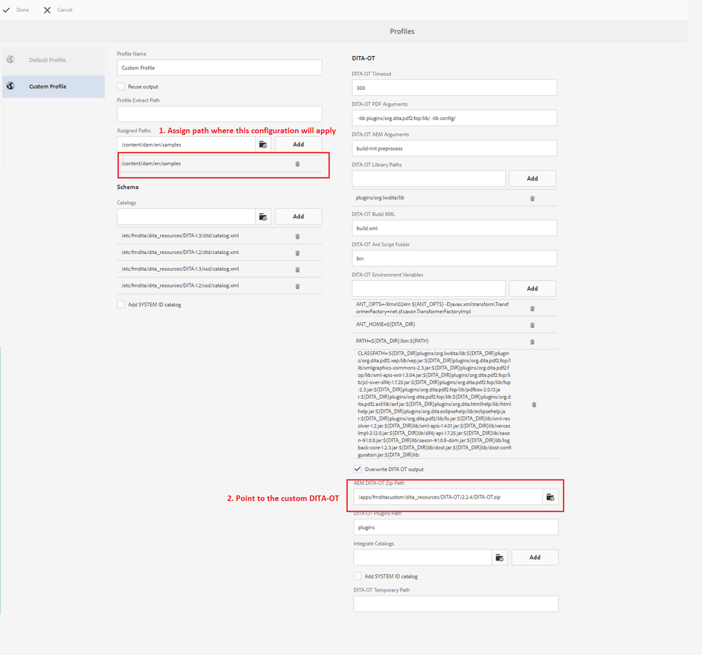

# 在中设置自定义DITA-OT [!DNL AEM Guides] 适用于AEM的

有关添加自定义DITA-OT的步骤，请参阅部分 _使用自定义DITA-OT插件_ 的 _安装和配置指南_.

从较高层面来看，这些步骤包括：

+ 获取基本DITA-OT
   + 如果要从获取现成DITA-OT的副本 [!DNL AEM Guides]，从路径下载 `/etc/fmdita/dita_resources/DITA-OT.zip`
   + 如果要获取其他版本，则可以从 [dita-ot repo](https://www.dita-ot.org/download)
+ 对DITA-OT like进行更改 [添加新插件](https://www.dita-ot.org/dev/topics/plugins-installing.html)，或自定义现有插件（请参阅下面相关链接部分中的示例）
+ 上传 `DITA-OT.zip` 接收至 `/apps/<project-folder>/dita_resources` （建议创建自定义项目文件夹）
+ 通过添加DITA配置文件 **[!UICONTROL 工具]** > **[!UICONTROL 指南]** > **[!UICONTROL DITA配置文件]** （使用上载自定义DITA-OT的DITA-OT路径，请参见下面的屏幕快照）
  

>[!MORELIKETHIS]
>
>+ [自定义DITA-OT插件示例](https://www.dita-ot.org/dev/topics/pdf-customization.html)
