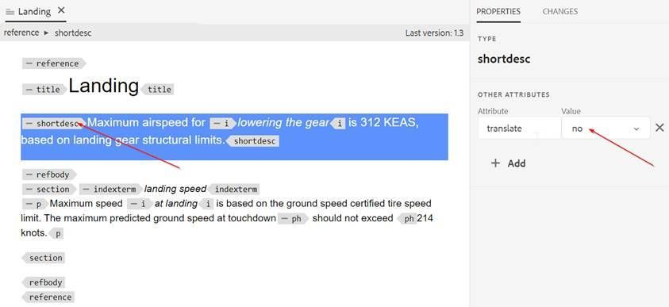
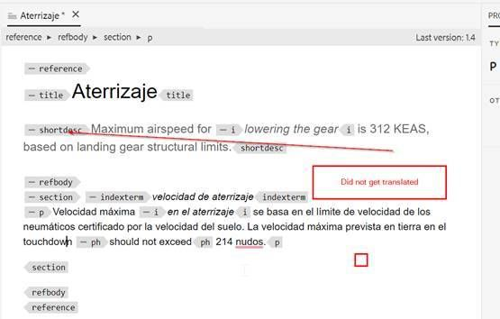

# 如何从翻译中排除主题中的段落

最简单的方法是使用translation=no attribute。

+ 作者可以将其他属性插入为 **translation=no** 他们不想翻译的段落。 需要通知翻译供应商，他们可以在终端进行配置以忽略具有此属性的文本。
+ OOTB机器翻译(带有试用版Microsoft翻译连接器)具有相同的行为。
+ 使用Microsoft翻译进行测试：如果您定义 **translate=no** 属性，则它不会翻译完整的段落。 此属性可以在任何元素中定义，并且不会翻译该元素中的内容。

以下是一些屏幕截图，进一步解释了这一点：

**源内容**

**西班牙语翻译内容**

