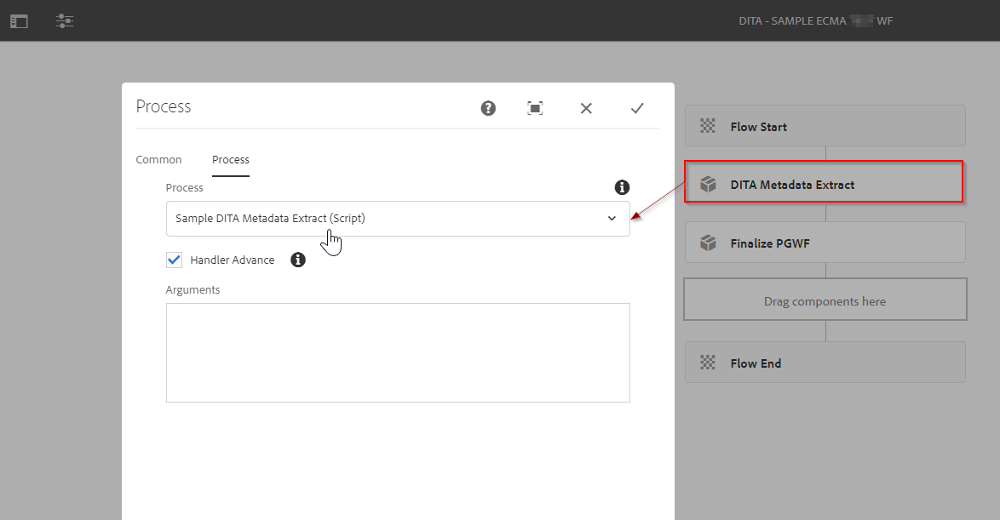
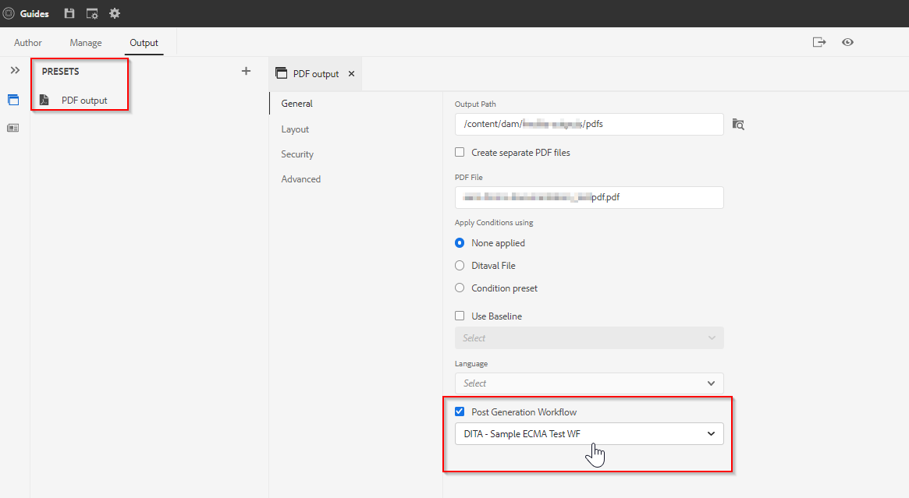

# AEM Guides发布 — 帖子生成工作流程

AEM Guides使您能够灵活地指定输出后生成工作流程。 您可以对使用AEM Guides生成的输出执行一些后处理任务。
例如，您可能希望在PDF输出中设置某些属性，或者在生成输出后向一组用户发送电子邮件。

## 利用后生成工作流涉及哪些步骤

### 创建工作流进程

创建基于Java或ECMA的工作流进程，以对生成的输出执行操作。 例如，将某些元数据从源复制到生成的内容或处理生成的输出的元数据。
- 我们将以使用ECMA脚本创建此类流程为例（您可以引用附加的包）
- 对于基于Java的工作流进程，请参阅部分。*自定义输出后生成工作流*&#x200B;的“ [安装和配置指南](https://helpx.adobe.com/content/dam/help/en/xml-documentation-solution/4-2/Adobe-Experience-Manager-Guides_UUID_Installation-Configuration-Guide_EN.pdf#page=119)

### 创建工作流模型

使用您在上一步中创建的自定义工作流流程，创建一个工作流模型并将该流程步骤添加到其中。
- 您还需要添加一个强制性流程步骤»*最终确定帖子生成*”作为工作流的最后一步。

请参阅下面显示的工作流模型示例：

### 在地图上使用此后期生成工作流

后生成工作流是一个属性，可在AEM Guides发布机制内的任何输出预设上配置该属性。 示例：

假定已创建选定的模型。

### 测试

现在，您可以使用此预设运行发布并验证流程步骤输出

## 样本

如需参考，您可以使用以下包并通过包管理器安装它，以测试示例的后生成工作流(*如上面的屏幕截图中所述*)

[基于ECMA的后生成工作流模型示例](../assets/workflows/sample-pgwf-ecma-test-wfmetadata.zip)
