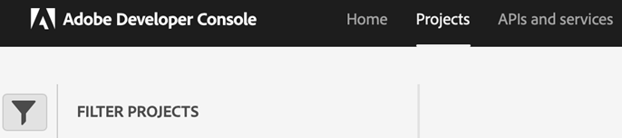
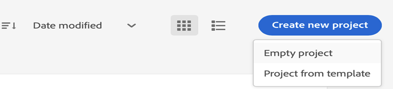
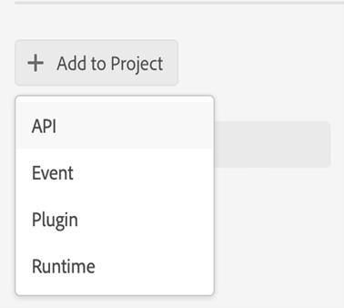
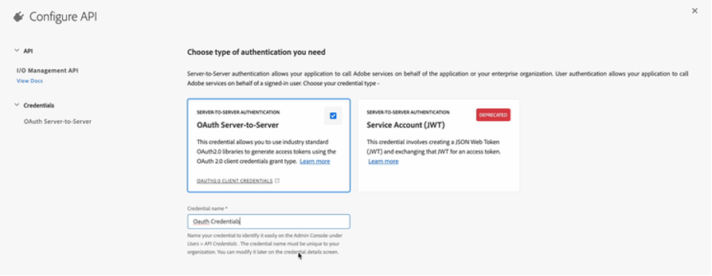
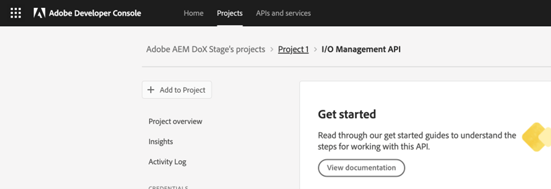
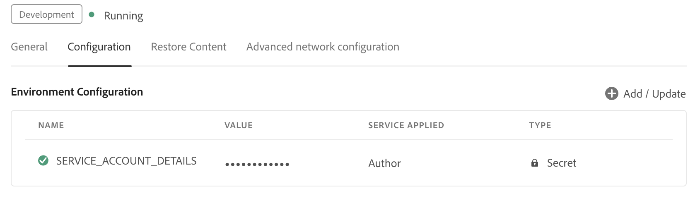

# 使用OAuth身份验证配置基于微服务的发布

发布微服务允许您在Experience Manager Guides as a Cloud Service上同时运行大型发布工作负载，并利用业界领先的Adobe I/O Runtime无服务器平台。

对于每个发布请求，Experience Manager Guides as a Cloud Service会运行一个单独的容器，该容器可根据用户请求水平缩放。 与大型内部部署Adobe Experience Manager服务器相比，这提供了运行多个发布请求并获得更高性能的功能。

>[!NOTE]
>
> Experience Manager Guides中基于微服务的发布支持PDF（本机或基于DITA-OT）、HTML5、JSON和CUSTOM类型的输出预设。

由于云发布服务受Adobe IMS基于OAuth的身份验证保护，请执行以下步骤以将其环境与Adobe的安全基于令牌的身份验证工作流集成，并开始使用基于云的可伸缩发布解决方案。


## 在Adobe Developer Console中创建IMS配置

**创建配置所需的角色**：系统管理员

执行以下步骤以在中创建IMS配置 **Adobe Developer Console**：

>[!NOTE]
>
>如果您已经创建了OAuth项目来配置用于创作的AI支持的智能建议，则可以跳过以下步骤来创建项目。

1. 打开 **Developer Console**： `https://developer.adobe.com/console`.

1. 切换到 **项目** 从顶部选项卡。

   

   *选择&#x200B;**项目**选项卡&#x200B;**Adobe Developer Console***

1. 要创建新的空项目，请选择 **空项目** 从 **创建新项目** 下拉菜单。

   

   *创建新的空项目。*

1. 选择 **API** 从 **添加到项目** 下拉列表，以将IO管理API添加到您的项目中。

   

   *从下拉菜单中选择一个API项目。*

   

   *将I/O管理API添加到您的项目中。*

1. 创建新的OAuth凭据并保存它。

   

   *为API配置OAuth凭据。*


1. 返回到 **项目** 选项卡并选择 **项目概述** 左边。

   

   *新项目入门。*

1. 单击 **下载** 按钮以下载服务JSON。

   

   *下载JSON服务详细信息。*

您已配置OAuth身份验证详细信息并下载JSON服务详细信息。 根据下一节中的要求，随时准备此文件。


## 将IMS配置添加到环境

>[!NOTE]
>
>如果您已经为智能建议创建了OAuth项目，则可以在微服务中重用同一项目，并跳过以下步骤以将IMS配置添加到环境中。

### 更新现有配置

如果您已在使用微服务来使用JWT进行发布（已弃用），请执行以下步骤，以更新配置：


1. 打开 **Experience Manager** 并选择包含要配置的环境的程序。
1. 切换到 **环境** 选项卡。
1. 选择要配置的环境的名称。 这应该会将您导航到 **环境信息** 页面。
1. 切换到 **配置** 选项卡。

1. 使用您下载的新OAuth JSON文件更新SERVICE_ACCOUNT_DETAILS JSON字段。
1. 删除PRIVATE_KEY字段。


   

   *更新现有JWT环境配置。*

### 首次配置

要首次使用发布微服务，请按照以下步骤更新配置：
1. 打开 **Experience Manager** 并选择包含要配置的环境的程序。
1. 切换到 **环境** 选项卡。
1. 选择要配置的环境的名称。 这应该会将您导航到 **环境信息** 页面。
1. 切换到 **配置** 选项卡。

1. 更新SERVICE_ACCOUNT_DETAILS JSON字段。 确保您使用以下屏幕快照中给出的相同名称和配置。


*首次配置环境。*


### 首次使用基于微服务的发布

>[!NOTE]
>
> 如果您已在使用基于微服务的发布，请跳过以下步骤：

将IMS配置添加到环境后，执行以下步骤以使用OSGi将这些资产与Experience Manager Guides链接：

1. 在您的Cloud Manager Git项目代码中，添加以下两个文件(对于文件内容，请查看 [附录](#appendix))。

   * `com.adobe.aem.guides.eventing.ImsConfiguratorService.cfg.json`
   * `com.adobe.fmdita.publishworkflow.PublishWorkflowConfigurationService.xml`
1. 确保新添加的文件包含在您的 `filter.xml`.
1. 提交并推送您的Git更改。
1. 运行管道以将更改应用到环境。

完成此操作后，您可以使用基于微服务的云发布。

## 常见问题解答


1. 如果启用了使用微服务的OSGi配置，则发布过程能否在本地Experience Manager服务器上使用相同的代码库？
   * 否，如果标志 `dxml.use.publish.microservice` 设置为 `true`，它始终查找微服务配置。 设置 `dxml.use.publish.microservice` 到 `false` 以便在本地服务器上进行发布。
1. 使用基于微服务的发布时，为DITA进程分配了多少内存？ 这是否通过DITA配置文件和参数驱动？
   * 对于基于微服务的发布，内存分配不会通过DITA配置文件和参数驱动。 服务容器上可用的总内存为8 GB，其中6 GB分配给DITA-OT进程。


## 附录 {#appendix}

**文件**：
`com.adobe.aem.guides.eventing.ImsConfiguratorService.cfg.json`

**内容**：

```
{
"service.account.details": "$[secret:SERVICE_ACCOUNT_DETAILS]",
}
```

**文件**： `com.adobe.fmdita.publishworkflow.PublishWorkflowConfigurationService.xml`

**内容**：
* `dxml.use.publish.microservice`：切换到使用DITA-OT启用基于微服务的发布
* `dxml.use.publish.microservice.native.pdf`：切换到启用基于微服务的本机PDF发布

```
<?xml version="1.0" encoding="UTF-8"?>
<jcr:root xmlns:jcr="http://www.jcp.org/jcr/1.0" xmlns:sling="http://sling.apache.org/jcr/sling/1.0"
          jcr:primaryType="sling:OsgiConfig"
          dxml.publish.microservice.url="https://adobeioruntime.net/api/v1/web/543112-guidespublisher/default/publishercaller.json"
          dxml.use.publish.microservice="{Boolean}true"
          dxml.use.publish.microservice.native.pdf="{Boolean}true"
/>
```
