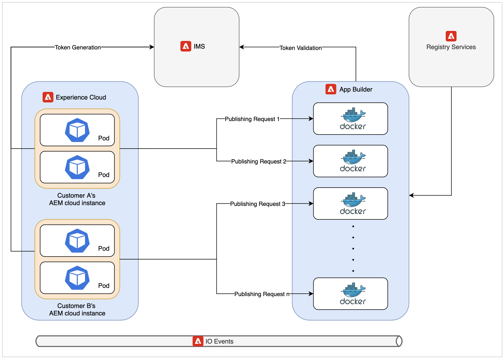

# 云发布微服务架构和性能分析

本文分享了关于新的云发布微服务的架构和性能数字的见解。

>[!NOTE]
>
> AEM Guides中基于微服务的发布支持PDF（本机或基于DITA-OT）、HTML5、JSON和CUSTOM类型的输出预设。

## 云上现有发布工作流存在问题

DITA发布是一个主要依赖于可用系统内存和CPU的资源密集型过程。 如果发布者发布包含许多主题的大型地图，或者如果触发了多个并行发布请求，则对这些资源的需求将进一步增加。

如果您未使用新服务，则所有发布都会在同一个Kubernetes(k8)面板上进行，该面板也在运行AEM云服务器。 典型的k8存储模块对其可以使用的内存和CPU数量存在限制。 如果AEM Guides用户正在发布大型或并行工作负载，则此限制可能会很快突破。 K8会重新启动Pod，这些Pod尝试使用的资源超过配置的限制，可能会对AEM云实例本身造成严重影响。

这种资源限制是提出专用服务的主要动机，这种专用服务允许我们在云上运行多个并发和大型发布工作负载。

## 新架构简介

该服务正在使用Adobe的尖端云解决方案（如App Builder、IO Eventing、IMS）创建无服务器产品。 这些服务本身基于Kubernetes和docker等被广泛接受的行业标准。

对新发布微服务的每个请求都在独立的Docker容器中执行，该容器一次仅运行一个发布请求。 如果收到新发布请求，将自动创建多个新容器。 每个请求配置的单一容器使微服务能够为客户提供最佳性能，而不会带来任何安全风险。 发布结束后，将丢弃这些容器，从而释放所有未使用的资源。

所有这些通信都由Adobe IMS使用基于JWT的身份验证和授权来保护，并通过HTTPS执行。

>[!NOTE]
>
> 发布过程在AEM服务器上执行请求的某些与内容相关的部分，如依赖关系列表生成。 但是，发布流程中最详尽的部分（如运行DITA-OT或本机引擎）已卸载到新服务中。

## 性能分析

本节显示微服务的性能编号。 它将微服务的性能与AEM Guides本地服务进行比较，因为旧云架构在并发发布或发布非常大的地图方面存在问题。

如果您正在本地发布大型映射，则可能必须调整Java栈参数，否则可能会遇到内存不足错误。 在云上，微服务已进行性能分析，并且具有最佳的Java栈和其他开箱即用的配置。

### 在云上运行一个发布而不是在内部部署

* 云

  如果您使用新服务在云上执行单个发布，则与单个内部发布相比，发布可能需要更多一点时间。 这种略微增加的时间是由于新云架构的分布式性质。

  

* 内部部署

  在旧云架构或内部部署中，单个发布的结果会更好，因为完整的发布操作会在运行AEM的同一个Pod/计算机上进行。

  

### 在云上运行多个发布而不是在内部部署

* 云

  新的发布微服务在此场景中大放异彩。 正如您从下图中所看到的，随着多个并发发布作业的增加，云能够发布这些作业而不会显着增加发布时间。

  

* 内部部署

  在内部服务器上运行并发发布会导致性能严重下降。 如果发布者同时发布更多地图，则性能下降更为严重。

  

## 其他优势

每个发布请求的某些部分必须在AEM实例上运行，才能获取发送到微服务的正确发布内容。 新的云架构使用AEM作业来取代AEM工作流，就像旧架构中的情况一样。 此更改使AEM Guides管理员能够单独配置云发布队列设置，而不影响其他AEM作业或工作流配置。

可在此处找到有关如何配置新发布微服务的详细信息： [配置微服务](configure-microservices.md)
