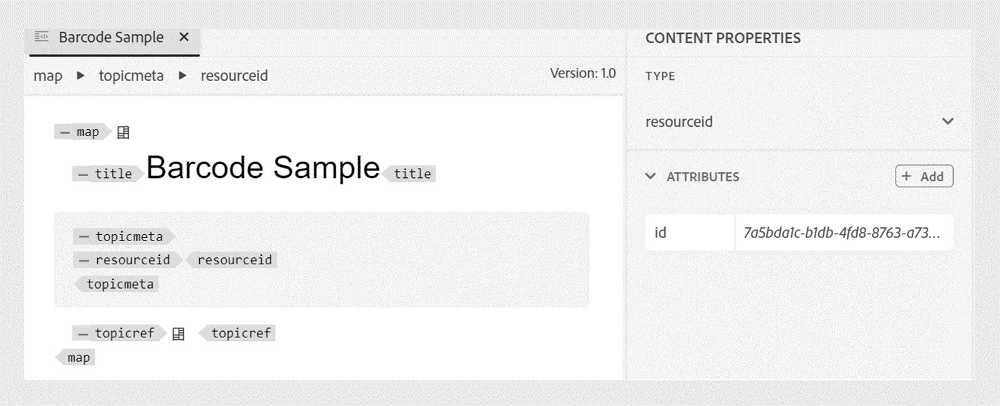
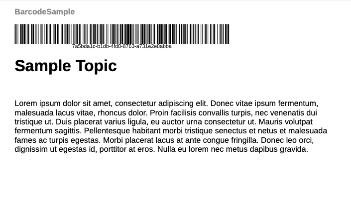

# 向PDF输出添加条形码

条形码可用于包含易于机器处理的信息。 同样，二维码用于读者可以通过移动设备打开的链接。

本教程可帮助您在PDF输出的每个页面上添加条形码。

## 生成条形码的步骤

要生成条形码，请执行以下步骤：

### 向DITA映射添加资源ID

向DITA映射添加资源ID元素。 资源ID用作生成条形码的主要输入。

```xml
<?xml version="1.0" encoding="UTF-8"?>
<!DOCTYPE map PUBLIC "-//OASIS//DTD DITA Map//EN" "technicalContent/dtd/map.dtd">
<map id="GUID-3c330691-4dac-4020-904a-d2d6246aeeb1-en">
  <title>Barcode Sample</title>
  <topicmeta>
    <resourceid id="7a5bda1c-b1db-4fd8-8763-a731e2e8abba">
    </resourceid>
  </topicmeta>
  <topicref href="GUID-139f6c64-bea3-4f17-8b22-ee131557e249-en.dita" type="topic">
  </topicref>
</map>  
```

您还可以在创作模式下编辑资源ID。




### 在模板标题中添加条形码占位符

修改 `Common.plt` 中的文件 **基本** 用于在项目标题后添加条形码的模板。

```html
...
  <div data-region="header">
    <p class="chapter-header"><span data-field="project-title" data-format="default">Project Title</span> </p>
    <p><span class="barcode" data-field="metadata" data-format="default" data-subtype="//resourceid/@id">Resource ID (barcode)</span></p>
  </div>
} 
...
```


### 更新模板的CSS以渲染条形码值

修改 `content.css` 文件以在PDF生成期间呈现条形码。 支持各种条形码类型，如“qrcode”和“pdf417”。  有关更多详细信息，请参阅 [条形码类型](#barcode-types).


```css
...
.barcode {
  -ro-replacedelement: barcode;
  -ro-barcode-type: code128;
}
...
```

执行上述步骤后，可以使用条形码生成PDF输出。

以下屏幕截图在PDF输出中显示一个条形码示例。




## 条形码类型 {#barcode-types}

| 类型 | CSS属性 | 其他属性 |
| ------------------------------- | ----------------------- | -------------------------- |
| QR代码 | qrcode |                            |
| PDF417 | pdf417 |                            |
| 数据矩阵 | 数据矩阵 |                            |
| Aztec代码 | aztec-code |                            |
| 网格矩阵 | 网格矩阵 |                            |
| Maxicode | maxicode mode-4 |                            |
| Micro QR | microqr |                            |
| 代码1 | code-one |                            |
| 代码块F | codablockf |                            |
| GS1数据库有限公司 | 数据库限制 |                            |
| GS1数据库全向 | 数据库全向 |                            |
| EAN-13 | ean-13 |                            |
| GS1-128 (EAN-128) | 代码128 | -ro-barcode-encoding： gs1； |
| ITF-14 | itf14 |                            |
| UPC-A | upc-a |                            |
| 代码128 | 代码128 |                            |
| 交错的2个，共5个 | code2of5交织 |                            |
| POSTNET | postnet |                            |
| 荷兰文邮政编码 | kixcode |                            |
| 《韩国邮报》 | 韩国 — 邮政 |                            |
| 德国邮政编码 | dp-leitcode |                            |
| 《澳大利亚邮报》 | 奥斯波特 |                            |
| Logmars | logmars |                            |
| Pharmacode | pharmacode |                            |
| USPS OneCode（智能邮件） | usps-onecode |                            |


