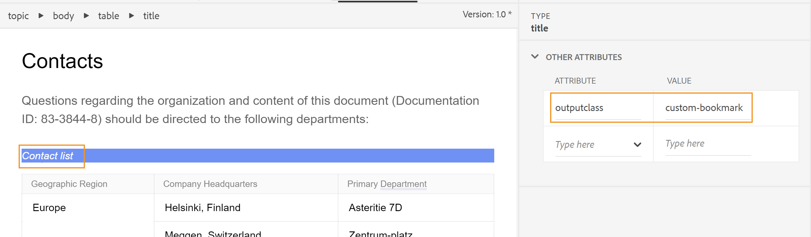

# 在PDF输出中添加自定义书签

通常，DITA映射中的TOC将作为书签复制到最终PDF输出中。 此TOC是根据DITA映射中的主题或节标题创建的。 有时，您可能希望在PDF输出中的特定内容上添加自定义书签以方便导航。 这可以通过添加 `outputclass` 属性，并将以下属性应用于该元素：

`bookmark-level: 3`

在此， `bookmark-level` 是属性和数字 `3` 是指示书签层次结构中添加书签的级别的值。 在以下示例中，第一级主题“联系人”有一个表“联系人列表”，我们在该表中添加了 `outputclass` 属性值为的属性 `custom-bookmark`.




下列定义 `custom-bookmark` 类添加到CSS文件中：

```css
…
/*Adding a custom bookmark*/
.custom-bookmark{
    bookmark-level: 2
}
…
```

在PDF输出中， *联系人列表* 表格被添加到第二级的PDF书签列表中，如下所示：


>[!NOTE]
>
>您必须选择添加自定义书签的正确级别。 如果指定的数字小于父级主题的书签，则自定义书签将占据父级书签的位置，而所有其他书签将显示为子级。 这可能会导致出现意外的书签结构。
