# PDF模板的组件 {#components-pdf-template}

PDF模板包含四个组件：页面布局、样式表、资源和设置。 可通过在生成PDF输出时自定义这些单独的组件并将模板与输出预设相关联来创建模板。 以下部分详细介绍了这些组件及其自定义过程。

## 创建和自定义页面布局 {#create-customize-page-layout}

利用页面布局组件中的设置，可通过定义页面上的页眉、页脚和内容区域来设计页面的结构。 使用WYSIWYG页面布局编辑器，您可以为PDF中的不同部分创建页面布局，例如前后封面页、章节、目录(TOC)、索引、空白页、前重要页、后重要页、数字列表(LOF)、表列表(LOT)、术语表，或者为自定义页面创建布局。 在PDF模板设置中，您可以分配一个包含PDF中不同部分的页面布局，然后使用它们生成PDF输出。

### 创建新页面布局 {#create-page-layout}

>[!NOTE]
>
>有一些现成的示例页面布局。 您可以自定义这些页面或创建新页面布局。

1. 在Web编辑器中，转到 **输出** 选项卡。
1. 展开左侧边栏并单击 **模板**.
1. 打开要使用的模板。

   >[!NOTE]
   >
   >您可以双击模板名称或单击模板名称旁边的>图标来打开模板。

1. 要创建新的页面布局，请执行下列操作之一：

   * 将鼠标悬停在 **页面布局** 然后单击(*选项* 图标) **...** 并选择 **新页面布局**.

   * 在 **模板** 面板上，单击 **+** 图标旁边 **模板** 并选择 **页面布局** 从上下文菜单中。

     这将打开 **添加布局** 对话框。

     

1. 指定新页面布局的名称。
   >[!NOTE]
   >
   >在命名页面布局时，请避免使用任何特殊字符。 名称中的空格被下划线“_”替换。

1. 单击&#x200B;**完成**。

   将在“页面布局”下创建并添加新布局。

### 复制页面布局 {#duplicate-page-layout}

1. 在 **模板** 要复制的模板部分，双击  **页面布局** 或单击 **>** 图标在前 **页面布局**.

   这会显示模板中的页面布局列表。

1. 将鼠标悬停在要复制的页面布局上，然后单击(*选项* 图标) **...** 并选择 **复制** 从上下文菜单中。

1. 在 _复制布局_ 对话框，输入页面布局的名称。

1. 单击 **完成**.
将在“页面布局”下创建并添加所选页面布局的副本。

### 自定义页面布局 {#customize-page-layout}

1. 在 **模板** 要编辑的模板部分，双击 **页面布局** 或单击 **>** 图标在前 **页面布局**.

   这会显示模板中的页面布局列表。
1. 要自定义任何页面布局，请执行以下操作之一：
   * 双击任何页面布局。
   * 将鼠标悬停在任意页面布局上，然后单击(*选项* 图标) **...** 并选择 **编辑** 从上下文菜单中。

   这将打开页面布局编辑器以进行自定义。
1. 进行所需的更改后，单击 *全部保存* (或 `Crl+S`)。

   有关定义页眉、页脚、页码、标题等各个布局元素的更多信息，请参阅 [设计页面布局](design-page-layout.md).

## 使用样式表自定义PDF {#stylesheet-customization}

样式表组件中的设置允许您使用WYSIWYG编辑器设置页面布局组件和DITA内容的样式或直接处理CSS文件。 您可以创建自己的样式或自定义默认样式属性。 所见即所得编辑器允许您访问设置页面布局或DITA内容样式所需的大多数属性。 对于高级自定义，可以直接在源视图中工作。

### 创建新样式表 {#create-stylesheet}

虽然为内容和布局提供了CSS文件，但您可以创建新样式表以将多个自定义项应用于特定样式类型，然后可以将其应用于目标组件。 默认情况下，示例CSS文件捆绑在产品中。 这些CSS文件旨在帮助您跨内容和布局组织样式信息。 您可以选择将这些样式合并到一个CSS文件或多个文件中。

默认情况下，无论何时创建新页面布局， `layout.css` 文件包含在新的页面布局中。 如果您希望页面布局包含其他CSS文件的样式，则只需将所需的CSS文件拖放到新页面布局的内容编辑区域上即可。 要验证CSS文件是否已嵌入页面布局中，请切换到源视图，您将在中找到指向CSS文件的链接 `<head>` 元素。

要创建样式表，请执行以下步骤：
1. 在 **模板** 面板，执行以下操作之一：
   * 将鼠标悬停在 **样式表** 选项卡，然后单击(*选项* 图标) **...** 并选择 **新建样式表**.
   * 单击 **+** 图标旁边 **模板** 并选择 **样式表** 从上下文菜单中。

   这将打开添加样式表对话框。

   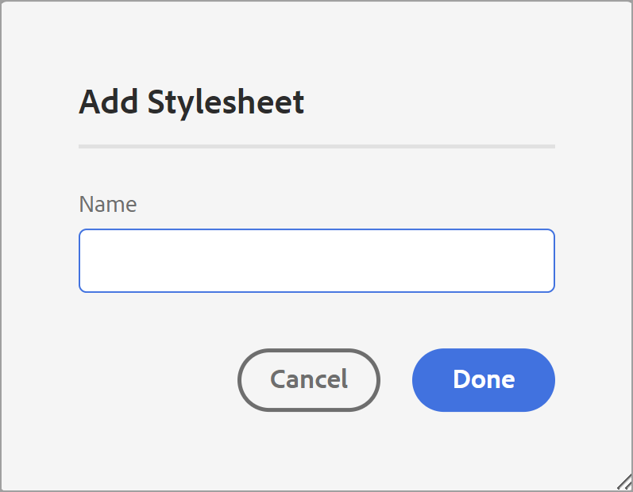
1. 指定新样式表的名称。
1. 单击&#x200B;**完成**。

   将在“样式表”部分下创建并添加新的样式表。

### 创建新样式 {#create-style}

默认情况下，随模板一起提供的CSS文件包含标题、段落、字符、超链接、图像、表、div、页面和其他样式的样式。 可以覆盖默认样式格式或创建新样式。

您可以创建新样式以在模板的页面布局中使用它，或者为任何DITA元素应用自定义样式。 要将这些自定义样式应用到DITA元素，必须确保样式的类名与DITA元素的名称或 `outputclass` 属性。  例如， `
` 在DITA中受 `.div {}` 在CSS或其 `outputclass` 属性。 如果您申请 `
` 在DITA中，它由 `.div {}` 或 `.my-div {}` 在CSS中。

要创建新样式，请执行以下步骤：
1. 展开左侧边栏，然后双击要在其中创建样式的模板。
1. 展开 **样式表** 部分。 它会打开 **样式** 包含所有样式选项的面板。
1. 选择+图标以添加新样式。

   **添加样式** 对话框打开。

   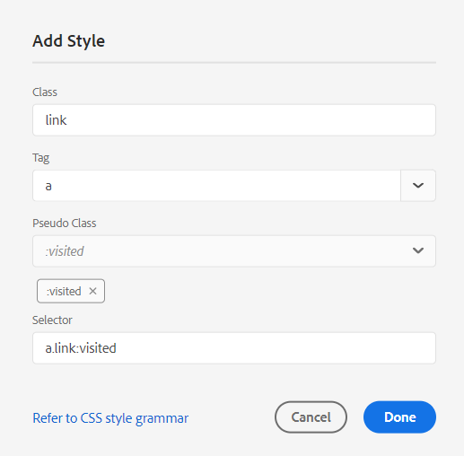

1. 指定 **类** 名称。 要将样式应用到DITA元素，请确保样式的类名与DITA元素的名称相同，或者 `outputclass` 属性。
1. 在 **标记** 字段（可选）中，选择要为其创建新样式的标记。

1. 选择 **伪类** 设置元素的样式。 伪类可帮助您定义元素的特殊状态。 例如，将鼠标悬停在元素上或焦点悬停在元素上时，可使用伪类来设置元素的样式。 还可以选择多个伪类。 例如，可以使用伪类 `a::visited {color: blue;}` 设置已访问链接的样式。

1. 添加新样式的选择器。 此 **选择器** 字段可帮助您添加除Class、Tag和Pseudo Class组合之外的自定义选择器。 例如，您可以创建 `table a.link` 表内所有超链接的样式。

   有关CSS标记的更多信息，请查看 [请参阅CSS样式语法](https://www.w3.org/TR/CSS21/syndata.html#characters).

1. 单击&#x200B;**完成**。

   随即会创建一个新样式并将其添加到样式列表中。

### 自定义预定义样式或新样式 {#customize-style}

在使用默认样式创建新的CSS文件或者希望自定义现有CSS文件中的样式后，可以使用样式编辑器执行此操作。

要自定义样式，请执行以下步骤：
1. 双击 **样式表** 或单击 **>** 图标在前 **样式表**.

   这会显示默认（内容和布局）和自定义CSS文件。
1. 打开样式表进行编辑。

   要打开样式表进行编辑，请执行下列操作之一：
   * 双击样式表名称。
   * 将鼠标悬停在样式表名称上，单击（选项图标）。..并选择“编辑”。

   这将打开样式表进行编辑，并在“样式”面板中显示样式列表。

   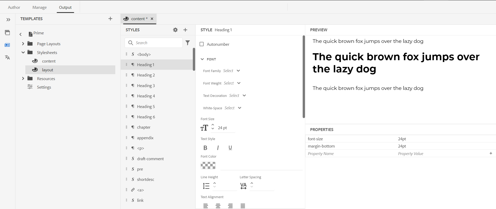

1. 要自定义样式，请选择要查看的样式，然后使用样式编辑器对其进行自定义。

### 样式的属性

在中心面板中，您可以编辑属性，但可能很难获得所有值存在的快照。  此 **属性** 窗格可快速查看样式的所有属性和值。

在中心面板中，您可以编辑常用属性，但不能编辑CSS支持的所有属性。 在 **属性** 窗格中，您可以编辑CSS支持的所有属性并进行预览。 无需切换到源视图即可编辑任何属性。

了解有关使用样式编辑器的更多信息 [使用常见的内容样式](stylesheet.md).

## 使用资源 {#work-with-resources}

这是用于设计模板的所有资产的容器。 您可以将其视为一个文件夹，其中包含背景图像、自定义字体、徽标等资产。 无论何时在模板中添加资源，都会将其上传或签入到资源文件夹。 然后，您可以使用这些资源来自定义或设计您的PDF模板。

要将资源文件添加到“资源”文件夹，请执行以下步骤：

1. 将鼠标悬停在“资源”文件夹选项卡上，单击（选项图标） ...并选择“导入”。

   这将打开上传资源对话框。

   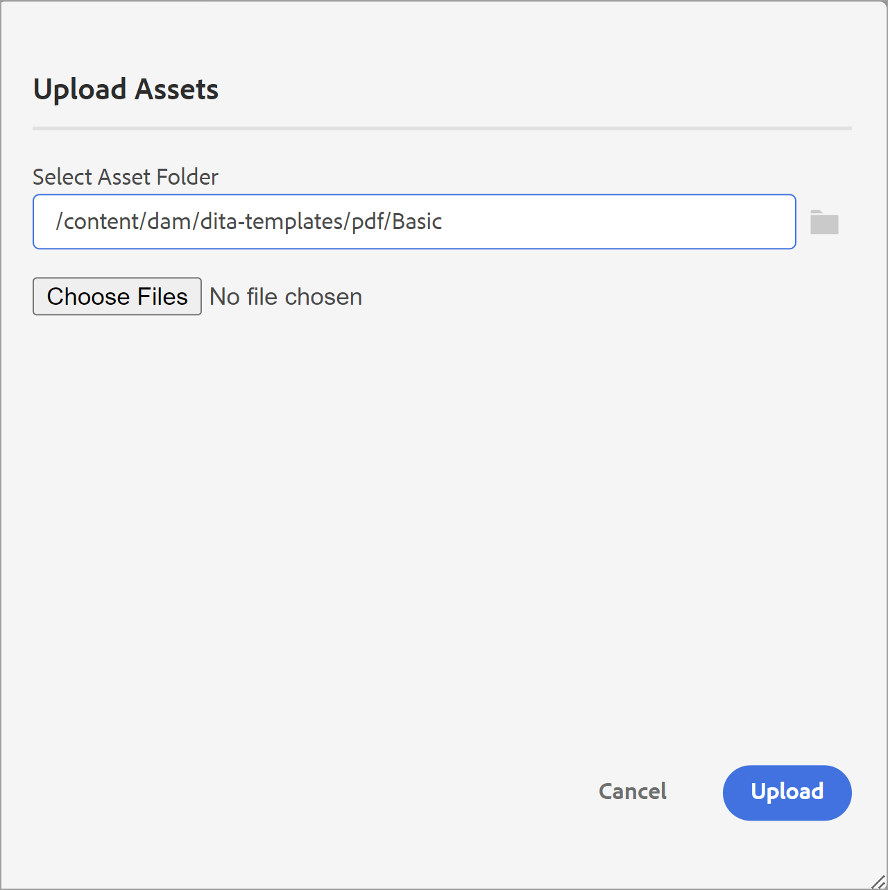

   要上传资源文件的路径，请参见 **选择资产文件夹** 字段。
   >[!NOTE]
   >
   >您无法更改上传资产的路径。 默认情况下，所有资源都存储在 `/content/dam/dita-templates/pdf/<PDF-template-name>` 文件夹。

1. 单击 **选择文件** 以从本地计算机浏览资源文件

1. 单击 **上传**.
选定的文件即被导入并列在“资源”文件夹下。

## 高级PDF设置 {#advanced-pdf-settings}

使用“设置”部分可以配置PDF页面布局的高级设置、从奇数页或偶数页开始PDF、交叉引用的格式以及允许在使用该模板生成的最终PDF中打印标记。

要配置，请单击 **设置** 在 **模板** 面板查看以下选项：

### 常规

设置从奇数页或偶数页开始章节的基本配置设置、目录结构，并定义目录条目的引线格式。 您可以定义以下设置：

* **从开始任何新章节**：用于定义如何在最终PDF中发布每个章节。 您可从 **新建页面**， **奇数页**， **偶数页**，或 **当前页**  选项。 如果选择从奇数页开始一个新章节，则会在结束于奇数页的章节后面插入空白页。 例如，如果您的章节在页码15结束，那么发布过程将插入一个空白16th 页面，以便新章节可以从17开始th 页面。  如果您选择 **当前页** 选项，则所有章节将继续发布，且不会出现任何分页符。 例如，如果章节在页面15的中间结束，则下一章节也会从第15页本身开始。

* **从新页面开始每个主题**：如果您希望章节中的每个主题都从新页面开始，请选择 **从新页面开始每个主题** 选项。 如果要使主题继续下去，并且不出现任何页面间隙，请取消选择此选项。

* **目录结构**：用于自定义目录的层次结构。 它使用以下附加设置：

   * **使用最高级别的标题**：它允许您调整要在PDF的目录结构中显示的标题级别数量。
   * **不在目录中显示第一级的页码**：选择此选项可隐藏包含嵌套或子主题的所有章节的相应页码。 请考虑以下示例，其中在不选择此选项的情况下创建输出。

  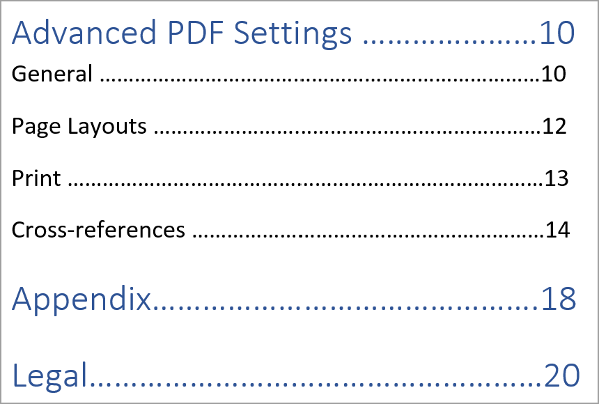

  在上述示例中，“高级PDF设置”、“附录”和“法律”是第一级主题标题或章节标题。 页码将分配给所有这些标题。

  现在，如果选择此选项并生成输出，您将获得以下目录：

  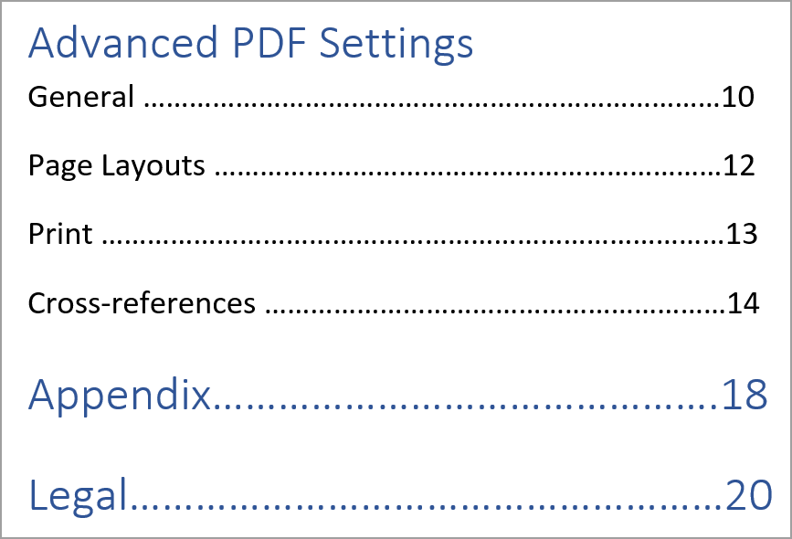

  在此，您可以注意到第一个章节高级PDF设置未提供任何页码，因为它包含嵌套主题或子主题。 而页码（如果分配给“附录”和“法律”），因为它们是独立主题，没有任何子主题。

* **不在目录中显示章节编号** ：选择此选项可显示章节名称，而目录中不包含章节编号。   默认情况下，章节编号显示在PDF输出的目录中。
* **引线格式**：使用下拉菜单选择虚线、实线或空格引线，将标题级别连接到其相应的页码。
有关应用目录结构和样式标题级别，请参见 [添加章节目录](design-page-layout.md#add-chapter-toc).

  >[!NOTE]
  >
  >如果您是CSS开发人员，则也可以直接在CSS文件中定义引线格式。

* **使用表续集标记**：选择此选项可以为跨多个页面的长表格定义标记。
您可以定义要在断点前后显示的文本。 例如，一个表在页面5上断开，并且您定义 `<Continued on page %page-num%>` 对象 **分隔之前的文本**.  文本在第5页的底部显示“第6页继续”。

  使用语言变量定义断点前后连续标记文本。 根据您选择的语言，将在PDF输出中自动选取本地化的值。 例如，您可以发布 `Continued on page %page-num%` 作为英语和文本使用 `Fortsetzung auf Seite %page-num%` 德语。

  将鼠标悬停在  靠近该选项，以查看有关该报表的更多详细信息。
* **将术语表链接到术语表页面**：选择此选项可在内容中将术语显示为超链接，并将它们链接到术语表页面上的术语。 这有助于读者快速查看词汇表中定义的术语的定义。

  要将术语表转换为超链接，您需要：
   * 启用 **术语表** 在 **页面布局顺序** DITA映射选项卡。
   * 在“书的地图”的“后事项页”中添加术语表。

  如果未启用“术语表”页面，则PDF中的术语不会转换为内容输出中的超链接。
  <!--For more information on using table continuation markers, see Use table continuation markers.-->

### 页面布局 {#page-layouts}

通过“页面布局”设置，您可以完全控制指定用于文档特定部分的页面布局。 例如，要为目录选择布局，请单击目录字段下的下拉菜单，然后选择您为生成目录而设计的布局。

请注意，书签设置优先于页面布局设置，这一点很重要。

“页面布局”部分下提供了以下设置：

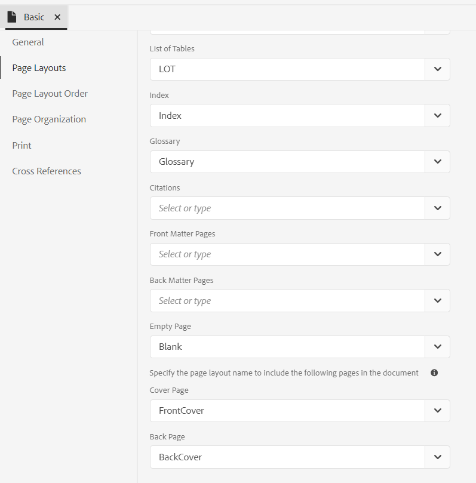

**默认页面布局**：选择用作PDF中所有页面的默认布局的页面布局。 这是基础页面布局，应用于尚未创建专用页面布局的那些部分或主题。

**不同部分的页面布局**：您可以使用PDF输出的以下部分映射页面布局。 如果您已经为相关部分设计了页面布局，请从下拉列表中选择它。 如果尚未为特定部分创建页面布局，则应用默认页面布局。

* **章节和主题**：您可以为章节和主题指定页面布局。 所选布局将应用于所有章节和主题。

* **目录**：如果您已设计目录页面布局，请选择 **目录** ，则文档中的所有TOC页面都将具有TOC页面布局。

* **图列表和表列表**：您还可以指定图和表的页面布局。 所选布局将应用于所有插图和表格。

* **索引**：如果您已经设计了“索引”页面布局，请将其映射到“索引”选项。 使用样式表，可以在PDF输出中设置不同的索引元素样式。 使用索引样式 `.idx-header`， `.idx-footer`， `.idx-body`， `.idx-title`， `.idx-keyword-group`， `.idx-unit`，  `.idx-keyword`， `.idx-name`， `.idx-link` 和 `.idx-child` 以自定义索引元素的样式。

* **术语表**：如果您有术语表页面布局，则将其映射到术语表选项。

  PDF输出词汇表中的术语始终按字母顺序排序。

  您还可以添加标记 `sort-as` 定义术语的排序键。 然后，《Experience Manager指南》使用排序键对术语进行排序，以代替术语表。 如果您尚未定义排序键，则它使用术语表进行排序。 例如，您可以添加标记 `sort-as` 到 `glossterm` 并将其值设置为 `A` 表示术语“USB”(例如， `<glossterm>USB<sort-as>A</sort-as></glossterm>`)。 同样，您可以添加 `sort-as` 标记并将其值设置为 `B` “钢笔通道”一词。 当您对这些术语表进行排序时，排序键 `A` 词汇表术语“USB”出现在排序键之前 `B` 词汇表“Pen Drive”。 因此，在PDF输出中，“USB”在术语表页上的“Pen Drive”前面。

  使用样式表，您可以在PDF输出中设置不同的术语元素样式。 使用术语表样式 `.glo-header`， `.glo-footer`， `.glo-body`， `.glo-title`， `.glo-unit`， `.glo-link`、和 `.glo-term` 自定义术语表元素的样式。

  了解有关使用样式编辑器的更多信息 [使用常见的内容样式](stylesheet.md).

* **“首页”和“后页”**：这些页面布局定义书籍中前后重要页面的样式。 如果您已设计前处理布局，请将其映射到 **首页** 选项。 当您从下拉菜单中选择前文布局时，前文布局将应用于前文中的所有主题。

  如果您设计了背面物质布局，请将其映射到 **后置内容页面** 选项。 从下拉菜单中选择后置内容布局时，后置内容布局将应用于后置内容中存在的所有主题。

  **首页** 还用作的回退布局 **目录**， **数字列表**&#x200B;和表列表。  同样地， **后置内容页面** 还用作的回退布局 **索引** 和 **术语表** 版面。 如果您尚未为这些页面选择布局，则会应用选定的前置或后置重要页面布局。  如果您未选择前置或后置重要页面布局，则会对其应用默认页面布局。

* **空页面的页面布局**：您还可以为空页面指定页面布局。 所选布局将应用于所有空页面。 例如，如果您为所有空页面设计了空白页面布局，则选择 **空白** ，则文档中的所有空白页面都将具有空白页面布局。

* **封面页和后页**：如果您设计了封面布局，则将其映射到 **封面** 选项。 同样，如果您有后页布局，则将其映射到 **后页** 选项。 如果尚未创建封面或后页布局，则应用默认页面布局。

有关页面布局的详细信息，请参阅 [设计页面布局](design-page-layout.md).

### 页面布局顺序 {#page-order}

您可以在PDF中显示或隐藏以下部分，还可以排列它们在最终PDF输出中的显示顺序：

* 目录
* 章节和主题
* 数字列表
* 表列表
* 索引
* 术语表
* 引用

  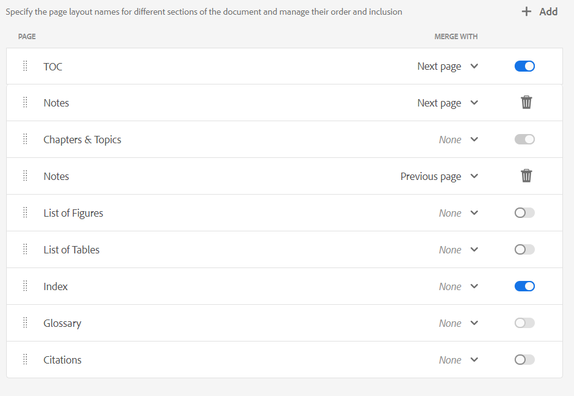

  如果不想在PDF输出中显示特定截面，可以通过关闭切换开关来隐藏该截面。

  您还可以定义在PDF中生成这些不同部分的顺序。 要更改这些部分的默认顺序，请选择虚线将部分拖放到所需位置。

  >[!NOTE]
  >
  > 顺序和包含设置仅适用于DITA映射。 对于书图，这些设置不适用。 书签中的页面按照书签中各个部分的顺序显示。

.
**章节和主题** 默认情况下，布局始终处于启用状态。 您无法切换它。

**合并页面**

默认情况下，所有部分都从新页面开始。 选择 **上一页** 或 **下一页** 选项来自 **合并为** 下拉菜单以将节与上一页或下一页合并。 这将发布与PDF输出中选择的页面接续的部分。 这样，两者之间就不会有分页符。

>[!NOTE]
>
> 此设置仅适用于部分，而不适用于其组件。  例如，如果您选择 **上一页** 选项 **章节和主题**， **章节和主题** 部分与上一页合并。 各种章节和主题将按照 **常规** settings。例如，如果在 **从设置开始任何新章节**，您选择 **奇数页**，则会在以奇数页结尾的章节之后插入空白页。

将节合并到上一页或下一页时，将合并内容，并应用合并内容的目标节的样式。

例如，如果启用 **目录** 和 **章节和主题** 并选择 **下一页** 对象 **目录**， **目录** 与下一部分合并，即 **章节和主题**. 的样式 **章节和主题** 部分将应用于两个部分的合并内容。

合并选项会连续运行，因此如果您已选择 **下一页** 对于多个连续截面，它们都与未设置此属性的第一个截面（在下一个方向）合并。 例如，您启用 **目录**， **章节和主题**， **数字列表**、和 **索引**. 那么，如果您设置 **下一页** 对象 **目录**， **章节和主题**， **数字列表**、和 **无** 对象 **索引**，它们都与  **索引**.

**静态页面**

各种页面布局可帮助您设计各个部分的输出。 这些部分在发布输出时从DITA映射生成。
您还可以创建自定义页面布局，并将其发布为PDF输出中的静态页面。 这有助于您添加任何静态内容，如注释或空白页面。

执行以下步骤可添加自定义页面布局：

1. 选择 **添加**  以添加新的页面布局。 此时将打开“添加页面布局”面板。
2. 从列表中选择页面布局，然后单击“添加”。 新的页面布局将添加到页面布局列表中。

您还可以执行以下操作：

* 选择点状条以将页面布局拖放到所需位置。

* 选择 **删除布局**   以删除布局。

* 您还可以将静态页面与上一页或下一页合并。

* 您还可以多次添加自定义布局并对其进行排序。 这有助于您相应地发布静态内容。

  例如，您可以使用自定义布局在PDF输出中多次发布静态警告。

### 页面组织

PDF文档中的页面通常根据在DITA映射或书签映射文件中组织的内容进行发布。 但是，您还可以更改PDF文档中的页面顺序。 例如，您可以将多页文档打印为小册子。 整理、折叠、装订工作表时，会生成一个页面顺序正确的帐簿。  然后，你可以像读书一样阅读已出版的小册子。

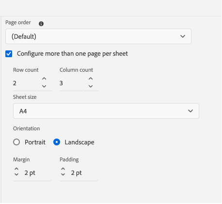

以下设置位于 **页面组织** 部分：

#### 页面顺序

选择决定PDF文档中页面顺序的页面顺序。 您可以从下拉菜单中选择以下选项：

* **默认**：页面在源文件中的默认顺序。
* **奇数页优先**：所有奇数页面都会移到所有偶数页面之前。
* **偶数页优先**：所有偶数页面都会被移动到所有奇数页面之前。
* **反向**：页面顺序颠倒。
* **手册**：所有页面都和小册子一样排序。
* **从右至左的小册子**：所有页面的顺序均为从右至左。
* **自定义**：定义页面的自定义顺序，而不是预定义的顺序。
   * “答：b” — 从a到b的所有连续页面。
   * &quot;a，b，c&quot; — 新页面顺序a、b、c。
   * &quot;a*b&quot; — 页面a重复b次。
   * “ — a” — 负页码从最后一页开始向后计数，可以与其他自定义订单组合。
   * “X” — 文档的所有页面。 与“1..-1”。

例如，您可以提供自定义顺序，如“2,3，5*2,7..10，-1，-2”。
给定页面顺序的PDF具有原始文档中的以下页码（假定它共有25页）：2、3、5、5、7、8、9、10、25、24。

#### 每页配置多页

选择此选项可在单张纸上发布多个页面。  然后，选择行数和列数并将页面像网格一样发布到单个工作表上。 例如，您可以将页面发布为包含2行和4列的网格。

定义目标页面大小和发布页面的方向。 还可以指定页面的边距和填充属性。

### 打印

配置打印生产设置以分配打印机标记，选择颜色模型，并指定与打印PDF输出相关的属性。

* **打印机标记**：在准备文档以进行打印生产时，打印机标记将添加到页面边界以帮助在打印期间正确对齐、裁剪和颜色选择。 通过选择打印机标记，扩展页面边界以容纳在打印期间被修剪的标记。 您可以选择在PDF输出中显示以下打印机标记：
   * **修剪标记**：选择选项以在裁切区域的每个角落处放置标记，以指示打印后需要裁切纸张的位置。
   * **出血标记**：选择以在出血框的每个角处放置标记，以指示扩展图像的修剪区域。
   * **注册标记**：选择此项可将标记置于裁切区域之外，以对齐彩色文档中的不同分色。
   * **颜色条**：选择以在修剪区域之外添加颜色条带，以保持颜色一致性并在打印时调整油墨密度。

  使用设置所选打印机标记的尺寸 **线条宽度**， **线条颜色**、和 **出血框宽度** 选项。

* **介质盒大小**：这是总页面大小，包括打印机标记所占用的扩展区域。 使用下拉选项为PDF输出选择页面大小或创建自己的自定义大小。

* **色彩空间**：您可以选择使用RGB或CMYK色彩空间来打印PDF文档。 选择“RGB”以数字方式显示生成的PDF和物理打印的CMYK。 文档中定义的颜色将转换为所选颜色空间。
  >[!NOTE]
  >
  >如果使用CMYK色彩空间，创建PDF/A时需要ICC色彩配置文件。

  <!--For more information on applying these print settings, see *Printing preferences*.-->

### 交叉引用 {#cross-references}

使用 **交叉引用** 选项卡定义交叉引用在PDF中的发布方式。 您可以设置主题标题、表格、插图等的交叉引用的格式。

>[!NOTE]
>
> 如果在插入交叉引用时定义了链接文本，则该文本优先于在本机PDF模板中定义的交叉引用格式。

还可使用变量来定义交叉引用。  使用变量时，将从属性中提取其值。 您可以使用单个变量或变量组合来定义交叉引用。 您还可以使用字符串和变量的组合。

例如，您可以使用 `View details on {chapter}`. 如果章节名称为“常规设置”，则输出中的交叉引用为“查看有关常规设置的详细信息”。

AEM Guides提供了以下开箱即用的变量：

* {title}：创建对主题标题的交叉引用。 例如，请参阅第2页上的有用链接。
* {page} 向页码添加交叉引用。 例如，请参阅第1页上的。
* {description}：添加对描述文本的交叉引用。 例如，请参阅AEM Guides的详细信息。
* {chapter}：添加对章节编号的交叉引用。 例如，请参阅第1章中的。
* {bookmarkText}：创建对标为书签的文本的交叉引用。 例如，请参见第5页上的stop_words。
* {captionText}：创建对主题中图形或表标题的交叉引用。 例如，请参阅第2页上的气流。
* {figure}：添加对数字的交叉引用。 从您为数字定义的自动编号样式中选取数字编号。  例如，您可以使用 {figure} 在页面 {page}“。 输出中的交叉引用包含自动生成的图号及其页码“请参见第5页的图1”。
* {table}：添加对表编号的交叉引用。 从您为标题定义的自动编号样式中选取表格编号。 例如，您可以使用 {table} 在页面 {page}“。 输出中的交叉引用包含自动生成的表编号及其页码，“请参见第5页上的表1”。

  >[!NOTE]
  >
  >可以为字幕和图形标记创建自动编号样式。

#### 默认交叉引用格式

如果将文本字段保留为空，并且在插入交叉引用时尚未定义链接文本，则“Experience Manager参考线”会为各个交叉引用添加以下变量：

* **标题**： `{title}`
* **描述**： `{description}`
* **段落**： `{bookmarkText}`
* **书签**： `{bookmarkText}`
* **图**： `{captionText}`
* **表**： `{captionText}`

交叉引用的优先级顺序为：
* 在交叉引用中添加的链接文本
* 在本机PDF模板中定义的交叉引用格式
* 默认交叉引用格式

#### 交叉引用中的语言变量

您还可以使用语言变量来定义本地化的交叉引用。 根据您选择的语言，将在PDF输出中自动选取本地化的值。

例如，您可以添加语言变量“reference-label”并以英语和德语定义值。

* 英语 — “在页面上查看” {page}&quot;
* 德语 — “Einzelheiten finden Sie auf der Seite {page}&quot;

添加时 `${lng:<variable name>}` 对于“段落”部分，输出段落中的交叉引用包含本地化文本和页码。\
例如，以下屏幕截图以英语显示交叉引用“View on page 1”并以德语显示“Einzelheiten finden Sie auf der Seite 1”。

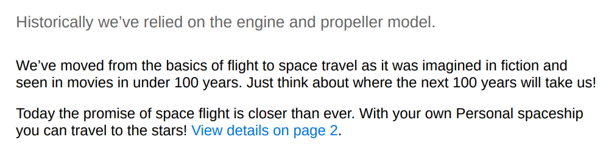

*以英语发布时，段落中的交叉引用。*

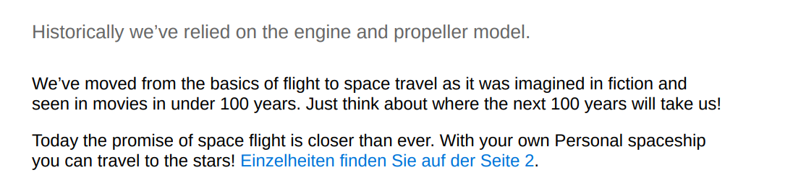

*以德语发布的段落中的交叉引用。*

<!--For more information, see *Format cross-references*.-->
