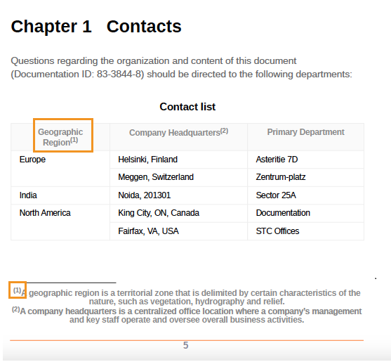
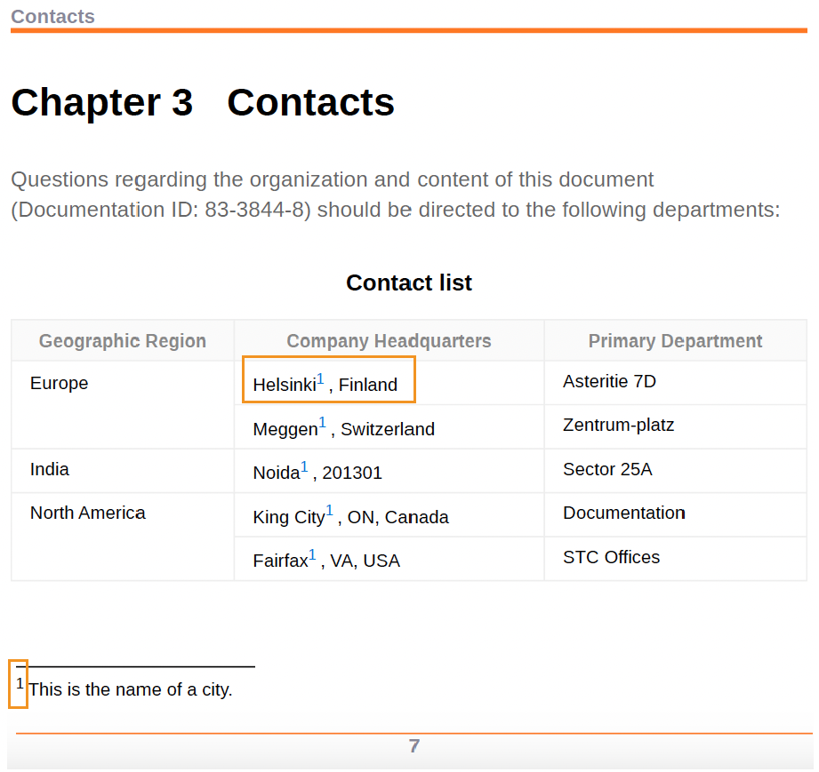

# 应用脚注样式


脚注是放置在页面底部的注释，用于在文本的指定部分上添加注释或引用引用。

每个脚注在页面底部都有一个脚注标记，通常是一个数字或星号等符号。 在主内容中，相同的脚注标记将显示为脚注调用，并以与上标相同的数字或符号指示。


## 更改脚注调用和标记的样式

您可以更改脚注调用和标记的样式并管理它们在PDF输出中的外观。 这些样式可帮助您快速识别文档中的脚注。


**示例1**：

使用给定示例，在脚注调用和标记之前和之后添加一个括号：

* 使用中的内容属性添加前缀“（”和后缀“）” `footnote-call` 样式，这将在主题内容的脚注编号周围添加括号。
* 使用中的内容属性添加前缀“（”和后缀“）” `footnote-marker` 样式，这将在页面底部的脚注编号周围添加括号。

```css
...
.fn::footnote-call { 
content: "(" counter(footnote, decimal) ")"; 
} 

.fn::footnote-marker { 
content: "(" counter(footnote, decimal) ")"; 
} 

...
```




*在脚注调用和脚注标记周围添加括号。*

**示例2**：

您还可以使用星号或小希腊字符而不是数字来标记脚注调用和标记。


```css
.fn::footnote-call {
 content: counter(footnote, asterisks);
}
.fn::footnote-marker {
 content: counter(footnote, asterisks) " ";
}
```

在输出中，您可以查看如下内容：


*为脚注调用和标记添加星号。*

## 隐藏脚注调用

您还可以将样式应用于具有特定属性的脚注调用。 例如，使用以下样式隐藏带ID的脚注：脚注调用在主内容中是隐藏的，但脚注标记显示在页面底部。

```css
.fn[id]::footnote-call {
		display: none;
                        }
```

## 设置脚注区域格式

脚注区域是放置所有脚注的位置，通常位于页面底部。 可以使用页面布局或CSS样式设置脚注区域的格式。


### 页面布局

您可以使用页面布局的页面属性来设置PDF文档中不同部分的脚注区域的样式。 例如，可以指定章节中脚注区域的边距和填充属性。 您还可以更改边框侧、样式、颜色、宽度和半径。

了解如何 [使用页面布局的页面属性](./design-page-layout.md#page-props-page-layout).

### CSS样式

可以在PDF文档中应用样式和设置脚注区域的格式。 例如，您可以更改边框长度、样式、颜色和宽度。

```css
	@page {
	  @footnote {
   		border-top-style: solid;
   		border-top-color: #FF0000;
   		border-top-width: 3px;
 		        }
	      }
```

## 重新开始脚注的编号

默认情况下，脚注在文档中连续编号。 但是，您可以使用页面布局或CSS样式重新对脚注进行编号。


### 页面布局

您可以在页面布局中指定一个编号，以在PDF文档的不同部分中重新开始脚注编号。 例如，从 **重新开始编号** “页面属性”面板中的字段，以重新开始每个章节的脚注编号。

### CSS样式

使用以下样式在PDF输出的每一页上重置脚注编号：

```css
@page
{
counter-reset: footnote
}
```

因此，每个页面上的脚注都将从1重新开始。

## 显示内联脚注

通常，每个脚注都显示为块或开始于新行。 但您也可以将它们放在一行中或彼此旁边。

```css
.fn{
  	display: inline;
              }
```

## 将样式应用于脚注交叉引用

您还可以交叉引用脚注并在PDF输出中多次引用同一脚注。 这有助于您在文档中多次引用同一引用或详细注释，而无需再次为其创建脚注。

例如，以下屏幕截图显示了如何将同一脚注交叉引用到PDF输出中的所有城市。


*插入脚注的交叉引用。*


使用CSS样式，您还可以设置脚注交叉引用的格式。 例如，可以更改交叉引用的背景颜色。

```css
    .xref-fn{
	background-color: red;
	}
```


