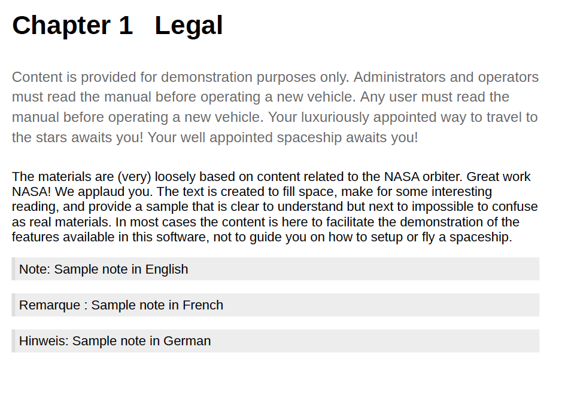
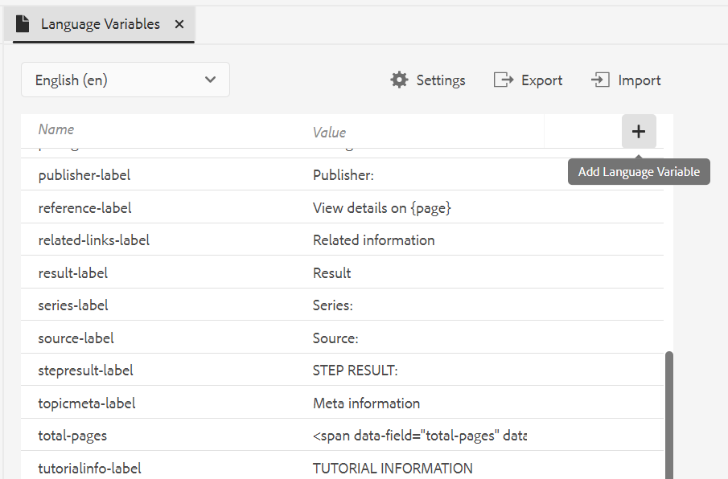
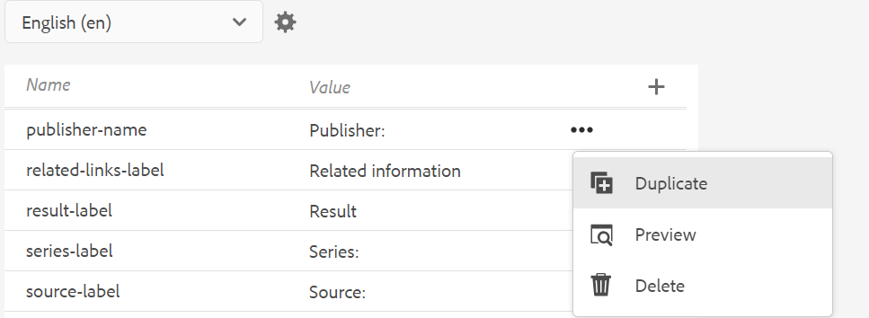
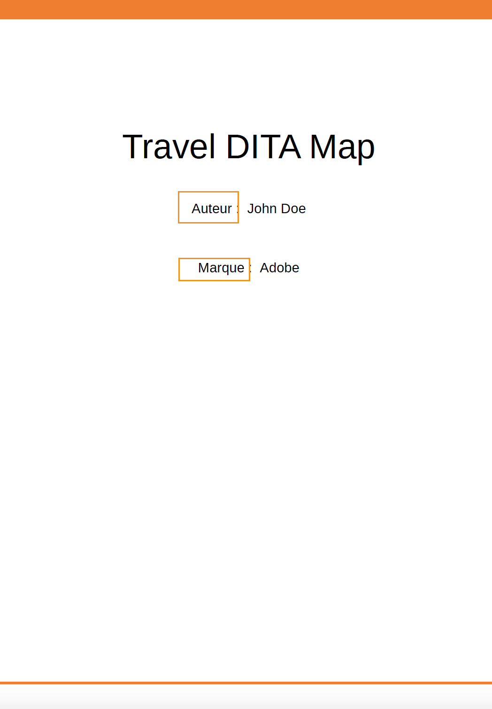
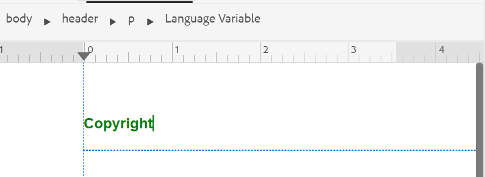
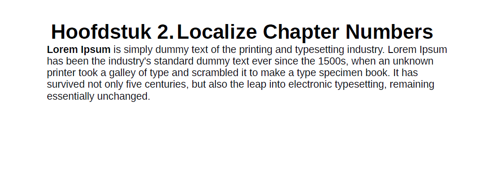
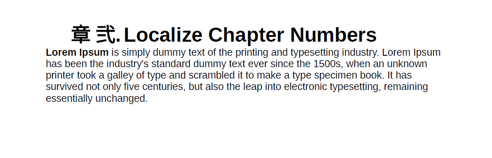

# 支持语言变量

AEM Guides提供了使用语言变量的功能。 您可以使用语言变量在PDF输出中定义本地化字符串，或在输出模板中本地化任何静态文本。 您可以使用CSS样式将来自CSS的字符串本地化。

## 在PDF输出中使用语言变量

您可以使用语言变量来定义开箱即用标签的本地化版本，例如PDF输出中的“注意”、“注意”和“警告”或静态文本。 所有语言的变量名称都相同，但各种语言的值可能不同。 您可以用一种或多种语言更新这些变量的值，然后在PDF输出中自动选取本地化值。

例如，您可以通过以下方式显示标签 `Note` 在PDF输出中：

- 英文：注释

- 法语：雷马克

- 德语：欣威语



*英语、法语和德语样本注释。*

>[!NOTE]
>
> 如果任何变量的值未以特定语言定义，则AEM Guides会从UI（应用程序的用户界面）的语言中选取字符串作为回退机制。
>
> 如果您尚未使用UI的语言定义值，则会查找英语(`en_us`)，否则会选取英语(`en`)值，并在PDF输出中显示相同的值。

## 语言变量的类型

AEM Guides支持两种类型的变量：应用程序和用户变量。

### 应用程序变量

AEM Guides提供了一组预定义的或现成的应用程序变量。 您可以使用这些预定义的变量添加有关特定于AEM Guides的文档的信息。 例如， `chapter-number` 变量如果包含在页面中，则显示页面所属的章节编号。 此 `author-label` 变量显示文档作者的名称。

>[!NOTE]
>
> 您可以覆盖应用程序变量的值。


### 用户变量

您还可以创建新的语言变量。 例如，您可以为文档的发布者标签创建用户变量Publisher。

>[!NOTE]
>
>  您应该具有创建用户变量和编辑应用程序变量的管理权限。



*添加和查看选定语言的语言变量。*

## 添加新语言变量

1. 在Web编辑器中，转到“输出”选项卡。
1. 选择 **语言变量**  在左侧面板中。
1. 选择 **编辑** 以打开 **语言变量** 窗口。 以所选语言显示的应用程序和用户变量按字母顺序列出。 根据所选语言显示值。 例如，如果选择法语，则“提示”将显示为“Conseil”。
1. 从 **语言** 在下拉列表中，选择要编辑变量的所需语言。

   >[!NOTE]
   >
   > 如果您没有查看所需的语言，请从以下位置启用所需的语言： **语言变量设置**. 选择设置   以打开 **语言变量设置** 对话框。

1. 在中输入变量名称 **名称** 列及其值 **值** 列。

   >[!NOTE]
   >
   >您可以将任何HTML内容用作变量值，以特定格式显示变量值。 例如，您可以添加 `<b>` 标记到变量值，以粗体显示Publisher。

1. 选择 **添加语言变量**  将新的语言变量添加到所选语言。 将变量添加到一种语言会自动将其添加到所有语言。 不能创建与现有变量同名的变量。 显示错误。

>[!NOTE]
>
> 如果您不选择 **添加语言变量**，则不会创建变量并将其添加到列表中

## 导出和导入语言变量

Experience Manager指南支持导出和导入以选定语言显示的语言变量。 您可以轻松导出所有语言变量以及定义的值。 这包括应用程序和用户变量。 使用导出的文件在值中进行所需的更改，或将其本地化为其他语言。

您还可以导入包含语言变量的XML文件。 Experience Manager指南仅导入已定义的语言变量，包括应用程序和用户变量。 它不会导入任何尚未定义的变量。

### 导出语言变量

要导出某种语言的语言变量，请从下拉列表中选择该语言，然后选择 **导出** .
它会创建格式为的XML文件 `language_variable_<ln>` 位置 `<ln>` 是所选语言的代码。 例如， `language_variable_en.xml` 英语和 `language_variable_fr.xml` 法文版的。

>[!NOTE]
> 
>如果语言变量中有任何未保存的更改，则无法导出这些更改。 保存更改以查看已启用的 **导出**  图标。

### 导入语言变量

要导入语言变量：

1. 从下拉列表中选择一种语言，然后选择 **导入** 。
2. 浏览并选择包含语言变量的XML。 例如，language_variable_en.xml。
可以以下列格式导入XML文件：

```
<?xml version="1.0" encoding="UTF-8"?>
<variables>    
<variable id="note-important">Important: </variable>    
<variable id="note-caution">Avertir: </variable>    
<variable id="image-with-text">Text and image &lt;img src=&quot;/content/dam/assets/images/image_with_text.png&quot; /&gt; </variable> 
</variables> 
```

导入文件后，将导入具有相同ID的变量。 所选语言中变量的值将与XML文件中的值一起更新。  此时会显示一条关于已更新变量数的消息。

>[!NOTE]
> 
><ul><li>如果文件不是XML文件，或者如果文件包含的格式不正确，且未使用语言变量进行映射，则您将看到一个错误，表明XML文件存在问题。 
&gt;<li>如果文件不包含具有相同ID的变量，您将看到一条警告，指出在导入的文件中未找到匹配的语言变量。

### 语言变量的选项

将鼠标悬停在变量上以查看 **选项** 菜单。



*使用&#x200B;**选项**菜单来删除、预览或复制语言变量。*

您可以预览应用程序和用户变量。 要查看变量值在输出中的显示方式，请选择 **预览** 从 **选项** 选定变量的菜单。
您还可以选择 **删除** 或 **复制** 用户变量。 从一种语言中删除变量会自动将其从所有语言中删除。

### 编辑或还原应用程序变量

您还可以编辑应用程序变量的值。 之后，您可以将应用程序变量还原为原始值。 **还原变量**   对于值已更改的应用程序变量显示。

## 在输出模板中使用语言变量

您应在本地化文档中添加语言变量。 您可以在本地化文档中跨不同页面显示的页面布局中插入这些语言变量。 例如，您可以为添加语言变量 `author-name` 显示在页面布局的页眉区域（或任何其他部分，如页脚或正文）中。





*在为法语生成的PDF输出中本地化的作者和品牌名称。*

插入语言变量，如 `copyright-label` 在标题区域中，执行以下步骤：

1. 打开所需的页面布局进行编辑。

   >[!NOTE]
   >
   > 视图 [自定义页面布局](../native-pdf/components-pdf-template.md#customize-a-page-layout-customize-page-layout) 部分，用于打开页面布局进行自定义或编辑。

1. 选择标题可使其在插入变量时处于活动状态。
1. 选择 **插入变量**   工具栏中。
1. 在 **插入变量** 弹出窗口，选择要插入的语言变量的名称，然后单击 **插入** 以将其插入标题区域。

   >[!NOTE]
   >
   > 您还可以在文本框中输入搜索字符串。 将过滤包含给定字符串的变量名称，并将其显示在列表中。
   > 选定的语言变量将插入标题区域。




*此 `copyright-label` 在标题区域中添加。*

### 将内容样式应用于语言变量

除了分配给语言变量的值之外，您还可以使用HTML标记以特定格式显示变量值。 例如，您可以显示 `publisher-label` 粗体。

- 您还可以使用以下方式设置值的样式格式 <span> 标记之前。 例如，使用page-number语言变量，您可以用英文罗马数字格式显示页码，并指定其他语言的格式。

  英文的值：
  `<span data-field="page-number" data-format="upper-roman">1</span>`

  泰米尔的值：
  `<span data-field="page-number" data-format="tamil">1</span>`

同样，您可以添加语言变量并设置页面布局的插入字段功能中列出的其他字段的格式。 有关添加字段的更多详细信息，请查看 [添加字段和元数据](../native-pdf/design-page-layout.md#add-fields-metadata).

- 您还可以在值中添加本地化的图像。 例如，您可以添加章节编号语言的图像图标，并在PDF输出中获取该图标的本地化图像。

  对于英语，图像的变量值可以是 ``，并且对于德语中的相同变量，它可以是 ``. 所以它根据语言来挑选图像。

## 使用CSS样式本地化字符串

使用CSS样式，您还可以本地化Autonumber中使用的字符串，如Chapter、Section、Figure和Table。 由于这些字符串来自CSS文件，因此无法使用语言变量对其进行本地化。 要将这些字符串本地化，您可以为要将其本地化的每种语言创建CSS样式。
例如，您可以使用以下CSS以各种语言显示章节前缀和相应的数字格式。
例如，您可以使用以下CSS以德语将Chapter显示为Hoofdstuk，并以小数格式显示章节编号。 对于日语，可以使用日语数字格式在目录中显示章节编号。

```
// for English
h1:before {
  counter-increment: h11;
  content: "Chapter " counter(h11, decimal)".";
}

// for German
:root:lang(de) h1:before {
  content: "Hoofdstuk " counter(h11, decimal)".";
}

// for Japanese
:root:lang(ja) h1:before {
  content: "章 " counter(h11, japanese-formal)".";
}
```

以下屏幕截图显示了德语和日语本地化的PDF输出字符串。







### 设置前缀格式

使用CSS样式，您还可以设置前缀的格式。 例如，您可以设置标签格式 `Note` 以红色显示在各种语言的PDF输出中。

```
.note .prefix-content 
{
color: red;
} 
```
