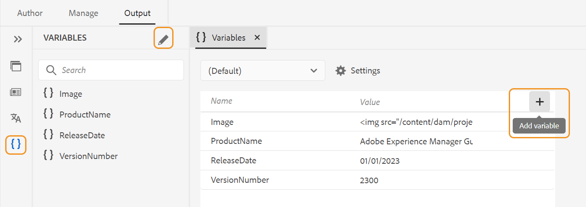
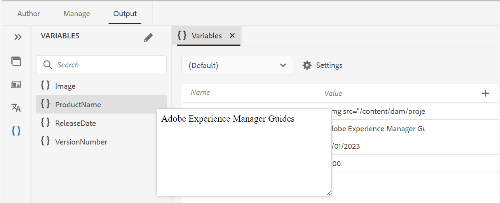
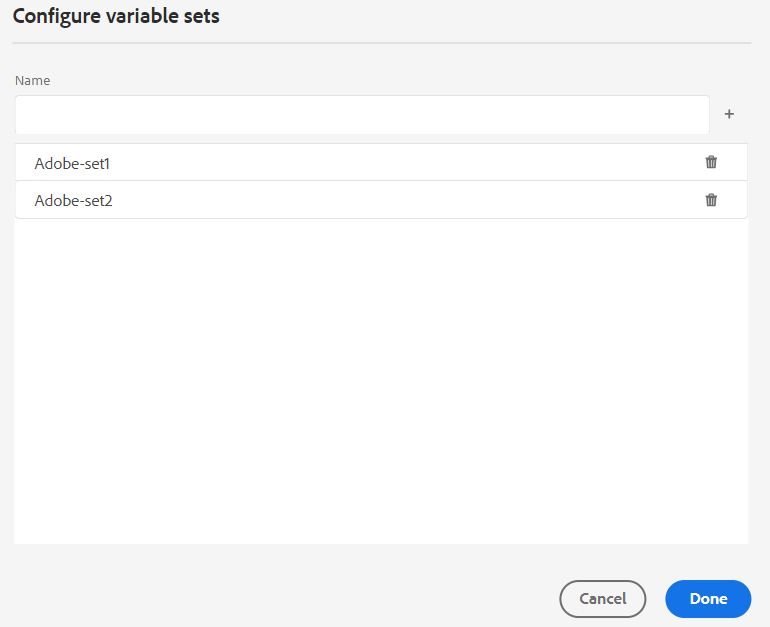
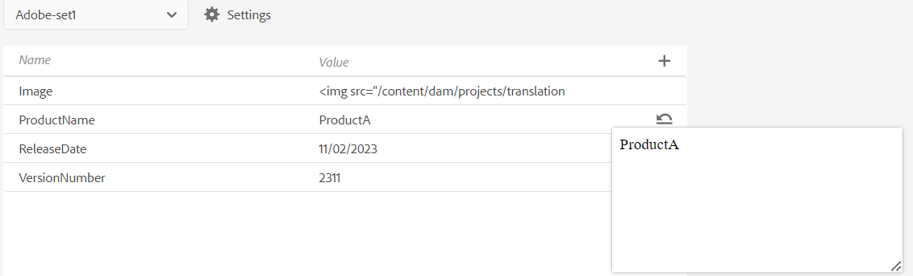
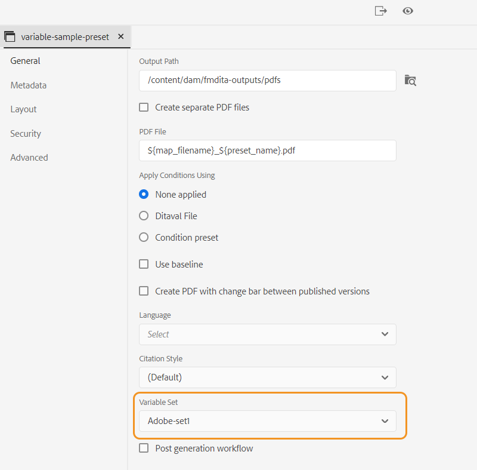
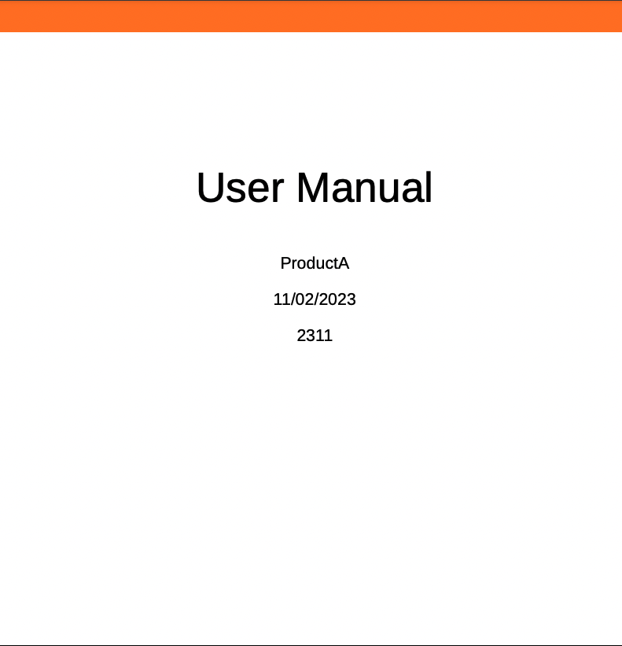

# PDF 输出中的变量

变量是数据的名称-值对，用作可重复使用的信息片段。 这可让您的内容易于更新。 修改变量或其值时，会更新该变量或值的每个发生次数。

## 创建新变量

执行以下步骤可创建变量：

{width="800" align="left"}

*创建变量并为其定义值。*

1. 在Web编辑器中，转到 **输出** 选项卡。
1. 选择 **变量**  在左侧面板中。
1. 选择 **编辑**  以打开 **变量** 编辑者。
变量按字母顺序列出。
1. 在值 **列中输入名称** 列中 **的变量名称及其值** 。
   >[!TIP]
   >
   >您可以将任何HTML内容用作变量值，以特定格式显示变量值。 例如，您可以添加 `<b>` 标记到变量值以显示值 **Experience Manager指南** 粗体。 您还可以将存储库中的图像添加为值。

1. 选择 **添加变量**  以添加新变量。 不能创建与现有变量同名的变量。 显示错误。

   >[!NOTE]
   >
   >如果您不选择 **添加变量** ，则不会创建变量并将其添加到列表中。

这样，您便可以创建具有默认值的变量。 例如：
* ProductName：Experience Manager指南
* 版本号：2300
* 发行日期： 2023年1月1日

### 编辑变量

您可以通过两种方式编辑变量：

**从左侧的“变量”面板**

1. 在中选择一个变量 **变量** 面板。
1. 将鼠标悬停在变量上以查看 **选项** 菜单，然后选择 **编辑** 选项。
1. 在 **编辑变量** 对话框中，可以编辑所选变量的默认值。
1. 单击&#x200B;**完成**。

**从变量编辑器中**

1. 选择 **变量**  在左侧面板中。
1. 选择 **编辑** 打开 &quot;变量 **&quot;** 编辑者。

1. 在 &quot;变量 **&quot;** 编辑者中，您可以编辑所选变量的值。

您需要保存变量 **中所做的** 任何更改，编辑者在左侧的 &quot; **变量** &quot; 面板中视图它们。

>[!NOTE]
>
> 如果您编辑任何变量值，则 Adobe Experience Manager 指南会同时更新任何适用的引用。

### Search 和预览变量

您可以搜索和预览变量的值。 在的搜索框中输入一个字符串 **变量** 面板。 它同时根据变量名称及其值执行搜索。
您可以通过两种方式预览变量：

变量的预览显示默认值。 例如，如果您已将ProductName变量的默认值定义为“Adobe Experience Manager Guides”，则它会在预览中显示此值。

**从左侧的“变量”面板**

1. 在中选择一个变量 **变量** 面板。
1. 将鼠标悬停在变量上以查看 **选项** 菜单，然后选择 **预览** 选项。

{width="550" align="left"}

*预览变量的默认值。*

**从变量编辑器中**

1. 将鼠标悬停在列表中的变量上以查看 **选项** 菜单。
1. 选择 **预览**.

### 复制变量

您可以根据需要重复变量并修改值。

1. 将鼠标悬停在列表中的变量，以视图 **选项** 菜单。
1. 选择 **复制** 。

变量的默认名称为 `<selected variable name>` （如“sample”）。 您可以根据自己的要求更改名称。

### 删除变量

您可以通过两种方式删除变量：

**从左侧的“变量”面板**

1. 在中选择一个变量 **变量** 面板。
1. 将鼠标悬停在变量上以查看 **选项** 菜单，然后选择 **删除** 选项。

**从变量编辑器中**

1. 将鼠标悬停在列表中的变量上以查看 **选项** 菜单。
1. 选择 **删除** 选项。

将从所有变量集中删除该变量。

## 输出预设的变量集

Adobe Experience Manager 指南还支持变量集，可让您为变量分配替换值。 例如，公司可以销售两种产品： A 和 B。它具有不同的规格。 这些规范可能包括产品名称、版本号和发行日期。 品牌推广可能存在其他差异。 使用变量集，您可以为变量定义不同的值集。 生成输出时，选择相应的变量集并生成所需的输出。

### 配置变量集

在将任何变量添加到变量集之前，需要配置变量集。

1. 选择 **设置**  以打开 **配置变量集** 对话框。
   {width="550" align="left"}
1. 在中输入变量集名称 **名称** 列。
1. 选择 **添加变量**  以添加新变量集。 变量集按字母顺序列出。
1. 您可以选择 **删除** 以删除变量集。

### 变量集操作

所有变量集都具有相同的变量，但可以具有不同的值。

您可以查看、编辑和预览特定变量集的值。 从中选择一个变量集 **变量集** 下拉菜单。 根据所选变量集显示值。
编辑特定变量集中的变量值时，它会覆盖默认值并更改所选变量集的值。
例如，您可以为变量集设置以下值， *Adobe集1* 和 *Adobe集2* .

**变量集1**： *Adobe集1*

* ProductName： ProductA
* 版本号：2311
* 发行日期： 2023年11月2日

**变量集2**： *Adobe集2*

* ProductName： ProductB
* 版本号：2310
* 发行日期： 2023年9月7日

每个新变量都会添加到所有变量集中。 当您删除或复制变量时，将会为所有变量集更新该变量。

您还可以预览变量集的值。
例如，对于变量集 *Adobe集1*，您已将ProductName变量的值定义为“ProductA”，然后它会在变量编辑器的预览中显示此值。

{width="550" align="left"}

*预览您在所选变量集中定义的值。*

### 重置变量的值

如果编辑了该值，则还可以将变量重置为默认值。
重置  对于值已更改的变量显示。
例如，您可以将ProductName变量的值重置为默认值Experience Manager Guides。

## 在本机PDF模板中使用变量

您可以在生成产品文档输出时添加变量，以使它们可移植且易于更新。 您可以在文档的不同页面中显示的页面布局中插入这些变量。 例如，您可以添加变量ProductName ，该变量显示在页面布局的页眉区域（或任何其他部分，如页脚或正文）中。

要在标题区域中插入诸如ProductName之类的变量，请执行以下步骤：
1. 打开所需的页面布局进行编辑。

   >[!NOTE]
   >
   > 视图 [自定义页面布局](../native-pdf/components-pdf-template.md#customize-a-page-layout-customize-page-layout) 部分，用于打开页面布局进行自定义或编辑。

1. 选择标题可使其在插入变量时处于活动状态。

1. 您可以通过以下两种方式插入变量：

   **从左侧的 &quot;变量&quot; 面板中**

   * 将变量从 &quot; **变量** &quot; 面板拖放到标题区域。

   **从工具栏**

   1. 选择 **插入变量/字段** 。
   1. 在 **变量** 对话框中，选择变量的名称以将其插入到标题区域。
   1. 您还可以在文本框中输入搜索字符串。 将过滤包含给定字符串的变量名称，并将其显示在列表中。 选定的变量将插入标题区域。 您可以查看变量的默认值。
   1. 要替换变量，请双击变量值，然后从中选择另一个变量 **变量** 对话框。 变量会被替换。

## 使用变量生成PDF输出

可以使用其他PDF的值生成变量输出。 在生成布局之前，请从输出预设中选择一个变量集 **变量集** 下拉列表以选取其值。

{width="550" align="left"}

*从要用于生成 PDF 输出的输出预设的下拉列表中选择一个变量集。*

>[!NOTE]
>
> 您也可以从下拉列表中选择（默认），以发布所有变量的默认值。

根据您选择的变量集，您将获得与变量集中定义的变量值对应的输出。 例如，如果您选择变量集 *Adobe集1*，则输出将显示该集中定义的变量值。

*使用页面布局中的变量生成PDF输出。*

您还可以在需要时快速更新任何变量集的值并重新生成输出。 例如，如果需要更新版本的详细信息，可以在VersionNumber变量中更新版本的值并重新生成输出。

