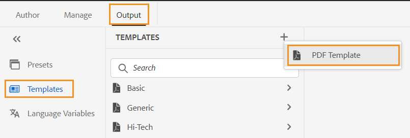
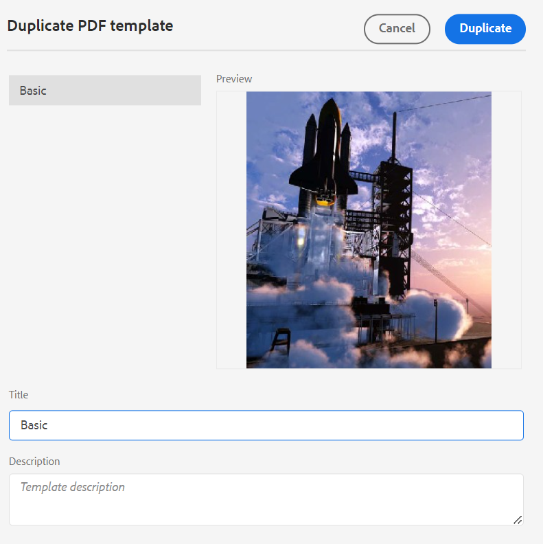
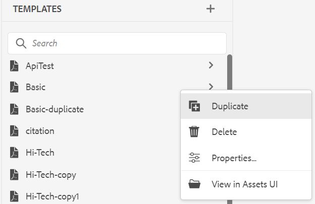
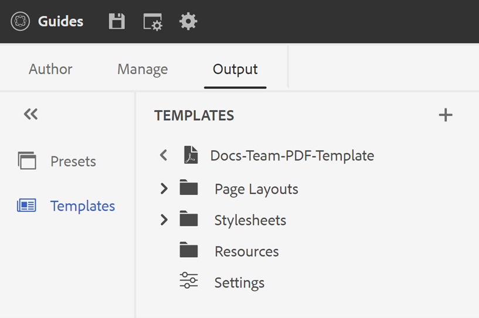

# PDF模板 {#PDF-template}

使用模板可确保内容布局和结构的一致性。 由于模板是预定义模板，您可以避免重新处理每个新项目或更新出现的格式问题。 使用模板，您可以设计页面布局、设置内容样式并应用各种设置来自定义PDF。

## 工厂和自定义PDF模板

提供了一些现成的示例工厂模板，开发人员可以将这些模板用作基本模板，以根据组织要求创建自定义模板。

## 创建新的PDF模板 {#create-pdf-template}

您可以使用样式表创建具有特定页面布局的自定义PDF模板，并为页面布局组件（如TOC、索引、术语表）或DITA组件（如标题、段落、列表）定义格式。

要创建新的PDF模板，请执行以下步骤：

1. 在Web编辑器中，转到 **输出** 选项卡。
1. 选择 **模板**  在左侧面板中。

   

1. 在 **模板** 窗口中，选择 **+** 图标旁边 **模板** 并选择 **PDF模板**.
1. 在 **新建PDF模板** 对话框，选择要用作创建自定义模板的基础的工厂模板。 您还可以使用搜索框搜索模板。
1. 指定模板的标题。

   >[!NOTE]
   >
   >  您还可以在创建和复制模板时预览模板的缩略图。 编辑或删除缩略图，使用 [**属性**](#properties-option) 在 **选项** 菜单。

1. 单击&#x200B;**创建**。

   新模板随即创建并添加到中 **模板** 面板。

## 复制PDF模板 {#duplicate-pdf-template}

如果要创建与现有模板具有相同页面布局和格式的新模板，可以创建副本。 复制模板后，您可以根据需要进一步自定义其组件。

要复制现有PDF模板，请执行以下步骤：

1. 在Web编辑器中，转到 **输出** 选项卡。
1. 选择 **模板**  在左侧面板中。 这将打开 **模板** 窗口。
1. 将鼠标悬停在要复制的模板上，然后选择 **...** *选项* 图标并选择 **复制** 从上下文菜单中。

   这将打开 **复制PDF模板** 对话框。

   

   *选择要复制的模板、预览缩略图并更新中的标题&#x200B;**复制PDF模板**对话框。*

1. 指定模板的标题。

   此 **标题** 字段预填充为与源模板相同的标题的副本。 如果存在具有相同标题的模板，您将查看错误消息。

1. 要指定首选标题，请删除预填充的标题并指定标题。
1. 单击 **复制**.

   复制模板随即创建并添加到下 **模板**.

## 对模板的其他操作

您还可以从以下位置对模板执行以下操作 **选项** 菜单：

### 删除

选择删除选项可删除所选模板。 然后，在确认提示中选择是。
预设将从 **模板**.

### 属性{#properties-option}

选择此选项可查看和编辑模板的属性。 您可以预览模板的现有缩略图。 您还可以编辑或删除缩略图。 您还可以更改模板的标题和描述。

### 在Assets UI中查看

选择此选项可在Assets UI中查看模板。 在打开模板的根位置时，您可以查看模板的所有资源。

创建自定义模板后，您可以从PDF输出预设的“页面布局”中选择它。

了解如何 [发布PDF输出](https://experienceleague.adobe.com/docs/experience-manager-guides-learn/tutorials/user-guide/output-gen/web-editor/native-pdf-web-editor.html?lang=en).

>[!NOTE]
>
>如果您的文件夹配置了文件夹配置文件，则您将仅查看在文件夹配置文件中配置的PDF模板。

根据您的设置，管理员可以配置模板：

+++ Cloud Service

有关设置全局和文件夹级别配置文件的详细信息，请查看 [配置模板](../cs-install-guide/conf-folder-level.md#id1889D0IL0Y4) 部分(适用于Cloud Service的安装和配置指南)。

+++

+++ 内部部署软件

有关设置全局和文件夹级别配置文件的详细信息，请查看 [配置创作模板](../install-guide/conf-folder-level.md#create-custom-authoring-template-id1917d0eg0hj) 本地安装和配置指南中的部分。

+++

## 自定义PDF模板 {#customize-pdf-template}

可通过调整模板组件并使用样式表应用样式格式来自定义模板。

要自定义PDF模板，请执行以下步骤：

1. 在Web编辑器中，转到 **输出** 选项卡。
1. 展开左侧边栏并选择 **模板**.

   这将打开 **模板** 面板。

1. 要查看模板的组件，请执行下列操作之一：

   * 选择模板旁边的>图标或双击模板名称。
   * 将鼠标悬停在任意模板上并选择…… (**选项** 图标)并选择 **编辑** 从上下文菜单中。

   默认情况下，这将打开 **设置** 模板编辑器中的面板。

   

   >[!NOTE]
   >
   >  您的管理员可以从以下路径下载最新的模板并替换现有模板：
   >
   > `/libs/fmdita/pdf`

   您可以自定义的各种模板组件在以下部分中分类：

   * 页面布局：典型PDF包含不同的页面，例如封面或标题页面、目录、章节、索引、引文等。 利用“页面布局”部分，可设计构成PDF的各个页面的外观。 有关详细信息，请查看 [页面布局](../native-pdf/components-pdf-template.md#page-layouts).

     除了外观之外，您还可以定义页面元素（如页眉、页脚和页面上的内容区域）的排列。 要了解有关自定义页面布局的更多信息，请参阅 [创建和自定义页面布局](components-pdf-template.md#create-customize-page-layout).

   * 样式表：“样式表”部分中的设置允许您自定义页面布局组件（如目录、索引、术语表、引文等）的外观。 此外，您还可以自定义DITA内容的样式，如标题、段落、列表等。 要了解有关使用样式表的更多信息，请参阅 [使用样式表自定义PDF](components-pdf-template.md#stylesheet-customization).
   * 资源：存储自定义或设计PDF模板所需的资源文件。 徽标、自定义字体、背景图像等资产存储在资源中。
您还可以使用存储库中任何其他位置的资源。 您无需为每个模板创建重复资源，可以将这些资源保存在共享文件夹中，并在所有本机PDF模板中使用它们。

     要了解有关利用资源的更多信息，请参阅 [使用资源](components-pdf-template.md#work-with-resources).

   * 设置：配置用于使用模板生成PDF的输出设置。 通过此部分，您可以为PDF中的各种页面、章节开始页面、打印标记、引文等定义模板映射。

   您还可以按照它们在最终PDF输出中的显示顺序进行排列。
有关应用设置的详细信息，请参阅 [高级PDF设置](components-pdf-template.md#advanced-pdf-settings).

1. 要自定义模板组件，请双击模板组件或选择它之前的>图标。

   例如，双击 *页面布局* 或选择 *>* 图标在前 *页面布局* 以查看可用的页面布局。

   >[!NOTE]
   >
   >您还可以使用更新模板的缩略图和描述 [**属性**](#properties-option) 在 **选项** 菜单。

1. 进行所需的更改后，选择 *全部保存* (或 `Ctrl+S`)。
