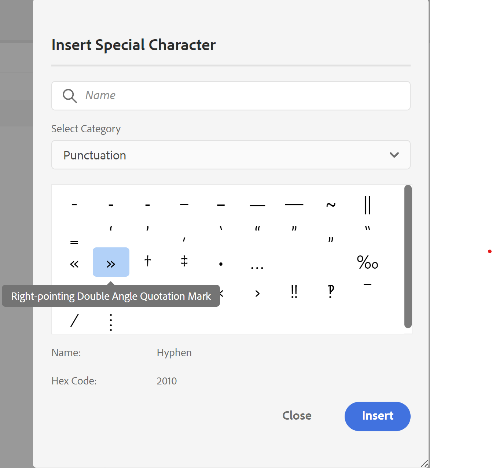
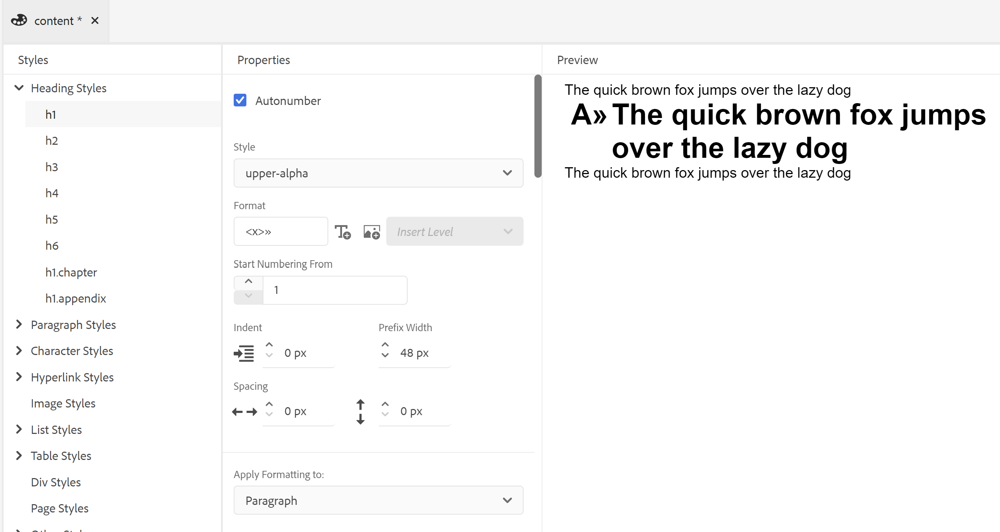
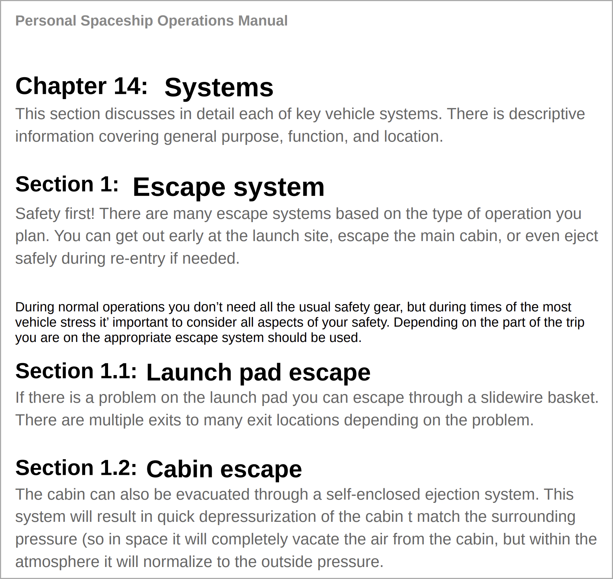
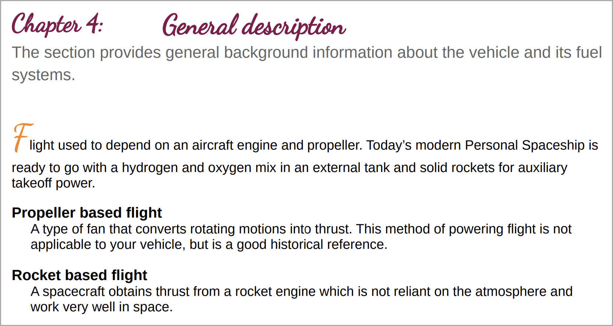
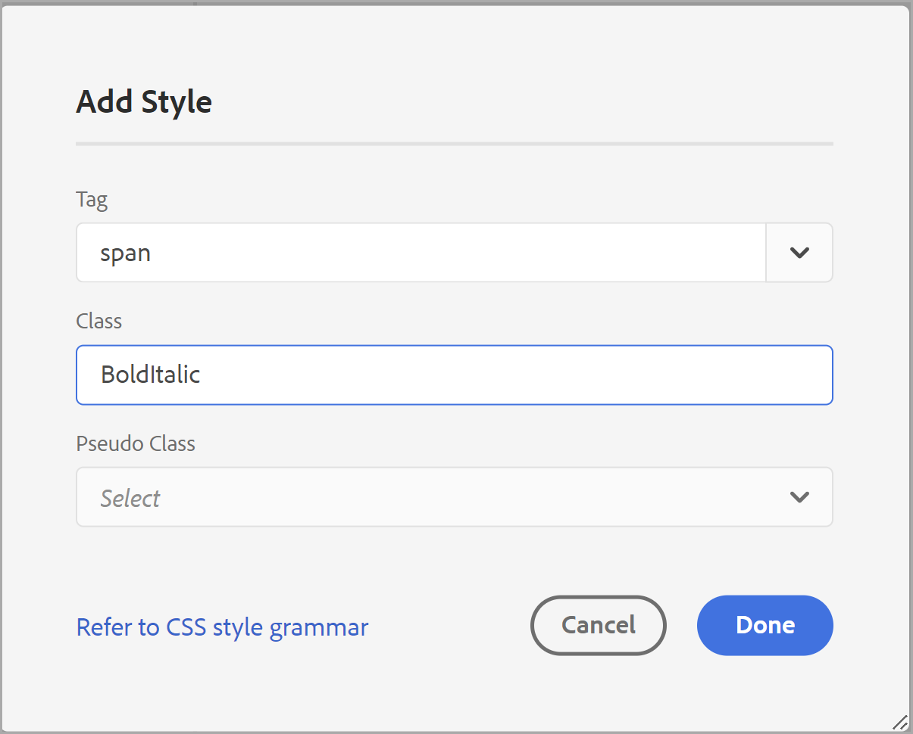
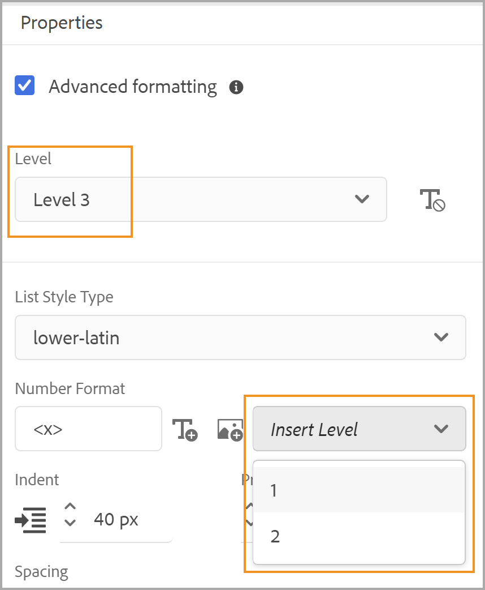
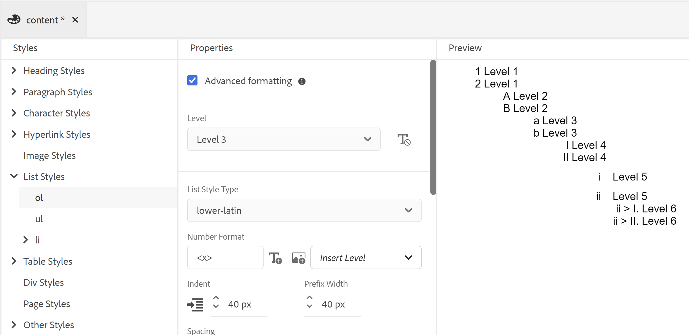
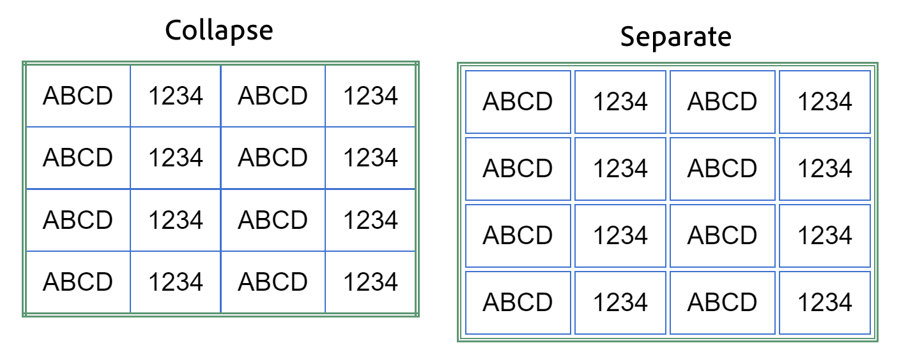
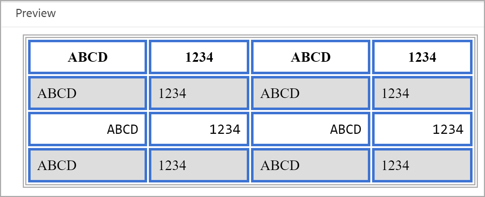
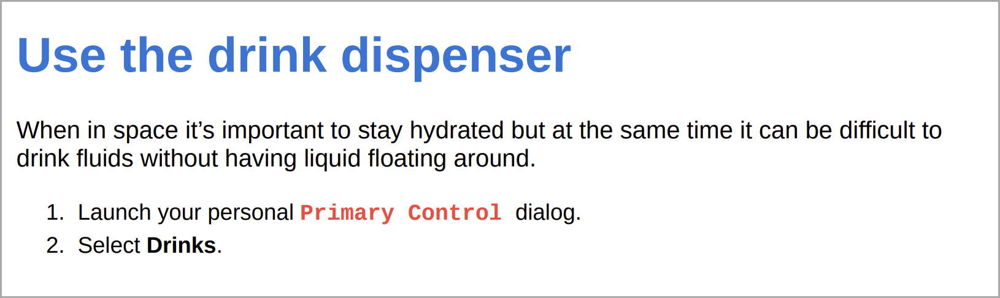

# 使用常见的内容样式 {#work-with-common-styles}

样式表包含PDF输出中所用元素的样式定义。 您可以选择使用示例样式表或创建新样式表。 在大多数情况下，创建OOTB示例样式表的副本将帮助您快速入门。

样式编辑器是一个WYSIWYG编辑器，它隐藏用户界面后面的CSS代码的所有复杂内容。 使用样式编辑器，您可以轻松、快速地为您选择的元素自定义样式。 这些样式按以下标题进行分类：

* 标题样式
* 段落样式
* 字符样式
* 超链接样式
* 图像样式
* 列表样式
* 表格样式
* Div样式
* 页面样式
* 其他样式

处理结构化DITA内容时，大多数DITA元素的样式映射在默认样式表中就位。 如果使用标准DITA元素，则可通过直接在样式定义中进行更改来更改其外观。 这些样式定义位于“其他样式”类别下。 有关更多详细信息，请参阅 [使用其他样式](#other-styles) 本主题后面的部分。

以下部分以示例形式介绍了最常用的样式设置。

>[!NOTE]
>
>在以下示例中，假定您使用的是产品附带的示例样式表。

## 使用标题样式 {#heading-styles}

标题样式封装了内容中所用标题的所有基本样式。 OOTB您将获得6种基本标题样式以及主题/章节和附录标题的标题样式。 在结构化文档中，H1表示主题或章节的标题，H2到H6用于主题/章节中的子主题或章节。 每当找到相应的标题时，此标题层次结构就会自动应用于您的内容。

>[!NOTE]
>
>您可以创建自己的自定义标题样式，这些样式可以使用outputclass在内容中使用。 有关更多详细信息，请参阅中的步骤4 [使用页面方向和视图旋转](design-page-layout.md#page-orientation-rotation) 示例。

### 创建自定义章节级别标题 {#create-chapter-level-heading}

在书籍（或书图）中，您可以使用“章节”。 基本标题样式的设计方式使其无需任何自定义即可应用于章节级别的标题。 但是，如果您要为内容创建专门的标题，则必须创建这些标题。 例如，缺省值 `h1.chapter` 标题将应用于章节的标题。 如果您希望章节标题以不同的样式显示，则需要自定义 `h1.chapter` 样式。 同样，您可以为章节中的子标题创建自定义样式。 例如，如果要为所有2创建自定义样式nd 和3第三 章节中的标题级别，则需要创建新样式作为 `h2.chatper` 和 `h3.chatper`.

由于“本机PDF发布”功能包含最常用样式的基本样式定义，因此即使意外删除了样式，也会对内容应用默认样式。 例如，如果您的样式表中没有h2样式的样式定义，则“本机PDF发布”功能将对h2内容应用一些基本样式。

在本例中，我们将创建二级章节标题样式：

1. 打开所需的样式表进行编辑。
   >[!NOTE]
   >
   >请参阅 [自定义预定义样式或新样式](components-pdf-template.md#customize-style) 用于打开样式表进行自定义或编辑的部分。

1. 在 **样式** 列表，展开 **标题样式**.
1. 右键单击 **标题样式** 样式和选择 **新样式**.
1. 在 *添加样式* 对话框，保留 **标记** 命名为 `h2` 并输入 `chapter` 在 **类** 名称字段。
1. 单击&#x200B;**完成**。

名为的新标题样式 `h2.chapter` 创建并添加到“标题样式”列表中。

创建样式后，可以使用样式编辑器自定义样式的所需属性。

### 创建自动编号标题 {#auto-number-heading}

最常用的输出样式之一是自动编号标题。 这些标题表示章节编号、主题和子主题编号。 自动编号标题与为主题中的项列表分配自动编号的列表样式不同。

在本例中，我们将自定义从级别1到级别3的标题，以使用不同格式的自动编号。

1. 打开所需的样式表进行编辑。

   >[!NOTE]
   >
   >请参阅 [自定义预定义样式或新样式](components-pdf-template.md#customize-style) 用于打开样式表进行自定义或编辑的部分。

1. 在 **样式** 列表，展开 **标题样式**.

1. 选择 **h1** 从列表中选取样式。
h1样式的属性与其“预览”一起显示在“属性”面板中。

   >[!NOTE]
   >
   >“预览”面板为您提供了对任何元素应用的任何样式更新的实时视图。

1. 选择 **自动编号** 属性。

   您可以在自动编号列表中应用的样式显示在Autonumber属性下方。

1. 设置以下属性：
   * **样式**：从多种区域设置特定的或通用的编号样式中进行选择。 您可以选择阿拉伯文 — 印度文、梵文、格鲁吉亚文、小数、小Alpha等样式。 对于当前示例，选择 `upper-alpha`.

   * **格式**：默认格式设置为 `<x>`，其中 `x` 值将替换为您在Style属性中选择的编号Style。 例如，如果您选择了 `decimal` (1) style，则其值 `x` 自动递增的每个实例 `h1` 样式设置为2、3，以此类推。 您还可以在字段中添加自定义文本以设置标题样式的格式。 例如，如果您希望所有h1标题的前缀均为 `Chapter`，则需要将此字段设置为 `Chapter <x>`.

   * **插入字符**：如果要在格式中添加任何特殊字符，请单击插入字符()图标。 选择要添加到样式格式的所需字符，然后单击“插入”。 您可以从选择类别下拉列表中选择不同类型的特殊字符。 在本例中，从“标点”类别中选择右指双角引号。

     

   * **起始编号**：如果您希望编号从特定编号开始，请提供该值。 例如，保留默认值1。

   * **缩进**：如果要缩进标题，则需要设置“缩进”值。 对于我们的示例，请将其设置为0像素。

     >[!NOTE]
     >
     >可以按像素(px)、点(pt)、rem、em、百分比(percentage)或英寸(inches)单位输入值。

   * **前缀宽度**：这是自动编号格式所占用的区域。 它会自动设置为可以轻松适应所选样式格式的大小。 如果要增加大小，则可以替换默认值。

     手动设置此值时，请尝试更改将影响宽度的其他属性。 例如，更改字体大小、带前缀(Chapter)或后缀(：)的格式，在 *起始编号* 属性，以及各种字体属性以得出最佳大小。

     例如，保留默认值。

   * **间距**：指定水平和垂直间距。 例如，保留默认值。

     通过上述自定义设置，可自定义样式，如下所示：

     

   * **将格式应用于**：自动编号类别下的属性将帮助您定义编号样式。 要对标题格式的编号样式或内容应用进一步的自定义设置，可以在此字段中选择“编号”或“段落”。 如果选择“编号”，则对“字体”、“边框”、“布局”和其他类别所做的任何更改将仅应用于标题中的编号样式。 但是，如果选择“段落”，则更改将应用于标题内容而非编号样式。

   使用以下设置生成如下屏幕快照所示的输出：

   | **标题样式** | **属性** | **值** | **其他注释** |
   | :- | :- | :- | :- |
   | h1 | 样式 | 十进制 | 这些属性位于“自动编号”类别下 |
   |  | 格式 | `Capter <x>:` |  |
   |  | 前缀宽度 | 160像素 |  |
   |  | 字体>文本对齐方式 | 左 | 确保将“应用格式至”设置为编号 |
   | h2 | 样式 | 十进制 | 这些属性位于“自动编号”类别下 |
   |  | 格式 | `Section <x>:` |  |
   |  | 前缀宽度 | 125像素 |  |
   |  | 字体>文本对齐方式 | 左 | 确保将“应用格式至”设置为编号 |
   | h3 | 样式 | 十进制 | 这些属性位于“自动编号”类别下 |
   |  | 插入级别 | 2 |  |
   |  | 格式 | `Section <2>.<x>:` |  |
   |  | 前缀宽度 | 125像素 |  |
   |  | 字体>文本对齐方式 | 左 | 确保将“应用格式至”设置为编号 |
   |  |

   

## 使用段落样式 {#paragraph-style}

可以创建段落样式，对整个段落应用特殊格式。 但是，使用伪类可以只将样式应用于文本的特定部分。 在以下示例中，我们将创建一个段落样式以使用首字下沉样式。

### 创建首字下沉样式 {#drop-cap-style}

一种首字下沉样式（或称首字下沉样式）用于杂志和文学文献中，其中段落或节的第一个字符被赋予某种特殊样式。 使用“本机PDF发布”功能可以实现相同的效果。

在以下示例中，我们将创建一个首字下沉样式：

1. 打开所需的样式表进行编辑。

   >[!NOTE]
   >
   请参阅 [自定义预定义样式或新样式](components-pdf-template.md#customize-style) 用于打开样式表进行自定义或编辑的部分。

1. 在 **样式** 列表，展开 **段落样式**.

1. 右键单击 **段落样式** 并选择 **新样式**.

1. 在 *添加样式* 对话框，保留 **标记** 名称是p，在 **伪** **类** 字段，选择 `::first-letter`.

1. 单击&#x200B;**完成**。

   名为的新段落样式 `::first-letter`  创建并添加在 **段落样式** 列表。

1. 选择 `::first-letter` 在p样式下，设置以下属性：

   * **字体**：为段落中的第一个字母设置所需的字体。 例如，将“字体系列”设置为草稿，将字体粗细设置为500，将字体大小设置为30 pt，然后选择字体颜色。

   * **布局**：设置首字下沉样式周围文本的垂直对齐方式。 在本例中，我们将将“垂直对齐”设置为“底部”。

作为 `p` 标记与 `
` 元素，则无需使用outputclass属性显式添加此样式。 无论内容在什么位置 `
` 元素上会自动应用首字下沉样式。 在下面的屏幕截图中，章节标题、简短描述和定义列表元素未使用首字放大样式进行格式设置。 只有段落样式使用首字下沉样式进行格式设置：

## 使用字符样式 {#char-style}

使用字符样式，可以创建用于设置内容中字符或单词格式的样式。 例如，您可以为内联代码或文件名创建字符样式，也可以创建对选定内容使用多种样式格式的样式。

### 创建内联字符样式 {#inline-char-style}

设置段落中的内联字符或单词格式是一种非常常见的样式。 创建内联样式的过程涉及两个任务 — 第一，在样式表中创建新样式，第二，使用在内容中应用样式 `outputclass` 属性。

在以下示例中，我们将创建内联字符样式：

1. 打开所需的样式表进行编辑。

   >[!NOTE]
   >
   请参阅 [自定义预定义样式或新样式](components-pdf-template.md#customize-style) 用于打开样式表进行自定义或编辑的部分。

1. 在 **样式** 列表，展开 **字符样式**.

1. 右键单击 **字符样式** 并选择 **新样式**.

1. 在“添加样式”对话框中，保留 **标记** 命名为span并输入 `BoldItalic` 在 **类** 名称字段。

   

1. 单击&#x200B;**完成**。

   将在“字符样式”列表下创建并添加一个名为code的新字符样式。

1. 选择 `span.BoldItalic` 从 **字符样式** 列表，并设置以下属性：

   * **字体**：所有与字体相关的属性都可以从此部分进行自定义。 默认情况下，有一些字体与产品捆绑在一起。 可以为字符样式选择所需的字体。 例如，将“字体系列”设置为 *塞里夫，* 并选择 *粗体* 和 *斜体* 在“字体样式”属性中。 您还可以自定义其他字体属性，如字体粗细（如粗体、较浅）、文本修饰（如下划线、上划线）、字体大小、字体颜色、文本对齐方式等。

     >[!NOTE]
     >
     您还可以向模板中添加字体，这些字体存储在模板的“资源”部分中。 有关添加字体和使用“资源”的更多详细信息，请参阅 [使用资源](components-pdf-template.md#work-with-resources).

   * **布局**：可设置与布局相关的属性，如高度和宽度、边距、边距、对齐方式等。

   * **背景**：利用“背景”属性，可设置特定样式的背景颜色格式。 您可以为任何样式定义背景颜色或图像。

创建内联字符样式后，需要将其应用于内容。 要应用内联代码样式，请转到源视图并添加 `outputclass` 属性：

`outputclass="BoldItalic"`

以下示例显示了在运行文本的不同位置应用的粗斜体格式：

## 自定义列表样式 {#custom-list-style}

列表样式包含已排序和未排序列表的缺省样式设置。 您可以轻松自定义这些列表样式以满足文档要求。

在以下示例中，我们将自定义编号或排序列表样式：

1. 打开所需的样式表进行编辑。

   >[!NOTE]
   >
   请参阅 [自定义预定义样式或新样式](components-pdf-template.md#customize-style) 用于打开样式表进行自定义或编辑的部分。

1. 在 **样式** 列表，展开 **列表样式**.

1. 选择 **ol** 从列表中选取样式。

   早期样式的属性与其“预览”一起显示在“属性”面板中。

   

1. 选择 **高级格式化** 选项。

   此时将显示“确认”消息。

1. 单击 **是** 在 *确认* 消息以打开 **高级格式化** 属性。

   默认情况下，以下属性可用：

   * **级别**：默认情况下，编号列表有6个级别。 在此下拉列表中选择的级别控制选定级别和所有后续级别的样式更改。 例如，如果您选择级别4，则应用的所有样式更改都会在级别4、5和6上设置。

   * **列表样式类型**：有许多列表编号样式可供您选择。 该列表包含用于创建编号列表的特定于区域设置和通用编号样式。 清单上的样式类型包括阿拉伯文、柬埔寨文、梵文、埃塞俄比亚文、朝鲜文、希伯来文、日文、韩文、简体中文、乌尔都文等。

   此外，您还可以使用以下高级格式属性：

   * **数字格式**：默认格式设置为 `<x>`，其中 `x` 值将替换为您在“列表样式类型”属性中选择的编号“样式”。 例如，如果您选择了 `decimal` (1) style，则其值 `x` 对于列表元素的每个实例，自动递增，分别显示为2、3，依此类推。 您还可以在字段中添加自定义文本以设置列表样式的格式。 例如，如果您希望所有第一级列表样式都有一个后缀&#39;&#39;&#39;`)`“，则需要将第一级列表样式的此字段设置为”`<x>)`“。

   * **插入字符**：如果要在数字格式中添加任何特殊字符，请单击插入字符()图标。 选择要添加到样式格式的所需字符，然后单击“插入”。 您可以从选择类别下拉列表中选择不同类型的特殊字符。

   * **插入级别**：您可以采用数字格式包含前面任何级别的数字。 例如，如果要在第6级数字格式中包含第5级的数字格式，请在“插入级别”下拉列表中选择5。 请注意，“插入级别”下拉列表只显示前面的级别，而不显示后面的级别。 例如，当处于级别3时，“插入级别”列表将只显示级别1和级别2。

     

     您还可以根据需要更改数字格式以显示列表值。 例如，当使用级别3的嵌套编号样式时，可以将其格式化为&#39;&#39;`<2>.<x>))`“。 该图显示列表编号2，后跟一个句点，然后是列表编号3，最后是两个方括号，如 `2.3))`.

   * **缩进**：如果要缩进列表，则需要设置“缩进”值。 可以在“预览”面板中查看缩进中的任何更改并进行调整。

     >[!NOTE]
     >
     可以按像素(px)、点(pt)、rem、em、百分比(percentage)或英寸(inches)单位输入值。

   * **前缀宽度**：这是数字格式占用的区域。 它会自动设置为可以轻松容纳所选格式的大小。 如果要增加大小，则可以替换默认值。

     手动设置此值时，请尝试更改将影响宽度的其他属性。 例如，更改字体大小、带前缀或后缀的格式以及各种字体属性，以获得最佳大小。

   * **间距**：指定列表编号格式与内容之间的水平间距。 垂直间距控制两个列表项之间的间距。

     以下屏幕截图显示了每个级别的自定义排序列表：

     

## 使用表格样式 {#table-styles}

使用样式表，您可以设计 *n* 表格样式的数量。 使用表格样式，可以设计整个表格（特定行或列）的方式。 在单元格级样式中使用控件，可以创建非常可呈现的表样式。

在以下示例中，我们了解如何创建表格样式以及可自定义的各种表格样式选项：

1. 打开所需的样式表进行编辑。

   >[!NOTE]
   >
   请参阅 [自定义预定义样式或新样式](components-pdf-template.md#customize-style) 用于打开样式表进行自定义或编辑的部分。

1. 在 **样式** 列表，右键单击 **表格样式** 并选择 **新样式**.

1. 在 *添加样式* 对话框，保留 **标记** 命名为 `table` 并输入 `double-border` 在 **类** 名称字段。

1. 单击&#x200B;**完成**。

   名为的新表样式 `table.double-border` 创建并添加到“表格样式”列表下。

1. 选择 `table.double-border` 从 **表格样式** 列表，并设置以下属性：

   * **将格式应用于**：您可以选择将样式格式应用于整个表、奇数/偶数行或列，或者第一个/最后一个行或列。

     >[!NOTE]
     >
     以下设置位于 **常规** 部分条件 **将格式应用于** 设置为 **整个表**.

   * **文本换行**：选择如何在表周围环绕文本。 当表位于另一个块级别元素内，并且必须将该表与块元素中的其他内容一起呈现时，这将很有用。 包装选项为 *左侧* 或 *右* 已对齐，或 *无*.

   * **边框折叠**：选择表边框的外观。 如果选择折叠，则只会在表单元格之间绘制一条边框线。 但是，对于单独的样式，边框显示在每个单元格周围，带有其他边距。

     

   * **边框间距**：仅当“边框折叠”设置为“分隔”时，此设置才可用。 使用此设置，可以指定单元格边框之间的垂直间距和水平间距。

     

     >[!NOTE]
     >
     以下设置位于 **单元格** 部分条件 **将格式应用于** 设置为 **整个表**.

   * **内边距**：指定表单元格之间的边距。 可以为顶端、底端、左侧和右侧指定不同的填充值。

   * **垂直对齐**：指定单元格内容的垂直对齐方式。 可用选项包括：“顶部”、“中间”和“底部”。

   * **边框侧、样式、颜色、宽度、半径：** 指定与边框相关的属性。 您可以选择仅在特定侧边上有边框，如左边或右边。 “边框样式”会列出可用的边框样式，如“实线”、“虚线”、“双线”等。 使用调色板指定边框颜色。 您可以指定边框宽度（像素、pt、rem、em、%和单位）。 “半径”定义曲线以生成圆角。

   本主题的其他示例中解释了“字体”、“边框”、“布局”、“分页”和“背景”下的其他属性。 根据您在 **将格式应用于** 属性，则可以将这些值应用到整个表或选定的行或列。

   下面显示了采用不同格式化的不同行的示例表的预览：

   

## 使用其他样式 {#other-styles}

如果您使用结构化(DITA)内容，那么您会注意到，几乎所有的DITA元素在默认样式表中都有一个样式映射。 例如， `<shortdesc>` 元素的样式定义于 **其他样式** > **.shortdesc** 样式定义。 您可以轻松自定义任意这些样式，它们会自动应用于从结构化PDF生成的Content输出中。 这意味着，与其他自定义样式不同，您无需添加 `outputclass` 这些样式内容的属性。

如果想要为默认情况下不可用的任何元素创建样式定义，或者您具有自定义元素，则可以在样式表中轻松创建它。 必须考虑的唯一一点是，创建与结构化元素名称同名的样式。

在以下示例中，我们将创建一个新窗口的标题(`wintitle`)样式：

1. 打开所需的样式表进行编辑。

   >[!NOTE]
   >
   请参阅 [自定义预定义样式或新样式](components-pdf-template.md#customize-style) 用于打开样式表进行自定义或编辑的部分。

1. 在 **样式** 列表，展开 **其他样式**.

1. 右键单击 **其他样式** 并选择 **新样式**.

1. 在 *添加样式* 对话框，保留 **标记** 命名为 *空白* 并输入 `wintitle` 在 **类** 名称字段。

   作为 `wintitle` 是一个可识别的DITA元素名称，其样式定义会自动映射到 `<wintitle>` 元素。

1. 单击&#x200B;**完成**。

   名为的新样式 `.wintitle` 创建并添加在 **其他样式** 列表。

1. 从中选择.wintitle **其他样式** 列表，并根据需要设置属性。

以下屏幕截图显示了应用于文本“Primary Control”的wintitle样式。

