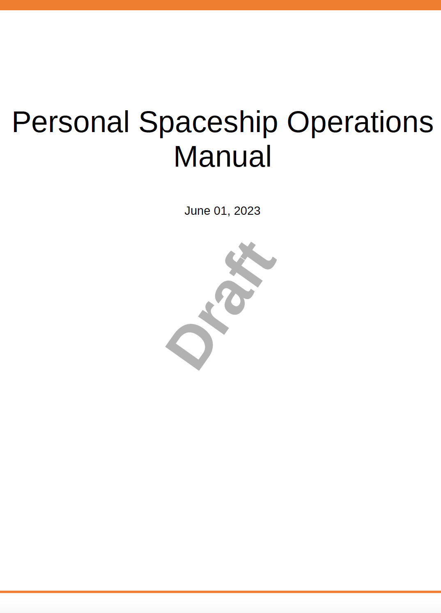

# 使用JavaScript处理内容或样式

本机PDF发布功能允许您运行JavaScript以处理在生成最终PDF之前应用于内容的内容或样式。 此功能可让您完全控制最终输出的生成方式。 例如，您可能希望向PDF输出(位于另一个PDF中)添加法律声明信息。 使用JavaScript，您可以在为基本PDF创建PDF后、生成最终内容之前添加法律声明信息。\
为了支持JavaScript执行，“本机PDF发布”功能提供了以下回调函数：

* `window.pdfLayout.onBeforeCreateTOC(callback)`：此回调函数在生成目录之前执行。
* `window.pdfLayout.onBeforePagination(callback)`：此回调函数在生成目录之后、但在PDF中添加分页符之前执行。
* `window.pdfLayout.onAfterPagination(callback)`：此回调函数在目录和分页符添加到PDF中之后执行。

>[!NOTE]
>
>在内部，会维护这些标注函数的执行顺序。 首先执行onBeforeCreateTOC，然后执行onBeforePagination，最后执行onAfterPagination。

根据要执行的内容类型或样式修改，可以选择要使用的回调函数。 例如，如果要添加内容，建议在生成目录之前添加内容。 同样，如果您想要进行一些样式更新，则可以在分页之前或之后完成这些更新。

在下面的示例中，图标题的位置从图像上方更改为图像下方。 为此，您需要在预设中启用JavaScript执行选项。 为此，请执行以下步骤：

1. 打开预设进行编辑。
1. 转到 **高级** 选项卡。
1. 选择 **启用JavaScript** 选项。
1. 保存预设并关闭。

接下来，使用以下代码创建一个JavaScript文件，并将其保存在模板的Resources文件夹中：

```css
...
/*
* DITA only allows the figure title to be placed above images 
* This JavaScript code is used to move the figure title below the image
* */
window.addEventListener('DOMContentLoaded', function () {
    window.pdfLayout.onBeforeCreateTOC(function() {
        var titleNodes = document.querySelectorAll('.fig > .title')
        for (var i = 0; i < titleNodes.length; i++) {
            var titleNode = titleNodes[i]
            var figNode = titleNode.parentNode
            var imageNode = figNode.querySelector('.image')
            if(imageNode && imageNode.parentNode !== figNode) {
              imageNode = imageNode.parentNode
            }
            if (figNode && imageNode && imageNode.parentNode === figNode) {
                figNode.insertBefore(imageNode, titleNode)
            }
        }
    })
});
...
```

>[!NOTE]
>
>此 `window.addEventListener('DOMContentLoaded', function ()` 必须先调用函数，然后才能使用回调函数。

接下来，必须从用于生成PDF输出的模板文件中调用此脚本。 例如，我们将其添加到目录模板中。 确保 `<script>` 标记被添加到预定义的 `<div>` 标记内 `<body>` 标记之前。 如果您将其添加到 `<head>` 标记或标记之外 `<body>` 标记时，脚本将不会执行。


使用此代码生成的输出，模板在图像下方显示图标题：


## 为草稿文档的PDF输出添加水印 {#watermark-draft-document}

您还可以使用JavaScript添加条件水印。 当满足定义的条件时，这些水印将添加到文档中。\
例如，您可以创建一个包含以下代码的JavaScript文件，以便为尚未批准的文档的PDF输出创建水印。 如果您为“已批准”文档生成的文档PDF，则不会显示此水印。

```css
...
/*
* This file can be used to add a watermark to the PDF output
* */

window.addEventListener('DOMContentLoaded', function () {
    var watermark = 'Draft'
    var metaTag = document.getElementsByTagName('meta')
    css = "@page {\n  @left-middle {\n    content: \"".concat(watermark, "\";\n    z-index: 100;\n    font-family: sans-serif;\n    font-size: 80pt;\n    font-weight: bold;\n    color: gray(0, 0.3);\n    text-align: center;\n    transform: rotate(-54.7deg);\n    position: absolute;\n    left: 0;\n    top: 0;\n    width: 100%;\n    height: 100%;\n  }\n}")
    head = document.head || document.getElementsByTagName('head')[0], style = document.createElement('style');
    style.appendChild(document.createTextNode(css));
    window.pdfLayout.onBeforePagination(function () {
        for (let i = 0; i < metaTag.length; i++) {
            if (metaTag[i].getAttribute('name') === 'docstate' && metaTag[i].getAttribute('value') !== 'Approved') {
                head.appendChild(style);
            }
        }
    })
});
...
```

使用此代码生成的PDF输出会显示水印 *草稿* 在文档的封面上：


