# 适用于Adobe Experience Manager Guides的氧气插件 {#id1645H6010Q5}

适用于Adobe Experience Manager Guides的氧气插件\(稍后在指南中称为AEM Guides的氧气插件\)允许您将Oxygon XML Author连接到Adobe Experience Manager \(AEM\)存储库以进行内容创作和管理。 您可以使用该插件浏览、搜索和打开文件；签出和签入文件；将文件夹和文件上载到AEM存储库中。 桌面应用程序中的“AEM Guides”面板允许您将所需的文件夹\(从AEM存储库\)标记为收藏夹列表以进行快速访问。 此外，您可以在AEM Web界面中安装包，并直接从AEM Web界面在Oxygon XML Author中打开DITA文件。

## 下载并安装 {#id1826M0L0PUI}

AEM Guides的氧气插件可通过您的Adobe软件分发门户获取。 在“Experience Manager”选项卡中搜索“氧气”，然后从 [Adobe软件分发门户](https://experience.adobe.com/#/downloads/content/software-distribution/en/general.html).

>[!NOTE]
>
>从发行说明中查看特定Adobe Experience Manager Guides的氧气连接器版本兼容性。

安装完安装程序后，将其安装在安装了Oxygan XML Author的本地计算机上。 在开始安装过程之前，您必须确保系统符合安装AEM Guides的氧气插件的技术要求。

### 技术要求

- Oxygon XML Author 25.1版

- Adobe Experience Manager Guides版本4.3或更高版本

- Adobe Experience Manager版本6.5，带有Service Pack 14、15、16和17

- 氧XML作者25.1版支持的操作系统

- Java开发工具包
   - oracleSE 8 JRE 1.8

### 在Windows上安装插件

>[!IMPORTANT]
>
>如果系统上安装了旧版本的插件，请确保先卸载该插件，然后再开始安装过程。 请参阅 **卸载包** 中的部分 [如何使用包](https://helpx.adobe.com/experience-manager/6-4/sites/administering/using/package-manager.html) 有关卸载说明的文章。

在安装了Oxygon XML Author的系统上执行以下步骤：

1. 启动安装程序的 `.exe` 文件。

   出现安装向导的欢迎屏幕。

1. 单击 **下一个** 并浏览到可用Oxygon XML Author的.exe文件的位置。

1. 选择文件，然后单击 **打开**.

   所选文件的位置会添加到安装向导中。

1. 单击&#x200B;**下一步**。

1. 单击 **安装**.

1. 单击 **完成** 以关闭安装向导。
1. 启动Oxygon XML Author。

   AEM Guides面板显示在Oxygon XML Author中。

   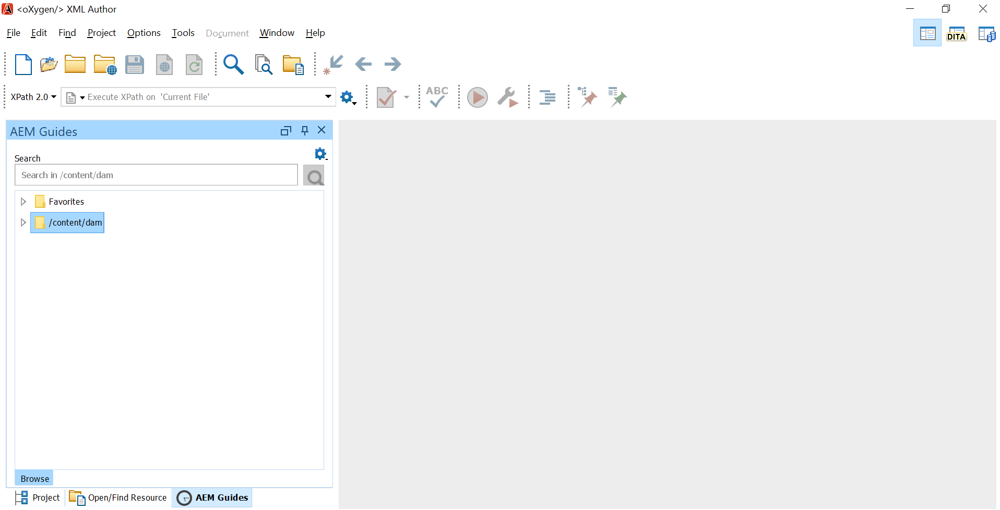{width="800" align="left"}

   >[!NOTE]
   >
   >如果看不到AEM Guides面板，请参阅疑难解答部分中的解决方法 — [“缺少AEM Guides”面板](#id192BH200ZAX).


### 在Mac上安装该插件

>[!IMPORTANT]
>
>如果系统上安装了旧版本的插件，请确保先卸载该插件，然后再开始安装过程。 请参阅 **卸载包** 中的部分 [如何使用包](https://helpx.adobe.com/experience-manager/6-4/sites/administering/using/package-manager.html) 文章卸载说明。

在安装了Oxygon XML Author的系统上执行以下步骤：

1. 在系统上找到插件的.dmg文件。

1. 双击.dmg文件以打开文件内容。

   .dmg文件包含aem-connector-x.x文件夹和aem-connector-x.x安装文件。

   >[!NOTE]
   >
   >文件名称中的x.x是插件的版本号。

1. 复制Oxygon XML Author的plugins文件夹中的aem-connector-x.x文件夹。
1. 双击aem-connector-x.x-setup文件以启动安装程序。

1. 启动Oxygon XML Author。

   AEM Guides面板显示在Oxygon XML Author中。

   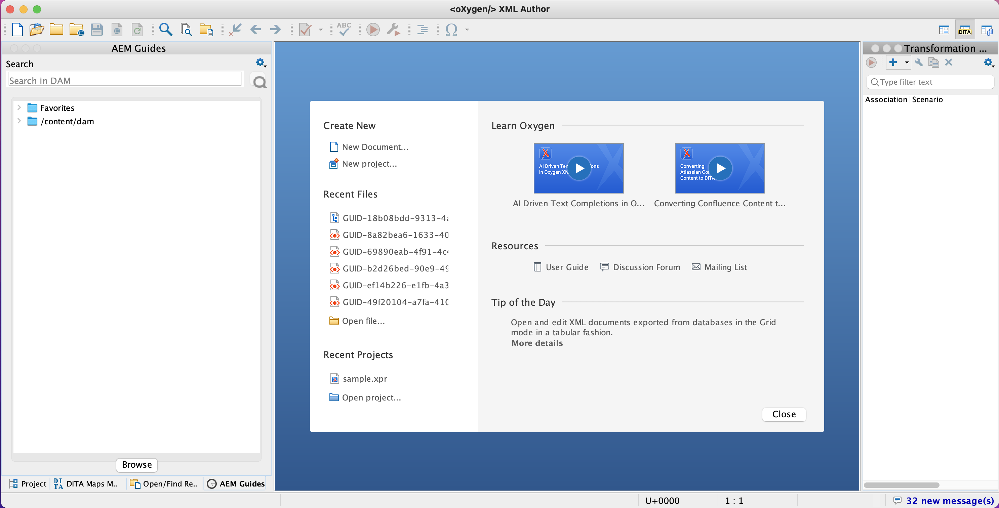 {width="800" align="left"}

   >[!NOTE]
   >
   >如果看不到AEM Guides面板，请参阅疑难解答部分中的解决方法 — [“缺少AEM Guides”面板](#id192BH200ZAX).


### 安装用于从AEM Web界面启用文档编辑功能的软件包 {#id182CE0Q0TY4}

作为作者，您可以直接从AEM Web界面在Oxygon XML Author中打开和编辑DITA映射或主题。 要在AEM Web界面中启用此功能，AEM管理员需要在AEM创作实例中安装包。

作为AEM管理员，执行以下步骤来安装包：

1. 从您的IT团队获取包的.zip文件。
1. 登录AEM实例 *\（作为管理员\）* 并导航到CRX包管理器。 访问包管理器的默认URL为

   `http://<server name>:<port>/crx/packmgr/index.jsp`

   包管理器可管理本地AEM安装中的包。 有关使用包管理器的更多信息，请参阅 [如何使用包](https://experienceleague.adobe.com/docs/experience-manager-cloud-service/content/implementing/developer-tools/package-manager.html?lang=en) 请参阅AEM文档。

   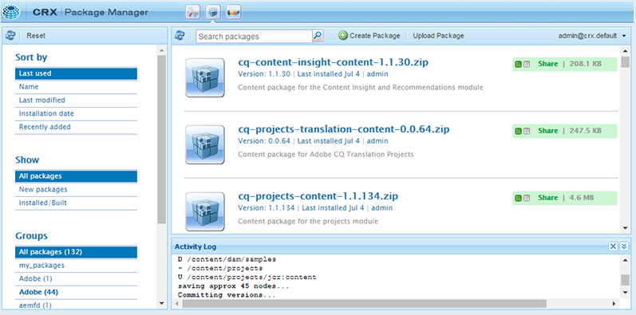 {width="650" align="left"}

1. 要上传氧气包，请单击 **上传包**.
1. 在上传包对话框中，导航到您在步骤1中下载的氧气包文件，然后单击确定。

   资源包将上传到您的AEM实例。

1. 要启动安装过程，请单击 **安装**.

   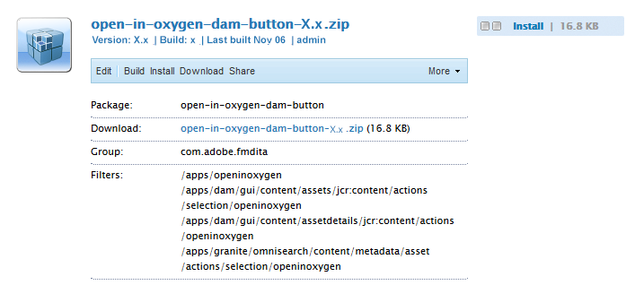{width="650" align="left"}

1. 在“安装包”对话框中，单击 **安装**.
1. 安装完成后，单击CRX包管理器左上角的“主页”按钮。
1. 在资源文件夹中选择DITA文件。

   **在Oxygen中编辑** 选项在工具栏中可用。 有关使用此选项的详细信息，请参阅 [从AEM Web界面在氧XML创作中打开DITA主题](#id182CE0I905Z).

   >[!NOTE]
   >
   >此 **在Oxygen中编辑** 选项在选择一个DITA主题时可见。 如果选择多个主题，则该选项将不可见。


## 为AEM Guides配置氧气插件 {#id1826KF00AHS}

下载并安装插件后，您需要配置以下内容才能使用插件：

- **Web身份验证设置**：AEM Guides的插件中的SSO身份验证设置。
- **常规设置**：插件的连接设置，如AEM服务器URL、登录详细信息等。
- **在交叉引用中分析属性自定义和文件名的首选项**：文档集的分析属性方案需要此配置。

### Web身份验证设置

JxBrowser通过氧气连接器插件用于SSO身份验证。 它是一个基于chromium的浏览器。 对于Java 9及以上版本，需要访问非公共API，并且您必须明确授予对JxBrowser的此访问权限。 有关更多详细信息，请参阅 [JxBrowser疑难解答](https://jxbrowser-support.teamdev.com/docs/guides/troubleshooting/issues.html).

更新给定文件，以在AEM Guides的Ourney Plugin中配置Web身份验证设置：

>[!NOTE]
>
>在更新文件之前对其进行备份。

**用于Mac和氧气25.1**

在env.sh中添加以下行

```java
--illegal-access=permit\
--add-opens=java.desktop/javax.swing.plaf.basic=ALL-UNNAMED\
--add-exports=javafx.controls/com.sun.javafx.scene.control=ALL-UNNAMED\
--add-exports=javafx.graphics/com.sun.javafx.stage=ALL-UNNAMED\
--add-exports=javafx.graphics/com.sun.javafx.scene=ALL-UNNAMED\
--add-exports=javafx.graphics/com.sun.javafx.scene.traversal=ALL-UNNAMED\
--add-exports=javafx.graphics/com.sun.javafx.tk=ALL-UNNAMED\
--add-exports=javafx.graphics/com.sun.glass.ui=ALL-UNNAMED\
--add-opens=javafx.graphics/com.sun.glass.ui=ALL-UNNAMED\
--add-opens=javafx.graphics/javafx.stage=ALL-UNNAMED\
--add-opens=javafx.graphics/com.sun.javafx.tk.quantum=ALL-UNNAMED\
--add-exports=java.desktop/sun.awt=ALL-UNNAMED\
--add-opens javafx.swing/javafx.embed.swing=ALL-UNNAMED
```

在oxyoAuthor.sh中添加以下行

```java
-Djdk.module.illegalAccess=permit\-Djava.ipc.external=true\
```

**对于Windows和氧气25.1**

在env.bat中添加以下行

```java
--illegal-access=permit --add-opens=java.desktop/javax.swing.plaf.basic=ALL-UNNAMED --add-exports=javafx.controls/com.sun.javafx.scene.control=ALL-UNNAMED --add-exports=javafx.graphics/com.sun.javafx.stage=ALL-UNNAMED --add-exports=javafx.graphics/com.sun.javafx.scene=ALL-UNNAMED --add-exports=javafx.graphics/com.sun.javafx.scene.traversal=ALL-UNNAMED --add-exports=javafx.graphics/com.sun.javafx.tk=ALL-UNNAMED --add-exports=javafx.graphics/com.sun.glass.ui=ALL-UNNAMED --add-opens=javafx.graphics/com.sun.glass.ui=ALL-UNNAMED --add-opens=javafx.graphics/javafx.stage=ALL-UNNAMED --add-opens=javafx.graphics/com.sun.javafx.tk.quantum=ALL-UNNAMED --add-exports=java.desktop/sun.awt=ALL-UNNAMED --add-opens javafx.swing/javafx.embed.swing=ALL-UNNAMED
```

在oxyoAuthor.bat中添加以下行

```java
-Djdk.module.illegalAccess=permit -Djava.ipc.external=true
```

>[!NOTE]
>
>您需要以管理员身份在Mac中运行oxyoAuthor.sh，在Windows中运行oxyoAuthor.bat。

### 常规设置

执行以下步骤以在Adobe Experience Manager Guides的Ourney Plugin中配置连接设置：

1. 在“AEM Guides”面板中，单击设置图标，然后选择 **设置**.

   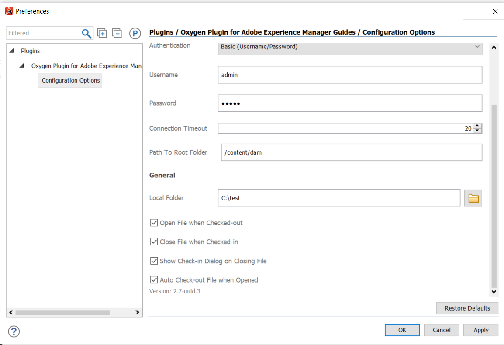{width="800" align="left"}

1. 指定以下详细信息：
   - **服务器URL**：AEM服务器的URL，例如：

     ```http
     http[s]://<host>:<port>
     ```

     在上述URL中，指定部署AEM服务器的服务器的主机名和端口。

     >[!IMPORTANT]
     >
     >如果您的AEM服务器部署在端口80或443上，则不需要在URL中指定它。

   - **身份验证：** 选择自 **基本\（用户名/密码\）** 或 **Web身份验证**. 如果您选择 **基本** 身份验证：您需要输入 **用户名** 和 **密码** 在“首选项”对话框中。

     如果选择Web验证，则会显示AEM登录屏幕。 输入登录凭据并单击 **登录** 按钮。 成功登录后，“AEM登录”屏幕将关闭，“AEM Guides”面板将显示AEM服务器中的文件列表。

   - **连接超时**：以秒为单位，指定客户端将等待来自AEM服务器的响应的时间。 如果在指定的时间内未收到来自服务器的响应，则请求被终止。 默认值为20秒。

   - **本地文件夹**：签出后AEM存储库中存储文件的本地计算机上的位置。 如果指定的位置在驱动器上不存在，则插件将创建该位置。
   - **签出时打开文件**：如果选中，会在签出时打开文件。
   - **签入时关闭文件**：如果选定此选项，则在签入时关闭文件。 在关闭文件之前，会显示一个弹出窗口，您可以在其中指定版本注释。
   - **关闭文件时显示签入对话框**：如果选定此选项，将在关闭文件时显示弹出窗口。 从弹出窗口中，您可以选择检入文件或关闭文件而不检入。
   - **打开时自动签出文件**：如果选定该属性，双击文件会自动将其签出并打开以进行编辑。 如果文件已签出，则只需打开它进行编辑。 如果未选中此选项，则打开没有锁定的文件会在只读模式下将其打开。
1. 单击&#x200B;**确定**。

### 在交叉引用中分析属性自定义和文件名的首选项 {#id1827K0D0OHT}

您需要在Oxygon XML Author中配置首选项，以使用与AEM存储库中的DITA主题关联的性能分析属性。 您还需要配置首选项，以代替交叉引用中的GUID显示文件名。

执行以下步骤可配置性能分析属性和交叉引用：

1. 在Oxygon XML Author中，单击 **选项** \> **偏好设置**.
1. 在 **文档类型关联** 选项卡，选择 **DITA**，然后单击 **扩展**.

   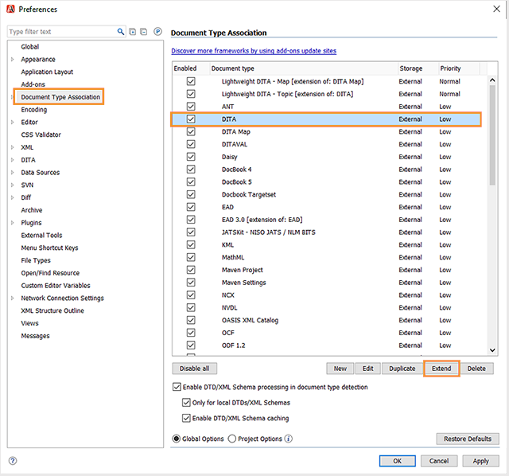{width="650" align="left"}

1. 在 **类路径** 选项卡，选择 `com.adobe.o2.connector` 在 **使用插件中的ID为父类加载器** 下拉菜单。

   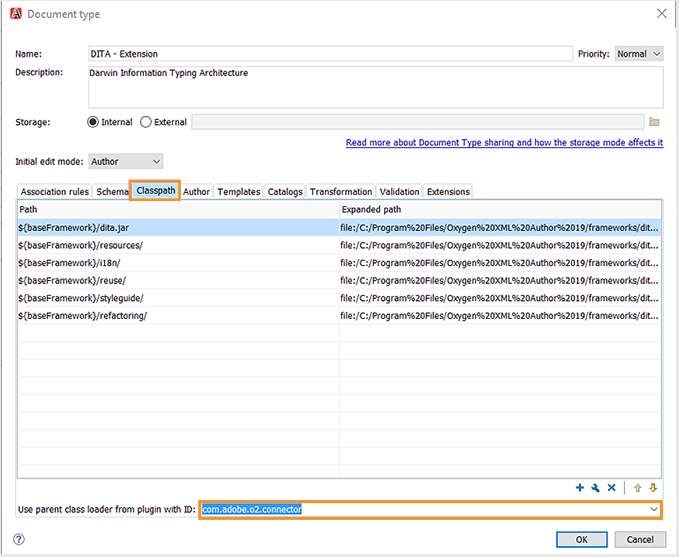{width="650" align="left"}

1. 在 **扩展** 选项卡中，进行以下更改：

   - 单击 **选择** 旁边的 **扩展包** 并选择   `LinkResolverExtensionBundle - com.adobe.o2.framework.extn` 在 **类** 列表。 单击&#x200B;**确定**。
     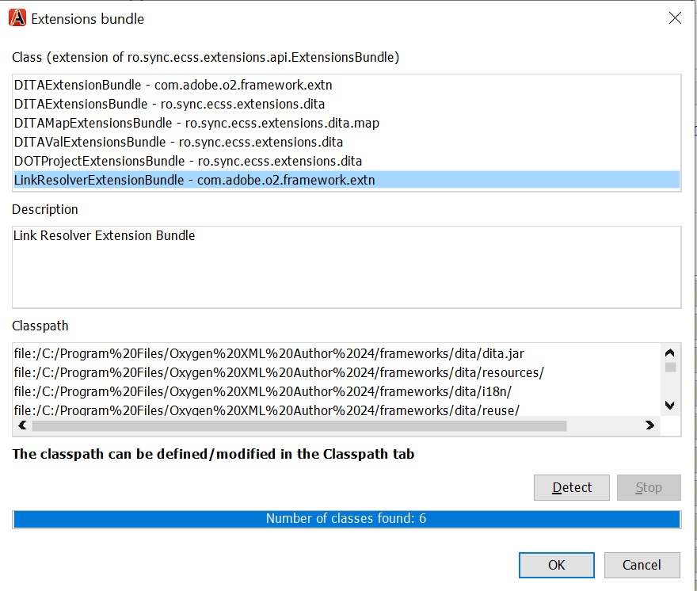 {width="650" align="left"}
   - 单击 **选择** 旁边的 **作者扩展状态侦听器** 下 **单个扩展** 并选择 `CustomAuthorExtensionStateListener - com.adobe.o2.framework.extn` 在 **类** 列表。 单击&#x200B;**确定**。
   - 单击 **选择** 旁边的 **作者自定义属性值编辑器** 下 **单个扩展** 并选择 `CustomValueEditor - com.adobe.o2.framework.extn` 在 **类** 列表。 单击&#x200B;**确定**。
   - 单击 **选择** 旁边的 **创作外部对象插入处理程序** 下 **单个扩展** 并选择 `CustomURLInsertionHandler - com.adobe.o2.ui ` 在 **类** 列表。 单击&#x200B;**确定**。


   以下屏幕截图显示了配置的 **扩展名** DITA主题的选项卡：
   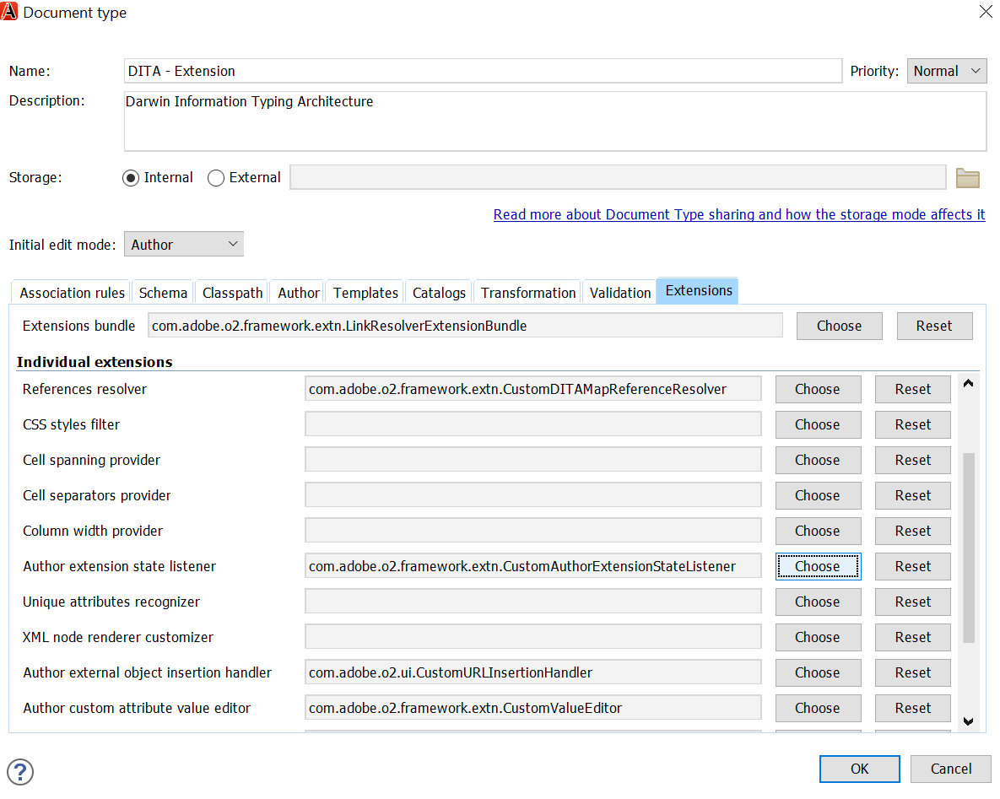
1. 单击 **确定** ，以保存更改。

### 配置DITA映射扩展

要允许直接从AEM Web界面在Oxyo XML Author中打开映射文件，需要配置DITA映射扩展。 这些配置类似于在前面的过程中完成的用于分析属性的配置。

执行以下步骤来配置DITA map扩展：

1. 在Oxygon XML Author中，单击 **选项** \> **偏好设置**.
1. 在 **文档类型关联** 选项卡，选择 **DITA映射**，然后单击 **扩展**.
1. 在 **类路径** 选项卡，选择com.adobe.o2.connector **使用插件中的ID为父类加载器** 下拉菜单。
1. 在 **扩展** 选项卡中，进行以下更改：
   - 单击 **选择** 旁边的 **扩展包** 并选择   `com.adobe.o2.framework.extn.LinkResolverDITAMapExtensionBundle` 在 **类** 列表。 单击&#x200B;**确定**。

   - 单击 **选择** 旁边的 **作者扩展状态侦听器** 下 **单个扩展** 并选择 `CustomDITAMapAuthorExtensionStateListener - com.adobe.o2.framework.extn` 在 **类** 列表。 单击&#x200B;**确定**。

   - 单击 **选择** 旁边的 **创作外部对象插入处理程序** 下 **单个扩展** 并选择 `CustomURLInsertionHandler - com.adobe.o2.ui ` 在 **类** 列表。 单击&#x200B;**确定**。

   - 单击 **选择** 旁边的 **作者自定义属性值编辑器** 下 **单个扩展** 并选择 `CustomValueEditor - com.adobe.o2.framework.extn` 在 **类** 列表。 单击&#x200B;**确定**。

   - 单击 **选择** 旁边的 **引用解析程序** 下 **单个扩展** 并选择 `CustomDITAMapReferenceResolver - com.adobe.o2` 在 **类** 列表。 单击&#x200B;**确定**。
   - *\（可选\）* 如果在打开映射文件时不想解析引用，则需要执行以下附加配置：

   以下屏幕截图显示了配置的 **扩展名** 选项卡：
   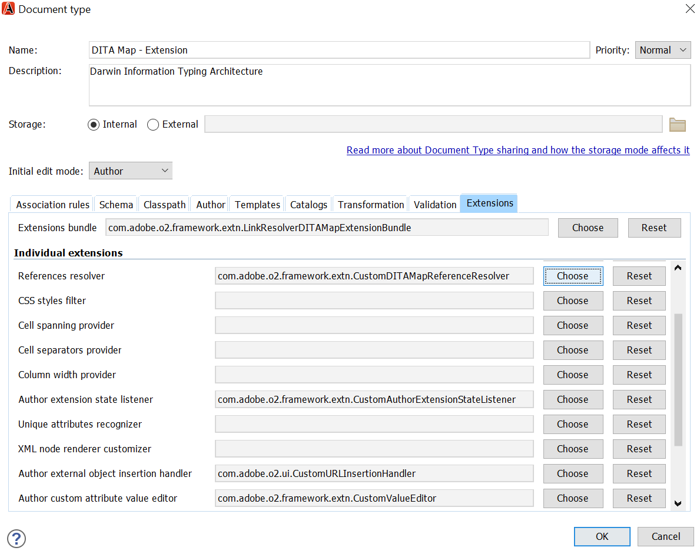

1. 单击 **确定** ，以保存更改。

## 使用AEM Guides的氧气插件 {#id1826JG00WY4}

### AEM Guides面板

以下屏幕显示“AEM Guides”面板。

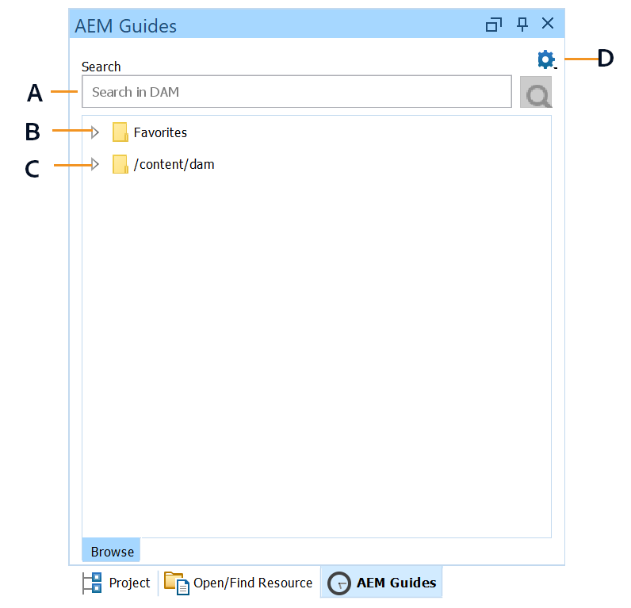{width="550" align="left"}

**A**\)显示搜索栏。

**B**\)显示收藏夹文件夹。 默认情况下，为空。 您可以从AEM存储库中将文件夹添加为收藏夹，收藏夹随后会显示在此处。

**C**\) DAM文件夹显示AEM存储库。 您可以展开和折叠文件夹视图。

**D**\)设置\（齿轮\）图标及以下选项：

- **连接**：选择此选项以连接到AEM服务器。 当Oxygon XML Author连接到AEM Server时，将禁用该选项。
- **刷新**：选择此选项可从AEM存储库中获取文件和文件夹的最新状态。

  >[!NOTE]
  >
  >确保在刷新文件之前保存文件。 当您选择时 **刷新** 选项，您会收到一则警告，提示您在刷新文件之前先保存文件。 如果尚未保存文件，可以单击 **取消** 并拯救他们。

- **设置**：您可以使用此选项打开插件的常规首选项对话框。
- **注销**：选择此选项可关闭AEM服务器连接。 仅当使用Web身份验证模式时，此选项才可用。

### 上下文菜单函数

右键单击AEM存储库中的文件夹或文件即可使用AEM Guides的氧气插件的功能。 文件夹可用的功能与文件不同。 以下是AEM Guides上下文菜单的氧气插件中的完整功能列表：

- **打开**：打开选定的文件或展开选定的文件夹。
- **打开方式**：您可以选择在AEM Guides的Web编辑器、映射仪表板或映射编辑器中打开选定的文件。 有关这些选项的详细信息，请参阅 [在AEM Guides的编辑器中打开文件](#id195GH0V30KX).
- **结帐**：从AEM存储库中签出文件。 有关更多详细信息，请参阅 [签出文件](#id195HC020TS4).
- **与家属一起结帐**：签出包含其直接引用的文件。 有关更多详细信息，请参阅 [签出文件](#id195HC020TS4).
- **签出只读依赖项**：检出选定的文件及其依赖项。 无法在相关文件中进行任何更改。 有关更多详细信息，请参阅 [签出文件](#id195HC020TS4).
- **取消签出**：取消已签出的文件，从编辑器中关闭该文件，并恢复对服务器上保存的文件的最新版本所做的更改。
- **刷新**：对于文件，从AEM存储库获取文件的最新副本。 对于文件夹，它会获取文件夹结构和文件的状态。 这意味着添加了一个文件，然后该文件将显示在AEM Guides视图中。 此外，如果文件在AEM服务器上签出，在“氧气创作”中执行“刷新”操作会将文件显示为已签出。 但是，这不会更新 *AEM Guides中签出的文件* 视图。
- **刷新签出文件**：刷新中签出文件的列表 *AEM Guides中签出的文件* 视图。 如果文件在AEM服务器上签出，则执行“刷新”将更新中签出文件的列表 *AEM Guides中签出的文件* 视图。 但是，如果添加了新文件或者文件状态已更改，则不会在“AEM指南”树视图中更新该文件。 要更新AEM上文件的状态，必须执行“刷新”。
- **签入**：签入您已签出的文件。 有关更多详细信息，请参阅 [签入文件](#id182CF0J0FHS).
- **与家属签入**：如果您已签出包含依赖项的文件，则此选项会签入主文件及其依赖项。 有关更多详细信息，请参阅 [签入文件](#id182CF0J0FHS).
- **创建文件夹**：在AEM存储库中创建文件夹。 此选项仅在文件夹级别可用。
- **上传文件**：上传单个或多个文件。 有关更多详细信息，请参阅 [上载文件和文件夹](#id195HC03F03J).
- **与依赖项一起上传**：上载DITA文件及其依赖项\（XML、DITA、Book map或DITA map\）。 有关更多详细信息，请参阅 [上载文件和文件夹](#id195HC03F03J).
- **上传文件夹**：在AEM存储库中上传文件夹。 有关更多详细信息，请参阅 [上载文件和文件夹](#id195HC03F03J).
- **添加到收藏夹**：将文件夹添加到 *收藏夹* AEM文件夹。 建议在此处添加工作文件夹，这样可以更轻松地从AEM同步文件和文件状态。
- **从收藏夹中移除**：从删除文件夹 *收藏夹*. 有关更多详细信息，请参阅 [添加或删除收藏夹](#id195HC04405P).
- **查看元数据**：显示元数据，例如DITA类、文档的标题、类型、UUID以及与文件关联的其他信息。 有关更多详细信息，请参阅 [查看文件的元数据](#id195GHN0H05C).
- **查看版本**：显示文件的版本历史记录。 有关更多详细信息，请参阅 [查看文件的版本历史记录](#id195GI000D5Q).

### 在氧XML创作中打开文件 {#id195GHJ0A0UB}

连接到AEM存储库后，即可在Oxygon XML Author中打开文件进行编辑。 执行以下步骤，打开文件以在Oxygon XML Author中进行编辑：

1. 在“AEM参考线”面板中右键单击要打开以进行编辑的文件。

1. 选择 **打开** 从上下文菜单中。

   该文件将在氧XML作者的编辑器中打开。

   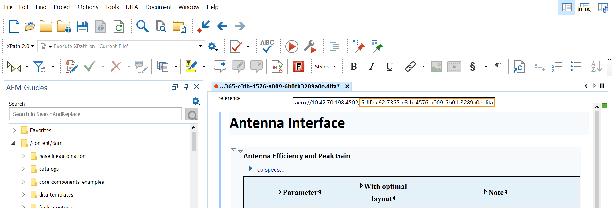 {width="800" align="left"}

   将鼠标指针悬停在文件的选项卡上时，将显示服务器路径及其UUID。 在上面的屏幕快照中，文档的UUID高亮显示。


如果您已选择 **打开时自动签出文件** 选项\(在“首选项”(Preferences)对话框中\)，则在打开文件时，文件将自动签出并可用于编辑。 要打开文件，可以双击文件名或右键单击文件名并选择 **打开** 从上下文菜单中。 如果未选择此选项，则文件将以只读模式打开。

>[!NOTE]
>
>也可以双击文件以将其打开。

### 在AEM Guides的编辑器中打开文件 {#id195GH0V30KX}

如果要使用AEM Guides中可用的编辑器，可以通过从上下文菜单中选择所需的选项来实现此目的。 执行以下步骤，使用AEM Guides的编辑器代替Oxygon XML作者的编辑器：

1. 在“AEM参考线”面板中右键单击要打开以进行编辑的文件。

1. 选择 **打开方式** 从上下文菜单中，从以下选项中进行选择：

   - **Web主题编辑器**：如果要打开的文件是.xml或.dita文件，则可以在Web编辑器中打开该文件进行编辑。 选择 **Web主题编辑器** 选项打开选定的文件以在Web编辑器中编辑。

   - **映射仪表板**：您可以选择在映射仪表板中编辑.ditamap文件，在该仪表板中，您可以对映射文件执行各种操作。 这些操作取决于您所属的角色/组。

   - **Web DITA映射编辑器**：如果要打开.ditamap文件以在映射编辑器中编辑，请选择此选项。 使用“DITA映射编辑器”选项，可以添加或删除主题、添加关系表以及对映射执行其他操作。


### 签出文件 {#id195HC020TS4}

签出文件时，该文件将存储在您系统上的本地位置，并锁定在AEM存储库中进行编辑。 执行以下步骤签出文件：

1. 您可以通过以下方式之一签出文件：
   - 右键单击“AEM参考线”面板中的文件。
   - 右键单击“DITA映射管理器”面板中的映射选项卡。
   - 右键单击“DITA映射管理器”面板中的文件。
   - 在编辑器中打开映射或主题时，右键单击文件选项卡。

1. 选择以下选项之一：
   - **结帐：** 从AEM存储库中签出文件并使其可用于编辑。
   - **与家属一起结帐**：签出包含其直接引用的文件。 您可以使用此选项在父页面和子页面中进行更改。 AEM Guides的氧气插件支持检出一个级别的依赖项。 例如，映射A引用主题A和主题A引用主题B。签出映射A将签出主题A，无论其在目录层次结构中的级别如何。 但是，它不会签出主题B，因为它未直接从映射A链接。
   - **签出只读依赖项**：签出文件并将其依赖项作为只读副本下载到本地计算机。 无法在相关文件中进行任何更改。

如果您已选择 **签出时打开文件** 选项\(在“首选项”(Preferences)对话框中\)，则在签出文件时，将自动打开文件以进行编辑。

如果您已选择 **打开时自动签出文件** 选项\(在“首选项”(Preferences)对话框中\)，然后在打开文件时，文件将自动签出并可供编辑。 要打开文件，可以双击文件名或右键单击文件名并选择 **打开** 从上下文菜单中。

签出文件时，文件的图标会更改为显示其锁定状态。

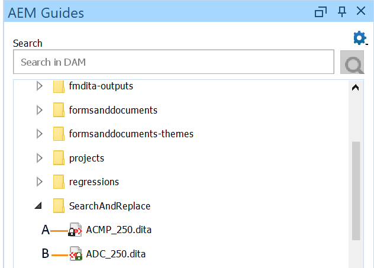{width="650" align="left"}

在上面的屏幕快照中，其他用户签出的文件显示有一个黑色的锁定图标\(A\)。 当前用户签出的文件以绿色锁定显示\(B\)。

>[!NOTE]
>
>如果签出文件被删除或移至AEM中的任何其他文件夹，则在签入文件时将会显示错误消息。 确保签出文件未使用AEM Web界面移动或删除。

### 签入文件 {#id182CF0J0FHS}

签入文件时，系统中的本地副本将存储在AEM存储库中，并且文件的锁定将被移除。 执行以下步骤以检入文件：

1. 通过单击保存文件 **文件** \> **保存**.

1. 右键单击签出的文件或映射（位于以下位置之一）：
   - AEM Guides面板
   - DITA映射管理器面板
   - 在编辑器中打开映射或主题时的“文件”选项卡。
   - “DITA映射管理器”面板中的“映射”选项卡。

1. 从以下两个选项中选择：

   - **签入**：将所选文件从本地系统签入AEM存储库。
   - **带家属签入：** 如果已将文件及其从属文件一起签出，则使用此选项可在一次操作中签入所有从属文件。 选择此选项时，将显示包含所有从属文件的“签入”对话框。 单击“确定”以一次签入所有文件。

   如果尚未签出从属文件，然后您选择此选项，则只有已签出的从属文件才会被签入。 您将看到无法签入的文件列表：

   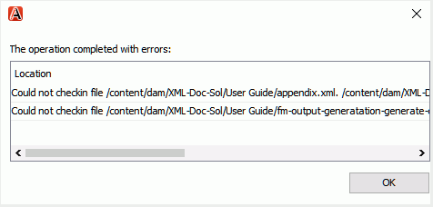{width="800" align="left"}

   强烈建议不要移动已签出的文件。 但是，如果将已签出的文件移动到其他位置，则必须取消对该文件的签出。 如果要更新该文件，则再次签出该文件，进行更改，然后再次签入。 如果尝试签入的文件已从其原始位置移出，则会出现错误。

   如果相关文件在AEM中检出，则“带从属项检入”不会在“检入”对话框中显示相关文件。 要获取在AEM中检出的相关文件的列表，必须执行文件夹“刷新”。

   同样，如果您通过AEM签入了相关文件，则在执行文件夹“刷新”和“刷新签出文件”之前，不会在“氧创作”中刷新文件列表。 如果对通过AEM签入的某些文件执行带家属的签入，则会出现错误，列出无法签入的文件。

1. \（可选\）在 **签入** 或 **带家属签入** 对话框，添加评论 **版本注释** 文本框。

   >[!NOTE]
   >
   >此注释会显示在文件的AEM版本历史记录中。

1. 在中添加标签 **标签** 文本框 **签入** 或 **带家属签入** 对话框。 输入标签，然后按Enter键。 例如， *2307版本*.

   如果您的管理员预定义了一个标签列表并将它们上传到 `label.json` 文件，则这些标签将显示为下拉列表。 您可以从下拉菜单中选择一个或多个标签。

   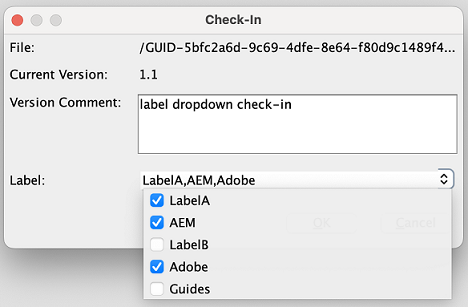{width="550" align="left"}

   您可以向主题的同一版本添加多个标签（用逗号分隔）。  例如， *Adobe*， *AEM*， *指南*.
但是，不能向主题的不同版本添加相同的标签。 如果添加已经添加到早期版本的标签，则会将其添加到最新版本并从早期版本中删除。

   >[!NOTE]
   > 
   > 这些标签显示在文件的AEM版本历史记录中。


1. 单击&#x200B;**确定**。

>[!NOTE]
>
>如果签出文件被删除或移至AEM中的任何其他文件夹，则在签入文件时将会显示错误消息。 确保签出文件未使用AEM Web界面移动或删除。

### AEM Guides视图中签出的文件

当在多个文件夹中时，很难在一个视图中检出多少文件。 AEM Guides在AEM Guides视图中提供了“Files Checked-Out”（文件签出），该视图提供了当前已签出文件的完整快照。 使用此视图，您可以轻松查找已使用AEM Guides在AEM存储库中签出的文件。 执行以下步骤以访问此视图：

1. 单击 **窗口** \> **显示视图** \> **AEM Guides中签出的文件**.

   将显示“AEM Guides”视图中的“文件签出”。

   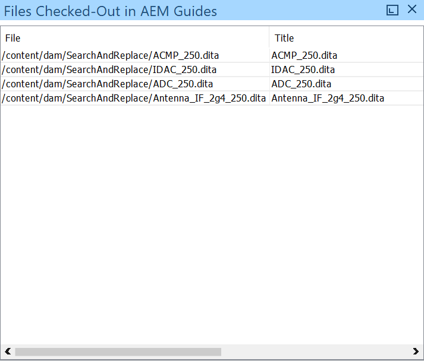{width="550" align="left"}

1. 右键单击此视图中的文件以获取以下选项：

   - [打开](#id195GH0V30KX)
   - [打开方式](#id195GH0V30KX)
   - 取消签出
   - [签入](#id182CF0J0FHS)
   - [带家属签入](#id182CF0J0FHS)
   - [查看元数据](#id195GHN0H05C)
   - [查看版本](#id195GI000D5Q)

**AEM Guides视图中签出的文件注释：**

- 此 *AEM Guides中签出的文件* 视图维护用户的会话。 这意味着由当前用户签出的文件在同一用户的会话\（或cache\）中存储并维护在视图中。

- 如果用户更改登录凭据或AEM服务器，则视图中的签出文件数据\（或cache\）将被重置。 用户必须手动运行 *刷新签出的文件* 之前从中签出文件的每个文件夹上的命令。 为简化此操作，建议将您的工作文件夹添加到 *收藏夹* 从中快速刷新文件夹。

- 您可以根据文件的文件名、标题或路径对文件列表进行排序。 如果新文件已签出，则该文件将在视图中按排序顺序显示。


### 上载文件和文件夹 {#id195HC03F03J}

执行以下步骤上载文件或文件夹：

1. 右键单击“AEM Guides”面板中的文件夹。
1. 选择以下选项之一：
   - **上传文件**：选择此选项以将单个或多个文件上传到AEM存储库中的选定文件夹。 在“选择要上传的文件\(s\)”对话框中，选择文件并单击 **打开**.
   - **与依赖项一起上传**：选择此选项可上传DITA文件及其依赖项。 在“选择要上传的文件”对话框中，选择文件并单击 **打开**.
   - **上传文件夹**：选择此选项可在AEM存储库中上传文件夹。 在“选择”对话框中，选择文件夹并单击 **选择**.

**有关使用基于UUID的文件的其他说明**：

将内容从本地系统移动或复制到AEM存储库时，必须考虑以下几点：

- 上传一个或多个文件时，将为不包含任何UUID的文件生成新的UUID。 此UUID将添加到 `topic id` DITA文件。

- 复制文件夹时，将自动更新对该文件夹中引用文件的所有DITA map中的文件\（在文件夹内）。

- 复制DITA映射文件时，不会更改映射文件中的UUID引用。

- 如果文件或文件夹存在冲突或重复，则会为要复制或移动的新文件生成唯一的文件名。

- 任何两个文件都不能具有相同的UUID。 为所有新文件分配一个唯一的UUID。

- 如果文件由两个不同的用户同时上传，则以后处理的文件会覆盖较早的文件。 然而，这种做法应加以避免。

- 当您从AEM存储库签出内容并在本地系统上做出更改时，请确保在上传文件时文件名未发生更改。

- 在DITA映射管理器或编辑器中插入引用时，将显示文件的标题而不是UUID。 如果标题不存在，则显示文件名。

### 添加或删除收藏夹 {#id195HC04405P}

执行以下步骤，在“AEM Guides”面板的“收藏夹”文件夹中添加或删除文件夹：

- 右键单击文件夹，然后选择 **添加到收藏夹**. 如果文件夹不在“收藏夹”中，则可以将其添加到收藏夹。
- 您可以通过以下方式从收藏夹中删除文件夹：
   - 右键单击 **收藏夹** 文件夹并选择 **从收藏夹中移除**.
   - 右键单击AEM存储库中位于下的文件夹 **DAM** 已添加为收藏夹的文件夹并选择 **从收藏夹中移除**.

### 查看文件的版本历史记录 {#id195GI000D5Q}

执行以下步骤以查看文件的版本历史记录：

1. 右键单击“AEM参考线”面板中的文件。

1. 选择 **查看版本** 从上下文菜单中。

   文件的版本历史记录将显示在“版本”对话框中。

   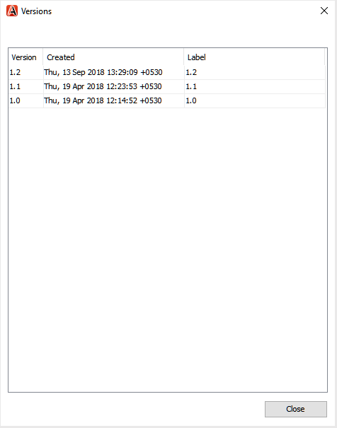{width="550" align="left"}


### 查看文件的元数据 {#id195GHN0H05C}

执行以下步骤以查看文件的元数据：

1. 右键单击“AEM参考线”面板中的文件。

1. 选择 **查看元数据** 从上下文菜单中。

   文件的元数据（如DITA类、文档状态、修改日期、大小、标题和UUID）显示在“元数据”对话框中。

   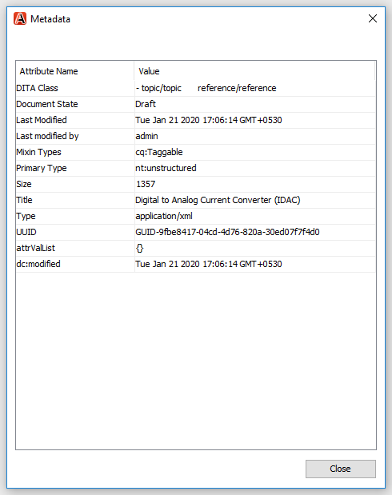{width="550" align="left"}


## 搜索AEM存储库中的主题 {#id1826J20405Z}

您可以使用AEM Guides面板中的搜索栏搜索AEM存储库中的主题。 您可以在整个DAM文件夹中进行搜索，或选择一个文件夹，然后在该文件夹中搜索主题。 搜索结果将显示文本与搜索查询匹配的主题。

执行以下步骤以搜索主题：

1. 在AEM存储库中选择要在其中搜索主题的文件夹。
1. 输入搜索查询\(例如， `introduction`\)在AEM Guides的氧气插件搜索栏中。
1. 单击搜索按钮或按Enter。

   结果在“搜索结果”选项卡中显示为带有文件路径的列表。 如果您的搜索查询没有匹配结果，则在中未找到任何结果 &lt;path of=&quot;&quot; the=&quot;&quot; selected=&quot;&quot; folder=&quot;&quot;> 将显示消息。

   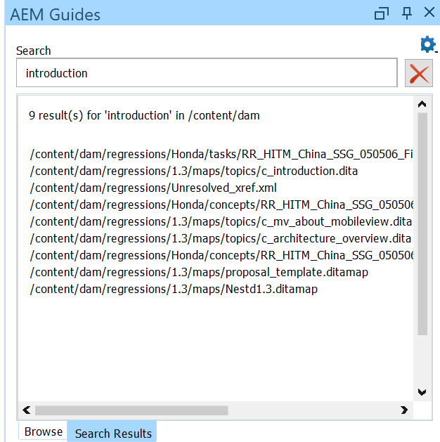{width="550" align="left"}

1. \（可选\）双击搜索结果中的文件以在Oxygen XML Author中将其打开。
1. 要返回“AEM资料档案库”视图，请执行下列操作之一：
   - 要在不清除搜索结果的情况下查看“AEM资料档案库”视图，请单击 **浏览** 选项卡。
   - 要清除搜索结果并查看AEM存储库，请单击删除搜索图标。

## 从AEM Web界面在氧XML创作中打开DITA主题 {#id182CE0I905Z}

您可以从AEM Web界面在Oxygon XML Author中打开并编辑DITA主题。 您需要在AEM中安装包才能启用此选项。 有关软件包安装的更多信息，请参见 [安装用于从AEM Web界面启用文档编辑功能的软件包](#id182CE0Q0TY4).

>[!NOTE]
>
>此 **在Oxygen中编辑** 选项可从AEM中的各个位置访问：选择主题时、预览主题时，或从DITA映射控制台的主题和报表选项卡访问。 如果选择多个主题，则该选项在工具栏中不可见。

**打开DITA主题**

执行以下步骤，在Oxygon XML Author中打开DITA主题：

1. 在资源中选择主题并单击 **在Oxygen中编辑** 选项。

   >[!NOTE]
   >
   >如果主题未检出，则会先检出该主题，然后在编辑模式下在Oxygen中将其打开。

1. 选择氧XML作者 *&lt;version>* 在 **启动应用程序** 消息框。 您可以选择 **记住我选择的AEM链接** 选项以保存您的首选项。

**编辑DITA主题**

执行以下步骤以在Oxygon XML Author中编辑DITA主题：

1. 选择并签出资源中的主题。
1. 单击 **在Oxygen中编辑** 选项。

   >[!NOTE]
   >
   >如果主题未检出，则会先检出该主题，然后在编辑模式下在Oxygen中将其打开。

1. 选择氧XML作者 *&lt;version>* 在 **启动应用程序** 消息框。 您可以选择 **记住我选择的AEM链接** 选项以保存您的首选项。
1. 在Oxygon XML Author中编辑主题。
1. 查看AEM Guides的氧气插件中的主题。

   有关使用AEM Guides的氧插件签入主题的更多信息，请参阅 [签入文件](#id182CF0J0FHS).

   >[!NOTE]
   >
   >确保使用AEM Guides的氧气插件签入主题，如果从AEM Web界面签入，则在氧气XML创作中所做的更改不会保存在主题的签入版本中。

**插入对Experience Manager指南存储库中主题的引用**

也可以拖放主题以将引用插入到主题或DITA映射中。
>[!NOTE]
>
> 在添加对某个文件的任何引用之前，您需要签出该文件。

根据参照类型添加以下元素：

如果拖放到编辑器并打开主题，请执行以下操作：
- 引用被添加了 `<image>` 图像的元素。
- 为视频或音频添加对象元素。
- 此 `<xref>`  为所有其他引用(如topic、map、DITAVAL、PDF、ZIP和XML)添加了元素。

如果您使用打开的映射拖放到编辑器或DITA映射管理器：
- 此 `<mapref>` 为映射引用（包括DITA映射、书签映射或主题方案）添加了元素。
- 此 `<topicref>` 为所有其他引用(如topic、map、DITAVAL、PDF、ZIP和XML)添加了元素。


## 使用属性配置文件 {#id1827JA002YK}

AEM Guides允许您使用相关的DITA属性轻松创建和关联条件属性。 您可以在全局级别或文件夹级别定义条件属性。 全局定义的条件在所有项目中均可见，文件夹级别的条件仅在指定文件夹内创建的项目中可见。 内容作者可以使用这些条件属性来条件化其DITA主题中的内容或他们创建或使用的映射。 要详细了解如何使用AEM Guides在AEM中创建条件属性，请参阅 *为全局或文件夹级别的配置文件配置条件属性* 安装和配置Adobe Experience Manager Guides中的部分。

>[!NOTE]
>
>确保您已在AEM中添加了条件属性并设置了 [配置文件属性自定义的首选项](#id1827K0D0OHT) 在将条件属性添加到内容之前。

执行以下步骤，向Oxygon XML Author中的内容添加条件属性：

1. 从签出并打开一个主题 *AEM Guides的氧气插件*.
1. 选择要应用条件属性的内容部分。
1. 双击Oxygon XML Author的“属性”面板中的条件属性。

   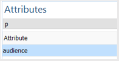{width="300" align="left"}

1. 在 **可用** 编辑属性对话框的列，选择属性并单击 **添加**.

   以下屏幕显示 `audience` 属性。

   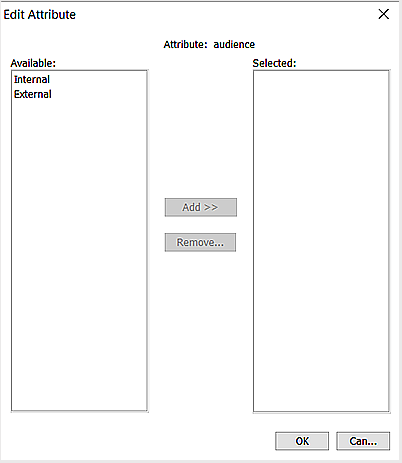{width="550" align="left"}

1. 单击&#x200B;**确定**。

   属性将添加到内容中。


## 常见问题疑难解答 {#id188ABC00RY4}

本主题涵盖了使用插件时可能遇到的一些最常见问题及其解决方案。

### “缺少AEM Guides”面板 {#id192BH200ZAX}

**问题**  — 如果在氧XML创作中没有看到AEM Guides面板，请尝试以下解决方案：

解决方案1：

1. 在Oxygon XML Author中，启用插件。

   单击 **选项** \> **偏好设置** \> **插件** 并选择 **Adobe Experience Manager Guides的氧气插件。**

1. 重新启动Oxygon XML Author。


解决方案2：

1. 如果您仍未看到AEM Guides面板，请启用AEM Guides窗口。

   在Oxygon XML Author中，单击 **窗口** \> **显示视图** \> **AEM指南**.

解决方案3：

1. 卸载并重新安装Adobe Experience Manager Guides的氧气插件。

   - 在Windows上，从卸载插件 **添加或删除程序** 列表。 然后，重新安装插件。

   - 在Mac上，访问Oxygon XML Author的plugins文件夹中的aem-connector-x.x文件夹，并将其移动到 **垃圾桶**. 然后，清空 **垃圾桶** 文件夹。


### 为DITA-OT转换配置端口

**问题**  — 对插件处理的文件运行任何DITA-OT转换时，转换会失败，并出现以下错误：

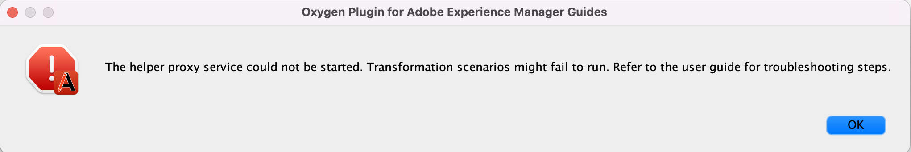{width="800" align="left"}

**解决方案**  — 通过在DITA-OT和插件之间添加代理服务器，已修复此问题。 此代理服务器处理并共享DITA-OT为转换请求的所有文件。 已配置此服务器的默认端口为： `5972`. 如果将此端口用于其他服务器，则可以为代理服务器指定其他端口。

执行以下步骤以更改代理服务器的默认端口：

1. 浏览到\(user&#39;s\)主目录。
1. 创建名为aem\_connector\_proxy的文件。
1. 在任意文本编辑器中打开文件，并在文件第一行中添加一个可用的端口号。
1. 保存并关闭该文件。
1. 重新启动Oxyer XML Author并运行DITA-OT转换。


### AEM Guides面板未浏览到打开的文件位置

问题：当您选择从AEM服务器打开文件以在Oxygon XML Author中进行编辑时，将打开该文件以在Oxygon XML Author中进行编辑。 但是，“AEM参考线”面板不会显示文件在导航树中的位置。

解决方案：在文件路径中包含/content/dam两次的情况下，已发现此问题。 默认情况下，AEM中的所有资源都存储在/content/dam文件夹下。 如果上传或创建的文件夹结构也包含/content/dam，则会出现此问题。 您可以对此类文件执行所有常规操作，但默认情况下，不会显示它们在导航树中的位置。 要在导航树中访问此类文件，必须手动浏览到文件的位置。 请注意，在导航树中，重复的/content/dam路径将被替换为/content/assets 。

### 配置日志记录

问题：默认情况下，AEM Guides的氧气插件不会生成任何日志，因此很难调试任何错误场景。

解决方案：执行以下步骤以设置oXygen和JxBrowser的记录器：

1. 关闭氧气XML作者

1. 创建名为的文件 `logback.xml` ，内容如下：

   ```xml
   <configuration>
       <appender name="R2" class="ch.qos.logback.core.rolling.RollingFileAppender">
           <file>${user.home}/Desktop/oxygenLog/oxygen.log</file>
           <rollingPolicy class="ch.qos.logback.core.rolling.FixedWindowRollingPolicy">
               <fileNamePattern>${user.home}/Desktop/oxygenLog/oxygen%i.log.gz</fileNamePattern>
               <minIndex>1</minIndex>
               <maxIndex>20</maxIndex>
           </rollingPolicy>
           <triggeringPolicy class="ch.qos.logback.core.rolling.SizeBasedTriggeringPolicy">
               <maxFileSize>100MB</maxFileSize>
           </triggeringPolicy>
           <encoder>
               <pattern>%r %marker %p [ %t ] %c - %m%n</pattern>
           </encoder>
       </appender> 
   
       <root level="debug">
           <appender-ref ref="R2" />
       </root>
   </configuration>   
   ```

1. 将文件保存在 `Oxygen Author 25` 目录。 (例如，路径将为： `C:\Program Files\Oxygen XML Author 25\logback.xml`)

1. 关闭文件。 这将启用Xygen日志，该日志将在以下路径中提供： `${user.home}/Desktop/oxygenLog/oxygen.log`
1. 打开 `oxygenAuthor.bat` 文件中的文本编辑器。
1. 通过添加参数来设置与JxBrowser相关的日志
   `-Denable.aem.jx.log=true`. 这将启用与JxBrowser相关的日志，您可以在路径中查看这些日志： `${user.home}\AppData\Local\Temp\Oxygen_Plugin_Javax_Log.log`：


   ```java
   SET OXYGEN_JAVA=java.exe
   if exist "%JAVA_HOME%\bin\java.exe" set OXYGEN_JAVA="%JAVA_HOME%\bin\java.exe"
   if exist "%~dp0\jre\bin\java.exe" SET OXYGEN_JAVA="%~dp0\jre\bin\java.exe"
   rem Set environment variables
   call "%~dp0\env.bat"
   %OXYGEN_JAVA% -XX:-OmitStackTraceInFastThrow -XX:SoftRefLRUPolicyMSPerMB=10 -Djdk.module.illegalAccess=permit -Djava.ipc.external=true 
   -Denable.aem.jx.log=true -Dsun.java2d.noddraw=true -Dsun.awt.nopixfmt=true -Dsun.java2d.dpiaware=true -Dsun.io.useCanonCaches=true -Dsun.io.useCanonPrefixCache=true 
   -Dsun.awt.keepWorkingSetOnMinimize=true -Dcom.oxygenxml.app.descriptor=ro.sync.exml.AuthorFrameDescriptor
    -Dcom.oxygenxml.ApplicationDataFolder="%APPDATA%" -cp %CP% ro.sync.exml.Oxygen %*
   ```


在前面的步骤中，将启用日志，您可以使用日志调试问题。
