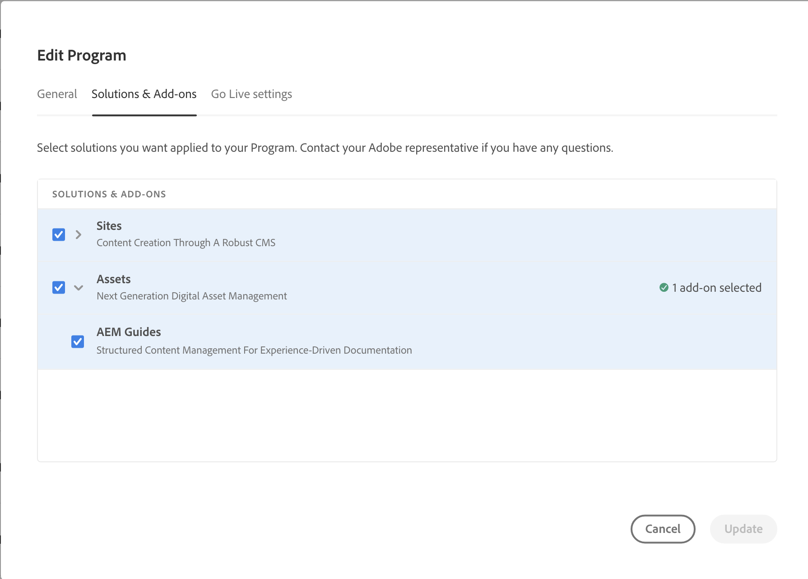

# [!DNL Adobe Experience Manager Guides] as a Cloud Service部署

了解如何添加 [!DNL Experience Manager Guides] 敬您的 [!DNL Experience Manager as a Cloud Service] 环境。

>[!NOTE]
>
> 从2024.2.0版本开始，《Experience Manager指南》仅作为适用于Experience Manageras a Cloud Service的自动加载项提供。 如果您对Experience Manager指南使用手动部署，请移除此行 `<module>dox.installer</module> from file dox/pom.xml` 在为您的项目启用《Experience Manager指南》之前，请在您的cloud manage git代码库中找到。

1. 登录 [!UICONTROL Cloud Manager].

1. 编辑要配置的程序 [!DNL Experience Manager Guides].

1. 切换到 **[!UICONTROL 解决方案和加载项]** 选项卡。

1. 在 **[!UICONTROL 解决方案和加载项]** 表，单击 **[!UICONTROL 资产]**.

1. 选择 **[!UICONTROL 指南]** 并选择 **[!UICONTROL 保存]**.

您已成功配置程序以自动配置Experience Manager指南解决方案。

>[!NOTE]
>
>安装 [!DNL Experience Manager Guides] 在集成程序下的任何环境中，必须运行与该环境关联的管道。 在CM Git代码库中无需额外配置即可安装 [!DNL Experience Manager Guides].
