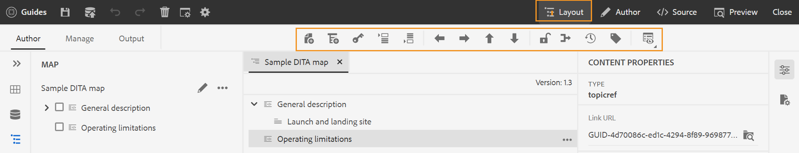
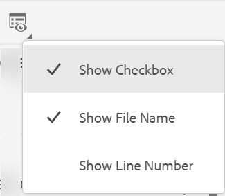
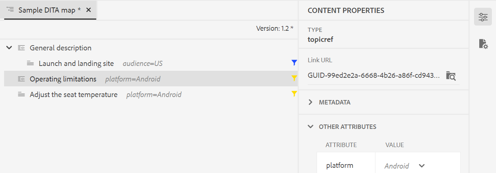
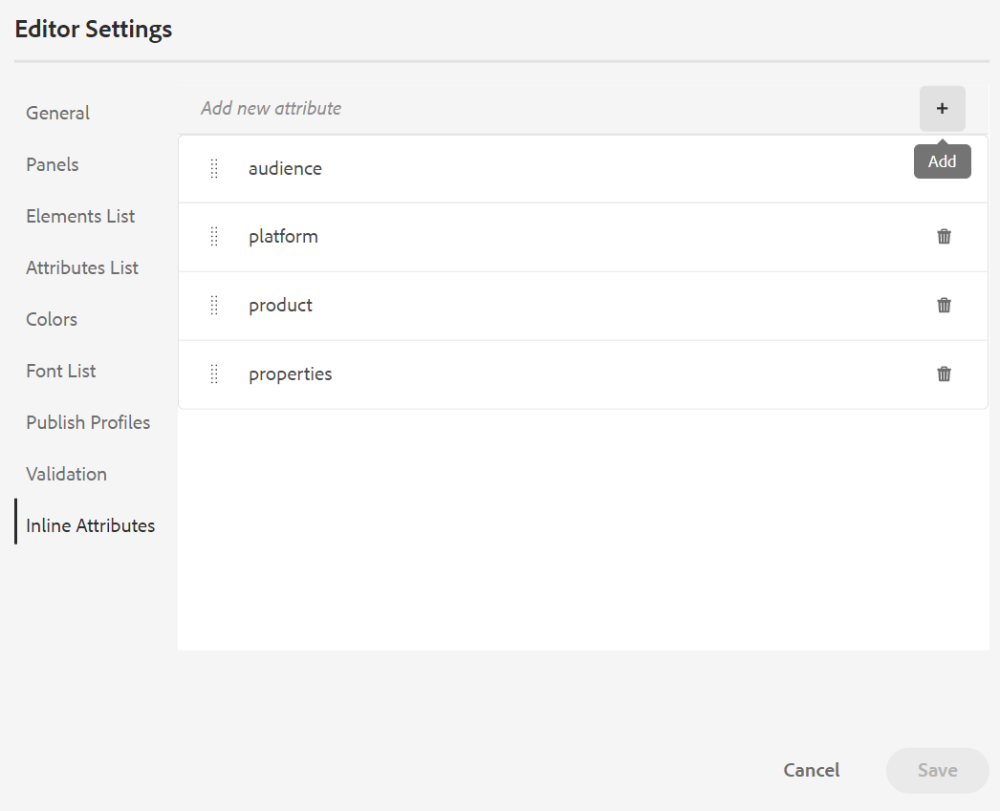
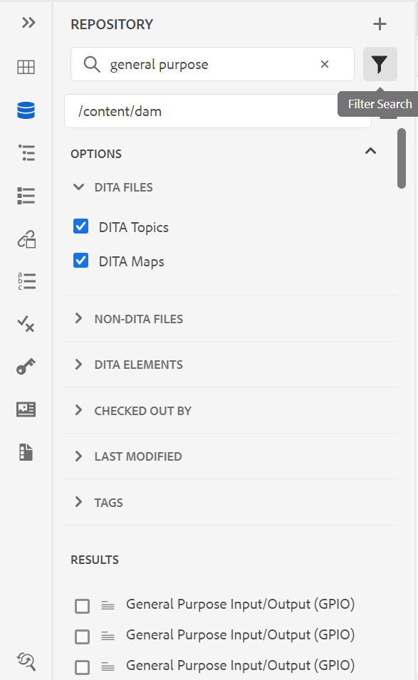

# Adobe Experience Manager Guidesas a Cloud Service8月版

## 升级到8月版

as a Cloud Service升级您当前的Adobe Experience Manager Guides(以后称为 *AEM Guidesas a Cloud Service*)进行设置：
1. 查看Cloud Service的Git代码，并切换到在Cloud Service管道中配置的与要升级的环境对应的分支。
1. 更新 `<dox.version>` 中的属性 `/dox/dox.installer/pom.xml` Cloud ServiceGit代码的文件更改为2022.8.167。
1. 提交更改并运行Cloud Service管道，以升级到AEM Guides的8月版本as a Cloud Service。

## 兼容性矩阵

本部分列出了AEM Guides 2022年8月as a Cloud Service版本支持的软件应用程序的兼容性矩阵。

### FrameMaker和FrameMaker Publishing Server

| FMPS | FrameMaker |
| --- | --- |
| 不兼容 | 2020更新4及更高版本 |
| | |

*从2020.2开始的FMPS版本支持在AEM中创建的基线和条件。

### 氧气连接器

| AEM Guides即云版本 | 氧气连接器窗口 | 氧气连接器Mac |
| --- | --- | --- |
| 2022.8.0 | 2.7.5 | 2.7.5 |
|  |  |  |

## 新增功能和增强功能

AEM Guidesas a Cloud Service在8月版本中提供了许多增强功能和新功能：

### 映射编辑器中的布局视图

现在，您可以在映射编辑器中查看DITA映射的完整布局。 当您打开地图进行编辑时，它会打开 **布局** 映射编辑器的视图。 在此视图中，您可以在树视图中查看映射层次结构，还可以在映射中组织或构建主题。

“布局”视图包含一个单独的工具栏，可帮助您对地图中的主题执行多项任务。
可以在映射中插入主题引用、主题组和键定义。 您可以通过上移、下移、左移或右移来重新组织地图中的主题。 您还可以拖放主题以在地图中移动它们。 映射编辑器还提供了用于锁定或解锁文件、检查版本历史记录和执行版本标签管理的图标。

“布局”视图还提供 **查看选项** 显示或隐藏行号、显示或隐藏复选框，或显示映射中主题的文件名或标题。

您还可以根据主题上应用的条件筛选器查看主题。

除了在映射文件中组织主题外，您还可以使用添加、移动、复制、粘贴或删除参照 **选项** 适用于“布局”视图中的元素的菜单。 您还可以将主题或地图从存储库面板拖放到在地图编辑器中打开的图中。

右侧面板在地图编辑器的布局视图中显示内容属性和地图属性。 为所选主题定义的内联属性将针对“布局”视图中的主题显示。 例如，您可以快速查找所有将其平台属性定义为 `IOS`.

现在，您还可以设置主题或映射的元数据信息。 您可以为所选主题或映射定义“导航标题”、“链接文本”、“简短说明”和“关键字”。

有关更多详细信息，请参阅 *布局视图* 部分(在使用Adobe Experience Manager Guidesas a Cloud Service中)。

### 编辑器设置中的内联属性

AEM Guides现在允许配置 **内联属性** 由您的管理员从 **编辑器设置**. 您还可以添加新的内联属性或从中删除现有属性 **内联属性** 选项卡。
为主题定义的已配置“内联属性”将针对“布局”视图中的主题显示。

### 存储库视图中的其他筛选器

现在，存储库视图中的过滤器搜索功能更加强大。 两个新的搜索条件， **上次修改时间** 和 **标记** 已添加来筛选文件，以及缩小AEM存储库中的搜索范围：
* **上次修改时间**：您可以查找在选定日期之后但在选定日期之前上次修改的文件。 您还可以选择使用预定义标准，并查找过去2小时、上周、上个月或去年上次修改的文件。
* **标记**：您还可以查找应用了特定标记的文件。 您可以键入标记或从下拉列表中选择标记。

## 修复的问题

修复了多个区域中的错误如下：

* /core/article-publish/src/main/java/com/adobe/dxml/article/publish/util/DoxUtils.java中使用了已弃用的Lucene索引(9291)
* 更新后的Node.js不用于发布。 (9835)
* 对所做的更改不会自动更新DITA主题 **属性** 页面。 (8745)
* 添加到DITA书签时，Frontmatter元素无法正常工作。 (9507)
* 本机PDF | 使用时生成空白PDF **快速生成** 选择空元素时用于多个文件。 (9822)
* 本机PDF | 附录作为PDF输出中的一章发布。 (9829)
* 本机PDF | 编辑SVG图像时，不会在页面布局中显示更新后的图像。 (9069)
* 当出现以下情况时，插入常规连字符号： `Nonbreaking Hyphen` 使用插入字符 **插入特殊字符** 对话框。 (8919)
* 如果更新图像已编辑，则XML编辑器不会在主题中显示更新图像。 (9500)
* 通过编辑器发布输出时，无法从删除预设 **输出** 选项卡。 (9100)
* DITA映射的子映射不会使用 **全选** 选项。 (9814)
* 无法从以下位置拖放映射或主题模板： **模板** Web编辑器中自定义映射模板的菜单。 (9846)
* 无法在映射或主题模板的子文件夹中创建新主题或映射模板。 (9888)
* 不存在用于浏览映射或主题模板的子文件夹内呈现的主题或映射的选项。 (9889)
* 当与DITA文件一起更新并保存Schematron文件时，不显示右侧面板（如果DITA文件破坏Schematron文件中存在的验证）。 (9986)
* 如果与现有预设名称相同，则可以创建新的重复输出预设。 (9997)
* SVG图像已损坏，在生成HTML输出时无法正确发布。 (9949)

## 已知问题

Adobe已发现AEM Guides 2022年8月as a Cloud Service版本的以下已知问题。

### 存在已知问题的解决方法

对以下已知问题使用给定的解决方法：

* “布局”视图在映射编辑器中不可见。

  **解决方法**：更新文件夹配置文件中的ui_config.json。

* Symbols.json被覆盖，因此出现8919问题。

  **解决方法**：更新的symbols.json必须与覆盖的symbols.json合并。

### 其他已知问题

* 如果在对存储库执行搜索时显示的结果部分中选择了多个文件，然后在作者视图中拖放这些文件，则只会添加一个文件。
