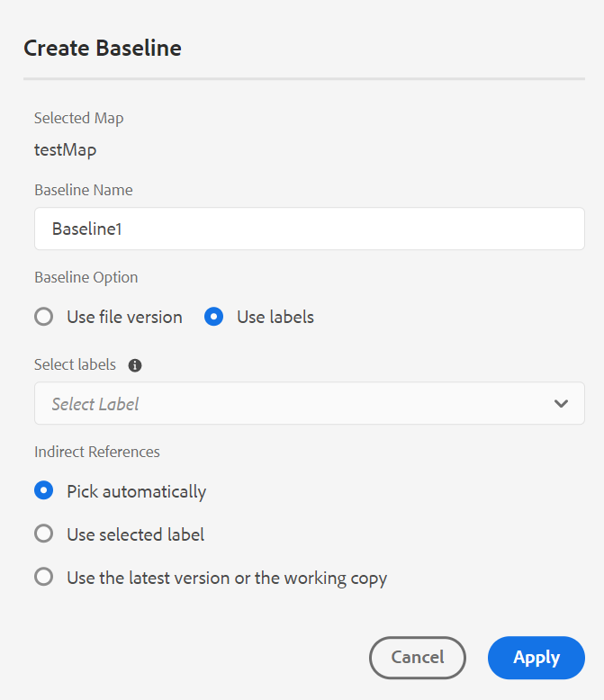
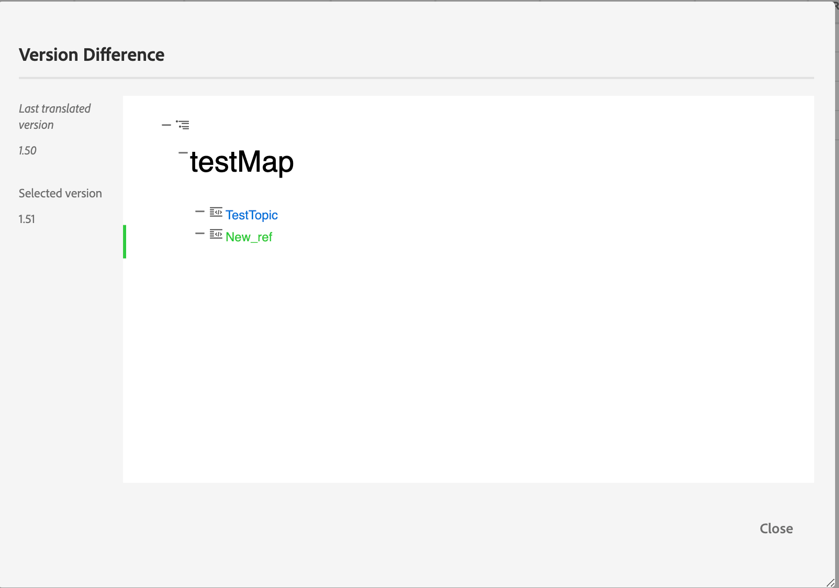
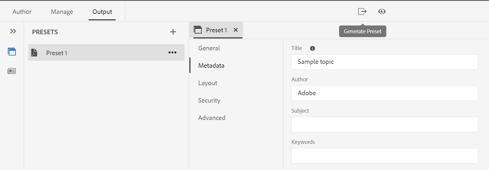

# Adobe Experience Manager Guidesas a Cloud Service9月版

## 升级到9月版

as a Cloud Service升级您当前的Adobe Experience Manager Guides(以后称为 *AEM Guidesas a Cloud Service*)进行设置：
1. 查看Cloud Service的Git代码，并切换到在Cloud Service管道中配置的与要升级的环境对应的分支。
1. 更新 `<dox.version>` 中的属性 `/dox/dox.installer/pom.xml` Cloud ServiceGit代码的文件更改为2022.9.178。
1. 提交更改并运行Cloud Service管道，以升级到AEM Guides的9月版本as a Cloud Service。

## 索引现有内容的步骤

执行以下步骤来索引现有内容，并在映射级别使用新的查找和替换文本：
* 对服务器运行POST请求（使用正确的身份验证） —  `http://<server:port>/bin/guides/map-find/indexin`.
(可选：您可以传递映射的特定路径来对其进行索引，默认情况下，所有映射都将进行索引 || 示例：   `https://<Server:port>/bin/guides/map-find/indexing?paths=<map_path_in_repository>`)
* 该API将返回作业ID。 要检查作业的状态，可以将带有作业ID的GET请求发送到同一端点 —  `http://<server:port>/bin/guides/map-find/indexing?jobId={jobId}`
(例如： `http://<_localhost:8080_>/bin/guides/map-find/indexing?jobId=2022/9/15/7/27/7dfa1271-981e-4617-b5a4-c18379f11c42_678)`
* 作业完成后，上述GET请求将做出成功响应，并提及是否有任何映射失败。 可以从服务器日志中确认已成功编制索引的映射。

## 兼容性矩阵

本部分列出了AEM Guides 2022年9月as a Cloud Service版本支持的软件应用程序的兼容性矩阵。

### FrameMaker和FrameMaker Publishing Server

| FMPS | FrameMaker |
| --- | --- |
| 不兼容 | 2020更新4及更高版本 |
| | |

*从2020.2开始的FMPS版本支持在AEM中创建的基线和条件。

### 氧气连接器

| AEM Guides即云版本 | 氧气连接器窗口 | 氧气连接器Mac | 在氧气窗口中编辑 | 在氧气Mac中编辑 |
| --- | --- | --- | --- | --- |
| 2022.9.0 | 2.7.13 | 2.7.13 | 2.3 | 2.3 |
|  |  |  |  |

## 新增功能和增强功能

AEM Guidesas a Cloud Service在9月版本中提供了许多增强功能和新功能：

### 基于标签创建动态基线

现在，AEM Guides提供了基于标签创建动态基线的功能。 如果您生成基线、下载基线或使用基线创建翻译项目，则系统会根据更新的标签动态选取文件。 此功能非常方便，因为在更新标签时您不必修改基线。
您还可以将基线的快照导出为CSV。

### 在映射级别查找和替换文本

现在，您可以在映射中搜索包含特定文本的文件。 搜索到的文本将在文件中突出显示。 您也可以使用文件中的其他单词或短语替换搜索的单词或短语。
选择 **替换** 图标以替换当前出现的 **替换文件中的所有内容** 图标以替换选定文件中的所有匹配项。

默认情况下，选项 **替换前签出文件** 和 **替换后创建新版本** 都会被选中，因此在替换文本之前会签出文件，并且在替换文本之后会创建一个新版本。

### 从翻译仪表板查看不同步文件的版本差异

您现在可以选择翻译 **不同步** 基于两个版本主题之间所做更改的文件。\

在翻译仪表板中，您可以轻松查看上次翻译版本与选定文件的当前版本之间的差异。

根据不同可以决定是否要翻译主题。

### 元数据UI可用于PDF预设

可以从DITA映射的输出预设设置元数据。 您可以设置标题、作者、主题和关键字元数据。 此元数据映射到输出PDF的文件属性中的元数据。
此元数据将覆盖在帐簿级别定义的元数据。 您可以具体定义每个输出预设中的元数据，并将其传递到输出PDF。

## 修复的问题

修复了多个区域中的错误如下：

* Web编辑器 | 在主题中移动元素时，元素上分配的ID会被自动分配的ID覆盖。 (7895)
* 跟踪更改 | 使用Enter键输入新元素时，内容将丢失。 (10246)
* 未创建引用dita-templates中的主映射的子映射。 (10231)
* XML编辑器 | 复制粘贴在创作模式下不起作用。 (10309)
* 选择多个版本标签后，不会取消选择。 (9561)
* 在站点浏览对话框中自动导航到路径的操作方式与文件浏览方式不同。 (9920)
* 从切换时，大纲面板不显示内容 **作者** 到 **来源** 模式。 (10319)
* 使用主题模板中的内容创建的新主题中的Conref不起作用。 复制的哈希ID不会在内容副本中更新。 (9890)
* Web编辑器 | 从映射模板创建映射时，不存在加载器。 (9891)
* 新建映射编辑器 | 如果我们从“ ”切换，“ ”映射标题中添加的粗体或斜体文本将不会保留 **作者** 到 **布局** 视图。 (10218)
* 新建映射编辑器 | 无法从布局视图中删除对任何引用应用的条件。 (10213)
* 新建映射编辑器 | 在“布局”视图中（如“作者”视图），无法应用条件引用。 (10198)
* 新建映射编辑器 | 如果上下文菜单中的左移无法左移，则会删除引用。 (10219)
* 新建映射编辑器 |在使用布局视图创建的映射中，图标显示不正确。 (10197)
* 存储库面板 | 在存储库面板中右键单击会引发应用程序错误。 (10123)
* 查找和替换 | 在Web编辑器中，无法读取搜索结果中的深色模式。 (9978)
* 翻译 | 元数据和标记不会传播到翻译的副本。 (4696)
* 复制粘贴(ctrl+c/ctrl+v)内容会在创作模式下引发错误。 (10304)
* PDF模板 | 将背景图像添加到任何页面布局时，将绝对显示图像路径，并且图像不会显示在输出PDF中。 (10297)
* 本机PDF | 章节标题和章节标题在PDF发布中不起作用。 (9947)
* 本机PDF | `xref` 对于特定DITA主题，无法正确解析概念。 (10229)
* 本机PDF | 无法在生成的PDF输出中查看表的标题文本。 (9827)
* 本机PDF | 附录中的引用不会在PDF输出中显示为附录。 (10182)
* 本机PDF | 表的Frame属性不会传播到tempHTML(as class)。 (10353)
* 本机PDF | 临时HTML文件将colsep和rowsep类添加到td和th，即使它们在源DITA中的值为0。 (10352)
* 本机PDF | 不接受在页面布局中添加的标准的元数据。 (10377)
* 本机PDF | 为特定PDF生成内容失败。 (9927)
* 本机PDF | PDF输出中未显示通过conkeyref的内容。 (9836)
* 本机PDF | 无法解析包含图像或外部链接的Keydef的关键引用。 (10063)
* 映射的“作者”视图不显示表格列表和数字列表的占位符文本。 (10330)
* 创建新基线时，不会应用已选择的基线过滤器。 (9954)
* 如果父文件夹名称包含空格字符，则基线中缺少视频文件。 10031)
* 当用户时区与服务器时区不同时，基线创建不会选择最新版本。 (10190)
* 在AEM 6.5.12上安装AEM Guides 4.1后，Control + F快捷键无法在Assets控制台上打开浏览器搜索模式。 (10189)

## 已知问题

Adobe已发现AEM Guides 2022年9月as a Cloud Service版本的以下已知问题。

* 动态基线未与知识库发布集成。

* 翻译 | 由于目标内容中的任何更改，将为源内容显示版本差异图标。
