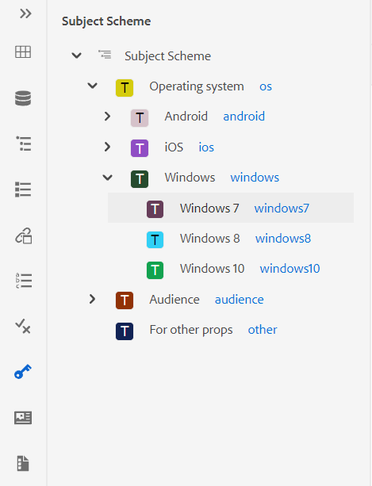
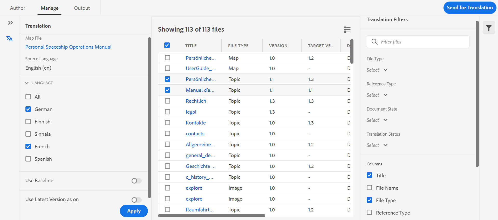
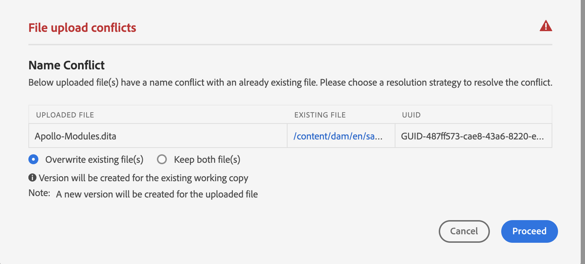
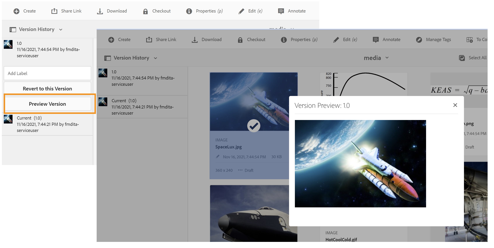

# 1月版的 [!DNL Adobe Experience Manager Guides] as a Cloud Service

## 升级到1月版

升级您当前的 [!DNL Adobe Experience Manager Guides] as a Cloud Service(以后称为 [!DNL AEM Guides] as a Cloud Service)通过以下步骤进行设置：
1. 查看Cloud Service的Git代码，并切换到在Cloud Service管道中配置的与要升级的环境对应的分支。
1. 更新 `<dox.version>` 中的属性 `/dox/dox.installer/pom.xml` Cloud ServiceGit代码的文件更改为2022.1.78。
1. 提交更改并运行Cloud Service管道，以升级到的1月版 [!DNL AEM Guides] as a Cloud Service。

## 兼容性矩阵

本节列出了所支持的软件应用程序的兼容性矩阵 [!DNL AEM Guides] 2022年1月版as a Cloud Service。

### FrameMaker和FrameMaker Publishing Server

| FMPS | FrameMaker |
| --- | --- |
| 不兼容 | 2020更新4及更高版本 |
| | |

### 氧气连接器

| [!DNL AEM Guides] 云版本 | 氧气连接器窗口 | 氧气连接器Mac | 在氧气窗口中编辑 | 在氧气Mac中编辑 |
| --- | --- | --- | --- | --- |
| 2022.1.0 | 2.4.0 | 2.4.0 | 2.2 | 2.2 |
|  |  |  |  |  |

## 新增功能和增强功能

### 基于文章的发布

在1月版中，我们引入了一种集成在Web编辑器中的基于文章的发布功能。 您可以使用基于文章的发布功能递增地生成一个或多个主题的输出，或将内容发布到知识库平台。

此功能允许用户以累加方式构建DITA映射，并在准备就绪时发布主题。 发布映射后，请使用基于文章的发布功能来实现仅更新文章的增量发布。

除了AEM之外，您还可以使用此独特功能将文章发布到任何知识库门户，如Salesforce。 此功能还附带一个OOTB内容模板，它基于AEM核心组件构建，允许您创建技术内容的基于知识的存储库。 此模板的优点在于，它可完全自定义以符合您的组织要求，并且还可支持企业Intranet门户等用例。
您还可以根据文章的文档状态和修改时间筛选文章。

这种按需文章发布功能不仅让您能够完全控制内容发布，还可以减少发布更新内容的整体时间。
使用此模板发布文章时，它也可以将元数据传递到已发布的页面。
有关更多详细信息，请参阅 *从Web编辑器中基于文章的发布* （在用户指南中）。

### 改进了Web编辑器

Web编辑器中引入了许多增强功能和新功能：

* Web编辑器中还添加了主题方案支持。 您现在可以使用“主题方案”面板创建和使用主题方案。 除了主题方案之外，您现在可以使用自己的公司元数据和分类。

* 此版本中引入了新的词汇热点工具，用于批量管理词汇表。 使用此工具，您可以快速将选定地图或打开主题的文本转换为术语表，并将术语表批量转换为术语。

* 在可重用内容面板中添加了刷新功能，通过该功能可快速刷新引用文件中的可重用内容。
* 新的工作副本指示器显示文件的当前（工作副本）是否与保存的版本同步。

* 存储库面板和文件浏览对话框中的搜索筛选器已得到增强，可提供更多可进一步自定义的筛选选项。

* 您现在可以从Web编辑器上传.docx文件。

### 使用FrameMaker创作

现在，您可以用FrameMaker创作和发布文档。 FrameMaker附带到Adobe Experience Manager的现成连接器。 在FrameMaker中，您获得了一个易于使用的界面，它允许您在分布式协作环境中维护文档的版本。

创建内容后，FrameMaker允许您以PDF、HTML5、EPUB和DITA等不同格式发布文档。 您还可以执行各种文件管理操作，如签出、带依赖项签出、签入、刷新等。
要在中进行FrameMaker创作 [!DNL AEM Guides] as a Cloud Service使用FrameMaker版本2020.4及更高版本。

### 新建翻译仪表板

Web编辑器中引入了新的翻译功能板，该功能板具有以下功能：

* 对主题列表进行排序、搜索和过滤。
* 按引用类型筛选内容 — 直接或间接引用。
* 轻松导航，以便在启动翻译请求时查找现有项目。
* 引入了多语言翻译机制，以避免在为多种语言启动翻译请求时为每个语言创建多个项目。
* 引入了一种配置，用于在地图仪表板中隐藏翻译选项卡。 默认情况下，它是可见的。 您可以选择使用映射仪表板或Web编辑器翻译内容。

### 增强型发布

* 现在，作者可以将映射和主题级别的元数据传递到DITA-OT发布。 当自定义PDF模板设计为使用文件元数据属性（如标记、作者、文档状态等）时，这非常有用。

* 添加了新配置，以允许用户保留或删除以下情况下要删除的主题版本： **删除并创建** 选项在AEM站点输出生成中使用。

### 改进了文件处理

在AEM Assets中处理文件时，现在可以看到以下改进：
* 引入了新的文件上传体验和用于选择冲突解决策略的新对话框。

* 能够创建已上传文件的新版本，并防止覆盖已签出的文件。
* 现在，您可以直接从“版本历史记录”视图中查看图像的预览。 此外，对于DITA和非DITA文件，“版本历史记录”将单独显示当前版本信息。

* 无论用户何时创建DITA文件，缺省文件名都会显示在小大小写中，以便与本机AEM文件夹创建方案内联。

### 新的报告导出功能

报告在确定内容的运行状况时非常有用。 [!DNL AEM Guides] as a Cloud Service提供各种报告以控制您的内容。 现在，您不仅可以查看报表，还可以将报表数据导出为CSV文件，以便查看和共享更大的团队。 报表数据可以让您快速浏览任何断开的链接或缺少的图像。

### 改进了氧气DAM刷新体验

在氧气中刷新AEM Server中的文件时，如果当前氧气会话中有未保存的文件，则会显示警告消息。 您可以选择取消刷新操作以保存任何未保存的文件。 如果没有此功能，用户将丢失其文档中的任何未保存信息。

### 其他功能增强

* 您现在可以创建新的 **Dita项目** 模板位于 **/apps/projects/templates** 路径。
* 现在下载默认设置 **ui_config.json** 文件夹配置文件中的文件。 这可用于合并来自现有的自定义更改 **ui_config.json** 文件。
* 即使存在JS文件的新版本，您也无需清除浏览器缓存。

## 修复的问题

修复了多个区域中的错误如下：

### Web编辑器

* 即使未损坏，conref也会以红色显示。 (8239)
* 在DITAVAL编辑器中选择添加所有属性时，不会自动填充条件属性的值。 (8234)
* 作者无法使用相对路径在主题中插入图像。 (8112)
* 如果文件名中存在空格，则“查看任务”页不显示多媒体文件。 (8111)
* 在表格单元格中添加的pH conref以红色显示。 (8083)
* 移动审阅文件时，审阅任务中的链接不会更新。 (8080)
* Web编辑器无法正确渲染缩放属性设置为75%或更高的图像。 (8073)
* GIF图像在Web编辑器中呈现为静态图像。 (8024)
* 注释元素中的conkeyref不会显示在Web编辑器预览或输出中。 (8006)
* 在编辑器中不会解析本身为conref的元素的xref。 (7933)
* 在编辑器预览和存储库面板中，包含键的标题无法正确呈现。 (7909)
* 包含特殊字符的代码片段无法正确存储。 (7908)
* 在格式化MathML公式后保存主题会导致错误。 (7954)
* 在编辑器中无法正确呈现具有(tm)的keydef，并且AEM站点输出包含重复的TM符号。 (7859)
* 根据DTD，拖放代码片段不起作用。 (7758)
* HTML将忽略图形的自定义尺寸。 (7718)
* 移动源文件时，conrefred属性不会更新。 (7698)
* 使用参考主题类型文档会导致多个UI问题。 (7656)
* 当作者在映射中添加ditavalref时，不显示DITAVAL文件。 (7594)
* 在每个空白处发现意外的空格 `<entry>` 元素(在将outputclass属性添加到 `<tgroup>` 元素。 (7532)
* “源”按钮不适用于通过映射仪表板打开的主题。 (7465)
* Pretty print插入空白行和空格，当文件以FrameMaker或氧气打开时，可以看到这些空格和空格。 (7408)
* 任何主题中带有href=&quot;/&quot;的映射都不会发布在AEM网站上。 (7405)
* 当根映射包含大量键值时，在编辑器中发现性能问题。 (7400)
* 带有自定义模板的映射的文档状态不会从其相应的状态配置文件继承。 (7359)
* `<tm>` 元素错误地呈现为块元素。 (7286)
* 创建新模板时，编辑器模板面板中会显示重复的模板。 (5814)
* 在ui_config中为图像定义的用于设置其他属性的模板不适用于拖放情况。 (5713)
* menucascade中uicontrol的默认外观不正确。 (5483)
* 主题/映射的自定义模板不会在UI中显示新名称。 它将该名称显示为“Topic”/“Map”，而不是显示配置的名称。 (4958)
* 能够从用户首选项设置中清除rootmap。 (8534)
* 即使刷新页面后，新创建的映射收藏集也不会列出。(8603)
* 无法关闭已解锁的主题。 (8545)
* 在源模式和创作模式之间切换会将主题标记为已修改，并需要再次保存内容。(8524)
* 在搜索特殊字符时重用内容面板崩溃 `[` 或 `*` .(8279)
* 使用键盘快捷键Alt+Enter打开插入元素对话框时，光标不会显示在搜索栏中。(7912)
* 搜索选项只搜索文件名，不搜索内容。 (7784)

### 氧气连接器

* 在Oxygon中加载时，其父文件夹包含特殊字符的文件会出错。 (8054)
* 在Oxygen中打开新创建的文档时，会引发“无法找到GUID”错误。 (7856)
* 使用“在氧气中编辑”从AEM签出文件后，签入选项被禁用。 (7471)

### 审核

* 实时同步不适用于注释。 (7661)

### 映射仪表板

* 在地图仪表板的主题或报表选项卡的主题标题中无法查看conref内容。 (8263)
* AEM Sites输出 | jcr：更新DITA主题标题时，生成的网站页面的标题不会更新。 (8131)
* 下载MAP不下载主题中使用的视频文件。 (8070)
* 通过下载书图API使用对象标记时，不会下载媒体文件。 (8057)
* 如果有任何主题的conref文件标题以conref开头，则“报告”选项卡中显示不正确的报告。 (4698)
* “基线”选项卡上的“应用标签”对话框在下拉列表中不显示标签。 (8455)

### 发布

* 选择“启用版本控制”后，PDF创建首次失败。 (8053， 8294)
* 在AEM Site输出中，空白字符会在“tm；”标记后自动添加。 (7964)
* 无法在AEM站点输出中查看YouTube视频。 (7401)
* 用户单击浏览映射仪表板基线选项卡中的所有主题后，无法按标签筛选引用内容。 (7388)
* 使用元素发布主题 `<tm>` 属性值SM或reg在生成的输出中显示不正确。 (7239)
* 图像的基线发布未在已发布输出中选取图像的最新版本。 (7231)
* “基线”选项卡中显示可引用的主题。 (5424)
* 标题中带有conkeyref的主题的增量发布无法按预期工作。 (4474)
* 页面标题不用于生成输出URL，即使已勾选该设置也是如此。 (8257)
* 基线发布选取图像的当前版本而不是冻结节点。 如果图像文件名中包含空格或特殊字符，也会出现这种情况。 (8274， 8322)
* 对于具有mapref类型主题方案的DITA映射，增量发布失败。 (8218)
* 每当将映射添加到批量发布仪表板时，都会添加Null。 (8695)
* 在主题中使用将图像作为conref的基线发布时，图像不会发布在输出中。 (8564)
* 如果删除AEM站点发布中使用的基线，发布会失败并出现异常。 (8572)
* 主题重新生成不起作用。 (8091)
* 在表格中发布脚注时出现问题。 (4709)

### AEM Assets

* 对Assets UI中的大型内容集执行选择/删除时发现性能问题。 (8238)
* 如果将DITA谓词添加到搜索筛选器，则保存的搜索功能（智能收藏集）将中断。 (8048)
* 将图像还原到旧版本不起作用。 (DXML-7903)
* 删除选项对于没有删除权限的作者也可见。 (7322)
* 资产编辑器的CCMS叠加会中断删除选项的呈现。 (8093)
* 未删除文档配置文件。 (8604)
* 执行“全选”并将多媒体/Dita_Content移动到其他文件夹时，引用中断。 (8621)
* 移动资产时，源中出现不正确的引用。 (8627)
* 未加载固定列表视图。 (8542)

### 内容导入

* HTML到DITA的转换 |如果表中的“tr”具有空的“td”条目，则会在输出中导致额外的行。 (8132)
* HTML到DITA的转换 |HTML具有一个带多个表体的表时失败，出现异常。 (7940)
* HTML到DITA的转换 |如果源HTML有注释，则出现错误。 (7937)
* 导入DITA 1.3 DITA文件会导致某些href转换为格式错误的链接。 (8019)

## 已知问题

Adobe已发现的以下已知问题 [!DNL AEM Guides] 2022年1月版as a Cloud Service。

### 存在已知问题的解决方法

对以下已知问题使用给定的解决方法：

* Web身份验证不适用于Mac上的氧气连接器。
  **解决方法**：现在使用Windows上的氧气连接器。

* 在Firefox浏览器中，如果不打开并排视图，则无法导入审核注释。
  **解决方法**：现在使用Chrome浏览器。

* 移动文件名中有空格的图像或多媒体文件时，引用中断。
  **解决方法**：重命名文件，并在移动前删除文件名中的空格。

* 在最新版本的Chrome浏览器中，映射仪表板不会间歇性加载。
  **解决方法**：刷新映射仪表板页面。

### 其他已知问题

* 如果氧气与 [!DNL AEM Guides] 解决方案使用Web身份验证，然后注销失败。
* 不能将审阅任务重新分配给用户。
* 映射收集UI中存在问题，例如文本扭曲并且 **全选** 功能无法正常工作。
